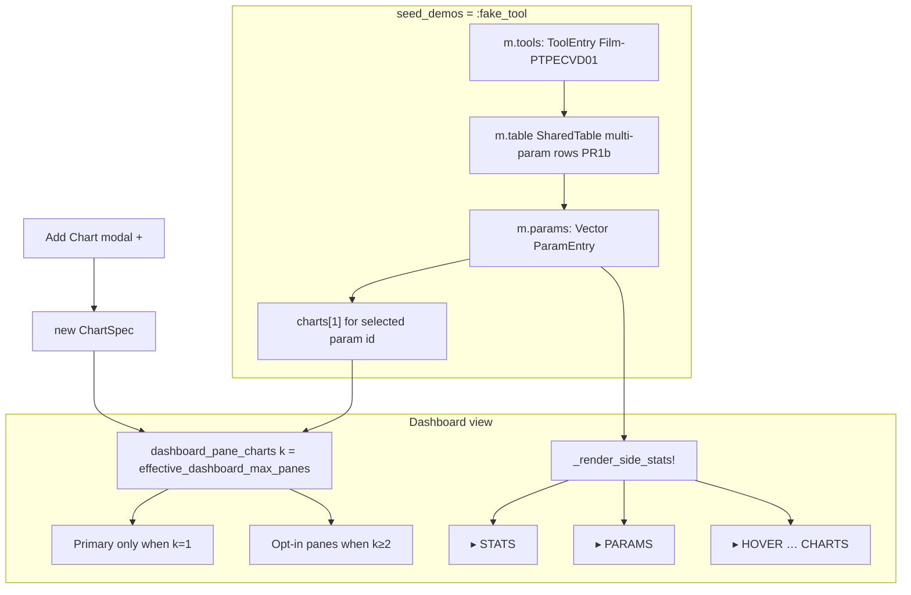
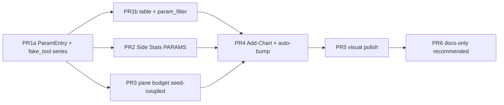
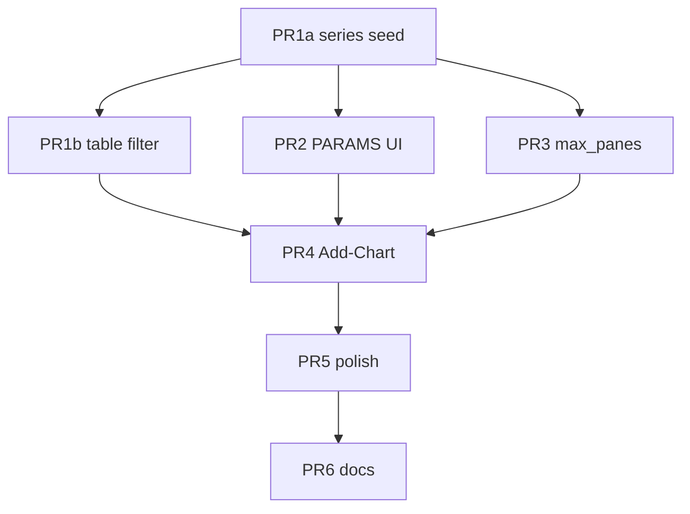

# Design: Dashboard Single-Chart + Parameter Side List + Add-Chart Extension

| Field | Value |
|-------|-------|
| **Document** | Dashboard config — selected-parameter single chart, opt-in multi-chart, tool parameter Side Stats |
| **Author** | design-doc-writer (Grok) |
| **Date** | 2026-07-15 |
| **Status** | Draft (rev. 2 — design review 78035dc0) |
| **Project** | tachikoma-tui (Julia + Tachikoma.jl SPC Workbench) |
| **Primary files** | `src/spc_workbench.jl`, `src/spc_workbench_io.jl`, `test/test_spc_workbench.jl` |
| **Related designs** | `docs/design/side-stats-sectionize.md`, `design-spc-html-parity-plan.md`, `design-spc-p2-polish-plan.md`, `design-spc-workbench-plan.md`, `design-graph-lines-config-4b12c85d.md` |
| **HTML parity source** | `SPC_workbench_2026-06-18-20-46.html` (Film-PTPECVD01 / Parameter column / multi-param charts) |

**Changelog (rev. 2):** Keybind remap (pause/`p`/`P` + keymap/`k`/`K` preserved); seed-coupled `dashboard_max_panes`; single-path `select_param!`; `ch.param` = `ParamEntry.id`; add-chart `update!` absorb order; analysis data prerequisites; full keybind delta; PR1 split + auto-bump only PR4; PARAMS×WECO H=18 budget; locator/header/clone/dual/supersession notes.

---

## Overview

Today the SPC Workbench dashboard **always** tries to paint up to three panes via `dashboard_pane_charts(m; k=3)`, and the default `seed_demos = :triple` path injects three unrelated demo series (Primary / Secondary / Tertiary) with **empty** tools and **empty** parameters. Side Stats sectionizes STATS · HOVER · LINES · WECO · CHARTS, but never surfaces a **tool parameter catalog**. Operators cannot tell which process parameters belong to a tool, nor treat “selected parameter” as the primary dashboard unit of attention.

This design reorients the **product dashboard UX** (via **`seed_demos = :fake_tool`**, not by breaking default triple) around:

1. **One chart by default** under `:fake_tool` / `:single` / `:none` — the chart for the **currently selected parameter**.
2. **Opt-in multi-chart** — users may add more panes either for a **second parameter** (same tool) or a **different analysis** of the same parameter (I-MR vs series-chunk X̄-R/S).
3. **Side Stats parameter list** — a new `▸ PARAMS` section (interactive **PARAMS only**; other sections stay read-only — supersedes the side-stats-sectionize non-goal for this section alone).
4. **Polished menus** — creative but consistent Tachikoma visual language across Config, Side Stats, Tools, Add-Chart, and parameter pickers.

Demo/testing uses a **synthetic fake tool + seed data** path (not `template_tool.csv`). Existing `seed_demos = :triple` keeps multi-pane via **seed-coupled** `dashboard_max_panes = 3`. Product demos and new BDD blocks use `:fake_tool`.

---

## Background & Motivation

### Current architecture (verified on disk 2026-07-15)

| Concern | Location | Behavior today |
|---------|----------|----------------|
| Chart identity | `ChartSpec` ~L265–294 | `id`, `name`, `chart_type`, `data`, specs, `param`, `units`, `owner`, `tools::Vector{String}`, column maps, `source` |
| Parameter field | `ch.param::String = ""` | Present on wire/JSON; **unused in UI**; demos leave it empty |
| Tool master registry | `ToolEntry` L2011–2014; `m.tools` L2117 | `id` + `description`; Tools page (`x`); **not** a parameter catalog |
| Per-chart tool filter | `ch.tools` | Used by `compute_chart_series` + `filter_tool` |
| Seed policy | `m.seed_demos` L2115–2116; `_ensure_charts!` L2404–2451 | `:triple` (default) / `:single` / `:none` — **never flip default** without intentional product PR |
| Pane selection | `dashboard_pane_charts(m; k=3)` L4011–4019 | Active + next `k-1` **visible** neighbors |
| Dashboard layout | `view` ~L6540–6559 | Hardcodes `k = 3`; splits plot stack 2-up / 3-up when `npanes ≥ 2` |
| Dual secondary canvas | `_dual_secondary_eligible` / `secondary_canvas` pref | Same chart, MR/R/s under primary — **not** a second ChartSpec; multi-pane compress at L6562–6576 (KD-P2-15) |
| Side Stats | `_render_side_stats!` L6946+ | Sections STATS → HOVER → LINES → WECO → CHARTS; `reserve_tail=2` at compact H |
| SharedTable | `m.table` | CSV/JSON ingress; multi-column materialize via builder |
| Generator | `generate_spc_workbench_data` L1622 | Scalar series only — no Tool / Parameter columns |
| Dashboard keys | `update!` ~L5047–5196 | `p`/`P` pause; `k`/`K` keymap; free today: `j`/`J`, `+`, `A`, `;`, … |
| HTML mockup | archive HTML | `Film-PTPECVD01`; Parameter column; multi-param charts |

### Pain points

1. **Dashboard is multi-pane under `:triple`** — three stacked demos compete for height; dual-canvas compress (KD-P2-15) already fights for space @ H=24.
2. **No parameter UX** — `ch.param` is dead weight; Side Stats shows chart names, not the process parameter vocabulary of a tool.
3. **Empty demo tools** — filters + Tools registry start empty.
4. **Add chart is blank** — library `a` → empty series; no guided second parameter / analysis path.
5. **Visual inconsistency risk** — new surfaces must match Config/Keys/Saved polish.

### Product narrative

Fab engineer opens the workbench on a **tool** (demo: `Film-PTPECVD01`). Side Stats lists **parameters**. Selecting a parameter activates that parameter’s chart when one exists. Adding a chart for another parameter or analysis makes multi-pane intentional.

---

## Goals & Non-Goals

### Goals

1. **Product single-chart default** via **`seed_demos = :fake_tool`** (and `:single`/`:none`) with `dashboard_max_panes = 1` set by seed policy — **not** by a global field default that would collapse `:triple`.
2. **Add-chart extension** for:
   - **G2a** Same tool, **different parameter** → new `ChartSpec` with `ch.param = ParamEntry.id` + materialize (table path after PR1b).
   - **G2b** Same parameter, **different analysis** → new `ChartSpec` same id-link, different `chart_type` (v1: I-MR ↔ series-chunk Xbar_R / Xbar_S only).
3. **Side Stats shows tool parameter list** from fake-tool seed (select / highlight).
4. **Fake tool + seed data** wired incrementally: PR1a series+catalog+tools; **PR1b** SharedTable long format + `param_filter` before wizard materialize-from-table (G4 staged — see Open Questions resolution).
5. **Visually eye-catching menus** within existing `tstyle` vocabulary.
6. **Incremental PRs**, suite stays green; `:triple` multi-pane oracles remain zero-churn via seed-coupled pane budget.
7. **Elm discipline** — pure helpers + `update!` mutations; re-render after every `update!` in tests.

### Non-Goals

| Out of scope | Rationale |
|--------------|-----------|
| Flipping global `seed_demos` default from `:triple` mid-train | Prior KDs / AGENTS / mass suite coupling (PR6 docs-only recommended) |
| Real MES/fab connectors | Fake tool only |
| Excel / admin / size binning | Prior locked non-goals |
| Making **entire** Side Stats interactive | **PARAMS only** interactive; STATS/HOVER/LINES/WECO/CHARTS stay read-only paint |
| Replacing dual-canvas with a second ChartSpec | Dual remains in-chart MR/R/s |
| Attribute chart types in analysis picker v1 | Need `n`/defects columns absent from fake long seed |
| Rewriting classic `src/spc.jl` | Separate surface |
| Changing Side Stats width from `Fixed(28)` | Keep 28 |
| New JSON schema major version | Optional keys only |
| Builder UI fields for `col_param` / `param_filter` v1 | Seed/wizard set them; builder optional later |
| Loading fake seed from `test/fixtures/spc/templates/template_tool.csv` | Synthetic builder functions only |

**Supersession note:** `docs/design/side-stats-sectionize.md` Non-Goal “Making side panel interactive” is **superseded for `▸ PARAMS` only**. Implementers must not treat PARAMS as paint-only; other sections remain non-interactive.

---

## Proposed Design

### High-level architecture



### Key concepts

| Concept | Definition |
|---------|------------|
| **Tool** | `ToolEntry(id, description)` — demo: `Film-PTPECVD01` |
| **Parameter** | `ParamEntry` catalog row |
| **Selected parameter** | `m.selected_param::Int` — **1-based** index into `params`; **`0` when catalog empty** |
| **Chart ↔ parameter** | `ChartSpec.param` always stores **`ParamEntry.id`** (stable wire key) |
| **Dashboard pane budget** | `m.dashboard_max_panes::Int` — **seed-coupled**; hard clamp 1..3 |
| **Analysis variant** | Same `ch.param` id, different `chart_type` + distinct `name` |

---

### Data model

#### New: `ParamEntry`

```julia
@kwdef struct ParamEntry
    id::String                 # stable key, e.g. "thk_1_3um" — ALSO stored in ch.param
    name::String               # display only, e.g. "Thickness 1.3µm"
    units::String = ""
    tool_id::String = ""       # "Film-PTPECVD01"
    value_col::String = "Value"
    default_chart_type::ChartType = I_MR
    μ::Float64 = 0.0           # series seed / fallback
    σ::Float64 = 1.0
    usl::Union{Float64,Nothing} = nothing
    target::Union{Float64,Nothing} = nothing
    lsl::Union{Float64,Nothing} = nothing
end
```

#### Model fields (`SPCWorkbenchModel`)

| Field | Type | Default | Purpose |
|-------|------|---------|---------|
| `params` | `Vector{ParamEntry}` | `ParamEntry[]` | Session parameter catalog |
| `selected_param` | `Int` | **`0`** | 1-based index; **0 = none / empty catalog** |
| `dashboard_max_panes` | `Int` | **`3`** | Field default matches triple compat; **seed policy overwrites** on `_ensure_charts!` |
| `side_focus` | `Symbol` | `:none` | `:none` \| `:params` |
| `add_chart_open` | `Bool` | `false` | Add-chart modal open |
| `add_chart_mode` | `Symbol` | `:param` | `:param` \| `:analysis` |
| `add_chart_selected` | `Int` | `1` | List cursor in modal |
| `add_chart_analysis` | `ChartType` | `I_MR` | Analysis type cursor |

**Empty catalog policy:** `isempty(m.params)` ⇒ `selected_param = 0`; all readers guard `selected_param < 1 || selected_param > length(params)`. Side Stats omits PARAMS body or paints dim empty line.

#### `ChartSpec` linkage — **identity lock (KD-DC-14)**

| Field | Convention |
|-------|------------|
| `ch.param` | **Always `ParamEntry.id`** (never display `name`) |
| `ch.name` | Display title from `ParamEntry.name`, analysis suffix if needed |
| `ch.units` | From `ParamEntry.units` |
| `ch.tools` | `[tool_id]` when seeded |
| `col_param` | Optional; default `""`; seed sets `"Parameter"` |
| `param_filter` | Optional; default `""`; when set, equals **stable id** (same string as `ch.param`) for row filter |

```julia
# New ChartSpec fields (defaults preserve all existing charts)
col_param::String = ""
param_filter::String = ""
```

**Select / duplicate equality:** single predicate `c.param == p.id` (no `name` OR).

#### Seed policy extension

```julia
seed_demos::Symbol = :triple   # :triple | :single | :none | :fake_tool
```

| Value | Charts | Tools | Params | SharedTable | `dashboard_max_panes` set by `_ensure_charts!` |
|-------|--------|-------|--------|-------------|-----------------------------------------------|
| `:triple` | 3 demos | empty | empty | empty | **3** |
| `:single` | 1 Primary | empty | empty | empty | **1** |
| `:none` | 1 empty | empty | empty | empty | **1** |
| `:fake_tool` | **1** chart for `params[1]` | Film-PTPECVD01 | 3+ entries | PR1b filled | **1** |

`_normalize_seed_demos` accepts `:fake_tool`; unknown → `:triple` (existing warn).

**KD-DC-1:** keep model **default** `seed_demos = :triple`. Do not flip mid-train.

**KD-DC-2 (revised — seed-coupled panes):**

```julia
function _seed_dashboard_max_panes!(m::SPCWorkbenchModel, seed::Symbol)
    m.dashboard_max_panes = seed === :triple ? 3 : 1
end

function effective_dashboard_max_panes(m::SPCWorkbenchModel)::Int
    return clamp(m.dashboard_max_panes, 1, 3)
end
```

- **Model field default = 3** so a fresh `SPCWorkbenchModel(...; seed_demos=:triple)` without re-seed still multi-panes if someone never runs ensure — and `_ensure_charts!` always re-applies seed coupling when it bootstraps charts.
- When `_ensure_charts!` finds charts **already non-empty**, it does **not** reset `dashboard_max_panes` (user/load may have changed it).
- **Drop** `with_legacy_triple_dashboard!` — unnecessary once seed coupling is locked.
- Product single-chart path is **seed-driven** (`:fake_tool`), not “global default 1”.

**KD-DC-3 (auto-bump — wizard only):** when `add_param_chart!` / `add_analysis_chart!` / add-wizard succeeds and `length(visible_charts(m)) > m.dashboard_max_panes`, set `dashboard_max_panes = min(3, length(visible_charts(m)))`. **Not** on blank library `add_chart!` unless product later decides (v1: wizard paths only). Delete does **not** auto-shrink.

**KD-DC-6 (JSON load):**

| Condition | Action |
|-----------|--------|
| Key `dashboard_max_panes` present | Honor clamped 1..3 |
| Key **absent** and `length(charts) ≥ 2` | `min(3, length(charts))` |
| Key absent and ≤1 chart | `1` |

---

### Fake tool seed data

#### Synthetic — not fixture CSV

`build_fake_tool_table` / `default_fake_tool_params` / `default_fake_tools` construct data **in Julia**. Do **not** load `test/fixtures/spc/templates/template_tool.csv` (that header is `Timestamp,Tool,Lot,Wafer,Value,Defects,n` — **no** Parameter column).

#### Tool registry

```julia
ToolEntry(id = "Film-PTPECVD01", description = "PECVD oxide film tool (demo)")
# Optional suite-only second tool (not required for v1 paint):
# ToolEntry(id = "Metro-RTSC01", description = "Metrology demo only")
```

Primary id **`Film-PTPECVD01`** aligns with HTML archive. Optional second tool is suite-only; not required for PARAMS paint.

#### Parameter catalog (demo)

| id (wire / `ch.param`) | name (display) | units | μ | σ | USL / Target / LSL | default type |
|------------------------|----------------|-------|---|---|-------------------|--------------|
| `thk_1_3um` | Thickness 1.3µm | nm | 1300 | 4.5 | 1320 / 1300 / 1280 | I_MR |
| `n_oxide` | Refractive Index | — | 1.46 | 0.008 | 1.48 / 1.46 / 1.44 | I_MR |
| `thk_hsq` | HSQ Thickness | nm | 600 | 12 | 640 / 600 / 560 | I_MR |

#### SharedTable long format (PR1b)

Columns:

```
Timestamp, Tool, Lot, Wafer, Parameter, Units, Value
```

- `Parameter` cell = **`ParamEntry.id`** (stable; matches `ch.param` / `param_filter`).
- `Units` / display names live on catalog, not required for filter.
- ~12–20 rows per parameter; `MersenneTwister(42)` offsets (KD-DC-9).
- Rows use `Tool = Film-PTPECVD01`.

#### PR1a series fallback (before PR1b)

Primary chart series from `generate_spc_workbench_data` with μ/σ from `params[1]`; set `ch.param = id`, tools, units, specs. Catalog + tools still filled so Side Stats PARAMS works without table.

#### Materialize (PR1b+)

```julia
function materialize_param_chart!(ch::ChartSpec, table::SharedTable, p::ParamEntry)
    ch.param = p.id
    ch.param_filter = p.id
    ch.col_param = "Parameter"
    ch.units = p.units
    ch.tools = isempty(p.tool_id) ? String[] : [p.tool_id]
    ch.col_value = "Value"
    ch.col_tool = "Tool"
    ch.col_time = "Timestamp"
    ch.chart_type = p.default_chart_type
    ch.usl = p.usl; ch.target = p.target; ch.lsl = p.lsl
    ch.name = p.name
    materialize_chart_from_table!(ch, table)
end
```

#### `_ensure_charts!` `:fake_tool` branch

1. `_seed_dashboard_max_panes!(m, :fake_tool)` → 1  
2. `m.tools` / `m.params` fill  
3. Table fill **if PR1b landed**; else empty table + series path  
4. `m.selected_param = 1`  
5. One `ChartSpec` for `params[1]`, push, `active = 1`  
6. Legacy mirror sync  

For `:triple` / `:single` / `:none`, call `_seed_dashboard_max_panes!` when bootstrapping empty charts.

---

### Dashboard single-chart behavior

```mermaid
sequenceDiagram
  participant U as User
  participant M as SPCWorkbenchModel
  participant V as view()
  participant S as Side Stats

  U->>M: seed_demos=:fake_tool
  M->>M: _seed_fake_tool_session! panes=1
  V->>V: panes k=1 primary only
  V->>S: ▸ PARAMS + selected ▶
  U->>M: ; focus params then j/J or ↑↓
  M->>M: select_param! activate or highlight-only
  U->>M: + Add Chart
  M->>M: wizard → ChartSpec + auto-bump panes
  V->>V: multi-pane if k≥2
```

#### Selection rules — **single path only (KD-DC-4)**

```julia
function select_param!(m::SPCWorkbenchModel, idx::Int)
    isempty(m.params) && (m.selected_param = 0; return)
    m.selected_param = clamp(idx, 1, length(m.params))
    p = m.params[m.selected_param]
    i = findfirst(c -> c.param == p.id, m.charts)
    if i !== nothing
        set_active_chart!(m, i)
        m.last_event = "param $(p.name)"
    else
        # Highlight only — NEVER rematerialize, NEVER rewrite active chart series
        m.last_event = "no chart for param — press + to add"
    end
    return nothing
end
```

**Forbidden on select:** rematerialize, overwrite `ch.data`, `param_bound` meta hacks, deleting charts.

Initial fake-tool chart is created for `params[1]` so first paint has data.

#### Pane / header titles (preserve test tokens)

| Surface | Contract |
|---------|----------|
| Primary Block title | Keep **`Dashboard:`** prefix and **`[active/total]`**; append dim chips: ` · $(param_name)` / tool id when known. Do **not** replace with a free-form header. |
| Extra panes | Exact prefix **`Chart 2: $(name) (read-only view)`** / **`Chart 3:`** — locked suite strings |
| Top 1-line header | May extend with dim tool/param; keep `SPC Workbench [dashboard]` and chart n/m if present |

Example primary title extension (not replacement):

```
Dashboard: Thickness 1.3µm [1/1] · Film-PTPECVD01 (│ hover …)  [ ] switch
```

When `k==1`, full `plot_rect` to primary; dual-canvas still allowed under primary when eligible.

#### Dual-canvas + multi-pane (KD-P2-15 interaction)

When user adds charts → auto-bump `k≥2`, existing dual-eligible + short height path **temporarily compresses** multi-pane to single interactive plot (view L6562–6576). Product note: opt-in multi-chart may hide neighbor panes while `secondary_canvas` is on at low H.

**v1 policy (KD-DC-15):** Accept compress behavior as today; document in help. Tests that assert multi-pane continue to set `visual_prefs["secondary_canvas"]=false` (existing suite pattern). Optional later: force dual off when `npanes≥2` — **non-goal** for this train.

---

### Add-chart UX

#### Entry points

| Surface | Key | Action |
|---------|-----|--------|
| Dashboard | **`+` primary** | Open add-chart modal |
| Dashboard | **`A` optional alias** | Same; **dashboard-only** (`view_mode === :dashboard`) |
| Library | `a` / `A` | **Unchanged** blank `add_chart!` — help must **not** imply library opens wizard |
| Keys panel | `+ · add chart` | Expanded dashboard binds |

#### Modal structure

Session flags (not a new `view_mode`). Keyboard-only.

```
┌─ ▸ ADD CHART ─────────────────────────────────────┐
│  [● Param]  [○ Analysis]     Tab switch mode       │
│────────────────────────────────────────────────────│
│  Mode :param — pick parameter                      │
│  ▶ 1. ● Thickness 1.3µm   nm   Film-PTPECVD01      │
│    2. ○ Refractive Index  —    Film-PTPECVD01      │
│────────────────────────────────────────────────────│
│  Enter confirm · Esc/q cancel · ↑↓ select          │
└────────────────────────────────────────────────────┘
```

#### Analysis mode — data prerequisites (KD-DC-16)

| Chart type | v1 support | Prerequisites |
|------------|------------|---------------|
| `I_MR` | **Yes** | Individuals series (table Value or series seed) |
| `Xbar_R` | **Yes** | Series-chunk with `subgroup_size` default **5** (copy from source chart or 5); `col_lot` left **empty** ⇒ chunk math already in materialize path |
| `Xbar_S` | **Yes** | Same as Xbar_R |
| `p_chart` / `np_chart` / `c_chart` / `u_chart` | **Hide or refuse** | Need `col_n` / defects — **not** in fake long seed |

Picker UI: list only I-MR / Xbar-R / Xbar-S. If code path receives attribute type → refuse with `last_event = "analysis type needs n/defects columns"`.

```julia
function add_analysis_chart!(m::SPCWorkbenchModel, src_idx::Int, chart_type::ChartType)::Union{Int,Nothing}
    # Clone from src: param, units, tools, usl/target/lsl, col_value/tool/time/lot,
    # col_param, param_filter, source, subgroup_size (default 5 if src has nothing useful)
    # Set chart_type; name = "$(src_display) · $(chart_type_to_string(type))"
    # Rematerialize from table if source===:table && table non-empty; else copy series values
    # Refuse attribute types; refuse duplicate (same param id + same chart_type)
end
```

**Duplicate policy:** same `ch.param` id + same `chart_type` → refuse `"chart already exists for param/type"`.

#### `update!` absorb order for add-chart modal (KD-DC-17)

Authoritative order (extend KD-SE-8 / existing chain):

```
builder | table | help | keymap
→ editing specs
→ pending_overwrite
→ pending_delete
→ file_browser_open
→ add_chart_open          # NEW — full absorb, no fall-through
→ prompt_kind
→ library | tools | config
→ weco_explain Esc close
→ global quit Esc/q
→ dashboard char handlers
```

When `add_chart_open`:

| Key | Action |
|-----|--------|
| `Esc` / `q` / `Q` | Close modal; `add_chart_open=false`; **never quit** |
| `Tab` | Toggle `:param` ↔ `:analysis` |
| `↑` / `↓` | Move `add_chart_selected` |
| `Enter` / `Space` | Confirm create |
| Other keys | Absorb (no pause, no WECO digits, no pan) |

**Paint z-order:** after main plot + side stats; **above** WECO explain if both open (force-close WECO explain when opening add-chart recommended); **below** file browser (mutually exclusive: opening one closes the other, or refuse open if browser open).

---

### Side Stats — tool parameter list

#### Section order

```
STATS → PARAMS → HOVER → LINES → WECO → CHARTS
```

**Supersedes** side-stats-sectionize non-goal for PARAMS interactivity only.

#### PARAMS mockup (width ≈ 26)

```
▸ PARAMS
◆ Film-PTPECVD01
▶ 1 Thickness…  nm
  2 RefIndex    —
  3 HSQ Thk     nm
```

| Element | Style |
|---------|-------|
| Header `▸ PARAMS` | `tstyle(:accent, bold=true)` |
| Tool chip | `◆ $(tool_id)` truncated — **prefer region `find_text`**, not whole-frame `◆` (plot OOC also uses ◆) |
| Selected | `▶` + accent bold **display name** |
| Others | indent + dim name + units |
| Empty | `(no params)` dim |

#### Interaction — locked keybinds (see full delta table)

| Key | When | Action |
|-----|------|--------|
| `;` | dashboard, catalog non-empty | Toggle `side_focus` `:params` ↔ `:none` |
| `↑` / `↓` | `side_focus === :params` | `select_param!(m, selected ± 1)` — **do not pan** while focused |
| `j` / `J` | `side_focus === :params` only | Same as ↓ / ↑ |
| `1`–`9` | `side_focus === :params` only | Jump to param index if in range |
| `Esc` | `side_focus === :params` | Clear focus to `:none` (**before** global quit) |
| `p` / `P` | **always** | Pause — **never** params |
| `k` / `K` | **always** | Keymap — **even while params focused** |

When `side_focus !== :params`: WECO digits `1`–`8` unchanged; `j`/`J` no-op; left/right pan unchanged.

#### Height policy + `reserve_tail` (KD-DC-18)

Call graph in `_render_side_stats_body!`:

```julia
y = _side_sec_summary!(...; reserve_tail, ...)   # existing
y = _side_sec_params!(...; reserve_tail, compact_h11, ...)  # NEW — honor reserve_tail
y = _side_sec_hover!(...)
y = _side_sec_lines!(...; reserve_tail, ...)
y = _side_sec_weco!(...)   # protected by reserve_tail from Lines; PARAMS must not steal tail
y = _side_sec_charts!(...)
```

**Rules:**

1. `_side_sec_params!` receives the same `reserve_tail` as summary/lines ( **2** when `side_inner.height ≤ 11`, else as current side-stats policy).
2. PARAMS must leave `reserve_tail` rows for WECO floor — never paint into the reserved tail.
3. Drop PARAMS content under pressure **before** starving WECO bubbles / `Viols: N` / STATS core:

| Drop # | Item | Notes |
|--------|------|-------|
| D0a | PARAMS non-selected rows (bottom-up) | Keep selected row longest |
| D0b | PARAMS tool chip `◆ …` | |
| D0c | PARAMS header `▸ PARAMS` | |
| D0d | Selected param row | Last PARAMS drop; after this section omitted |
| D1… | Existing side-stats D1–D18 | Unchanged relative order |

#### Worked H=18 example (`side_inner ≈ 11`, fake_tool, hover off, multi_or_filter false)

Assume `reserve_tail = 2`, compact_h11 true:

| Rows (approx) | Content |
|---------------|---------|
| 1–3 | STATS core (headerless optional): n/limits, cl/σ, Cpk |
| 4–5 | PARAMS: selected row only (header/tool chip dropped under pressure) **or** header+selected if rem allows |
| 6–7 | LINES minimal / omitted if rem tight |
| 8–9 | WECO bubbles + `Viols: N` (protected) |
| 10–11 | optional viol msg / charts omit |

**Must-pass suite:** existing H=18 WECO bubble locators stay green on `:triple` and on `:fake_tool`. New tests: `find_text` for `▸ PARAMS` at H=24; at H=18 at least selected param **or** documented compact omission only after STATS+WECO secure.

---

### Full dashboard keybind delta (KD-DC-13)

Verified free on dashboard today: `j`/`J`, `+`, `A`, `;` (and others). **Taken forever:** `p`/`P` pause, `k`/`K` keymap.

| Key | Before | After (this design) |
|-----|--------|---------------------|
| `p` / `P` | pause/resume | **Unchanged** pause/resume |
| `k` / `K` | keymap | **Unchanged** keymap (even if `side_focus===:params`) |
| `1`–`8` | WECO toggle | WECO toggle when **unfocused**; param jump when **`side_focus===:params`** |
| `;` | unbound | **Toggle params focus** |
| `j` / `J` | unbound | **Param next/prev only when focused** |
| `↑` / `↓` | unbound on dashboard (no handler) | **Param prev/next when focused**; else no-op (not pan — pan is ←→) |
| `←` / `→` | pan | **Unchanged** pan; when params focused still pan (or absorb — **lock: still pan** so focus only owns vertical + j) |
| `+` | unbound | **Open add-chart modal** (dashboard) |
| `A` | unbound on dashboard | **Optional** open add-chart (dashboard only) |
| `a` | unbound on dashboard | **Unbound** on dashboard (library owns `a`) |
| `Esc` | quit (after modals) | Clear `side_focus` if `:params`; clear `add_chart_open` if open; else quit |
| `m` `x` `d` `b` `c` `v` `o` `e` `f` `F` `w` `h` `?` `g` `s` `u` `t` `l` `r` `z` `[` `]` | existing | **Unchanged** |

Keys panel compact: add `( ";", "params")` and `( "+", "add")` when space; expanded section **PARAMS / CHARTS**.

---

### Visual design language

| Token | Usage | Notes |
|-------|--------|-------|
| `▸ SECTION` | Headers | Existing |
| `▶` | Selection | Existing |
| `●` / `○` | Mode radio / on-off | Add-chart modes |
| `◆` / `◇` | Tool chip in Side Stats | **Ambiguous with plot OOC `◆`** — assert via **side_area / modal rect**, not whole buffer |
| Tab chips | Config / add-chart mode | Existing strip language |
| `tstyle` keys only | No new RGB | |

#### Frozen TestBackend locator strings (PR2/PR4/PR5)

| Locator | Where |
|---------|--------|
| `▸ PARAMS` | Side Stats |
| `◆ Film-PTPECVD01` | Side Stats (fake_tool) — scoped find |
| `▸ ADD CHART` | Modal |
| `[● Param]` / `[○ Analysis]` or `[● Analysis]` | Modal mode chips |
| `Dashboard:` | Primary title prefix |
| `Chart 2:` | Multi-pane (when k≥2) |
| `no chart for param` | Message after select miss (substring) |

#### Tools page header upgrade (PR5)

```
▸ TOOLS REGISTRY
  Film-PTPECVD01 · N tools
  ▶ 1. Film-PTPECVD01  …
```

---

### API / Interface Changes

```julia
# Seed
build_fake_tool_table(; seed=42)::SharedTable          # PR1b
default_fake_tool_params()::Vector{ParamEntry}
default_fake_tools()::Vector{ToolEntry}
_seed_fake_tool_session!(m::SPCWorkbenchModel)
_seed_dashboard_max_panes!(m, seed::Symbol)

# Params
select_param!(m, idx::Int)   # single path; ch.param == p.id only
selected_param_entry(m)::Union{ParamEntry,Nothing}  # nothing if selected_param < 1

# Charts
add_param_chart!(m, p::ParamEntry; chart_type=nothing)::Int
add_analysis_chart!(m, src_idx::Int, chart_type::ChartType)::Union{Int,Nothing}

# compute_chart_series — if col_param + param_filter set, filter rows (PR1b)

effective_dashboard_max_panes(m)::Int
```

#### `compute_chart_series` filter

```julia
if !isempty(ch.param_filter) && !isempty(ch.col_param)
    String(get(row, ch.col_param, "")) == ch.param_filter || continue
end
```

#### New ChartSpec field checklist (PR1a/1b)

| Touch point | Required |
|-------------|----------|
| `ChartSpec` `@kwdef` defaults | Yes |
| `compute_chart_series` | PR1b |
| `_chart_to_dict` / `_chart_from_dict` | Yes fail-soft empty defaults |
| `clone_chart!` | Yes copy `col_param`, `param_filter` |
| HTML import path if maps charts | Copy if present; else `""` |
| Builder `BUILDER_FIELDS` | **Non-goal v1** |
| Pure unit tests | Serialize, clone, filter |

#### JSON optional keys

| Key | Notes |
|-----|-------|
| `params` | Array of objects; missing → `[]` |
| `selected_param` | Int; clamp; 0 if empty |
| `dashboard_max_panes` | KD-DC-6 |
| `charts[].col_param` / `param_filter` | Default `""` |

#### Runners

```julia
spc_workbench_demo(; seed_demos=:fake_tool)
spc_workbench(; seed_demos=:fake_tool, paused=true)
```

Default runner `seed_demos` stays `:triple` until optional PR6 product decision (**docs-only recommended**).

#### Exports

```julia
export ParamEntry, select_param!, add_param_chart!, add_analysis_chart!
export build_fake_tool_table, default_fake_tool_params, default_fake_tools
```

---

### Data Model Changes (summary)

| Component | Change |
|-----------|--------|
| `ParamEntry` | New |
| Model | `params`, `selected_param` (0 empty), `dashboard_max_panes` (**default 3**), focus + add-chart flags |
| `ChartSpec` | `col_param`, `param_filter`; `param` stores **id** |
| `seed_demos` | `:fake_tool` |
| Side Stats | `_side_sec_params!` with `reserve_tail` |
| `view` | `k = effective_dashboard_max_panes(m)` |
| `update!` | `;` focus, j/J/↑↓ when focused, `+`/`A`, add_chart absorb block, Esc focus clear |

---

### Alternatives Considered

#### Alt A — Flip default to `:single` only

Rejected alone: no parameter catalog / tool narrative.

#### Alt B — Separate pinned dashboard set vs library

Deferred: heavier CRUD/JSON.

#### Alt C — Free-text `ch.param` without catalog

Rejected: Side Stats list requires catalog.

#### Alt D — Multi-pane filtered to selected param family by default

Rejected: fights “one chart default”.

#### Alt E — Keymap strategies for PARAMS (choose one)

| Option | Pros | Cons |
|--------|------|------|
| E1 Arrows-only under explicit focus | Zero letter collisions | Discoverability |
| E2 Free letters only (`j` always) | Fast | Accidental nav |
| E3 Focus + free letters + digits under focus | Clear mode | Extra `;` toggle |

**Chosen: E3** — `;` focus toggle; `j`/`J` + `↑`/`↓` + digits **only while focused**; `p`/`P` and `k`/`K` never reassigned. Matches Critical fixes for pause/keymap.

---

### Security & Privacy

| Concern | Mitigation |
|---------|------------|
| Seed mistaken for prod | `(demo)` in tool description; `last_event` on seed |
| Path I/O | Unchanged explicit prompts |
| Huge table | Existing 50k row fail-closed |
| Untrusted names | Truncate display; no eval |

---

### Observability

| Signal | Mechanism |
|--------|-----------|
| Actions | `last_event`: `param …`, `no chart for param — press + to add`, `added chart …`, `params focus`, `fake tool seed loaded` |
| Tests | Region-scoped `find_text`; frozen locators table |
| Dual+multi | Document compress; existing secondary_canvas=false in multi-pane tests |

---

### Rollout Plan



| Stage | Gate | Rollback |
|-------|------|----------|
| Each PR | Full suite green | Revert PR |
| App | `julia --project=. -e '… seed_demos=:fake_tool smoke'` | |
| Product default | **PR6 docs-only** unless owner flips demo runner only | |

---

### Risks

| Risk | Severity | Mitigation |
|------|----------|------------|
| Pane default 1 collapses triple | **High** | Seed-coupled panes; field default **3**; KD-DC-6 |
| Keybind vs pause/keymap | **Critical** | Locked delta table; never rebind `p`/`P`/`k`/`K` |
| PARAMS starves WECO @ H=18 | **High** | `reserve_tail` on `_side_sec_params!`; worked budget; bubble tests |
| `param` id/name mismatch | **High** | KD-DC-14 id-only |
| Dual compress hides multi after add | **Med** | KD-DC-15 document; tests force dual off |
| `◆` locator ambiguity | **Med** | Region find_text |
| Attribute analysis without columns | **Med** | Hide/refuse v1 |

---

### Open Questions

1. ~~Wide vs long table / series-first~~ — **Resolved:** PR1a series + catalog; PR1b long table required before PR4 table materialize. G4 staged.
2. Library group-by-parameter? Nice-to-have; not v1.
3. Auto `filter_tool` on tool chip? Optional later.
4. ~~Attribute types in picker~~ — **Resolved:** hide/refuse until seed has `n`/defects (KD-DC-16).
5. Product default seed after PR6 — **Resolved recommendation:** **docs-only**; keep runner/model `:triple`. If flipping **demo runner only**, inventory oracles that call `spc_workbench_demo()` without kwargs (grep) before change.

---

## Key Decisions

| ID | Decision | Rationale |
|----|----------|-----------|
| **KD-DC-1** | Do not flip `seed_demos` default from `:triple` mid-train | Suite / AGENTS lock |
| **KD-DC-2** | `dashboard_max_panes` field default **3**; `_ensure_charts!` sets **3** for `:triple`, **1** for `:single`/`:none`/`:fake_tool` | Zero-churn multi-pane tests; product single is seed-driven |
| **KD-DC-3** | Auto-bump panes only on **wizard / add_param / add_analysis** success | Intentional multi-pane; not blank library add |
| **KD-DC-4** | `select_param!`: find `c.param == p.id` → activate; else highlight-only; **never rematerialize** | Safe nav |
| **KD-DC-5** | WECO digits when unfocused; param digits only when `side_focus===:params` | WECO muscle memory |
| **KD-DC-6** | JSON load heuristic for missing pane key | Old multi-chart sessions |
| **KD-DC-7** | Session `Vector{ParamEntry}` catalog | Side Stats before all charts exist |
| **KD-DC-8** | Analysis = new ChartSpec, not dual-canvas | Library model |
| **KD-DC-9** | Deterministic fake seed | TestBackend |
| **KD-DC-10** | Existing `tstyle` + glyphs only | Consistency |
| **KD-DC-11** | Hard max 3 panes | Layout complexity |
| **KD-DC-12** | PARAMS after STATS before HOVER | Nav context first |
| **KD-DC-13** | Full keybind delta: `;` focus, `j`/`J`+arrows when focused, `+`/`A` add; **`p`/`P` pause forever; `k`/`K` keymap forever** | Critical collisions fixed |
| **KD-DC-14** | `ch.param` / `param_filter` / table Parameter cell = **ParamEntry.id**; `name` display-only | Unambiguous match |
| **KD-DC-15** | Keep dual multi-pane compress; document; tests may force dual off | Avoid scope creep |
| **KD-DC-16** | Analysis v1 = I-MR / Xbar_R / Xbar_S only; `subgroup_size` default 5; clone col maps + specs | Data prerequisites |
| **KD-DC-17** | `add_chart_open` absorb block after file_browser, before prompt; Esc/q never quit | Modal safety |
| **KD-DC-18** | PARAMS honors `reserve_tail`; D0 drops before WECO starve | H=18 gate |
| **KD-DC-19** | Side Stats interactivity supersession: **PARAMS only** | Explicit vs sectionize non-goal |
| **KD-DC-20** | Fake seed synthetic — not `template_tool.csv` | Avoid false fixture parity |

---

## References

- `src/spc_workbench.jl` — model, seed, panes, side stats, keys L5047–5196, dual compress, runners
- `src/spc_workbench_io.jl` — JSON tools/charts/table; `param` already at chart dict
- `test/test_spc_workbench.jl` — multi-pane `"Chart 2"` oracles; tools; SharedTable
- `docs/design/side-stats-sectionize.md` — D-list, H=18, reserve_tail (PARAMS supersession noted)
- HTML archive — Film-PTPECVD01 / Parameter vocabulary
- `AGENTS.md` — Elm, TestBackend, seed caution

---

## PR Plan

### PR1a — `ParamEntry` + `:fake_tool` series seed (no table filter yet)

| | |
|--|--|
| **Title** | `spc-workbench: ParamEntry + :fake_tool series seed (tools, params, one chart)` |
| **Files** | `src/spc_workbench.jl` (`ParamEntry`, model fields defaults, `_normalize_seed_demos`, `_seed_fake_tool_session!` series path, `_seed_dashboard_max_panes!`); optional JSON `params`/`selected_param`; `test/test_spc_workbench.jl` |
| **Depends on** | — |
| **Done when** | `:fake_tool` ⇒ tools non-empty, `length(params)≥3`, one chart with `ch.param == params[1].id`, series n>0, `dashboard_max_panes==1`; `:triple` still 3 charts; pure tests; **no** `compute_chart_series` change yet |
| **Not in PR1a** | SharedTable long fill, `col_param` filter, Side Stats paint, wizard |

### PR1b — Long SharedTable + `param_filter` + clone/JSON fields

| | |
|--|--|
| **Title** | `spc-workbench: fake-tool SharedTable + ChartSpec param_filter materialize` |
| **Files** | `src/spc_workbench.jl` (`col_param`/`param_filter`, `compute_chart_series`, `clone_chart!`, `build_fake_tool_table`, seed uses materialize); `src/spc_workbench_io.jl` serialize/deserialize; tests |
| **Depends on** | PR1a |
| **Done when** | Filter pure tests; clone copies new fields; fake_tool table non-empty; materialize yields param-scoped series; existing empty-filter charts unchanged |
| **Checklist** | serialize · deserialize fail-soft · clone · pure tests · builder **not** required |

### PR2 — Side Stats `▸ PARAMS` + focus keys

| | |
|--|--|
| **Title** | `spc-workbench: Side Stats PARAMS + select_param! (; j/J ↑↓)` |
| **Files** | `src/spc_workbench.jl` (`_side_sec_params!`, body order, `select_param!`, `;`/`j`/`Esc` focus, Keys/help); tests |
| **Depends on** | PR1a (catalog); PR1b optional for table-backed names |
| **Done when** | `find_text` `▸ PARAMS` @ H=24 fake_tool; H=18 WECO bubbles still green (triple + fake_tool); `p` still pauses; `k` still keymap; `select_param!` activates by id or Message `no chart for param`; region-scoped `◆ Film-PTPECVD01` |
| **Acceptance strings** | `▸ PARAMS`, pause still `"paused"`/`"resumed"`, keymap `"keymap open"` |

### PR3 — `dashboard_max_panes` wire + seed coupling (no auto-bump)

| | |
|--|--|
| **Title** | `spc-workbench: dashboard_max_panes seed-coupled (view k= effective)` |
| **Files** | `src/spc_workbench.jl` (`effective_dashboard_max_panes`, view L6541 replacement); `spc_workbench_io.jl` KD-DC-6; tests |
| **Depends on** | PR1a soft (seed sets panes); can land after PR1a parallel to PR2 |
| **Done when** | Default triple model still shows `Chart 2` **without** test fixture hacks (seed coupling); fake_tool has **no** `Chart 2:`; load JSON missing key multi-chart restores panes≥2; **no** wizard auto-bump code in this PR |
| **Acceptance** | Existing multi-pane testset still passes with default construct; fake_tool TestBackend lacks `Chart 2` |

### PR4 — Add-Chart wizard + auto-bump

| | |
|--|--|
| **Title** | `spc-workbench: Add Chart modal (+/A) param + analysis + pane auto-bump` |
| **Files** | `src/spc_workbench.jl` (absorb order KD-DC-17, modal paint, `add_param_chart!`, `add_analysis_chart!`, auto-bump); tests |
| **Depends on** | PR1b (materialize), PR3 (pane field), PR2 nice-to-have |
| **Done when** | Dashboard `+` opens `▸ ADD CHART`; Esc closes without quit; param add creates chart + bump panes→ multi `Chart 2:`; analysis Xbar_R sets `subgroup_size=5` + same `param` id; attribute refuse; library `a` still blank-add; dual compress documented in test comment if asserting multi with dual off |
| **Acceptance strings** | `▸ ADD CHART`, `[● Param]`, Message on duplicate |

### PR5 — Visual polish + locator discipline

| | |
|--|--|
| **Title** | `spc-workbench: visual polish PARAMS / Add-Chart / Tools / titles` |
| **Files** | render helpers, Keys entries, Tools header; region-scoped tests |
| **Depends on** | PR2, PR4 |
| **Done when** | Frozen locators pass; no whole-frame-only `◆` asserts; primary title still contains `Dashboard:`; Tools shows `▸ TOOLS` |

### PR6 — Docs (recommended: no default flip)

| | |
|--|--|
| **Title** | `docs: fake_tool dashboard params + add-chart keys` |
| **Files** | `docs/user/workbench.md`, `docs/APP_WALKTHROUGH.md`, `docs/src/spc-workbench.md` |
| **Depends on** | PR1–PR5 |
| **Done when** | Document `;` / `+` / seed flag; **recommend keep** runner default `:triple`. If product insists on demo default flip: checklist grep `spc_workbench_demo(` and list oracles — **do not flip model field default** without suite plan |
| **Recommended outcome** | Docs-only |

### PR dependency DAG



---

*End of design document (rev. 2).*
