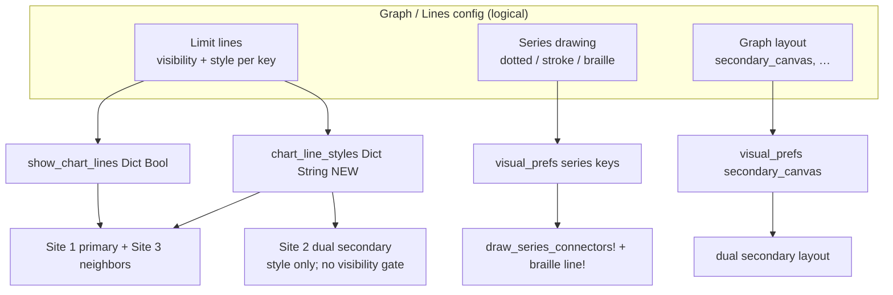
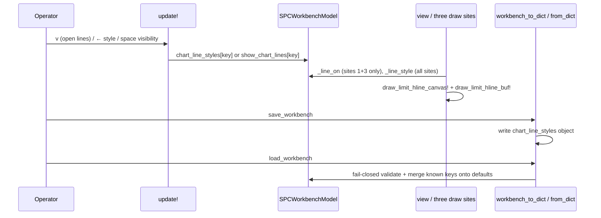
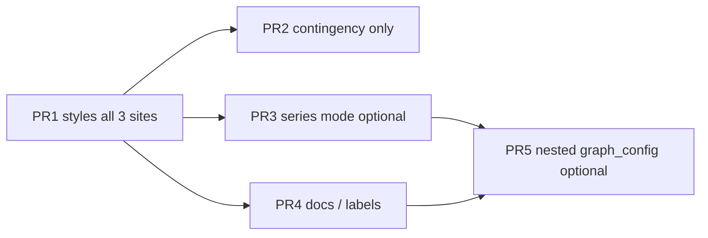

# Design: Graph / Lines Config — Per-Line Styles First

| Field | Value |
|-------|-------|
| **Document** | Graph & Lines Config (unified surface, incremental delivery) |
| **Author** | (agent draft) |
| **Date** | 2026-07-13 |
| **Status** | Draft (rev 2 — review feedback addressed) |
| **Project** | tachikoma-tui (Julia + Tachikoma.jl SPC workbench) |
| **Primary files** | `src/spc_workbench.jl`, `src/spc_workbench_io.jl`, `test/test_spc_workbench.jl` |

---

## Overview

Operators already configure **which** chart lines appear (CL, ±1σ, ±2σ, ±3σ, Specs) via the **Lines** config tab (`v`), and **how** series connectors / dual canvas behave via **Visual Preferences** (`o`). Styles for limit lines themselves are **hardcoded** today: CL is always solid; σ zones and specs always use fixed dash periods on the braille canvas and fixed step patterns on the cell-buffer overlay.

This design unifies those surfaces under a single conceptual **Graph / Lines config** model—without a big-bang rewrite—and delivers **per-line line styles** (solid / dotted / dashed / long-dash) as the first independently mergeable slice. Later slices can grow the same surface (series connector modes, secondary layout knobs, optional colors/glyphs) without rewriting the first PR.

---

## Background & Motivation

### Current state (as implemented)

The workbench config overlay is a three-tab modal on `SPCWorkbenchModel`:

| Tab | `config_tab` | Open key | Model field | Storage type |
|-----|--------------|----------|-------------|--------------|
| WECO Rules | `:weco` | `c` | `enabled_rules` (+ per-chart sync) | `Dict{String,Bool}` |
| Chart Lines | `:lines` | `v` | `show_chart_lines` | `Dict{String,Bool}` |
| Visual Preferences | `:visual` | `o` | `visual_prefs` | `Dict{String,Bool}` |

**Chart line identity** is centralized:

```484:500:src/spc_workbench.jl
const CHART_LINE_KEYS = ["cl", "sigma1", "sigma2", "sigma3", "specs"]
const CHART_LINE_LABELS = Dict(
    "cl" => "CL",
    "sigma1" => "±1σ",
    "sigma2" => "±2σ",
    "sigma3" => "±3σ",
    "specs" => "Specs",
)
const DEFAULT_CHART_LINES = Dict{String,Bool}(
    "cl" => true,
    "sigma1" => true,
    "sigma2" => true,
    "sigma3" => true,
    "specs" => true,
)

_line_on(m, key::AbstractString) = get(m.show_chart_lines, key, true)
```

**Visual prefs** are global booleans (not style enums), listed in order for the Visual panel:

```502:522:src/spc_workbench.jl
const VISUAL_PREF_KEYS = ["solid_series", "solid_stroke", "braille_series", "secondary_canvas"]
# labels + DEFAULT_VISUAL_PREFS all Bool
_pref_on(m, key::AbstractString) = get(m.visual_prefs, key, get(DEFAULT_VISUAL_PREFS, key, false))
```

Model fields (`SPCWorkbenchModel` ~L1714–1730):

- `config_open`, `config_selected`, `config_tab`
- `show_chart_lines::Dict{String,Bool}`
- `visual_prefs::Dict{String,Bool}`

JSON schema v1 already round-trips both as optional objects via `_bool_dict_from_json` (`src/spc_workbench_io.jl` ~L410–418, L722–726, L817–818).

### How lines are drawn today (three *layers* and three *call sites*)

**Paint layers** (what gets drawn for each geometry):

| Line | Canvas layer | Buffer overlay (`_draw_lim_line!`) |
|------|--------------|-------------------------------------|
| **CL** | `line!` (solid braille) | continuous `─` accent |
| **±1σ** | `dashed_line!(…; dash=2)` | `step=2` of `-` |
| **±2σ** | `dashed_line!(…; dash=3)` | `step=3` of `-` |
| **±3σ (UCL/LCL)** | `dashed_line!(…; dash=4)` | `step=4` of `-` |
| **Specs USL/LSL** | `dashed_line!(…; dash=2)` | `step=2` of `-` (error style) |

Helpers involved:

- Canvas: `dashed_line!` (Bresenham with on/off period; `src/spc.jl` ~L300 and workbench guard ~L5382)
- Buffer: nested `_draw_lim_line!(rect, val, sty, step=3)` ~L3897
- Series connectors (separate concern): `draw_series_connectors!` → `solid_cell_line!` / `solid_stroke_line!` gated by visual prefs; braille series uses `line!` when `braille_series` is on

**Call sites** (where limit geometry is invoked — distinct paths):

| Site | Location | Geometry drawn | Visibility gate | Notes |
|------|----------|----------------|-----------------|-------|
| **1. Primary** | `_render_series_canvas!` with `draw_sigma_zones=true` (~L3851–3925) | Full zones + CL + specs | `_line_on` per `CHART_LINE_KEYS` | Active plot; binds mouse |
| **2. Dual secondary** | Same function, `draw_sigma_zones=false` (~L3881–3936); call ~L4661–4674 | **Only** CL / UCL / LCL when args non-`nothing` | **None** — ignores `show_chart_lines` | MR/R/s under active; display-only |
| **3. Neighbor panes** | Inline dashboard blocks (~L4717–4867) | Full zones + CL + specs | `_line_on` per key | Charts 2/3; duplicated canvas + buffer logic |

These three sites are **not** the same geometry set. Site 2 is simplified CL/UCL/LCL; sites 1 and 3 use all five line keys. Style plumbing must cover all three (see Proposed Design matrix).

HTML reference (`SPC_workbench_2026-06-18-20-46.html` ~L2828) similarly hardcodes dash arrays per limit type (`stroke-dasharray` for USL/LSL/UCL; solid CL; series path always solid). Terminal already exceeds HTML on **visibility toggles** and series connector prefs; styles remain fixed in both.

### Pain points

1. **No operator control of line *appearance*** — only on/off. Dense σ overlays are hard to distinguish when dash periods are fixed and colors alone must carry meaning.
2. **Two adjacent tabs feel related but are split** — “lines on chart” vs “graph drawing prefs.” Users ask for a “graph config”; the natural home for style is the Lines tab, with Visual remaining series/layout knobs until a later merge.
3. **Style logic is scattered literals** — dash=2/3/4 and step=2/3/4 repeated across the **three call sites** above. Adding a new style today means hunting every path.
4. **Bool-only prefs cannot express exclusive style enums** — `visual_prefs` is the wrong type for “one of solid|dashed|dotted.” Extending it with fake multi-bools would paint a corner.

### Why now

- Lines visibility + config UI + JSON plumbing are stable and well-tested (`test_spc_workbench.jl` “side stats chart-line params…” ~L2871+).
- Primary path already lives in `_render_series_canvas!`; dual secondary shares that function’s `else` branch; neighbor panes duplicate the same vocabulary—good extraction point for shared helpers.
- User explicitly wants **incremental** delivery: first styles per line; unify graph/lines config as framing, not a rewrite.

---

## Goals & Non-Goals

### Goals

1. **Per-line styles** for each `CHART_LINE_KEYS` entry: at least **solid**, **dotted**, **dashed**, and one longer-dash variant that preserves today’s σ3 look.
2. **Defaults match current visual appearance** so existing sessions and screenshots do not regress without user action (including specs = dash/step 2 → style id `dotted`).
3. **Lines tab UI** to view and cycle style without breaking existing visibility toggles (`space`/`enter`/digit keys).
4. **JSON persistence** of styles (optional schema-v1 field; omit-or-defaults on old files).
5. **Architectural room** for a unified Graph config (series + layout + lines) delivered in later PRs without migrating PR1’s public behavior again.
6. **TestBackend-first verification**: style changes observable via `char_at` density on horizontal limit rows; config row text via `find_text` / `row_text`.
7. **All three draw sites** (primary, dual secondary, neighbor panes) use style helpers in PR1 — no “styles on active only” ship.

### Non-Goals (this design / near-term)

- Per-chart (not session) line styles — styles stay **session-level**, like `show_chart_lines` / `visual_prefs` today.
- Per-line **colors** or custom Unicode glyphs (may come later under the same keys). Call sites **keep existing `tstyle(...)` mappings** in PR1; helpers own dash/step/char only.
- Rewriting series connector prefs into a single enum in PR1 (optional later PR).
- Merging `:lines` and `:visual` tabs into one panel in PR1 (framing only; optional PR later).
- Schema major version bump (`version: 2`) solely for styles.
- HTML export / SVG dash parity as a hard requirement.
- Changing WECO rules UI or limit math (`compute_limits_and_zones`, `auto_limits`).
- Point marker styles (● ◆ ✕) or hover crosshair glyphs.
- **Changing dual-secondary visibility gating** — secondary continues to draw CL/UCL/LCL whenever values are non-`nothing`, **without** consulting `_line_on` / `show_chart_lines`. PR1 applies **styles only** to what secondary already draws. Gating secondary with `_line_on` is a separate optional later PR if product wants it.

---

## Proposed Design

### Conceptual model: Graph Config layers

Treat “graph config” as a **logical product surface** with three layers. Storage can stay as sibling fields on `SPCWorkbenchModel` until a later nesting PR.



| Layer | Today | PR1 | Later |
|-------|-------|-----|-------|
| Limit visibility | `show_chart_lines` | unchanged (primary + neighbors only) | optional secondary gating |
| Limit **style** | hardcoded | **`chart_line_styles`** | optional color/glyph |
| Series connectors | `visual_prefs` bools | unchanged | optional `series_mode` enum |
| Layout | `secondary_canvas` | unchanged | denser graph knobs |

**Why not one nested `graph_config` struct in PR1?** Nested rewrite forces JSON, model, tests, and docs churn with zero user-visible gain for styles. Parallel `chart_line_styles` matches the established `show_chart_lines` / `visual_prefs` pattern and is easy to fold under a `graph_config` object later with a thin adapter.

### Call-site matrix (required for PR1)

| Site | Geometry | Visibility | Style keys |
|------|----------|------------|------------|
| **Primary** `_render_series_canvas!` (`draw_sigma_zones=true`) | full zones + specs + CL | `_line_on` per key | each of `CHART_LINE_KEYS` |
| **Dual secondary** `_render_series_canvas!` (`draw_sigma_zones=false`) | cl / ucl / lcl only | **unchanged: no `_line_on`** | `cl` → style `cl`; `ucl`/`lcl` → style `sigma3` |
| **Neighbor panes** 2/3 (inline ~L4717–4867) | full zones + specs + CL | `_line_on` per key | each of `CHART_LINE_KEYS` |

**PR1 Done criterion (hard):** after the change, limit-line drawing must go through `draw_limit_hline_canvas!` / `draw_limit_hline_buf!` (or thin wrappers) at **all three sites**. Concrete gate:

```bash
# No remaining limit-line dashed_line!/line! for CL/UCL/σ/specs outside helpers.
# (series braille connectors may still call line! between points — that is not a limit line.)
rg "dashed_line!" src/spc_workbench.jl
# Expected: definition/guard of dashed_line! and/or calls only inside draw_limit_hline_canvas!
```

PR2 exists only as a **delete-if-done contingency** if a review finds a missed site; it is **not** a license to ship primary-only styles.

### LineStyle vocabulary

Use a small closed set of **wire strings** (JSON-friendly, TestBackend-readable labels). Prefer `String` over `@enum` for dict storage consistency with the rest of the workbench; validate on parse.

```julia
# src/spc_workbench.jl (near CHART_LINE_KEYS)

const LINE_STYLE_KEYS = ["solid", "dotted", "dashed", "long_dash"]
const LINE_STYLE_LABELS = Dict(
    "solid"     => "solid",
    "dotted"    => "dotted",
    "dashed"    => "dashed",
    "long_dash" => "long dash",
)

# Defaults preserve today's hardcoded look (KD-LS-4).
# Canvas dash / buffer step today: CL solid; σ1=2; σ2=3; σ3=4; specs=2.
const DEFAULT_CHART_LINE_STYLES = Dict{String,String}(
    "cl"     => "solid",      # was line!
    "sigma1" => "dotted",     # was dash=2 / step=2
    "sigma2" => "dashed",     # was dash=3 / step=3
    "sigma3" => "long_dash",  # was dash=4 / step=4
    "specs"  => "dotted",     # was dash=2 / step=2 — same period as sigma1
)

_line_style(m, key::AbstractString)::String =
    get(m.chart_line_styles, key, get(DEFAULT_CHART_LINE_STYLES, key, "dashed"))
```

**Render mapping** (single source of truth):

| Style | Canvas | Buffer overlay glyph / step |
|-------|--------|-----------------------------|
| `solid` | `line!` (every braille point) | continuous `─` (step ≤ 1) |
| `dotted` | `dashed_line!(…; dash=2)` | `'-'` step 2 (**legacy buffer glyph**) |
| `dashed` | `dashed_line!(…; dash=3)` | `'-'` step 3 |
| `long_dash` | `dashed_line!(…; dash=4)` | `'-'` step 4 |

> **Glyph policy (PR1):** All non-solid buffer overlays use `'-'`, matching `_draw_lim_line!` today (~L3897–3903). Do **not** ship `'·'` / `'.'` in PR1. Prettier dotted glyphs are a later polish note only.

Helper sketch:

```julia
"""Map style id → (canvas_dash::Union{Nothing,Int}, buffer_step::Int, buffer_ch::Char).
`canvas_dash === nothing` means solid `line!`.
Helpers own dash/step/char only; call sites keep existing tstyle(...) color mappings."""
function _style_draw_params(style::AbstractString)
    s = String(style)
    s == "solid"     && return (nothing, 1, '─')
    s == "dotted"    && return (2, 2, '-')   # legacy buffer glyph
    s == "dashed"    && return (3, 3, '-')
    s == "long_dash" && return (4, 4, '-')
    return (3, 3, '-')  # defensive fallback for internal misuse only
end

function draw_limit_hline_canvas!(c, y::Int, dw::Int, style::AbstractString)
    dash, _, _ = _style_draw_params(style)
    if dash === nothing
        line!(c, 0, y, dw - 1, y)
    else
        dashed_line!(c, 0, y, dw - 1, y; dash = dash)
    end
end

function draw_limit_hline_buf!(buf, rect, val, viewport, style::AbstractString, sty)
    # `sty` is the call-site tstyle (color/bold) — helpers must not invent colors.
    _, step, ch = _style_draw_params(style)
    yy = data_val_to_cell_row(Float64(val), rect, viewport)
    if step <= 1
        for xx in rect.x:right(rect)
            set_char!(buf, xx, yy, ch, sty)
        end
    else
        for xx in rect.x:right(rect)
            if (xx % step) == 0
                set_char!(buf, xx, yy, ch, sty)
            end
        end
    end
end
```

**Color preservation:** Helpers own **dash / step / char only**. Call sites retain today’s `tstyle` mappings:

| Line | Buffer `tstyle` (unchanged) |
|------|----------------------------|
| Specs USL/LSL | `tstyle(:error, bold=true)` |
| σ3 UCL/LCL | `tstyle(:warning, bold=true)` |
| σ2 | `tstyle(:secondary)` |
| σ1 | `tstyle(:text_dim)` |
| CL | `tstyle(:accent)` continuous `─` (solid path) |

### Refactor sketches by call site

#### Site 1 — Primary (`draw_sigma_zones && lz !== nothing`)

```julia
if draw_sigma_zones && lz !== nothing
    if _line_on(m, "sigma1")
        st = _line_style(m, "sigma1")
        for z in (lz.ucl1, lz.lcl1)
            draw_limit_hline_canvas!(c, map_to_dot_y(z, viewport, dh), dw, st)
        end
    end
    # … same pattern for sigma2, sigma3, cl, specs …
    # Buffer overlay: same gates + draw_limit_hline_buf!(…, st, tstyle(...))
end
```

#### Site 2 — Dual secondary (`else` / simplified; **no `_line_on`**)

```julia
else
    # Dual secondary geometry: draw when args provided — do NOT consult show_chart_lines.
    if ucl !== nothing
        draw_limit_hline_canvas!(c, map_to_dot_y(Float64(ucl), viewport, dh), dw,
                                 _line_style(m, "sigma3"))
    end
    if lcl !== nothing
        draw_limit_hline_canvas!(c, map_to_dot_y(Float64(lcl), viewport, dh), dw,
                                 _line_style(m, "sigma3"))
    end
    if cl !== nothing
        draw_limit_hline_canvas!(c, map_to_dot_y(Float64(cl), viewport, dh), dw,
                                 _line_style(m, "cl"))
    end
    # Buffer overlay: same style keys + existing tstyle(:warning) / tstyle(:accent)
end
```

#### Site 3 — Neighbor panes

Replace inline `dashed_line!` / step-loops with the same helpers as Site 1 (full `CHART_LINE_KEYS`, `_line_on` gates, per-key styles). Prefer extracting a small shared `_draw_limit_set!(…)` used by primary and neighbors if it keeps the PR small; either way, both sites must end up style-aware.

### Model & API surface

```julia
@kwdef mutable struct SPCWorkbenchModel <: Model
    # …
    show_chart_lines::Dict{String,Bool} = copy(DEFAULT_CHART_LINES)
    chart_line_styles::Dict{String,String} = copy(DEFAULT_CHART_LINE_STYLES)  # NEW
    visual_prefs::Dict{String,Bool} = copy(DEFAULT_VISUAL_PREFS)
    # …
end
```

**Exports** (add to `src/spc_workbench.jl` re-exports + `TachikomaTUI.jl`), matching the peer pattern of `DEFAULT_CHART_LINES` / `CHART_LINE_KEYS` / `DEFAULT_VISUAL_PREFS` / `VISUAL_PREF_KEYS`:

| Export | Kind |
|--------|------|
| `LINE_STYLE_KEYS` | `Vector{String}` |
| `LINE_STYLE_LABELS` | `Dict{String,String}` |
| `DEFAULT_CHART_LINE_STYLES` | `Dict{String,String}` |

**Do not export** `_line_style`, `draw_limit_hline_canvas!`, `draw_limit_hline_buf!`, or invent a `CHART_LINE_STYLES` alias. Tests access internals via the module (same as `_line_on` / `_pref_on` today) or public model fields.

Keep `CHART_LINE_KEYS` as the shared key list for both visibility and style.

### Config UI (Lines tab)

**Keep** Tab cycle: WECO → Lines → Visual → WECO.

**Lines row format (PR1 — short, mandatory):**

```text
▶ 1 ● CL     [ON]  solid
  2 ● ±1σ   [ON]  dotted
  3 ● ±2σ   [ON]  dashed
  4 ● ±3σ   [ON]  long dash
  5 ● Specs  [ON]  dotted
```

Rules:

- **No** per-row “(draw on chart)” (drop existing suffix if still present).
- **No** long `style:` prefix or cycle instructions on each row.
- Style label uses `LINE_STYLE_LABELS` (`"long dash"` for `long_dash`).
- Cycle / toggle hints live **only** in the Block title.

Block title:

```text
Config: Chart Lines (Tab · ↑↓ · 1-N toggle · ←/→ style · Esc/v close)
```

**Keybindings on `:lines` tab only:**

| Key | Action |
|-----|--------|
| `↑` / `↓` | Move selection (existing) |
| `space` / `enter` | Toggle **visibility** (existing) |
| digit `1`–`5` | Select + toggle visibility (existing) |
| `←` / `→` | Cycle style for selected line **backward / forward** through `LINE_STYLE_KEYS` |

`last_event` examples: `"toggle line sigma1"`, `"style cl=dashed"`.

Visual tab is **unchanged** in PR1.

TestBackend assertions should look for substrings like `"solid"`, `"dotted"`, `"long dash"` — **not** full instructional sentences.

### Cycle helper

```julia
function _cycle_line_style!(m::SPCWorkbenchModel, key::AbstractString; dir::Int = 1)
    cur = _line_style(m, key)
    idxs = findfirst(==(cur), LINE_STYLE_KEYS)
    i = idxs === nothing ? 1 : idxs
    n = length(LINE_STYLE_KEYS)
    j = mod1(i + dir, n)
    m.chart_line_styles[key] = LINE_STYLE_KEYS[j]
    m.last_event = "style $key=$(LINE_STYLE_KEYS[j])"
    return LINE_STYLE_KEYS[j]
end
```

Wire in `update!` config branch (~L3096–3166): when `config_tab == :lines` and `evt.key == :left` / `:right`, call `_cycle_line_style!`. Config branch already returns early before pan handlers — left/right are free when config is open.

### Data flow



### JSON schema (additive, still version 1)

```json
{
  "version": 1,
  "charts": [ "…" ],
  "active": 1,
  "show_chart_lines": { "cl": true, "sigma1": true, "sigma2": true, "sigma3": true, "specs": true },
  "chart_line_styles": {
    "cl": "solid",
    "sigma1": "dotted",
    "sigma2": "dashed",
    "sigma3": "long_dash",
    "specs": "dotted"
  },
  "visual_prefs": { "solid_series": true, "solid_stroke": true, "braille_series": true, "secondary_canvas": true }
}
```

#### Single unknown-style policy (authoritative)

| Case | Behavior |
|------|----------|
| Missing `chart_line_styles` | `copy(DEFAULT_CHART_LINE_STYLES)` |
| Wrong top-level type (not object) | **Fail** whole parse: `"chart_line_styles must be an object"` |
| Known key, value not a string | **Fail**: `"chart_line_styles.<key> must be a string"` |
| Known key, string **not** in `LINE_STYLE_KEYS` | **Fail**: `"chart_line_styles.<key> unknown style: …"` |
| Unknown keys in the object | **Ignore** (do not fail; do not store) |
| Partial known keys | Merge onto defaults (missing keys keep default) |
| Save | Always write **full** key set (like `show_chart_lines`) |

There is **no** lenient “unknown style → default for that key” path. Fail-closed on unknown style strings keeps bad sessions out of the model and gives a clear load error.

#### IO apply checklist (must touch all four)

Implementers must extend **all** of:

1. `_style_dict_from_json` (new helper, policy above)
2. `_parse_workbench_dict` — `get(d, "chart_line_styles", nothing)` + include `chart_line_styles` in the returned **NamedTuple** (~L734–743)
3. `_apply_parsed!` — `m.chart_line_styles = parsed.chart_line_styles` (mirror ~L780–781)
4. `workbench_to_dict` — write `"chart_line_styles" => Dict{String,Any}(…)` (mirror ~L817–818)

Forgetting any of 2–4 yields either a compile/type error or silent non-persistence. `workbench_from_dict` uses `_apply_parsed!` after constructing a shell model — no separate constructor kwarg required if `_apply_parsed!` assigns the field.

New helper:

```julia
function _style_dict_from_json(v, defaults::Dict{String,String})::Union{Dict{String,String},String}
    v === nothing && return copy(defaults)
    v isa AbstractDict || return "chart_line_styles must be an object"
    out = copy(defaults)
    allowed = Set(LINE_STYLE_KEYS)
    for (k, rv) in v
        ks = String(k)
        haskey(out, ks) || continue          # ignore unknown keys
        rv isa AbstractString || return "chart_line_styles.$ks must be a string"
        s = String(rv)
        s in allowed || return "chart_line_styles.$ks unknown style: $s"  # fail-closed
        out[ks] = s
    end
    return out
end
```

### Testing strategy (TestBackend) — concrete recipe

Place tests next to existing lines/visual suites in `test/test_spc_workbench.jl`. Re-render with `TestBackend` **after every `update!`** before asserting (AGENTS.md discipline).

#### A. Defaults

- Fresh model: `m.chart_line_styles` matches `DEFAULT_CHART_LINE_STYLES` for all `CHART_LINE_KEYS`.
- Assert `"specs" => "dotted"`, `"cl" => "solid"`, `"sigma3" => "long_dash"`.

#### B. Config UI

1. `update!(m, KeyEvent('v'))` → `config_open && config_tab == :lines`.
2. `view` → row text contains `"solid"` / `"dotted"` (short format); do **not** require `"style:"` or cycle prose.
3. With selection on CL: `update!(…, KeyEvent(:right))` → style cycles solid→dotted; `last_event` contains `style cl=`.
4. `space` still toggles visibility only.
5. While `config_open`: `:left`/`:right` must **not** pan viewport (`viewport.x0` unchanged) — config branch returns early.

#### C. Primary buffer density (horizontal limit row)

Limit lines are **horizontal buffer overlays**, not Bresenham series connectors. Recipe:

1. Build a short synthetic series + viewport; pause live.
2. Turn **all** `show_chart_lines` off, then turn **only** `cl` on.
3. Turn off series connectors: `solid_series`, `solid_stroke`, `braille_series` = `false` (reduce mid-row noise).
4. Set `chart_line_styles["cl"] = "solid"`; `view`; locate `yy = data_val_to_cell_row(lz.cl, m.plot_area, m.viewport)`.
5. Count non-space `char_at` across `plot_area.x:right(plot_area)` on `yy` → `filled_solid`.
6. Set style `"dotted"`; re-`view`; same count → `filled_dotted`.
7. Assert `filled_solid > filled_dotted` (step 1 vs step 2). Optionally assert solid is nearly continuous.

#### D. Multi-site smoke

At least one of:

- **Secondary:** enable dual (`secondary_canvas=true`, eligible chart type, tall enough backend); set `chart_line_styles["sigma3"] = "solid"` vs `"dotted"`; assert density change on secondary UCL/LCL row **or** unit-level that secondary `else` branch calls `_line_style(m, "sigma3")` / helpers (if extracting a pure helper, test that).
- **Neighbor:** multi-chart dashboard with panes 2/3 visible; assert neighbor path uses helpers (same density idea on a neighbor limit, or shared `_draw_limit_set!` unit test used by both site 1 and 3).

If PR1 fully consolidates sites into shared helpers, one unit test of the shared function plus one primary integration density test is enough; if sites remain duplicated, require **one char_at or helper-invocation test per site**.

#### E. JSON

| Case | Expect |
|------|--------|
| Round-trip mutate style | restored after `workbench_from_dict!` |
| Missing `chart_line_styles` | defaults |
| Invalid type (array) | error `String` from parse |
| Unknown style string e.g. `"wiggly"` | error `String` (fail-closed) |
| Extra unknown key | ignored; known keys apply |

#### F. Regression

- Existing lines visibility tests remain green (side-panel bubbles, digit toggles, Tab cycle).
- Default-rendered specs/σ density does not silently change vs pre-PR1 (defaults map preserves dash periods).

### Future unification path (not PR1)

Optional later evolution when more knobs appear:

```julia
# Logical only — may never need a concrete Julia struct if dicts stay clearer
# graph_config = {
#   lines: { cl: {show, style}, … },
#   series: { solid_series, solid_stroke, braille_series },
#   layout: { secondary_canvas, dual_primary_frac? }
# }
```

UI merge options later:

- **A.** Rename Visual tab → “Graph”; move series/layout rows under it; Lines stays style+visibility.
- **B.** Single “Graph” tab with two sections (Lines / Series & layout).
- **C.** Keep three tabs; only docs call the pair “graph config.”

PR1 commits to **none of these UI renames** — only adds style under Lines.

**Optional later (not PR1):** gate dual-secondary CL/UCL/LCL with `_line_on(m, "cl")` / `_line_on(m, "sigma3")` if operators want Lines toggles to hide secondary limits too.

---

## API / Interface Changes

### New public constants

| Symbol | Kind | Notes |
|--------|------|-------|
| `LINE_STYLE_KEYS` | `Vector{String}` | cycle order |
| `LINE_STYLE_LABELS` | `Dict{String,String}` | UI short labels |
| `DEFAULT_CHART_LINE_STYLES` | `Dict{String,String}` | defaults |

Internal only: `_line_style`, `_style_draw_params`, `draw_limit_hline_canvas!`, `draw_limit_hline_buf!`, `_cycle_line_style!`.

### Model field

| Field | Type | Default |
|-------|------|---------|
| `chart_line_styles` | `Dict{String,String}` | `copy(DEFAULT_CHART_LINE_STYLES)` |

### JSON

| Key | Required | Notes |
|-----|----------|-------|
| `chart_line_styles` | no | object of line-key → style string; fail-closed unknown styles |

### UI contract changes

- Lines tab rows gain short style label; `←`/`→` cycle style when `config_open && config_tab == :lines`.
- No change to `c` / `v` / `o` open keys or Tab order.

### Before / after (primary site)

**Before** (hardcoded):

```julia
if _line_on(m, "sigma3")
    dashed_line!(c, 0, map_to_dot_y(lz.ucl, viewport, dh), dw - 1, …; dash = 4)
    dashed_line!(c, 0, map_to_dot_y(lz.lcl, viewport, dh), dw - 1, …; dash = 4)
end
if _line_on(m, "cl")
    line!(c, 0, map_to_dot_y(lz.cl, viewport, dh), dw - 1, …)
end
```

**After:**

```julia
if _line_on(m, "sigma3")
    st = _line_style(m, "sigma3")
    draw_limit_hline_canvas!(c, map_to_dot_y(lz.ucl, viewport, dh), dw, st)
    draw_limit_hline_canvas!(c, map_to_dot_y(lz.lcl, viewport, dh), dw, st)
end
if _line_on(m, "cl")
    draw_limit_hline_canvas!(c, map_to_dot_y(lz.cl, viewport, dh), dw, _line_style(m, "cl"))
end
# Buffer: draw_limit_hline_buf!(buf, rect, val, viewport, st, tstyle(:warning, bold=true))  # keep colors
```

See also Site 2 sketch above for dual secondary.

---

## Data Model Changes

### In-memory

```
SPCWorkbenchModel
├── show_chart_lines     # visibility (existing; sites 1+3 only)
├── chart_line_styles    # NEW style ids (all three sites)
└── visual_prefs         # series + layout (existing)
```

No `ChartSpec` fields — styles are **session-global**, consistent with visibility.

### Migration

| Source | Behavior |
|--------|----------|
| Fresh model | defaults |
| JSON without `chart_line_styles` | defaults |
| JSON with partial known keys | merge onto defaults |
| JSON with unknown style string | **load fails** with error string |
| HTML archive import | no styles in HTML → defaults after convert |

No DB; no disk migration beyond JSON optional key.

### Schema version policy

Remain on **`version: 1`**. Optional keys are the established pattern (`visual_prefs`, `table`, `default_rules`). Bump only if a breaking restructure (e.g. nested `graph_config` replacing flat keys with no dual-read) ships.

---

## Alternatives Considered

### A. Encode style inside `show_chart_lines` as tri-state / string

- **Pros:** one dict.
- **Cons:** breaks bool API, all tests, `_bool_dict_from_json`, side-panel bubble semantics (“on/off” vs style). **Rejected.**

### B. Nested `LineConfig` struct per key in one `Dict{String,LineConfig}`

```julia
struct LineConfig
    show::Bool
    style::String
end
```

- **Pros:** elegant domain model; single source for “a line.”
- **Cons:** larger PR; JSON object-of-objects; harder incremental ship; couples visibility bugs to style work. **Defer** to optional later cleanup once styles are stable.

### C. Put styles under `visual_prefs` as freeform values / multi-keys

- **Pros:** one prefs bag.
- **Cons:** `Dict{String,Bool}` type lies; Visual tab is the wrong UX home for CL/σ lines; digit shortcuts already map to `VISUAL_PREF_KEYS` order. **Rejected for PR1.**

### D. Only global “limit line style” (one style for all lines)

- **Pros:** trivial UI.
- **Cons:** fails user ask “styles **per line**”; loses today’s deliberate CL-vs-σ differentiation. **Rejected.**

### E. Full Graph-config rewrite + tab merge first

- **Pros:** clean end-state UX.
- **Cons:** high risk, slow to first value, conflicts with “add things one at a time.” **Rejected as first PR;** allowed as later framing PR.

**Chosen:** Alternative of **parallel `chart_line_styles` dict + Lines-tab cycling + shared draw helpers** (section Proposed Design).

---

## Security & Privacy Considerations

| Topic | Assessment |
|-------|------------|
| Threat model | Style strings are non-executable display metadata. |
| Injection | Allowlist against `LINE_STYLE_KEYS` on JSON load (**fail-closed**); never `eval` or pass to shell. Values are small wire tokens — no path/command semantics. |
| Auth | Unchanged (no admin gate on prefs). |
| Data handling | Styles may appear in saved workbench JSON; no secrets. |
| Path traversal | N/A (no new file paths). |

Severity of misuse: **negligible** (cosmetic).

---

## Observability

| Mechanism | Use |
|-----------|-----|
| `m.last_event` | `"style cl=dashed"`, `"toggle line specs"` for live debug footer / status |
| TestBackend | primary verification (no runtime metrics stack) |
| Load errors | Unknown style / bad type surface as parse error strings to the operator/API |

No Prometheus/metrics requirement for a TUI session pref. No silent style fallback logging needed under fail-closed policy.

---

## Rollout Plan

1. **Land PR1** (styles + helpers + **all three draw sites** + tests + JSON) behind no feature flag — pure additive defaults.
2. **Done gate:** `rg` checklist for limit-line call sites (see Call-site matrix); full suite green.
3. **Smoke:** `julia --project=. test/runtests.jl` + `julia --project=. -e 'using TachikomaTUI; … hello or workbench smoke'`.
4. **Docs:** update `docs/src/spc-workbench.md` (schema table + keys `v`/`←``→`) and user workbench guide in the same PR or a docs-only follow-up if preferred.
5. **Rollback:** revert PR; old JSON without styles still loads; JSON *with* styles remains valid if ignored by old code (`_parse_workbench_dict` uses selective `get` — old binaries ignore the field).

Staged rollout of later graph-unification PRs is independent.

---

## Risks

| Risk | Severity | Mitigation |
|------|----------|------------|
| One of three draw sites miss helpers → inconsistent multi-pane styles | **High** | PR1 Done criterion: all three sites + `rg` gate; multi-site smoke test |
| “Cleanup” applies `_line_on` to dual secondary | **Med** | Explicit non-goal; freeze secondary visibility; review checklist |
| Partial PR1 (primary only) ships as “done” | **Med** | Hard Done criterion; PR2 is contingency only, not a partial-ship path |
| `←`/`→` pan when config open | Low | Config branch returns early (~L3097–3166) before pan — add test |
| Overlay glyph change breaks char_at | Low | Canonical dotted/dashed/long_dash buffer char is `'-'` |
| Narrow overlay truncates row text | Low | Short row format only; hints in Block title |
| Operator confuses style cycle with visibility | Low | Distinct keys; row shows both `[ON]` and style token |
| Collapse all limit colors to one `tstyle` during refactor | Med | Helpers take `sty` from call site; document color table |

---

## Open Questions

Resolved in rev 2 (kept here for history):

1. ~~**Specs default**~~ → **`dotted`** (dash/step 2 parity with KD-LS-4). Closed.
2. **Secondary UCL/LCL style source:** always follow `sigma3` key (KD-LS-9). Closed for PR1; separate `ucl`/`lcl` keys only if product later wants independent control.
3. ~~**Unknown JSON style string**~~ → **fail-closed** (error string from parse). Closed.
4. ~~**Dotted buffer glyph**~~ → **`'-'`** in PR1. Closed.
5. **Should Target line get a style key?** Target is not in `CHART_LINE_KEYS` today. **Out of scope** unless product wants `target` as 6th line key later.
6. **Tab rename timing:** rename Visual → Graph in same release as series-mode enum, not with styles.

Remaining product optional (not blocking PR1):

7. Later: should dual secondary honor `show_chart_lines` for CL/UCL/LCL? Default **no** until requested.

---

## Key Decisions

| ID | Decision | Rationale |
|----|----------|-----------|
| **KD-LS-1** | **PR1 = per-line styles for limit lines**, not full graph rewrite | Delivers user-visible value immediately; matches “one at a time.” |
| **KD-LS-2** | Store styles in **`chart_line_styles::Dict{String,String}`** parallel to `show_chart_lines` | Same pattern as existing prefs; no bool-type lie; easy JSON; low migration cost. |
| **KD-LS-3** | Wire styles as **closed string set** (`solid` / `dotted` / `dashed` / `long_dash`) | JSON-stable, TestBackend-friendly, cycle-ordered; avoids `@enum` + dict friction. |
| **KD-LS-4** | **Defaults reproduce current hardcoded appearance** including **`specs => "dotted"`** (dash/step 2), CL solid, σ1 dotted, σ2 dashed, σ3 long_dash | Zero surprise for operators and golden TestBackend expectations; no intentional density change on load. |
| **KD-LS-5** | **Lines tab** owns style UI; `←`/`→` cycle, space/enter visibility; **short row format** | Styles are attributes of chart lines; Visual stays series/layout; overlay width is tight. |
| **KD-LS-6** | **Centralize draw params** in `_style_draw_params` + `draw_limit_hline_*!`; call sites keep **colors** | Removes dash/step literals; three-site reuse; colors stay intentional UX. |
| **KD-LS-7** | **Session-level** styles (not per-`ChartSpec`) | Matches visibility model; one control for all panes. |
| **KD-LS-8** | **Schema v1 additive** key `chart_line_styles`; **fail-closed** unknown styles | Consistent with optional prefs; fail-closed avoids silent wrong paint. |
| **KD-LS-9** | Dual secondary: style **`cl` / `sigma3` only**; **no visibility gate change** | Secondary geometry is CL/UCL/LCL; do not invent new keys; do not hide secondary when Lines toggles flip. |
| **KD-LS-10** | **Defer** tab merge and series-enum; document as later Graph config layers | Avoids painting into a corner while leaving a clear growth path. |
| **KD-LS-11** | **PR1 ships all three draw sites**; PR2 is delete-if-done contingency only | Prevents multi-pane dashboards with styles on active only. |
| **KD-LS-12** | Buffer non-solid glyph stays **`'-'`** in PR1 | Matches legacy `_draw_lim_line!`; zero glyph regression. |

---

## References

- `src/spc_workbench.jl` — `CHART_LINE_*`, `VISUAL_PREF_*`, `SPCWorkbenchModel`, config `update!` (~L3096), config view (~L4560), `_render_series_canvas!` (~L3783 primary + ~L3881 secondary else), series connectors (~L1472), neighbor panes (~L4717–4867)
- `src/spc.jl` — original `dashed_line!` (~L300)
- `src/spc_workbench_io.jl` — schema v1 `_bool_dict_from_json`, `_parse_workbench_dict` NamedTuple, `_apply_parsed!`, `workbench_to_dict`
- `test/test_spc_workbench.jl` — lines panel (~L2871), visual prefs density (~L2957+)
- `docs/src/spc-workbench.md` — keys `c`/`v`/`o`, schema table
- `docs/user/workbench.md` — operator guide prefs section
- `design-spc-html-gap-analysis.md` — visual prefs / chart line visibility matrix
- `design-spc-p2-polish-plan.md` — visual prefs surface notes
- HTML mock `SPC_workbench_2026-06-18-20-46.html` — `limitLine` + `stroke-dasharray` (~L2828)
- `AGENTS.md` — Tachikoma Elm pattern, TestBackend gates, incremental PRs

---

## PR Plan

### PR1 — Per-line limit styles (shippable slice; **must include all three draw sites**)

| | |
|--|--|
| **Title** | `spc: per-line chart styles (solid/dotted/dashed/long_dash)` |
| **Depends on** | none |
| **Files** | `src/spc_workbench.jl` (constants, model field, helpers, config update/view, `_render_series_canvas!` primary **and** secondary else, **neighbor panes** ~L4717–4867), `src/spc_workbench_io.jl` (`_style_dict_from_json`, NamedTuple, `_apply_parsed!`, `workbench_to_dict`), `src/TachikomaTUI.jl` (exports: `LINE_STYLE_KEYS`, `LINE_STYLE_LABELS`, `DEFAULT_CHART_LINE_STYLES` only), `test/test_spc_workbench.jl`, optionally `docs/src/spc-workbench.md` |
| **Description** | Add style dict + helpers. Lines tab short rows + `←`/`→` cycle. Wire **primary, dual secondary, and neighbor** limit drawing through helpers. Secondary: style only, no new visibility gates. JSON optional `chart_line_styles` with fail-closed unknown styles. Defaults preserve current look (`specs` → `dotted`). Full suite + density/UI/JSON tests. |
| **Done when** | (1) Full suite green; (2) no limit-line `dashed_line!` call sites outside helpers (`rg` gate); (3) multi-site smoke as specified; (4) defaults density unchanged. |

### PR2 — Contingency only (delete if PR1 greps clean)

| | |
|--|--|
| **Title** | `spc: route missed dual/neighbor limits through style helpers` |
| **Depends on** | PR1 **only if** review finds a remaining limit-line site outside helpers |
| **Files** | any leftover site in `src/spc_workbench.jl` + targeted tests |
| **Description** | **Not** a planned partial-ship path. Open only if PR1 Done gate failed a missed site. Prefer completing PR1 instead. |

### PR3 — Series connector mode (optional Graph layer growth)

| | |
|--|--|
| **Title** | `spc: series connector mode enum in visual prefs` |
| **Depends on** | PR1 (conceptual only; no hard code dep) |
| **Files** | `src/spc_workbench.jl` (`draw_series_connectors!`, `VISUAL_PREF_*` or new `series_mode`), IO if type changes, tests |
| **Description** | Optionally replace stacked bools with a small mode set — only if operators ask. Backward-compatible with existing `visual_prefs` JSON. |

### PR4 — Unified Graph config docs + optional tab labeling

| | |
|--|--|
| **Title** | `docs/ui: present Lines+Visual as Graph config surface` |
| **Depends on** | PR1 |
| **Files** | `docs/user/workbench.md`, `docs/src/spc-workbench.md`, maybe config Block titles |
| **Description** | No storage change. Clarify mental model; optional title renames only. |

### PR5 — Nested `graph_config` JSON (optional, only if nesting pays off)

| | |
|--|--|
| **Title** | `spc: optional nested graph_config in schema (dual-read)` |
| **Depends on** | PR1–PR3 as needed |
| **Files** | `spc_workbench_io.jl`, model adapters, docs schema |
| **Description** | Dual-read nested with flat fallback only if more graph knobs make flat root noisy. Prefer staying flat until pain is real. |

### Suggested implementation order



**First merge must be PR1 with the hard Done criterion.** PR2 should usually not exist. Everything else is optional growth of the same design frame.
