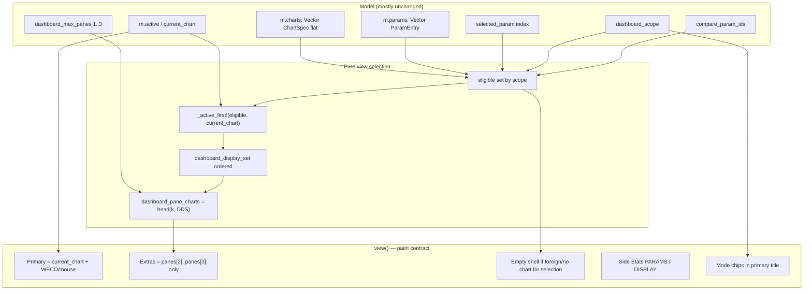
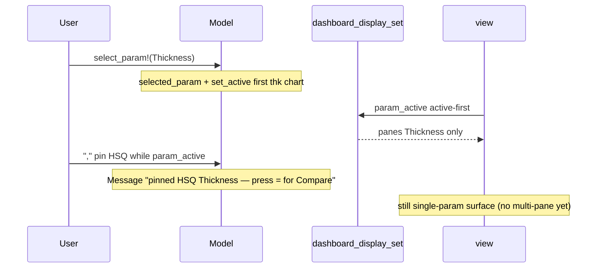
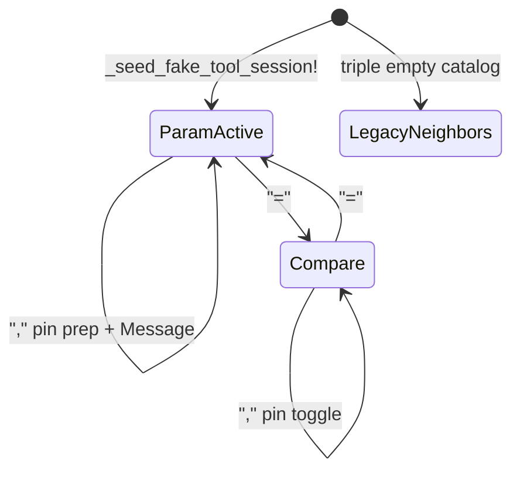
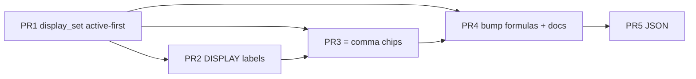

# Design: Param-Focused Dashboard Display + Explicit Multi-Param Compare

| Field | Value |
|-------|-------|
| **Document** | Presentation UX — selected parameter owns the chart surface; multi-param side-by-side is an explicit compare mode |
| **Author** | design-doc-writer (Grok) |
| **Date** | 2026-07-15 |
| **Status** | Draft (rev. 3 — re-review 635fb953) |
| **Project** | tachikoma-tui (Julia + Tachikoma.jl SPC Workbench) |
| **Primary files** | `src/spc_workbench.jl`, `src/spc_workbench_io.jl`, `test/test_spc_workbench.jl` |
| **Related designs** | `design-dashboard-single-chart-params-78035dc0.md` (PR train for params / fake_tool / add-chart — **backend mostly lands; presentation still wrong**), `docs/design/side-stats-sectionize.md`, `design-spc-p2-polish-plan.md` |
| **User docs (must update mid-train)** | `docs/user/workbench.md`, `docs/src/spc-workbench.md` |
| **Supersedes (presentation only)** | Neighbor multi-pane semantics of `dashboard_pane_charts` **when `dashboard_scope !== :legacy_neighbors`**; KD-DC-3 auto-bump-as-display-policy for cross-param add |

**Changelog (rev. 3):** Re-review — **KD-PD-2A** Compare unpinned select (cursor only, no activate); **KD-PD-20** `_reconcile_active_to_display!` + PR1 activate-path sync (library Enter, `[`/`]`); title chip **truncation priority** / pure maxw≈50 test; `_primary_only_elig` specified; split pin sequence diagrams (Param prep vs Compare).

**Changelog (rev. 2):** Review 635fb953 — active-first pane invariant (`panes[1] ≡ current_chart`); `add_param_chart!` syncs `selected_param`; empty/foreign-param primary paint rule; Compare chrome home + pin Messages with display names; compact Keys freeze + Shift+, hazard; exact auto-bump formulas; `[`/`]` cycle within display set; DISPLAY vs empty-filter `Charts:` freeze; seed-only scope bootstrap (JSON heuristic separate); PR1↔PR3 coupling; forced-k regression tests; docs narrative in PR3/PR4.

**Changelog (rev. 1):** Initial draft from user-testing confusion on `:fake_tool` dashboard (PARAMS selection vs multi-pane neighbors + Side Stats CHARTS).

---

## Overview

User testing of the SPC Workbench **fake_tool** dashboard shows a consistent mental-model failure: selecting **one** parameter in Side Stats ▸ PARAMS (e.g. Thickness) still **surfaces multiple charts** — either as multi-pane neighbors after add-chart auto-bump, and/or as the full library list under ▸ CHARTS. Operators read this as “Thickness has nested charts” or “PARAMS filters the dashboard.” **Neither is true today.**

**Product rule (this design):**

1. Choose **1 param** → see **only that param’s chart surface**.
2. Side-by-side **params** must be an **explicit, labeled UI choice** (compare mode + pin set). The user always knows the display set.
3. **Keep the backend model flat** (`Vector{ChartSpec}`, `ch.param = ParamEntry.id`, library CRUD, add-param / add-analysis wizards). Fix **view selection + labeling + mode flags**, not nested ChartSpec trees.

Recommended approach: **Alternative A (view-layer scope)** — `dashboard_scope ∈ {:param_active, :compare, :legacy_neighbors}` plus pure `dashboard_display_set(m)` with **active-first ordering** so `panes[1].id == current_chart(m).id` when the display set is non-empty — plus a same-param analysis stack hybrid. Alternative B (true param tree) and C (relabel only) are rejected for churn and insufficiency respectively.

---

## Background & Motivation

### Verified current behavior (on-disk 2026-07-15)

Citations are to `src/spc_workbench.jl` unless noted. (Refresh line numbers at implement time; structure verified.)

| Concern | Location | Behavior |
|---------|----------|----------|
| Flat library | `m.charts::Vector{ChartSpec}` | No nesting; `ch.param` is `ParamEntry.id` string link |
| Fake-tool seed | `_seed_fake_tool_session!` ~L2585–2609 | **One chart per catalog param** (3 today: Thickness / RI / HSQ); `selected_param=1`; `dashboard_max_panes=1` via `_seed_dashboard_max_panes!` |
| Param select | `select_param!` ~L3671–3687 | Sets `selected_param`; `findfirst(c.param == p.id)` → `set_active_chart!`; else Message only and **leaves prior active**. **No display filter** |
| Pane pick | `dashboard_pane_charts(m; k)` ~L4529–4537 | `visible_charts` → active + **following neighbors** in library order, length ≤ k → today **`panes[1] ≡ current_chart` when active is visible** |
| View paint | `view` ~L7131–7132, L7201, L7273–7279 | Primary from **`current_chart(m)`** (WECO/mouse/title); extras from **`panes[2]` / `panes[3]` only** |
| Auto-bump | `_auto_bump_dashboard_panes!` ~L3694–3700; from `add_param_chart!` / `add_analysis_chart!` | When `length(visible_charts) > dashboard_max_panes` → `min(3, n)`. **Raises k so neighbors of other params appear** |
| Add param | `add_param_chart!` ~L3720–3766; `_confirm_add_chart!` ~L3897–3909 | `set_active_chart!` new chart; **does not set `selected_param`** |
| Side CHARTS | `_side_sec_charts!` ~L8184–8219 | If `length(m.charts) > 1` (or filters on), lists **all** `visible_charts` with ▶ on active |
| Empty filter | `_render_side_stats!` variant `:empty_filter` ~L7565–7604 | Required token **`Charts: 0/N`** (suite locks) |
| PARAMS UI | `_side_sec_params!` ~L7795+; keys `;` / `j`/`J` / ↑↓ / 1–9 | Catalog rows + selection; focus chrome `▸ PARAMS ●` |
| Dual canvas | KD-P2-15 path in `view` | In-chart MR/R/s under primary — multi-pane may compress |
| Reserved keys | `p`/`P` pause; `k`/`K` keymap; `;` params; `j`/`J` when focused; `+`/`A` add-chart | Must not rebind |
| Free keys | dashboard char path ~L5580–5755 | Unshifted **`=`** and **`,`** unbound today; `<`/`>` are chart-cycle aliases (Shift+, on US) |

**Implementation drift vs prior design doc:** `design-dashboard-single-chart-params-78035dc0.md` planned **one** seeded chart for `params[1]`. Shipping seed builds **one chart per param** (tests lock `length(charts) == length(params)` ~L1842). Combined with auto-bump + neighbor panes + full CHARTS list, the product looks multi-param even when the operator “selected one param.”

### Pain points (from testing + code)

1. **Select ≠ filter.** `select_param!` only rehomes `active`. Neighbor panes and CHARTS still show other params’ charts.
2. **Add Chart auto-bump is a silent multi-param mode.** Adding analysis / a “new” chart can set `dashboard_max_panes ≥ 2`, and `dashboard_pane_charts` paints **library neighbors**, not “charts for this param.”
3. **CHARTS section overclaims.** Listing all library charts next to PARAMS implies nesting or co-display.
4. **No explicit compare affordance.** Multi-pane is an accident of order + budget, not a labeled choice.
5. **Titles are partially honest** (`Dashboard: TOOL · Param`) but multi-pane extras still say `Chart 2: $(name) (read-only view)` without clarifying compare vs same-param analysis.
6. **`add_param_chart!` / selection desync risk** under a future selected-param filter if `selected_param` is not updated when the new chart is activated.

### Product narrative (target)

Fab engineer opens Film-PTPECVD01. Side Stats lists **parameters**. Selecting **Thickness** shows **only Thickness** (primary analysis; optional stacked analyses **for Thickness only**). To compare Thickness vs HSQ side-by-side, they enter **Compare**, pin those params, and the chrome says so. Library CRUD and flat `ChartSpec` list remain under the hood.

---

## Goals & Non-Goals

### Goals

1. **Param-focused default:** When `dashboard_scope === :param_active`, the plot surface shows **only** charts for the selected parameter’s `ParamEntry.id` (never a foreign-param series as if selected).
2. **Same-param multi-analysis policy (locked):** Multiple `ChartSpec`s with the same `ch.param` id are **stacked analyses of that param only** (up to pane budget 1..3), never mixed with other params in param-focused mode.
3. **Explicit compare mode:** Labeled chrome + pin set defines multi-param side-by-side; user always knows the display set.
4. **Honest Side Stats / titles:** DISPLAY / CHARTS copy must match what is painted; PARAMS must not read as a broken filter.
5. **Minimal model churn:** Prefer view helpers + 2–3 mode/pin fields over nested ChartSpec trees.
6. **Key safety:** No collisions with `p`/`P`, `k`/`K`, `;`, `j`/`J` (params), `+`/`A` (add chart). Concrete compact Keys row for discoverability.
7. **TestBackend contracts:** Pure display-set oracles including **active-first invariant** and **forced-k** regression; re-render after every `update!`; WECO/mouse on **primary** only.
8. **Migration:** Soft-land from auto-bump neighbor behavior without breaking `:triple` demo multi-pane or library CRUD.
9. **Primary/active invariant (KD-PD-13):** Non-empty pane vector ⇒ `panes[1].id == current_chart(m).id` under active-first ordering; `view` keeps painting primary from `current_chart` with extras from `panes[2:end]`.
10. **Active ∈ display set after reconcile (KD-PD-20):** Before dashboard paint / after every activate path under scoped modes, `current_chart` is a member of `dashboard_display_set` whenever that set is non-empty (rehome active, or sync selection from active — never leave foreign primary + display extras mismatched).
11. **Compare unpinned select (KD-PD-2A):** In `:compare`, PARAMS cursor may move to unpinned params without activating them; primary stays on last pinned focus until pin or leave Compare.

### Non-Goals

| Out of scope | Rationale |
|--------------|-----------|
| Nested `ChartSpec` / param tree library | Flat list + id link is enough; B rejected |
| Changing library CRUD keys (`m`/`d`/`a`/…) | Unrelated |
| Flipping global `seed_demos` default from `:triple` | Prior KD lock |
| Real MES connectors / attribute chart types in add wizard | Unchanged |
| Making entire Side Stats interactive | PARAMS (+ pin affordance) only |
| Replacing dual-canvas with ChartSpec panes | Dual stays in-chart |
| Side Stats width change (`Fixed(28)`) | Keep 28 |
| JSON major version bump | Optional keys only for scope/pins |
| Auto-enter Compare on first pin | v1: pin is prep; `=` is explicit (Q1) |

---

## Proposed Design

### Recommendation: Alternative A + same-param stack hybrid

**Core idea:** Introduce a **display scope** orthogonal to the flat library, with **active-first** ordering inside the eligible set.

| Mode | Symbol | Eligible charts | Pane order |
|------|--------|-----------------|------------|
| **Param-focused** (product default for fake_tool) | `:param_active` | `ch.param == selected_param.id` | **Active-first** among eligible, then remaining in library order |
| **Compare** | `:compare` | Primary chart per **pinned** param id | **Active-first** among pinned primaries that match `current_chart`, then remaining pins in pin order |
| **Legacy neighbors** | `:legacy_neighbors` | Today’s active + following neighbors | Unchanged active-suffix slice |

`:triple` / empty-catalog sessions use **`:legacy_neighbors`** so existing demos and suite oracles stay green.



### Key concepts

| Concept | Definition |
|---------|------------|
| **Library** | Full `m.charts` (CRUD, filters, library page) |
| **Eligible set** | Unordered (bag) of charts allowed by scope before ordering |
| **Display set** | **Ordered** `Vector{ChartSpec}` for panes: active-first among eligible, then stable remainder |
| **Param-focused** | Eligible = visible charts with `param == selected id` |
| **Primary analysis** | Active chart when it is in eligible set; else first library-order match |
| **Analysis stack** | In `:param_active`, all eligible same-param charts (cap k after order) |
| **Compare pins** | Ordered unique `ParamEntry.id`s in `compare_param_ids`; empty → effective pins = `[selected_id]` if any |
| **Compare primary per pin** | For each pin: active if `current_chart.param == pin` and visible; else first visible with that param |
| **Invariant KD-PD-13** | If `dashboard_pane_charts` non-empty **and** `current_chart` is in the display set, then `panes[1].id == current_chart(m).id`. |
| **Invariant KD-PD-20** | After `_reconcile_active_to_display!(m)`, if display set non-empty under `:param_active`/`:compare`, then `current_chart ∈ display set` (so KD-PD-13 always holds at paint time). |
| **Compare select (KD-PD-2A)** | Unpinned select in Compare = catalog cursor only; **no** `set_active_chart!`; Message CTA to pin |

**v1 compare policy:** one chart per pinned param (primary analysis). Same-param dual analyses while comparing multiple params is **non-goal** for v1.

---

### Data model (minimal)

```julia
# SPCWorkbenchModel new / adjusted fields
dashboard_scope::Symbol = :legacy_neighbors
# :legacy_neighbors | :param_active | :compare
# Field default :legacy_neighbors preserves :triple construction without ensure side effects.

compare_param_ids::Vector{String} = String[]
# Ordered pin set for :compare. Store ParamEntry.id (stable), not display names.
```

**Existing fields retained:** `params`, `selected_param`, `dashboard_max_panes`, `side_focus`, add-chart flags, flat `charts`.

#### Seed / session coupling (KD-PD-1, revised)

**Prefer explicit bootstrap assignment — not a global `!isempty(m.params)` constructor heuristic.**

| Path | `dashboard_scope` assignment |
|------|------------------------------|
| `_seed_fake_tool_session!` | **Always** `m.dashboard_scope = :param_active`; `compare_param_ids = String[]` |
| `:triple` / `:single` / `:none` bootstrap in `_ensure_charts!` | Leave / set `:legacy_neighbors` (empty catalog) |
| Manual `m.params = ...` without seed | **Does not** auto-flip scope (caller / future feature must set) |
| JSON load, key `"dashboard_scope"` present | Honor if ∈ {legacy_neighbors, param_active, compare} |
| JSON load, key **absent** | Heuristic: `!isempty(params) ? :param_active : :legacy_neighbors`; if heuristic chooses `:param_active` and file had multi-pane neighbor intent, set one-shot `last_event` e.g. `"loaded · scope: param (use = Compare for multi-param)"` |

```julia
# inside _seed_fake_tool_session! only (explicit)
m.dashboard_scope = :param_active
m.compare_param_ids = String[]
# dashboard_max_panes = 1 via existing _seed_dashboard_max_panes!
```

Do **not** change field default of `dashboard_max_panes` (still 3 for triple compat).

#### JSON I/O (`spc_workbench_io.jl`)

Optional keys (no major version bump):

| Key | Write | Read |
|-----|-------|------|
| `dashboard_scope` | wire string of symbol | parse; unknown → load heuristic |
| `compare_param_ids` | `Vector{String}` | keep ids; orphan pins ignored at display time |

`dashboard_max_panes` stays as today (KD-DC-6).

---

### Pure selection API (KD-PD-13 active-first)

Replace “active + neighbors” as the **product** path with a pure display-set function. Keep `dashboard_pane_charts` as facade. **Do not** use bare library-order `head(k)` without active-first reorder.

```julia
"""Active-first stable order: current_chart first if in `elig`, then remaining in input order (no dups)."""
function _active_first(elig::Vector{ChartSpec}, m::SPCWorkbenchModel)::Vector{ChartSpec}
    isempty(elig) && return ChartSpec[]
    act = current_chart(m)
    i = findfirst(c -> c.id == act.id, elig)
    i === nothing && return copy(elig)  # active not eligible — reconcile must run before paint
    out = ChartSpec[elig[i]]
    for (j, c) in enumerate(elig)
        j == i && continue
        push!(out, c)
    end
    return out
end

"""Active-only eligible set when catalog selection is empty (index 0 / no id)."""
function _primary_only_elig(vis::Vector{ChartSpec}, m::SPCWorkbenchModel)::Vector{ChartSpec}
    isempty(vis) && return ChartSpec[]
    isempty(m.charts) && return ChartSpec[]
    act = current_chart(m)
    any(c -> c.id == act.id, vis) && return ChartSpec[act]
    return ChartSpec[vis[1]]  # active filtered out → first visible only
end

"""Charts eligible + ordered for dashboard panes.
Call `_reconcile_active_to_display!(m)` first on the dashboard paint/update path
so active ∈ set when set non-empty (KD-PD-20)."""
function dashboard_display_set(m::SPCWorkbenchModel)::Vector{ChartSpec}
    vis = visible_charts(m)
    isempty(vis) && return ChartSpec[]

    scope = m.dashboard_scope
    if scope === :legacy_neighbors || (scope !== :param_active && scope !== :compare && isempty(m.params))
        return _display_set_legacy_neighbors(m, vis)
    elseif scope === :compare
        return _display_set_compare(m, vis)
    else
        # :param_active
        return _display_set_param_active(m, vis)
    end
end

function _display_set_param_active(m::SPCWorkbenchModel, vis::Vector{ChartSpec})::Vector{ChartSpec}
    pid = _selected_param_id(m)
    isempty(pid) && return _active_first(_primary_only_elig(vis, m), m)
    same = ChartSpec[c for c in vis if c.param == pid]
    isempty(same) && return ChartSpec[]  # no chart for selected — empty display
    return _active_first(same, m)
end

function _display_set_compare(m::SPCWorkbenchModel, vis::Vector{ChartSpec})::Vector{ChartSpec}
    pins = _effective_compare_pins(m)
    # Eligible: one primary chart per pin (in pin order), skipping missing
    elig = ChartSpec[]
    for pid in pins
        ch = _primary_chart_for_param(vis, m, pid)
        ch !== nothing && push!(elig, ch)
    end
    return _active_first(elig, m)
end

function _display_set_legacy_neighbors(m::SPCWorkbenchModel, vis::Vector{ChartSpec})::Vector{ChartSpec}
    # Today: active + following neighbors (active-suffix). head(k) applied in pane_charts.
    act = current_chart(m)
    i = findfirst(c -> c.id == act.id, vis)
    i === nothing && (i = 1)
    return vis[i:end]
end

"""Pane vector = first k of ordered display set.
After reconcile: non-empty ⇒ panes[1].id == current_chart(m).id (KD-PD-13 + KD-PD-20)."""
function dashboard_pane_charts(m::SPCWorkbenchModel; k::Int = 3)::Vector{ChartSpec}
    k = clamp(k, 1, 3)
    ds = dashboard_display_set(m)
    isempty(ds) && return ChartSpec[]
    return ds[1:min(k, length(ds))]
end
```

**Helpers (package-private):**

| Helper | Behavior |
|--------|----------|
| `_selected_param_id(m)` | `params[selected_param].id` or `""` |
| `_param_display_name(m, id)` | `ParamEntry.name` for id, else raw id fallback |
| `_primary_chart_for_param(vis, m, pid)` | If `current_chart` has `param==pid` and is in vis → that; else first in vis with `param==pid` |
| `_effective_compare_pins(m)` | Non-empty `compare_param_ids` (drop blanks); else if selected id non-empty → `[selected]`; else `String[]` |
| `_charts_for_param(vis, pid)` | filter by id |
| `_selection_has_chart(m)` | `any(c.param == selected_id for c in visible_charts(m))` |
| `_primary_is_foreign_for_selection(m)` | `:param_active` and selected id non-empty and `current_chart.param != selected_id` |
| `_primary_only_elig(vis, m)` | **Specified:** if `current_chart ∈ vis` → `[current_chart]`; else if vis non-empty → `[vis[1]]`; else `[]`. Used only when selected param id is empty. |
| `_param_id_is_pinned(m, id)` | `id ∈ _effective_compare_pins(m)` (for Compare activate gate) |
| `_chart_in_display_set(m, ch)` | `any(c -> c.id == ch.id, dashboard_display_set(m))` |
| `_reconcile_active_to_display!(m)` | See KD-PD-20 below — mutates `active` and/or `selected_param` so paint invariants hold |
| `_sync_selected_param_from_active!(m)` | If `current_chart.param` matches a catalog id, set `selected_param` to that index |

#### Sequences (split by mode — KD-PD-17)

**A — Param-focused select + pin prep (still `:param_active`):**



**B — Compare enter + pin while already Compare:**

```mermaid
sequenceDiagram
  participant U as User
  participant M as Model
  participant D as dashboard_display_set
  participant V as view

  U->>M: "=" enter compare
  Note over M: scope=compare; seed pin selected if empty
  U->>M: select_param unpinned RI
  Note over M: KD-PD-2A cursor only; active stays pinned; Message not pinned
  U->>M: "," pin RI while compare
  Note over M: Message "pinned Refractive Index" (no press= CTA)
  V->>D: pins active-first among pin primaries
  D-->>V: panes[1]=active; no dup ids
```

---

### View paint contract (primary / empty / foreign)

Live `view` paints **primary from `current_chart(m)`**, extras from **`panes[2:]`**. This design **keeps that split** (minimal view churn) and makes the pure pane vector honor active-first so extras never duplicate the primary or drop the focused pin.

**Mandatory pre-paint hook (KD-PD-20):** call `_reconcile_active_to_display!(m)` at the start of dashboard `view` (and after every scoped activate path in `update!`) **before** computing `dashboard_pane_charts` / drawing series.

#### `_reconcile_active_to_display!` (KD-PD-20)

```julia
"""Ensure current_chart ∈ display set when set non-empty (scoped modes only).
Returns true if active or selected_param changed."""
function _reconcile_active_to_display!(m::SPCWorkbenchModel)::Bool
    m.dashboard_scope === :legacy_neighbors && return false
    m.dashboard_scope !== :param_active && m.dashboard_scope !== :compare && return false
    isempty(m.charts) && return false

    # Build eligible without depending on active membership for the empty check:
    # use display_set; if active ∉ set and set non-empty → rehome to set[1]
    ds = dashboard_display_set(m)
    if isempty(ds)
        # Chartless selected (param_active) or no pin charts — leave active; view paints empty
        return false
    end
    act = current_chart(m)
    any(c -> c.id == act.id, ds) && return false

    # Active outside display set — rehome to display head (library order / pin order already in ds)
    idx = findfirst(c -> c.id == ds[1].id, m.charts)
    idx === nothing && return false
    set_active_chart!(m, idx)
    # param_active: selection already defines set — do not overwrite selected_param
    # compare: sync selection to rehomed pin focus so PARAMS ▶ matches primary
    if m.dashboard_scope === :compare
        _sync_selected_param_from_active!(m)
    end
    return true
end
```

**Policy choice locked:** when active ∉ non-empty display set → **rehome active to `display_set[1]`** (not “paint panes[1] without model fix,” not empty shell). Empty shell is **only** when display set is empty (no chart for selection / no pin charts).

#### Empty / foreign-param primary (KD-PD-14 + KD-PD-20)

| Condition | Primary paint | STATS / WECO / HOVER | Message |
|-----------|---------------|----------------------|---------|
| Display set empty under `:param_active` (selected has no chart) | **Empty Block shell**; **do not** draw prior foreign series | **Dim / empty** | `"no chart for param — press + to add"` |
| Display set non-empty but active was foreign | **Should not reach paint** — reconcile rehomes active first | Follow rehomed chart | silent rehome (or dim debug only) |
| `:compare` display set empty | Empty shell + Compare chrome | Dim | `"compare: no pinned charts"` |
| Filters hide all (`npanes==0` + filters) | Existing empty-filter path | Existing `Charts: 0/N` | Unchanged |

**Implementation sketch in `view` (before drawing series):**

```julia
# KD-PD-20 — every dashboard paint under product scopes
_reconcile_active_to_display!(m)

panes = dashboard_pane_charts(m; k = effective_dashboard_max_panes(m))
npanes = length(panes)
# ... layout using npanes ...

paint_primary_empty = false
if m.dashboard_scope === :param_active || m.dashboard_scope === :compare
    if npanes == 0
        paint_primary_empty = true
    end
end

if paint_primary_empty
    # Block shell + Message; bind plot_area; skip series from foreign current_chart
else
    ch_act = current_chart(m)  # after reconcile, ∈ panes when npanes ≥ 1
    @assert isempty(panes) || panes[1].id == ch_act.id  # KD-PD-13
    # extras from panes[2], panes[3]
end
```

**KD-DC-4 preserved:** `select_param!` still never rematerializes. Chartless select may leave `active` on a foreign chart — display set empty → empty shell (no series).

---

### Activate-path coupling (PR1 required — not PR3-only)

Any path that changes `m.active` under `:param_active` / `:compare` must leave the model paint-consistent **before the next frame**.

| Path | Today | Required (PR1) |
|------|-------|----------------|
| Dashboard `[` / `]` | `_cycle_active_visible!` (full library) | **`_cycle_dashboard_focus!` display-set cycle in PR1** (pull from former PR3) **or** cycle + `_sync_selected_param_from_active!` then reconcile. **Preferred: ship display-set cycle in PR1** so selected stays aligned without walking other params. |
| Library Enter / dblclick activate → dashboard | `set_active_chart!` only (~L5429–5438 / mouse ~4882–4884) | After activate: **`_sync_selected_param_from_active!(m)`** when scope is `:param_active` or `:compare`. In `:compare`, if activated chart’s param **∉** effective pins → either refuse stay on library selection only **or** rehome via reconcile on next dashboard paint (active ∉ pin set → rehome to pin head). **v1 lock:** sync selection from active on library enter when `:param_active`; when `:compare`, if param not pinned Message `"not pinned — press , to pin"` and **rehome active to last pinned display head** (do not leave Compare showing unpinned library chart as primary). |
| `add_param_chart!` | active only | KD-PD-15 selected sync (already) |
| `select_param!` | rehomes always | KD-PD-2A compare gate (below) |
| Filters rehome | `_rehome_active_if_filtered!` | Then `_sync_selected_param_from_active!` if scoped |

```julia
function _after_library_activate_to_dashboard!(m::SPCWorkbenchModel)
    m.view_mode = :dashboard
    if m.dashboard_scope === :param_active
        _sync_selected_param_from_active!(m)
    elseif m.dashboard_scope === :compare
        pid = current_chart(m).param
        if !_param_id_is_pinned(m, pid)
            name = _param_display_name(m, pid)
            _reconcile_active_to_display!(m)  # snap back to pin set
            m.last_event = "not pinned — press , to pin ($(name))"
        else
            _sync_selected_param_from_active!(m)
        end
    end
    return nothing
end
```

---

### Interaction with `select_param!` (KD-PD-2A)

**Keep single path (KD-DC-4)** — no rematerialize. **Compare pin gate is product-critical.**

```julia
function select_param!(m::SPCWorkbenchModel, idx::Int)
    if isempty(m.params)
        m.selected_param = 0
        return nothing
    end
    m.selected_param = clamp(idx, 1, length(m.params))
    p = m.params[m.selected_param]

    # ── KD-PD-2A: Compare — cursor always; activate only if pinned ──
    if m.dashboard_scope === :compare
        if !_param_id_is_pinned(m, p.id)
            # Do NOT set_active_chart! — primary stays on last pinned focus
            m.last_event = "not pinned — press , to pin ($(p.name))"
            return nothing
        end
        # Pinned: rehome active to that param's chart when one exists
        if !isempty(m.charts)
            act = current_chart(m)
            act.param == p.id && (m.last_event = "param $(p.name)"; return nothing)
        end
        i = findfirst(c -> c.param == p.id, m.charts)
        if i !== nothing
            set_active_chart!(m, i)
            m.last_event = "param $(p.name)"
        else
            m.last_event = "no chart for param — press + to add"
        end
        return nothing
    end

    # ── :param_active / legacy ──
    if !isempty(m.charts)
        act = current_chart(m)
        if act.param == p.id
            m.last_event = "param $(p.name)"
            return nothing
        end
    end
    i = findfirst(c -> c.param == p.id, m.charts)
    if i !== nothing
        set_active_chart!(m, i)
        m.last_event = "param $(p.name)"
    else
        # Highlight only — NEVER rematerialize; active may stay foreign (empty shell)
        m.last_event = "no chart for param — press + to add"
    end
    return nothing
end
```

| Scope | Select pinned / matching chart | Select unpinned (has chart) | Select chartless |
|-------|--------------------------------|-----------------------------|------------------|
| `:param_active` | Activate + Message param name | Activate (selection **is** the filter) | Cursor only; empty shell |
| `:compare` | Activate if pinned | **Cursor only**; Message `not pinned — press , to pin (Name)`; **pins unchanged** | Cursor only; Message no chart / not pinned as appropriate |
| `:legacy_neighbors` | N/A catalog empty typical | N/A | N/A |

**Rejected alternatives:**  
- **B** auto-pin on select in Compare — weaker explicit-pin story.  
- **C** paint panes[1] without model rehome every frame — heavier; close to Alt F.

**v1 lock (KD-PD-2 + KD-PD-2A):** Selecting a param never auto-pins. In Compare, unpinned select does **not** rehome active.

---

### `add_param_chart!` / wizard — selected_param sync (KD-PD-15)

On disk today, `add_param_chart!` only `set_active_chart!`s; `_confirm_add_chart!` never sets `selected_param`. Under `:param_active` that desyncs DISPLAY vs primary.

**Required in PR1 (not deferred to Messages-only PR4):**

```julia
function add_param_chart!(m::SPCWorkbenchModel, p::ParamEntry; chart_type=nothing)::Union{Int,Nothing}
    # ... refuse duplicate, build chart, push ...
    idx = length(m.charts)
    m.library_selected = idx
    set_active_chart!(m, idx)
    # KD-PD-15: catalog selection follows the new param
    pi = findfirst(x -> x.id == p.id, m.params)
    if pi !== nothing
        m.selected_param = pi
        # Do NOT call select_param! again (would re-find + set_active twice); set index only
    end
    _maybe_bump_panes_for_display!(m; reason = :param)
    m.last_event = "added param chart $(p.name) · = Compare for side-by-side"
    return idx
end
```

| Path | `selected_param` | Bump |
|------|------------------|------|
| `add_param_chart!` / wizard `:param` | **Set to catalog index of `p.id`** | **No** (`reason=:param`) |
| `add_analysis_chart!` / wizard `:analysis` | **Unchanged** when `src.param` already matches selection (typical); if desynced, optional sync to `src.param` | **Yes** (`reason=:analysis`) |
| Blank library `add_chart!` | Unchanged | No |

---

### Auto-bump policy (KD-PD-3) — exact formulas

Replace `_auto_bump_dashboard_panes!` with:

```julia
"""Scope-aware pane budget bump. Never uses full library length for product scopes."""
function _maybe_bump_panes_for_display!(m::SPCWorkbenchModel; reason::Symbol)
    if reason === :param
        # New / other param chart: never raise for cross-param multi-pane
        return nothing
    elseif reason === :analysis
        # Same-param analysis stack only
        src = current_chart(m)  # newly activated analysis chart
        n_same = count(c -> c.param == src.param, visible_charts(m))
        target = min(3, n_same)
        if target > m.dashboard_max_panes
            m.dashboard_max_panes = target
        end
        return nothing
    elseif reason === :compare
        n_pins = length(_effective_compare_pins(m))
        target = min(3, max(1, n_pins))
        if target > m.dashboard_max_panes
            m.dashboard_max_panes = target
        end
        return nothing
    end
    return nothing
end
```

| Event | Formula / action |
|-------|------------------|
| `add_param_chart!` | `reason=:param` → **no bump** |
| `add_analysis_chart!` | `reason=:analysis` → `dashboard_max_panes = max(current, min(3, count(same param in visible_charts)))` |
| Enter `:compare` / pin while already comparing | `reason=:compare` → `max(current, min(3, n_effective_pins))` |
| Blank library `add_chart!` | No bump (unchanged) |
| Delete chart | No auto-shrink (unchanged) |
| Leave `:compare` → `:param_active` | Leave budget as-is (analysis stack may need ≥2); display set still filters by param |

**Delete KD-DC-3** “wizard always bumps to `length(visible_charts)`.”

---

### Empty / edge cases (summary)

| Case | Plot | Side / Message |
|------|------|----------------|
| Param selected, no chart | Empty primary shell (KD-PD-14); not foreign series | `"no chart for param — press + to add"` |
| Compare, pin has no chart | Skip pin in display set | Dim pin `★ Name` still listed in PARAMS; no pane |
| Compare, select unpinned | Primary **unchanged** (last pinned); DISPLAY = pins | `"not pinned — press , to pin (Name)"` |
| Compare, zero effective pins after drops | Fall back `_effective_compare_pins` → selected only | Chrome still Compare |
| Library Enter unpinned while Compare | Rehome active to pin set (KD-PD-20 path) | `"not pinned — press , to pin (Name)"` |
| Library Enter while param_active | Sync `selected_param` from active | `"param …"` / chart n |
| Active forced foreign (test) | Reconcile → rehome to display[1] | silent |
| Filters hide all | Existing empty-filter path | **`Charts: 0/N` token frozen** (not DISPLAY) |
| Active filtered out | Existing `_rehome_active_if_filtered!` + scoped sync | Unchanged + KD-PD-20 |

---

### UI chrome (Tachikoma visual language)

#### Mode chips — **mandatory home (KD-PD-16)** + title budget

**v1 single required home:** mode chip lives in the **primary plot Block title**, **not** Side Stats (WECO floor / H=18) and **not** the top header as the only home.

**Width risk:** plot inner width at TestBackend `80×24` ≈ `80 − 28` side ≈ **52** cols. Full string  
`Dashboard: Film-PTPECVD01 · Thickness 1.3µm [1/3]  [● Param]` is ~**60** chars — chips can be truncated off the end if the Block title clips right-to-left.

**Truncation priority for `_primary_dashboard_title` (locked):**

| Priority | Segment | Rule |
|----------|---------|------|
| 1 (never drop) | Prefix `Dashboard:` | Always keep |
| 2 (never drop) | Mode chip ` [● Param]` / ` [● Compare]` | **Always keep as title suffix** (or mini-chip) |
| 3 | Chart index `[a/n]` | Keep if room after chip |
| 4 | Param display name | Middle-elide / truncate |
| 5 (drop first) | Tool id | Drop under pressure before shortening chip |

```julia
function _primary_dashboard_title(m; empty_hint="", maxw::Int = 0)
    # maxw: view passes plot Block title budget ≈ plot_outer.width - 4 when known
    chip = _mode_chip_token(m)  # " [● Param]" | " [● Compare]" | "" if no catalog
    # Assemble Dashboard: + body + idx + chip
    # Over maxw: drop tool → shorten param → drop idx → body="…"
    # Chip + "Dashboard:" retained when catalog non-empty and maxw ≥ 20
    # Extreme: "Dashboard:[●P]" / "Dashboard:[●C]" mini chips
end
```

**Pure unit test (PR3):** `_primary_dashboard_title(m; maxw=50)` contains `Dashboard:` and `[● Param]` (or `[● Compare]`); `length ≤ 50`. Same at `maxw=40` still contains a mode chip (mini if needed). Full-frame `find_text` tests use W≥80.

Example titles:

```
Dashboard: Film-PTPECVD01 · Thickness 1.3µm [1/3] [● Param]   # wide
Dashboard: · Thickness 1.3µm [1/3] [● Param]                  # tool dropped
Dashboard: Thickness… [1/3] [● Param]                         # name truncated
Dashboard: [● Param]                                          # extreme
```

| Element | Style |
|---------|-------|
| Active mode chip | Title token `[● Param]` / `[● Compare]` |
| Inactive | Omit |
| Optional secondary | Dim `▸ PARAMS · 2★` when pins non-empty outside compare |

Frozen locator substrings (TestBackend):

| Locator | Notes |
|---------|--------|
| `[● Param]` / `[● Compare]` | Primary title when width allows (PR3) |
| `[●P]` / `[●C]` | Pure-title mini fallback only |
| `▸ PARAMS` | Unchanged prefix |
| `▸ DISPLAY` | Normal catalog dashboard (PR2+) |
| `Charts:` | **Frozen** empty-filter / filter count |
| `Dashboard:` | Keep prefix |
| `Chart 2:` | Multi-pane extras when npanes≥2 |

#### Pin messaging + discoverability (KD-PD-17)

| Action | `last_event` (display **names**, not wire ids) |
|--------|--------------------------------------------------|
| Pin while `:param_active` | `"pinned $(name) — press = for Compare"` |
| Unpin while `:param_active` | `"unpinned $(name)"` |
| Pin while `:compare` | `"pinned $(name)"` + bump (**no** press-= CTA) |
| Unpin while `:compare` | `"unpinned $(name)"` |
| Enter compare | `"scope: compare ($(n) pinned)"` |
| Leave compare | `"scope: param"` |
| Pin limit | `"compare pin limit 3"` |
| Select unpinned in Compare | `"not pinned — press , to pin ($(name))"` |
| Library activate unpinned in Compare | Same not-pinned Message + rehome |

Canonical user flow: **`,` pin prep while Param → `=` Compare** (or `=` first seeds selected pin, then `,` more). Unpinned PARAMS moves in Compare only move the **cursor** until `,`.

#### PARAMS rows — pin marks

```
▸ PARAMS ●
◆ Film-PTPECVD01
▶ 1 Thickness…  ★    ← selected + pinned (units may drop)
  2 RefIndex
  3 HSQ Thk     ★
```

**Truncation priority (maxw ≈ 26):** (1) drop units, (2) truncate name, (3) keep `▶`/` ` + index + trailing `★` (1-col suffix when pinned). Never drop `★` before name is truncated to ≥1 glyph if pinned.

| Mark | Meaning |
|------|---------|
| `▶` | Catalog selection |
| `★` | In `compare_param_ids` (show whenever pinned; bold in Compare, dim in Param prep) |

#### Side Stats section rename (honest labeling)

| Context | Section | Content |
|---------|---------|---------|
| Catalog non-empty, normal dashboard | **`▸ DISPLAY`** | **Only** `dashboard_display_set` names (+ short type); count `Display: n` or `Display: n · Compare` |
| Catalog non-empty | Optional dim | `Library: N` without listing all names when N > display size |
| Catalog empty / `:legacy_neighbors` | **`▸ CHARTS`** | Today’s full visible list behavior for triple demos |
| **Empty-filter variant** (`variant === :empty_filter`) | Keep **`▸ CHARTS`** + **`Charts: 0/N`** | **Do not rename** — suite tokens frozen (`test_spc_workbench.jl` ~5224, 6776) |
| Filter active, non-empty matches | Prefer DISPLAY when catalog non-empty; if filter-only triple | Keep `Charts: nvis/nall` count line style when catalog empty |

**Drop order:** DISPLAY names remain lowest priority (after WECO floor protected by `reserve_tail`). Mode chips live in primary title — **never** steal WECO rows.

#### Pane titles

| Pane | Title rule |
|------|------------|
| Primary `:param_active` | `Dashboard: TOOL · ParamName [a/n]  [● Param]`; analysis stack may append type wire on extras only |
| Extra same param | `Chart 2: $(name) · analysis (read-only view)` — keep `Chart 2:` prefix |
| Primary `:compare` | `Dashboard: TOOL · Compare (n) [a/n]  [● Compare]` (focus param name optional mid segment) |
| Extra compare | `Chart 2: $(param display name) (read-only view)` |

#### Keys panel (KD-PD-18) — frozen compact row

**Catalog non-empty compact row (locked):**

```julia
[("=", "scope"), (",", "pin"), (";", "params"), ("?", "more")]
```

- **`+` add** moves to **expanded** PARAMS/DISPLAY section (and remains bound on dashboard; not removed from `update!`).
- **`q` quit** remains global; not required on compact row (expanded / existing quit paths).
- Catalog **empty** compact row unchanged: e.g. `d` / `+` / `q` / `?` as today.

Expanded **PARAMS / DISPLAY** section:

```
(=) scope · (,) pin · (;) params · (j/J) next/prev · (+) add chart · (A) add
[ ] / ] cycle display · note: Shift+, is chart-cycle < — use unshifted comma to pin
```

---

### Keybindings (KD-PD-4)

**Must not touch:** `p`/`P` pause, `k`/`K` keymap, `;` params focus, `j`/`J` param step when focused, `+`/`A` add chart, WECO `1`–`8` when unfocused.

| Key | Context | Action |
|-----|---------|--------|
| `=` | dashboard, catalog non-empty | Toggle `:param_active` ↔ `:compare`. Entering compare: if pins empty, seed `[selected_id]`; call `_maybe_bump_panes_for_display!(m; reason=:compare)`. Leaving: keep pins sticky. |
| `,` | dashboard, catalog non-empty | `toggle_compare_pin!` on **selected** param. **Does not** auto-enter compare. Message per KD-PD-17. |
| Shift+, (`<`) | dashboard | **Still chart-cycle backward** (existing). **Hazard:** accidental Shift while pinning cycles library/display — document in help; TestBackend uses unshifted `KeyEvent(',')`. |
| `side_focus===:params` + `,` / `=` | allowed | Pin / scope (like `k` always works) |
| Esc | params focused | Unfocus only; does **not** exit compare |
| Clear-all-pins | deferred | Help text only (v1.1) |

**Rejected keys:** `c`/`C` (config), `m` (library), `y` (overwrite confirms), `x` (tools).

#### `[` / `]` cycle — display-set scoped (KD-PD-6 revised)

| Scope | `[` / `]` behavior |
|-------|--------------------|
| `:param_active` | Cycle **only within display set** (same-param analyses). If display set size ≤ 1, no-op (or Message `"only one chart for param"`). **Does not** walk other params’ library charts. |
| `:compare` | Cycle **only within display set** (pinned primaries). Sync `selected_param` to the newly activated chart’s param id when catalog matches. |
| `:legacy_neighbors` | Unchanged: `_cycle_active_visible!` over full `visible_charts`. |

```julia
function _cycle_dashboard_focus!(m::SPCWorkbenchModel, delta::Int)
    if m.dashboard_scope === :legacy_neighbors || isempty(m.params)
        return _cycle_active_visible!(m, delta)
    end
    ds = dashboard_display_set(m)
    length(ds) <= 1 && (m.last_event = "only one chart in display"; return nothing)
    act = current_chart(m)
    pos = findfirst(c -> c.id == act.id, ds)
    pos === nothing && (pos = 1)
    new_pos = mod1(pos + delta, length(ds))
    idx = findfirst(c -> c.id == ds[new_pos].id, m.charts)
    idx === nothing && return nothing
    set_active_chart!(m, idx)
    _sync_selected_param_from_active!(m)  # KD-PD-6
    m.last_event = "chart $(m.active)"
    return nothing
end

function _sync_selected_param_from_active!(m::SPCWorkbenchModel)
    isempty(m.params) && return
    pid = current_chart(m).param
    isempty(pid) && return
    i = findfirst(p -> p.id == pid, m.params)
    i !== nothing && (m.selected_param = i)
end
```



### Mouse

| Gesture | Behavior |
|---------|----------|
| Primary pane | Unchanged WECO bubbles, hover, drag pan, dblclick explain — **only when not `paint_primary_empty`** |
| Extra panes | Read-only (existing) |
| Click PARAMS / chips | **v1 keyboard-only** |

### Dual-canvas interaction

Unchanged KD-P2-15. Multi-pane asserts set `secondary_canvas=false` (existing suite pattern). Note: `npanes = length(panes)` from display set head(k), so orphan high `dashboard_max_panes` with only one display chart does **not** force multi-pane layout.

---

### Add Chart wizard interaction

Wizard stays add-only. After confirm:

| Mode created | Scope / selection | Bump |
|--------------|-------------------|------|
| Param chart | Stay `:param_active`; **`selected_param` → p** (KD-PD-15); activate new chart | **None** |
| Analysis chart | Stay `:param_active`; selection unchanged if same param | **`reason=:analysis`** |
| Side-by-side params | User must `=` Compare + pins; Message steers | n/a |

Delete remains library `d` — out of band.

---

### Architecture details for implementers

#### Call-site change map

| Site | Change |
|------|--------|
| `dashboard_display_set` / `_active_first` | **New** pure API |
| `dashboard_pane_charts` | Ordered display set + head(k); legacy branch active-suffix |
| `view` primary path | **`_reconcile_active_to_display!` first** (KD-PD-20); empty shell if npanes==0 (KD-PD-14); mode chip + maxw title (PR3); extras `panes[2:]` |
| Library Enter / dblclick → dashboard | `_after_library_activate_to_dashboard!` (sync or Compare rehome) |
| `_side_sec_charts!` | Catalog → DISPLAY from display set; empty-filter **unchanged** `Charts:` |
| `_contextual_key_entries` | Frozen compact `= , ; ?` when catalog non-empty |
| `_seed_fake_tool_session!` | Explicit `dashboard_scope = :param_active` |
| `_maybe_bump_panes_for_display!` | Replace auto-bump; exact formulas |
| `add_param_chart!` | KD-PD-15 selected_param sync; `reason=:param` |
| `add_analysis_chart!` | `reason=:analysis` |
| `_cycle_dashboard_focus!` | **PR1:** replace bare `_cycle_active_visible!` on dashboard `[`/`]` when scoped |
| `select_param!` | KD-PD-2A Compare pin gate; param_active keep active if same param |
| `spc_workbench_io.jl` | Optional scope + pins; load heuristic + one-shot Message |
| Exports | `dashboard_display_set`, `toggle_dashboard_scope!`, `toggle_compare_pin!` |

#### Suggested mutation helpers

```julia
function toggle_dashboard_scope!(m::SPCWorkbenchModel)
    isempty(m.params) && return nothing
    if m.dashboard_scope === :compare
        m.dashboard_scope = :param_active
        m.last_event = "scope: param"
    else
        m.dashboard_scope = :compare
        if isempty(m.compare_param_ids)
            pid = _selected_param_id(m)
            !isempty(pid) && push!(m.compare_param_ids, pid)
        end
        _maybe_bump_panes_for_display!(m; reason = :compare)
        n = length(_effective_compare_pins(m))
        m.last_event = "scope: compare ($n pinned)"
    end
    return nothing
end

function toggle_compare_pin!(m::SPCWorkbenchModel, param_id::AbstractString = _selected_param_id(m))
    isempty(param_id) && return nothing
    name = _param_display_name(m, param_id)
    i = findfirst(==(param_id), m.compare_param_ids)
    if i === nothing
        length(m.compare_param_ids) >= 3 && (m.last_event = "compare pin limit 3"; return nothing)
        push!(m.compare_param_ids, String(param_id))
        if m.dashboard_scope === :compare
            _maybe_bump_panes_for_display!(m; reason = :compare)
            m.last_event = "pinned $(name)"
        else
            m.last_event = "pinned $(name) — press = for Compare"
        end
    else
        deleteat!(m.compare_param_ids, i)
        m.last_event = "unpinned $(name)"
        m.dashboard_scope === :compare && _maybe_bump_panes_for_display!(m; reason = :compare)
    end
    return nothing
end
```

Pin cap **3** matches pane budget (KD-PD-5).

---

## API / Interface Changes

### New public / exported

```julia
dashboard_display_set(m::SPCWorkbenchModel)::Vector{ChartSpec}
toggle_dashboard_scope!(m::SPCWorkbenchModel)
toggle_compare_pin!(m::SPCWorkbenchModel)
```

### Changed semantics

| Function | Before | After |
|----------|--------|-------|
| `dashboard_pane_charts` | Active + next k−1 library neighbors always | Scope-specific eligible set, **active-first**, head(k); legacy active-suffix only for `:legacy_neighbors` |
| `_auto_bump_dashboard_panes!` | Bump to `length(visible_charts)` | `_maybe_bump_panes_for_display!(; reason=…)` exact formulas |
| `add_param_chart!` | Active only | + **`selected_param` sync** |
| `_side_sec_charts!` | All visible names | DISPLAY = display set when catalog; empty-filter keeps `Charts:` |
| Dashboard `[`/`]` | Full `visible_charts` cycle | Display-set cycle when scoped (**PR1**, not deferred) |
| `select_param!` in Compare | Always rehomes active | **KD-PD-2A:** unpinned = cursor only |
| Library → dashboard | `set_active_chart!` only | Sync selection / Compare rehome |

### Model fields

| Field | Type | Default |
|-------|------|---------|
| `dashboard_scope` | `Symbol` | `:legacy_neighbors` |
| `compare_param_ids` | `Vector{String}` | `String[]` |

---

## Data Model Changes

No `ChartSpec` shape change. No nested tree.

```json
{
  "dashboard_scope": "param_active",
  "compare_param_ids": ["thk_1_3um", "thk_hsq"],
  "dashboard_max_panes": 2
}
```

**Migration of existing saved workbenches:** missing keys → JSON load heuristic only (not construction-time). Old multi-pane+catalog files become param-focused until Compare — intentional; one-shot Message on load.

---

## Alternatives Considered

### A) View filter: `dashboard_scope` + pin set (recommended)

| Pros | Cons |
|------|------|
| Minimal churn; flat library preserved | Two concepts (scope + pins) to teach |
| Matches user mental model | Tests for pane_charts must branch |
| TestBackend-friendly pure function | Chrome + empty paint rules required |
| Active-first keeps view paint contract | |

### B) True param tree nesting in library

**Reject** — large CRUD/I/O/index churn; still need Compare UX.

### C) Keep neighbors; relabel heavily

**Reject** as primary fix; adopt **honest DISPLAY** labeling inside A. Empty-filter keeps `Charts:`.

### D) Hybrid rejected: select_param deletes other panes’ data

**Reject** — destructive.

### E) Hybrid accepted: A + same-param analysis stack

Included: param_active may show 2–3 panes **iff** same `ch.param` id. Cross-param only in compare.

### F) Rejected: view paints `panes[1]` as primary end-to-end

Viable but larger WECO/mouse/title churn. **Prefer active-first + keep `current_chart` primary** (KD-PD-13 option 1) plus **reconcile** (KD-PD-20).

### G) Compare unpinned select — alternatives

| Option | Behavior | Verdict |
|--------|----------|---------|
| **A (locked)** | Cursor only; no activate; Message pin CTA | **v1** — keeps explicit pins |
| B | Auto-pin then activate (cap 3) | Reject — weakens explicit pin |
| C | Paint display head without model fix | Reject — model/view diverge |

---

## Security & Privacy Considerations

| Topic | Assessment |
|-------|------------|
| Threat model | Local TUI; no new network surface |
| Auth | N/A |
| Data handling | Pins store parameter **ids** already in session; Messages use **display names** |
| Path I/O | Unchanged |
| Injection | Ids/names via existing truncation helpers |

---

## Observability

| Signal | Mechanism |
|--------|-----------|
| Mode / pin | `last_event` with **display names** and Compare CTA |
| JSON heuristic load | One-shot Message when scope forced to param_active |
| Debug | Pure `dashboard_display_set` in REPL |

---

## Rollout Plan

### Feature staging + coupling (KD-PD-19)

| Stage | Behavior | Coupling note |
|-------|----------|---------------|
| **PR1** | Pure display_set + active-first + seed scope + selected_param on add_param + empty shell + **reconcile (KD-PD-20)** + **display-set `[`/`]`** + **library activate sync** + forced-k tests + Compare select gate if scope field settable in tests | Multi-param UI still needs PR3 for `=`/`,`; but activate-path consistency is **not** deferred. **merge PR1+PR3 same train window**. |
| **PR2** | DISPLAY honesty + titles | Depends PR1 |
| **PR3** | `=` / `,` + title chips (**maxw truncation**) + compact Keys + pin Messages + **docs one-liner** | Depends PR1; **ship soon after PR1** |
| **PR4** | Scope-aware bump formulas + suite expectation rewrites + **docs walkthrough** fix | Depends PR1; ideally after PR3 so Messages match |
| **PR5** | JSON optional keys + keymap polish + load heuristic Message | Depends PR1–PR4 |

### Feature flag / rollback

Escape hatch: force `:legacy_neighbors` in `_seed_fake_tool_session!`. Revert pane_charts + auto-bump + CHARTS list-all.

### Risk register

| Risk | Severity | Mitigation |
|------|----------|------------|
| `head(k)` without active-first → wrong/duplicate panes | Critical | KD-PD-13 + pure tests |
| add_param without selected sync | Critical | KD-PD-15 in PR1 |
| Compare select unpinned paints foreign primary | Major | **KD-PD-2A** cursor-only |
| Active ∉ display set after library/`[`/`]` | Major | **KD-PD-20** reconcile + PR1 cycle/sync |
| Foreign chart painted for chartless param | Major | KD-PD-14 empty shell |
| Title chip clipped at W≈52 | Medium | Title truncation priority + maxw=50 pure test |
| PR1 alone blocks multi-param for days | Medium | KD-PD-19 couple PR1+PR3 |
| Shift+, cycles charts while pinning | Medium | Help + unshifted tests |
| H=18 WECO stolen by chips | Medium | Chips in primary title only |
| Docs teach auto-bump multi-param | Medium | Update `docs/user/workbench.md` in PR3/PR4 |
| Suite empty-filter `Charts:` breaks | Medium | Freeze token on filter path |

---

## Verification (TestBackend + pure)

### Pure (no UI) — required oracles

```julia
m = SPCWorkbenchModel(...; seed_demos=:fake_tool)
@test m.dashboard_scope === :param_active
_reconcile_active_to_display!(m)

# Forced-k regression (THE product gate — not only seed max_panes=1)
m.dashboard_max_panes = 3
panes = dashboard_pane_charts(m; k = effective_dashboard_max_panes(m))
@test length(panes) == 1  # only selected param's charts in set
@test all(c -> c.param == m.params[m.selected_param].id, panes)
@test panes[1].id == current_chart(m).id  # KD-PD-13

select_param!(m, 2)
panes2 = dashboard_pane_charts(m; k = 3)
@test all(c -> c.param == m.params[2].id, panes2)
@test panes2[1].id == current_chart(m).id

# Force foreign active while selection has chart → reconcile rehomes
set_active_chart!(m, findfirst(c -> c.param == m.params[1].id, m.charts))  # other param
m.selected_param = 2
@test _reconcile_active_to_display!(m)
@test current_chart(m).param == m.params[2].id
@test dashboard_pane_charts(m; k=3)[1].id == current_chart(m).id

# Compare + unpinned select (KD-PD-2A)
m.dashboard_scope = :compare
m.compare_param_ids = [m.params[1].id, m.params[3].id]  # thk + hsq, not RI
set_active_chart!(m, findfirst(c -> c.param == m.params[1].id, m.charts))
act_before = current_chart(m).id
select_param!(m, 2)  # RI unpinned
@test m.selected_param == 2
@test current_chart(m).id == act_before  # primary unchanged
@test occursin("not pinned", m.last_event)
@test all(c -> c.param in m.compare_param_ids, dashboard_display_set(m))

# Multi-analysis active-first: panes[1]==active; same param; unique ids
# Title budget (PR3): length(_primary_dashboard_title(m; maxw=50)) ≤ 50 && contains chip
```

### Behavioral / BDD (TestBackend)

| ID | Steps | Assert |
|----|-------|--------|
| PD-V1 | fake_tool H≥24; **force `dashboard_max_panes=3`** | Title param; **no** other-param `Chart 2:`; after PR3 `[● Param]` (W≥80) |
| PD-V2 | `;` `j` → param 2 | Only RI surface |
| PD-V3 | `=` enter compare | `[● Compare]`; single pane if 1 pin |
| PD-V4 | select + `,` pin second while Compare | `Chart 2:`; DISPLAY 2; primary = active |
| PD-V4b | `,` pin while still Param | Message `press = for Compare`; no multi-param panes |
| PD-V4c | Compare 2 pins → select unpinned | Primary still pinned chart; Message `not pinned`; pins unchanged |
| PD-V5 | `=` back to param | Multi-param Chart 2 gone; pins sticky |
| PD-V6 | add_analysis same param | Chart 2 ok; same param id; `panes[1]==active` |
| PD-V7 | add_param path | Single-param surface; selected matches new |
| PD-V8 | WECO on primary | explain works; empty shell no false WECO |
| PD-V9 | `:triple` | Neighborhood tests under legacy |
| PD-V10 | empty filter | `Charts: 0/N` |
| PD-V11 | `KeyEvent('=')` / `KeyEvent(',')` | No quit / no config |
| PD-V12 | chartless param select | Empty shell |
| PD-V13 | Library Enter other-param while param_active | `selected_param` tracks active; primary = that param only |
| PD-V14 | `[`/`]` under param_active with 1 chart/param | No-op or stay same param (display-set cycle) |
| PD-V15 | Pure/title: maxw=50 title builder | Contains `Dashboard:` + mode chip |

**Discipline:** re-render after every `update!` before asserts. Multi-pane tests: `secondary_canvas=false`.

---

## Open Questions

| # | Question | Resolution (rev. 3) |
|---|----------|---------------------|
| Q1 | Auto-enter compare on first pin? | **No** — Message CTA + mandatory title chip |
| Q2 | Clear-all-pins key | Defer |
| Q3 | DISPLAY lists analysis types? | Yes short names; drop before WECO |
| Q4 | Seed one-chart-per-param? | **Keep** |
| Q5 | Persist pins always? | Yes sticky; scope separate |
| Q6 | Library grouped by param? | Non-goal v1 |
| Q7 | Global isempty(params)→param_active? | **No** at construction; seed explicit + JSON heuristic only |
| Q8 | Compare unpinned select? | **KD-PD-2A** cursor only (option A) |
| Q9 | Active ∉ display set? | **KD-PD-20** rehome to display[1]; empty shell only if set empty |

---

## References

- `src/spc_workbench.jl` — `select_param!`, `dashboard_pane_charts`, `view` primary/`panes[2:]`, `_seed_fake_tool_session!`, `_auto_bump_dashboard_panes!`, `add_param_chart!`, `_side_sec_charts!`, empty-filter `Charts:`
- `src/spc_workbench_io.jl` — `dashboard_max_panes` load/save (KD-DC-6)
- `design-dashboard-single-chart-params-78035dc0.md` — prior train
- `docs/user/workbench.md` — still teaches wizard auto-bump second pane (must update PR3/PR4)
- `docs/src/spc-workbench.md` — API/auto-bump narrative
- `test/test_spc_workbench.jl` — fake_tool, neighborhood, empty-filter `Charts:`, auto-bump
- AGENTS.md — Elm update/view; TestBackend re-render

---

## Key Decisions

| ID | Decision | Rationale |
|----|----------|-----------|
| **KD-PD-1** | Scope set **explicitly** in `_seed_fake_tool_session!` to `:param_active`; triple stays `:legacy_neighbors`; no construction-time `!isempty(params)` flip | Avoid surprise scope on unrelated catalog fills; JSON heuristic only on load |
| **KD-PD-2** | Pins explicit; select does not auto-pin or auto-enter Compare | Clear mental model |
| **KD-PD-2A** | In `:compare`, unpinned `select_param!` updates **cursor only** — no `set_active_chart!`; Message `"not pinned — press , to pin (Name)"` | Prevents foreign primary under Compare happy path |
| **KD-PD-3** | `_maybe_bump_panes_for_display!(; reason=:param\|:analysis\|:compare)` with exact formulas; kill library-length bump | No accidental cross-param multi-pane |
| **KD-PD-4** | Keys `=` / `,`; preserve pause/keymap/params/add | Free unshifted keys |
| **KD-PD-5** | Max 3 pins | Pane budget |
| **KD-PD-6** | `[`/`]` cycle **within display set** for param_active/compare (**PR1**, not PR3-only); sync `selected_param` from active | “Next analysis / next compare column” |
| **KD-PD-7** | Same-param stack in param_active; cross-param only Compare | Product rule |
| **KD-PD-8** | View-layer display set; reject tree nesting | Minimal churn |
| **KD-PD-9** | `▸ DISPLAY` when catalog normal; **`Charts:` frozen** on empty-filter path | Honesty + suite |
| **KD-PD-10** | Keep one chart per param seed | Existing select/tests |
| **KD-PD-11** | Primary WECO/mouse on `current_chart` when painting series; extras read-only | Existing contract |
| **KD-PD-12** | Optional JSON keys; missing → load heuristic + optional Message | Backward compatible |
| **KD-PD-13** | **Active-first** display order; invariant non-empty panes ⇒ `panes[1].id == current_chart.id` when active eligible; view keeps primary=`current_chart`, extras=`panes[2:]` | Fixes multi-analysis + compare duplicate/missing panes |
| **KD-PD-14** | Empty/foreign: do not paint foreign-param series for chartless selection | Honest empty surface |
| **KD-PD-15** | `add_param_chart!` sets `selected_param` to new param’s catalog index | PR1 correctness |
| **KD-PD-16** | Mode chips in **primary plot title** with **truncation priority** (chip never dropped before tool/param); pure maxw≈50 test | Discoverable at W≈52 plot width |
| **KD-PD-17** | Pin Messages use **display names**; CTA only while param_active; Compare unpinned select Message | Discoverability |
| **KD-PD-18** | Compact Keys when catalog: `= , ; ?` (`+` expanded) | Discoverability |
| **KD-PD-19** | Ship PR1+PR3 in same train window; docs multi-param in PR3/PR4 | Avoid multi-param blackout + wrong docs |
| **KD-PD-20** | `_reconcile_active_to_display!` before paint; rehome active to display[1] when active ∉ non-empty set; library Enter + `[`/`]` sync in **PR1** | Never paint foreign primary over display extras |

---

## PR Plan

### PR1 — `dashboard_display_set` + active-first + reconcile + activate-path sync

| | |
|--|--|
| **Title** | `spc-workbench: param-focused display set (active-first + reconcile + empty shell)` |
| **Files** | `src/spc_workbench.jl` (fields, display_set, `_active_first`, `_primary_only_elig`, `_reconcile_active_to_display!`, pane_charts, seed, `add_param_chart!` selected sync, `select_param!` KD-PD-2A, `_cycle_dashboard_focus!`, library activate hook, view empty shell + reconcile), `test/test_spc_workbench.jl` |
| **Depends on** | None |
| **Description** | Eligible sets + **active-first**. **KD-PD-20** reconcile on dashboard view. **PR1 includes display-set `[`/`]`** and library→dashboard selection sync / Compare rehome. `add_param_chart!` KD-PD-15. Empty shell when display empty (KD-PD-14). Compare select gate (KD-PD-2A) testable by assigning `dashboard_scope=:compare` + pins even before `=` key. Pure: forced-k, panes[1]==active, foreign rehome, unpinned select. Triple legacy oracles unchanged. **Limitation until PR3:** no `=`/`,` keys/chrome — note in PR body; couple merge with PR3 (KD-PD-19). |

### PR2 — Honest Side Stats DISPLAY + pane titles

| | |
|--|--|
| **Title** | `spc-workbench: Side Stats DISPLAY section + param/compare titles` |
| **Files** | `src/spc_workbench.jl` (`_side_sec_charts!` / DISPLAY, titles), tests |
| **Depends on** | PR1 |
| **Description** | Catalog non-empty → `▸ DISPLAY` from display set only; optional `Library: N`. **Empty-filter keeps `Charts: 0/N`.** H=18 WECO still green; pin `★` truncation rules. |

### PR3 — Explicit Compare chrome + keys `=` / `,` + docs one-liner

| | |
|--|--|
| **Title** | `spc-workbench: compare mode (=) and param pins (,) + title chips` |
| **Files** | `src/spc_workbench.jl` (toggles, `update!`, compact Keys freeze, `_primary_dashboard_title` maxw/chip truncation), `docs/user/workbench.md`, tests |
| **Depends on** | PR1 (PR2 preferred for DISPLAY locators) |
| **Description** | `toggle_dashboard_scope!` / `toggle_compare_pin!`; Messages KD-PD-17; title chips with **budget** (PD-V15); compact keys `= , ; ?`; Shift+, hazard. PD-V3–V5, V4c, V11. **Couple merge timing with PR1.** (`[`/`]` already in PR1.) |

### PR4 — Scope-aware auto-bump + walkthrough docs

| | |
|--|--|
| **Title** | `spc-workbench: scope-aware pane bump; fix multi-param walkthrough docs` |
| **Files** | `src/spc_workbench.jl` (`_maybe_bump_panes_for_display!`), `test/test_spc_workbench.jl`, `docs/user/workbench.md`, `docs/src/spc-workbench.md` |
| **Depends on** | PR1; ideally PR3 |
| **Description** | Exact formulas `:param`/`:analysis`/`:compare`. Keep analysis ≥2 pane tests; **negative** cross-param add (single surface + Message). Rewrite walkthrough step that said “+ → second param → second pane” → Compare flow. |

### PR5 — JSON I/O + keymap polish

| | |
|--|--|
| **Title** | `spc-workbench: persist dashboard_scope / compare_param_ids` |
| **Files** | `src/spc_workbench_io.jl`, help/keymap strings, load-heuristic Message, tests |
| **Depends on** | PR1–PR4 |
| **Description** | Optional JSON keys; load heuristic + one-shot Message; no major schema version. |

### PR graph



**Train note:** Treat **PR1 → PR3** as a single product cut for multi-param capability. PR2 can land between or with PR3.

### Out of train (later)

- Mouse hit-test on chips / pin rows  
- Library grouped-by-param paint  
- Clear-all-pins key  
- Compare dual analyses per param  
- Painting primary from `panes[1]` end-to-end (Alt F) if active-first ever insufficient  

---

*End of design document.*
