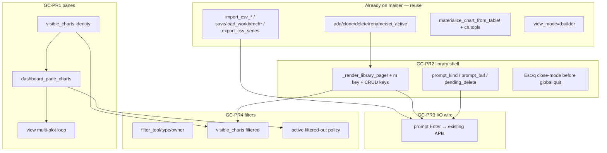
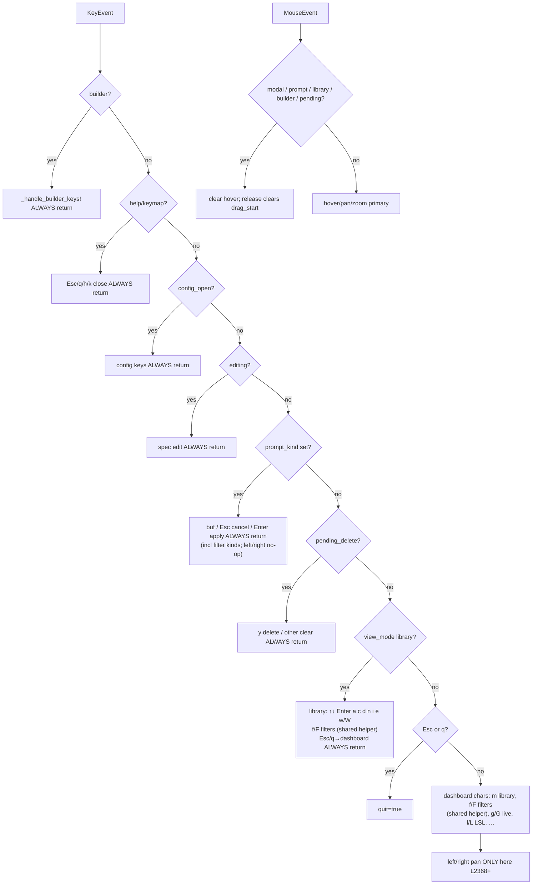
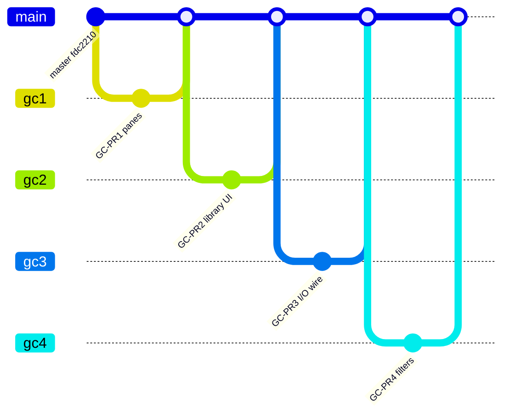

# SPC Workbench: Close Remaining HTML→Terminal Parity Gaps

**Author:** Grok (systems architect)  
**Date:** 2026-07-09  
**Status:** Draft (rev 3 — re-review Issues 1–2 addressed)  
**Project:** tachikoma-tui (Julia + Tachikoma.jl)  
**Branch tip:** `master` @ `fdc22102dd07076b7f4d0f255cf9ceed134730c7`  
**Repo:** `/home/dustin/Git/Projects/tachikoma-tui`  
**Authoritative prior docs:**
- `design-spc-html-gap-analysis.md` (rev 4 — locked inventory)
- `design-spc-html-parity-plan.md` (rev 3 — prior implementable plan)
- HTML reference: `SPC_workbench_2026-06-18-20-46.html`
- Review: `/tmp/grok-design-review-4c8816ea.md`

**Scope of this document:** **Gap-closure only.** Do not re-litigate shipped features. Ground every claim in current master `src/` (file:line). Propose a **small linear PR stack** that avoids another mega-DAG merge disaster on `spc_workbench.jl`.

**Primary deliverable path:** `/tmp/grok-design-doc-4c8816ea.md`  
**Repo copy:** `design-spc-gap-closure-plan.md` (keep in sync with this document)

---

## Overview

After the stacked-PR recovery on master (`fdc2210`), most Phase A–C and Phase B pure layers are **present and green**: chart CRUD APIs, CSV/JSON I/O, SharedTable + materialize + builder, X̄-R/S + attributes in `auto_limits`, side WECO msgs, live gates + `g`/`G`, HTML archive load (admins stripped), PrecompileTools + docs scaffold.

What remains is a **thin product shell** that the recovery never fully re-landed:

1. **Multi-plot pane selection** still hardcodes `m.charts[2]` / `m.charts[3]` (active==2 duplicate bug).
2. **Library TUI** is half-scaffolded (fields + mouse early-return + live-gate awareness) but has **no** `prompt_*` model fields, **no** render page, **no** `m` open binding, **no** library key handlers.
3. **Library-scoped I/O keys** (`i`/`e`/`w`/`W`) cannot productize existing APIs without that library page.
4. **Dashboard filters / tools registry UI** (parity-plan PR9) is still missing; only per-chart `ch.tools` filter during materialize exists.

This design inventories those gaps with master evidence, specifies the target algorithms and handler order, and sequences **four independently mergeable linear PRs** (all primarily touch `src/spc_workbench.jl`, so they must not run in parallel).

---

## Background & Motivation

### What already shipped (do not re-design)

Verified on master @ `fdc2210`:

| Capability | Evidence |
|------------|----------|
| `ChartType` / full `ChartSpec` (type, tools, manual limits, live_enabled, col_*, source) | `src/spc_workbench.jl` L72–294 |
| Pure CRUD `add_chart!` / `clone_chart!` / `delete_chart!` / `rename_chart!` / `set_active_chart!` | L1747–1887 |
| `seed_demos=:triple` default (never flip) | L1651; runners L3409–3470 |
| CSV import + SharedTable fill | `src/spc_workbench_io.jl` L194–331; materialize L371–459 |
| JSON schema v1 save/load/`!` | io L450–859 |
| `export_csv_series` + `chart_for_export` (library-aware) | io L1261–1301 |
| Live gates + **g/G** (not L); LSL stays `l`/`L` | dashboard bind L2321–2326; help lines ~L3188–3189; `_live_may_advance` L3326–3341 |
| Manual limits + side WECO msgs | resolver L1125–1198; side L3063–3078 |
| `SS_FACTORS` Xbar_R/S + attribute `auto_limits` | L109–L1073; L980+ |
| SharedTable + builder (`b`) + type cycle (`y`) | L1655–1660, L1905–2114, L2345–2352, L3259+ |
| `col_lot` table subgroups | materialize L376–418 |
| `load_html_archive` (strip admins) | io L859–1256 |
| PrecompileTools + docs scaffold | `src/precompile.jl`, `docs/` |
| Suite green wiring | `test/runtests.jl` includes hello / spc / workbench |

**Locked constraints (unchanged):**
- Never flip `seed_demos` default from `:triple`
- Live = `g`/`G` only (`L` = LSL)
- I/O tests via `using TachikomaTUI` (KD22)
- Do not modify `src/spc.jl`
- No Excel/XLSX; no admin/passcodes

### Pain points remaining

1. Operator cannot open a chart library UI — only `[`/`]` carousel + side list of 8-char names.
2. Dashboard secondary panes lie when `active != 1` (duplicate primary).
3. CSV/JSON/export APIs are package-callable but not keyboard-reachable in-session without knowing Julia.
4. No way to filter the dashboard/library by tool/type/owner the way HTML `renderViewedCharts` does.

### Process debt

Stack merge recovery left a **hybrid tree**: I/O code defensively uses `hasfield(typeof(m), :prompt_kind)` (io L671–678, L771–774; workbench L3331–3335) because **prompt fields were never added to the model**. Library mouse early-return already mentions `:library` (L2385–2393) and live gates already treat `:library` as blocking (L3337), but there is no path that *sets* `view_mode = :library` from a key.

This design must **ground every claim in current master** and ship **sequential, non-parallel-conflicting PRs**.

---

## Goals & Non-Goals

### Goals

1. Close remaining **P0** gaps: multi-plot pane selection; full library TUI + prompt SM; wire library I/O keys to existing APIs.
2. Close remaining **P1** product gap: dashboard/library/side-list filters over `visible_charts` with A6 active-filtered-out policy (tools **registry mode** deferred; filter prompts only).
3. **Reuse** pure CRUD/I/O/export/JSON — UI wiring only; do not rewrite pure layers unless a bug is proven.
4. Red-first TestBackend coverage for pane active==2, library no-bleed, filters A6.
5. Linear PR stack: each PR independently mergeable to master; **no parallel branches that both edit `spc_workbench.jl`**.

### Non-Goals

| Item | Status |
|------|--------|
| Excel / XLSX | Out |
| Admin auth / passcodes | Out |
| Self-modifying HTML | Out |
| Dual secondary Canvas (MR/R/s plot) | **P2 deferred** (side stats already present) |
| Size-binning UI | **P2 deferred** |
| Full library mouse chrome (click/double-click rows) | **P2 deferred** (fields stubbed; keyboard-first) |
| **`view_mode = :focused`** | **Non-goal for gap-closure.** Model comment still lists `:focused` (L1649); parity-plan KD20 forbids default focused on library Enter. **Do not implement focused mode.** Optional one-line comment cleanup only — no behavior. |
| Dedicated `view_mode = :tools` registry page | **Out of GC-PR4 v1** — no tools mode; see locked filter UX |
| Replacing existing green pure tests | Out (GC-PR1 may **deliberately** update `"Chart 2"` assertion only if title contract changes — default is preserve) |
| Aqua/JET ocean-boil | Out |
| Re-opening attribute *math* | Math present; type UI already in builder (`y`) — only extend if a gap remains after GC-PR2 |
| Flipping `seed_demos` default | Forbidden |

---

## Inventory Table (master @ fdc2210)

Legend: **Present** | **Partial** | **Missing**

### P0 — still open / regressed

| # | Gap | Status | Evidence (file:line) | Notes |
|---|-----|--------|----------------------|-------|
| 1 | Multi-plot pane selection (`dashboard_pane_charts` / `visible_charts`) | **Missing** | View hardcodes `ch2 = m.charts[2]` L2757–2758; `ch3 = m.charts[3]` L2866–2867. Primary uses `current_chart(m)` L2603. **No** `dashboard_pane_charts` / `visible_charts` symbols in `src/`. | Active==2: primary = charts[2], secondary = charts[2] again → duplicate. After delete to 2 charts, ternary path still guarded by `ncharts >= 3` but pane *identity* wrong. |
| 2a | Library model fields (`library_selected`, scroll, area, last_click) | **Partial** | Model L1645–1648 present; bootstrapped L1693/1718 | Usable by pure CRUD |
| 2b | `prompt_kind` / `prompt_buf` / `pending_delete` | **Missing** | **Not** on `SPCWorkbenchModel` L1609–1661. I/O uses `hasfield` guards (io L671–678). Live uses `hasfield` (L3331–3335). | Defensive code anticipates fields that do not exist |
| 2c | `_render_library_page!` + view dispatch | **Missing** | `view` dispatches help/keymap/builder only L2483–2492 — **no** `:library` branch | Setting `view_mode=:library` today falls through to dashboard chrome |
| 2d | Open library key `m`/`M` | **Missing** | Dashboard keys L2261–2363: `p r z c v o u t l g s 1-8 ? h k b [ ]` — **no** `m` | Help L3186–3204 likewise omits library |
| 2e | Library keys (↑↓ Enter a c d+y n i e w/W Esc/q) | **Missing** | No library handler block in `update!(KeyEvent)` | Esc/q global quit at L2256–2258 would fire before any library close if mode set without handler |
| 3 | Library-bound I/O product keys | **Partial** | APIs: `import_csv_into_model!` io L303; `export_csv_series`/`chart_for_export` L1267–1299; `save_workbench`/`load_workbench!` L792–839. `chart_for_export` already library-aware L1293–1298. | **No** prompt Enter handlers; unusable without library page |

### P1 — partial

| # | Gap | Status | Evidence | Notes |
|---|-----|--------|----------|-------|
| 4 | Filters/tools registry product UI | **Partial** | Per-chart `ch.tools` filter in `compute_chart_series` L322–328; `ToolEntry` struct L1602–1605; `m.tools::Vector{ToolEntry}` L1652 empty by default. **No** `filter_tool` / `filter_type` / `filter_owner`. **No** `visible_charts` filtering. **No** `f` key. Side list L3081–3091 shows **all** charts. | GC-PR4 locks filter prompts (no `:tools` mode v1); must filter side list + library + panes |
| 5 | Attribute type-selector UI | **Present (sufficient)** | Builder field `:chart_type` L1892; cycle via `y`/`Y` L2104–2110 over `_CHART_TYPE_CYCLE` L1905 (includes p/np/c/u). Math: `auto_limits` attribute branches L1027–1073. | **No GC PR required** unless usability gap found; optional library type badge only |

### P2 / deferred (keep deferred)

| # | Gap | Status | Evidence | Notes |
|---|-----|--------|----------|-------|
| 6 | Dual secondary Canvas (MR/R/s plot) | **Partial / deferred** | Side stats via `_primary_and_secondary` L1088+; help notes dual canvas deferred L3213 | Side R̄/s̄/MR̄ only — intentional P2 |
| 7 | Size-binning UI | **Missing / deferred** | — | Non-goal for gap-closure |
| 8 | Full library mouse chrome | **Partial / deferred** | `library_area`, `library_last_click` stubbed L1647–1648; mouse early-returns on `:library` L2385–2393 | Keyboard-first; mouse enhancement later |

### Process / hybrid residue

| Item | Status | Evidence |
|------|--------|----------|
| `hasfield` prompt guards | Temporary | io L671–678, L771–774; workbench L3331–3335 — **fields missing** on model |
| `hasfield` for `last_workbench_path` | Hygiene (field **already present**) | Model L1654 has `last_workbench_path`; io still guards L798, L825, L851, L1223, L1245. **Not** a model add — free cleanup in GC-PR2/3 alongside prompt `hasfield` removal |
| Header omits library | Missing UX | Dashboard header **L2533**: `"SPC Workbench [dashboard]  [p]pause [g]live …"` — no `[m]library` (L2554 is config-line rendering, not the header) |
| Footer omits library | Missing UX | Footer L3137: `[p g r c v o u t l s] [h k []] [q]` |
| Live gate for `:library` | Present (premature) | L3337 already blocks — good once mode exists |
| Mouse modal for `:library` | Present | L2384–2393 clears hover + `drag_start` on release |
| Side panel chart list ignores filters | Present (GC-PR4 must fix) | L3081–3091 enumerates **all** `m.charts` with `Charts: N` |

---

## Target Design

### Architecture (gap-closure only)



### GC1 — Multi-plot pane selection (P0 #1)

#### Algorithms

```julia
"""Phase A identity; GC-PR4 fills filters."""
function visible_charts(m::SPCWorkbenchModel)::Vector{ChartSpec}
    return copy(m.charts)  # or collect — stable order = charts vector order
end

"""
Active chart + up to (k-1) following *visible* neighbors.
Returns empty if no charts. Primary = panes[1].
"""
function dashboard_pane_charts(m::SPCWorkbenchModel; k::Int = 3)::Vector{ChartSpec}
    vis = visible_charts(m)
    isempty(vis) && return ChartSpec[]
    act = current_chart(m)
    i = findfirst(c -> c.id == act.id, vis)
    if i === nothing
        # Phase A: should not happen; GC-PR4 A6 will rehome active before view
        i = 1
    end
    j = min(i + k - 1, length(vis))
    return vis[i:j]
end
```

**Regression contract:**

| Scenario | panes |
|----------|-------|
| `active == 1`, 3 charts | [1, 2, 3] |
| `active == 2`, 3 charts | [2, 3] only — **no duplicate of 2 as secondary-from-charts[2]** |
| `active == 3`, 3 charts | [3] only — single primary |
| After delete → 2 charts, `active` clamped | panes length ≤ 2; no bounds throw |

#### View rewrite (critical)

Replace the dual hardcoded blocks at L2757–2758 / L2866–2867 with a loop over `panes = dashboard_pane_charts(m; k=3)`:

1. **Layout is driven by panes, not `length(m.charts)`.**  
   - `is_dashboard_multi = (m.view_mode == :dashboard && length(panes) >= 2)`  
   - Height split uses `nc = length(panes)` (existing math ~L2517–2529 pattern), **not** `ncharts = length(m.charts)`.  
   - **Consequence (cross-link regression table):** `active == last` with 3 charts → `panes = [last]` only → **single-pane layout** (not triple empty slots, not primary+charts[2]+charts[3] duplicate). Today master always builds 3 slots when `ncharts >= 3` even if active is last.
2. **Primary interactive plot** (hover/pan/zoom/markers) always draws `panes[1]`, which **must equal** `current_chart(m)` when active is visible (true in GC-PR1 identity).
3. Read-only secondary/tertiary draw `panes[2:end]`.

#### Locked read-only title format (GC-PR1 — preserves TestBackend)

Master titles (L2761, L2870):

- Secondary: `"Chart 2: $(ch2.name) (read-only view)"`
- Tertiary: `"Chart 3: $(ch3.name) (read-only)"`

Suite assertion (`test/test_spc_workbench.jl` ~L1419): with default `active=1` triple seed, `occursin("Chart 2", full)` **and** `occursin("Secondary", full)`.

**Contract for GC-PR1 (locked):**

| Pane | Title format |
|------|----------------|
| Primary (`panes[1]`) | Keep existing active plot title pattern (name / “Data” — **not** required to say `"Chart 1"`) |
| Read-only slot `j` for `j` in `2:length(panes)` | `"Chart $(j): $(panes[j].name) (read-only view)"` for `j==2`; `"Chart $(j): $(panes[j].name) (read-only)"` for `j==3` (match master’s slight wording difference **or** normalize both to `"… (read-only view)"` if a single format string is cleaner — either way the substring **`Chart 2`** must remain for the first read-only pane) |

With `active==1` and 3 charts, `panes = [ch1, ch2, ch3]` → first read-only is still `"Chart 2: Secondary…"` → existing test stays green **without** a test rewrite.

Long-term (optional same PR or later): add pure asserts on `dashboard_pane_charts` ids; keep `"Chart 2"` string assert until a deliberate test modernization updates to neighbor **name** only.

**Do not** change `current_chart` / `[` `]` / `_ensure_charts!` in this PR beyond what panes need.

#### Exports

```julia
export visible_charts, dashboard_pane_charts
```

Also re-export from `TachikomaTUI.jl` if other public helpers are re-exported there (pattern L36–47).

---

### GC2 — Library TUI + prompt state machine (P0 #2)

#### Model fields (add to `SPCWorkbenchModel`)

```julia
# Library / prompt SM (parity-plan A5 / KD8, KD21)
prompt_kind::Union{Nothing,Symbol} = nothing
# :import_csv | :export_csv | :save_workbench | :load_workbench | :rename_chart
prompt_buf::String = ""
pending_delete::Bool = false
# optional convenience (parity-plan After Phase A):
last_export_path::String = ""   # prefill only; never silent write
```

Existing: `library_selected`, `library_scroll`, `library_area`, `library_last_click` stay.

After fields land, **replace** `hasfield` branches in:
- `src/spc_workbench_io.jl` L671–678, L771–774 (and any load err path)
- `_live_may_advance` L3331–3335

with direct field access. Keep semantics: clear prompt on successful load; on err clear `prompt_kind`, prefer keep `prompt_buf`.

#### Handler precedence in `update!(KeyEvent)` (KD21)

Order **must** be (insert before global Esc/q quit at L2256–2258):

```
1. _ensure_charts!
2. view_mode == :builder        → _handle_builder_keys!  (already L2123–2127; always returns)
3. view_mode ∈ help/keymap      → close/toggle then return (already L2130–2138)
4. config_open                  → handle then return (already L2141–2212)
5. editing !== nothing          → handle then return (already L2214–2254)
6. NEW: prompt_kind !== nothing → prompt buffer handler; ALWAYS return
   (includes filter prompt kinds — Enter apply / Esc cancel; works whether opened from dashboard or library)
7. NEW: pending_delete          → y confirm / any other clears; ALWAYS return
8. NEW: view_mode == :library   → library keys **including GC-PR4 `f`/`F`** (same semantics as dashboard);
   Esc/q → dashboard (no quit); ALWAYS return
   # f/F MUST be handled here — library returns before step 10, so dashboard-only f/F would be unreachable
9. Global Esc / q               → quit (existing L2256–2258)  # dashboard-only after above
10. Dashboard char keys         → existing + NEW m/M open library + GC-PR4 f/F
11. Dashboard left/right pan    → existing L2368–2379 ONLY when steps 2–8 did not return
```

**Shared filter keys (locked — option A):** `f`/`F` are implemented in **both** the library handler (step 8) and the dashboard char block (step 10) with **identical** semantics (prefer a small `_handle_filter_keys!(m, c)::Bool` that returns true if consumed). They are **not** dashboard-only.

**Modal swallow rule (mandatory — Issue 1):**  
Handlers for `prompt_kind`, `pending_delete`, and `view_mode == :library` **must always `return`** after processing (or deciding no-op), matching builder/help/config/editing. Unhandled keys under those modes are **no-ops**, including:

- `:left` / `:right` pan (master pan is a **tail block** at L2368–2379, *after* the char block — easy to miss; fall-through would mutate the active chart viewport while library/prompt is open and break the no-bleed modal contract)
- digits, `[`/`]`, `p`, mouse-unrelated control keys, etc.

Optional clarity refactor (same PR or follow-up): nest pan under an explicit “dashboard-only” branch so modals cannot reach it by omission. Not required if every modal path returns.

**Prompt rules:**
- Chars / backspace edit `prompt_buf`
- **Esc** → cancel: `prompt_kind = nothing` (prefer **keep** `prompt_buf` for path retries)
- **`q` is a buffer character** — never quit while `prompt_kind !== nothing`
- **Enter** → apply by kind (see GC-PR2 I/O stub policy below and GC3 for real I/O)

**GC-PR2 Enter policy by kind (locked — no silent stuck prompts):**

| `prompt_kind` | GC-PR2 Enter behavior |
|---------------|------------------------|
| `:rename_chart` | Fully wire: `rename_chart!`; clear kind; `last_event = "renamed …"` |
| `:import_csv`, `:export_csv`, `:save_workbench`, `:load_workbench` | **Do not silently no-op.** Either (A) **prefer:** do not open these prompts in GC-PR2 at all (`i`/`e`/`w`/`W` set `last_event = "I/O keys land in GC-PR3"` without setting `prompt_kind`), **or** (B) on Enter: keep kind+buf, set `last_event = "… not wired (GC-PR3)"` so the operator sees feedback and live gate remains blocked intentionally until Esc. **Forbidden:** Enter that leaves kind set with no `last_event` change. |
| Filter kinds (GC-PR4) | Apply field; clear kind; rehome; **last_event precedence** (rehome wins if active changed) — see GC4 |

**pending_delete:**
- `y`/`Y` → `delete_chart!(m, library_selected)`; clear pending; set `last_event`
- any other key (incl Esc, left/right, random chars) → clear pending; **do not quit**; **return**

**Library keys (canonical — parity-plan A5):**

| Key | Action |
|-----|--------|
| `↑` / `↓` | Move `library_selected` (clamp 1..n); adjust `library_scroll` if needed |
| `Enter` | `set_active_chart!(m, library_selected)`; `view_mode = :dashboard` |
| `a` | `add_chart!(m)`; select new |
| `c` | `clone_chart!(m, library_selected)` (**library only**; dashboard `c` remains config) |
| `d` | `pending_delete = true` (if `length > 1`; else `last_event = "cannot delete last chart"`) |
| `n` | `prompt_kind = :rename_chart`; prefill `prompt_buf = charts[sel].name` |
| `i` / `e` / `w` / `W` | **GC-PR2:** either open prompt (Enter stub per table above) **or** message-only until GC-PR3. **GC-PR3:** open prompt with path prefill (`last_workbench_path` / `last_export_path` / empty) |
| `f` / `F` | **GC-PR4 (required in library handler):** same as dashboard — `f` open/cycle filter prompt; `F` clear all filters + rehome. Handled **inside** step 8 before the always-return (not only under step 10). |
| `b`/`B` | optional: open builder on selected (set active first) — soft; dashboard already has `b` |
| `Esc` / `q` | `view_mode = :dashboard`; clear pending; **never** `quit = true`; **return** (no pan, no quit) |

**Dashboard open:**
- `m` / `M` → `view_mode = :library`; sync `library_selected = active`; `last_event = "library open"`

#### Render

```julia
function _render_library_page!(buf, area, m)
    # Full-area page — NO dashboard plot chrome (same no-bleed contract as help/builder)
    # Title: "CHART LIBRARY  (Esc/q close · Enter activate · a c d n i e w/W)"
    # List: for each chart → "▶|  idx  name  type  n=…  cpk=…  live=…"
    # Prompt bar at bottom when prompt_kind !== nothing
    # Pending delete banner when pending_delete
end
```

Dispatch in `view` L2483-style:

```julia
elseif m.view_mode == :library
    _render_library_page!(buf, area, m)
    return
```

#### Mouse (GC-PR2)

Already early-returns on `:library` L2385–2393. **Extend** the condition to also cover `prompt_kind !== nothing` and `pending_delete` (parity with KD16 full template):

```julia
if m.config_open || m.editing !== nothing ||
   m.view_mode in (:help, :keymap, :library, :builder) ||
   m.prompt_kind !== nothing || m.pending_delete
    m.hover_x = nothing
    m.hovered = nothing
    if evt.action == mouse_release
        m.drag_start = nothing
    end
    return
end
```

Do **not** implement click-to-select library rows in this PR (P2).

#### Help / keymap / header / footer

Same PR must document:
- `m/M` open library
- Library-scoped keys
- Esc/q close library without quit
- Keep `g/G` live, `l/L` LSL, `o/O` visual

---

### GC3 — Library I/O Enter handlers (P0 #3)

**Reuse only** — no pure-layer rewrite.

API return shapes (master): `export_csv_series` / `save_workbench` → `Union{Nothing,String}` where `nothing` = Ok and `String` = err (`export_csv_series` io L1267–1285; empty path → `"empty path"`, write fail → `"unwritable: …"`). Import/load already return err strings / mutate `last_event` in io.

| `prompt_kind` | Enter Ok | Enter Err (non-`nothing` / error string) |
|---------------|----------|------------------------------------------|
| `:import_csv` | `import_csv_into_model!(m, prompt_buf; chart_idx=library_selected)`; stay library; `prompt_kind=nothing`; `last_event` from import success | **No mutate** charts; stay library; `prompt_kind=nothing`; **keep** `prompt_buf`; `last_event = "import err: …"` (or io’s existing prefix) |
| `:export_csv` | `ch = chart_for_export(m)`; `export_csv_series(path, ch.data.values) === nothing`; set `last_export_path = path`; clear kind; `last_event = "exported …"` | Do **not** update `last_export_path`; stay library; clear kind (prefer keep buf); `last_event = "export err: $err"` |
| `:save_workbench` | `save_workbench(m, path) === nothing`; set `last_workbench_path = path`; clear kind; `last_event = "saved …"` | Do **not** update `last_workbench_path`; stay library; clear kind (prefer keep buf); `last_event = "save err: $err"` |
| `:load_workbench` | `load_workbench!(m, path)` Ok → dashboard + clear prompt (io already sets `view_mode=:dashboard` ~L669) | Remain library; clear kind; keep buf; `last_event = "load err: …"` |

**Fail-closed** contracts already in io — do not invent new error types; surface via `last_event`. Mirror import for export/save err (Issue 8).

**Tests:** package-module (`using TachikomaTUI`) tempfile import/export/save/load through KeyEvent prompt path; err paths leave `length(m.charts)` and values unchanged; export/save err does not update `last_*` paths.

Optional: prefills for `i` from empty string; do not invent external pickers.

---

### GC4 — Filters + tools registry product (P1 #4)

#### Model fields

```julia
filter_tool::String = ""     # empty = no filter
filter_type::String = ""     # wire string e.g. "I-MR", "Xbar-R"; empty = all
filter_owner::String = ""    # empty = all
# tools::Vector{ToolEntry} already exists L1652 — not required for GC-PR4 v1 UI
```

#### Locked filter UX (GC-PR4 — no longer open)

**Single product surface (locked for red-first TestBackend):**

| Key | Mode | Action |
|-----|------|--------|
| `f` | **dashboard and library** (when `prompt_kind === nothing` and not `pending_delete`) | Open **one** filter prompt, cycling field each press: `:filter_tool` → `:filter_type` → `:filter_owner` → `:filter_tool` …. Prefill `prompt_buf` with the current field value. Track cycle with `filter_prompt_field::Symbol` (default `:tool`) advanced **on each successful Enter** (or on each `f` that opens a new prompt). **Implementation:** shared helper called from **both** library handler (step 8) and dashboard chars (step 10) — library always-return must not swallow `f`/`F` as no-ops. |
| Enter (filter prompt) | prompt active (step 6) | Apply **that one field** from `prompt_buf` into the matching `filter_*`; `prompt_kind = nothing`; advance cycle to next field; then `_rehome_active_if_filtered!` with **last_event precedence** (below). |
| Esc (filter prompt) | prompt active | Cancel prompt only: `prompt_kind = nothing`; **leave all three filters as last successfully applied**; `last_event = "filter edit cancel"`. Does **not** quit; does **not** clear filters. |
| `F` | **dashboard and library** (when not inside a non-filter prompt; if filter prompt open, `F` may clear-all + cancel prompt) | Clear **all** `filter_tool`/`filter_type`/`filter_owner` to `""`; clear prompt if it was a filter kind; `_rehome_active_if_filtered!` with **last_event precedence** (below). |

#### `last_event` precedence after filter apply / clear (locked)

`_rehome_active_if_filtered!` may set `last_event = "active chart filtered — switched to …"` when it actually changes `active`. Callers **must not** blindly overwrite that.

**Rule (locked):**

1. Apply or clear filters.
2. `changed = _rehome_active_if_filtered!(m)` — rehome returns `true` if `active` changed, `false` if no-op (including empty-visible leave-active-as-is).
3. **If `changed`:** **keep** the rehome `last_event` (do not overwrite). Optional combined form allowed: `"filter type=X · active chart filtered — switched to Y"` as long as the string **mentions rehome/filtered** (test asserts `occursin("filtered", last_event)` or equivalent).
4. **If not `changed`:** set plain confirmation:
   - Enter apply → `last_event = "filter <field>=…"`
   - `F` clear → `last_event = "filters cleared"`

Same rule for both dashboard- and library-originated filter changes.

```julia
function _rehome_active_if_filtered!(m)::Bool
    vis = visible_charts(m)
    isempty(vis) && return false
    act = current_chart(m)
    any(c -> c.id == act.id, vis) && return false
    idx = findfirst(c -> c.id == vis[1].id, m.charts)
    idx === nothing && return false
    set_active_chart!(m, idx)
    m.last_event = "active chart filtered — switched to $(vis[1].name)"
    return true
end

# after apply field or F-clear:
changed = _rehome_active_if_filtered!(m)
if !changed
    m.last_event = confirmation  # "filter type=…" or "filters cleared"
end
# if changed: leave rehome last_event (or set combined string once, above rehome)
```

**Explicitly out of GC-PR4 v1:**
- No `view_mode = :tools`
- No tools-registry add/delete UI
- No multi-line filter overlay chrome
- `refresh_tools_from_data!(m)` is **optional pure helper only** (unique tool strings from `ch.tools` + table `col_tool`) for future use or a one-line status hint — **not** a mode and **not** required to merge GC-PR4
- **Not** dashboard-only filters — library `f`/`F` are first-class (option A)

Filter prompts reuse the global prompt SM (handler step 6) so Enter/Esc work whether the prompt was opened from dashboard or library. Same **always-return** swallow rule as other prompts.

KD21 interaction: filter `prompt_kind` is just another prompt kind — Esc cancels prompt; `q` is buffer data; library Esc/q only runs when `prompt_kind === nothing`.

#### `visible_charts` (replace identity)

```julia
function visible_charts(m::SPCWorkbenchModel)::Vector{ChartSpec}
    out = ChartSpec[]
    for ch in m.charts
        if !isempty(m.filter_tool)
            # LOCKED (stricter HTML-like): only charts that list the tool.
            # Empty ch.tools does NOT pass — avoids "tool filter looks broken" on demo charts
            # that all have tools==String[] (default). Operator must assign tools (builder)
            # for a chart to appear under a non-empty tool filter.
            (m.filter_tool in ch.tools) || continue
        end
        if !isempty(m.filter_type)
            chart_type_to_string(ch.chart_type) == m.filter_type || continue
        end
        if !isempty(m.filter_owner)
            ch.owner == m.filter_owner || continue
        end
        push!(out, ch)
    end
    return out
end
```

**Demo UX implication (document in help):** with `seed_demos=:triple`, all charts have empty `tools` → any non-empty `filter_tool` yields **zero** visible charts and the empty message until tools are assigned (builder `tools` field). Type/owner filters still useful on demos (set owner via builder/API in tests). Pure unit test **must** encode: empty-tools chart hidden when `filter_tool` set; chart with `tools=["ETCH-1"]` visible when `filter_tool=="ETCH-1"`.

**A6 — active filtered out (on any filter change):** see `_rehome_active_if_filtered!` returns `Bool` and **last_event precedence** in the locked filter UX section above. Call after every filter apply / `F` clear. **Do not** silently swap panes while `m.active` still points at a hidden chart without updating `active`. **Do not** overwrite rehome `last_event` with a plain filter confirmation when rehome fired.

**Empty visible:** primary area message `"No charts match filters"`; no crash; rehome returns `false` (leaves active as-is).

#### Library list + panes + **side panel** (all filtered)

Consumers of `visible_charts` in GC-PR4 (**complete “viewed charts” surface**):

1. **`dashboard_pane_charts`** — already identity-based in GC-PR1; filter body automatically applies.
2. **Library list** — `_render_library_page!` iterates **visible** charts only; `library_selected` remains an **absolute** index into `m.charts` (↑↓ moves among visible rows only).
3. **Dashboard side-panel mini chart list** (master L3081–3091) — **must** also use `visible_charts(m)`:
   - Count line: `Charts: $(length(vis))/$(length(m.charts))` when any filter non-empty; else `Charts: $(length(m.charts))` as today.
   - Row loop: only visible charts; mark `▶` when `c.id == current_chart(m).id` (or absolute index match).
   - Truncation/cpk formatting unchanged.

**Do not** re-implement WECO side list (already shipped).

**Selection mapping (absolute index — locked):**
- Library ↑↓ moves among **visible** charts only but stores `library_selected` as the absolute index into `m.charts`.
- Avoids renumbering bugs on filter clear.

---

### Handler / mouse summary diagram



---

## API / Interface Changes

| Symbol | Change | PR |
|--------|--------|----|
| `visible_charts` | **New** pure helper | GC-PR1 (identity), GC-PR4 (filters) |
| `dashboard_pane_charts` | **New** pure helper | GC-PR1 |
| `SPCWorkbenchModel.prompt_kind/buf/pending_delete` | **New** fields | GC-PR2 |
| `SPCWorkbenchModel.last_export_path` | **New** optional prefill | GC-PR2/3 |
| `SPCWorkbenchModel.filter_*` | **New** fields | GC-PR4 |
| `_render_library_page!` | **New** view | GC-PR2 |
| `_handle_library_keys!` / `_handle_prompt_keys!` | **New** (or inline) | GC-PR2/3 |
| `import_csv_*` / `save_workbench` / `load_workbench!` / `export_csv_series` | **Unchanged** pure API; UI calls only | GC-PR3 |
| Dashboard `m`/`M`; library keys incl. `f`/`F`; dashboard `f`/`F` (shared) | Keymap | GC-PR2 / GC-PR4 |
| Help/keymap/header/footer strings | Docs in-app | same PR as keys |
| `hasfield` prompt guards | Remove after fields land | GC-PR2 |
| `hasfield` `last_workbench_path` | Remove (field already on model L1654) | GC-PR2/3 hygiene |
| Side panel chart list | Filter via `visible_charts`; `visible/total` count | GC-PR4 |
| Read-only plot titles | Keep `"Chart 2:"` / `"Chart 3:"` pane-slot prefixes | GC-PR1 |
| `src/spc.jl` | **Do not touch** | — |

---

## Data Model Changes

```
SPCWorkbenchModel (after gap-closure)
  charts[]: ChartSpec          # unchanged
  active, library_selected     # present
  library_scroll/area/click    # present (mouse still deferred)
  tools::Vector{ToolEntry}     # present; GC-PR4 populates
  table::SharedTable           # present
  + prompt_kind, prompt_buf, pending_delete
  + last_export_path           # optional prefill
  + filter_tool, filter_type, filter_owner
  + filter_prompt_field        # GC-PR4 cycle :tool|:type|:owner
  view_mode ∈ {dashboard, help, keymap, library, builder}
  # :focused remains unused — do not implement (model comment L1649 only)
  seed_demos = :triple         # NEVER flip
```

No JSON schema version bump required for filters/prompts (session-ephemeral). Optional: persist filters in a later schema v2 — **out of scope**.

---

## Alternatives Considered

### A. Fold library + panes + I/O + filters into one mega-PR

- **Pros:** One merge; fewer intermediate states.  
- **Cons:** Exactly the diamond/stack failure mode that produced hybrid `hasfield` residue; review surface huge; hard bisect.  
- **Reject** for process debt #9.

### B. Parallel feature branches (panes ∥ library ∥ filters)

- **Pros:** Wall-clock if independent files.  
- **Cons:** All three primarily edit `src/spc_workbench.jl` `update!`/`view` — guaranteed conflict. Prior parity-plan DAG already hurt recovery.  
- **Reject.** Linear stack only.

### C. Skip library UI; only document Julia APIs for I/O

- **Pros:** Zero UI work.  
- **Cons:** Fails product goal (fab workflow keyboard-primary); `chart_for_export` library branch dead code; P0 remains open.  
- **Reject.**

### D. Library as side panel instead of full-page mode

- **Pros:** Keep dashboard visible.  
- **Cons:** Breaks established no-bleed modal pattern (help/keymap/builder); TestBackend harder; cramped 80×24.  
- **Reject** for consistency with builder/help.

### E. Filters only as CLI kwargs on runner

- **Pros:** Tiny.  
- **Cons:** Not interactive; does not close HTML filter bar parity.  
- **Reject** as sole approach; optional additive later.

**Chosen:** Linear GC-PR1→4; full-page library; reuse APIs; identity panes first then filters.

---

## Security & Privacy Considerations

- Explicit typed paths only (no external pickers) — reduces unexpected file access.
- `load_html_archive` already strips `admins`/passcodes — keep that contract; library load uses JSON v1, not HTML theater.
- Confirm-to-delete (`d`+`y`) — no password theater; refuse delete last chart.
- Fail-closed I/O: err paths must not partially mutate charts (already pure API contract).
- Path prompts: `q` is data, not quit — prevents accidental exit mid-path with path containing `q`.

---

## Observability

- `m.last_event` remains the operator-visible status bus (`"library open"`, `"imported N…"`, `"import err:…"`, `"active chart filtered — switched to …"`, `"filters cleared"`).
- Footer already shows `last=$(m.last_event) mode=$(m.view_mode)` L3135 — ensure library/prompt modes remain visible (prompt should show kind + buf in library footer).
- No new logging framework.

---

## Test Plan (red-first)

### Shared discipline

- UI: Tachikoma `TestBackend` + **re-render after every `update!`** before assert (`.grok/docs/tachikoma-ui-testing.md`).
- I/O: `using TachikomaTUI` only (KD22); tempfile under `/tmp` or `mktempdir`.
- Do not flip `seed_demos` default; use `:triple` / `:single` / `:none` explicitly in tests.

### GC-PR1 — panes

```julia
@testset "dashboard_pane_charts active==2 no duplicate" begin
    m = SPCWorkbenchModel(data=d, paused=true, seed_demos=:triple)
    _ensure_charts!(m)
    m.active = 2; _ensure_charts!(m)
    panes = dashboard_pane_charts(m; k=3)
    @test length(panes) == 2
    @test panes[1].id == m.charts[2].id
    @test panes[2].id == m.charts[3].id
    @test panes[1].id != panes[2].id
end

@testset "active==last single pane" begin
    m.active = 3; _ensure_charts!(m)
    panes = dashboard_pane_charts(m; k=3)
    @test length(panes) == 1
    @test panes[1].id == m.charts[3].id
    # layout: is_dashboard_multi false → no secondary rect
end

@testset "delete to 2 charts: panes safe + view no throw" begin
    delete_chart!(m, 3)
    panes = dashboard_pane_charts(m; k=3)
    @test length(panes) <= 2
    # TestBackend render at active=2
end
```

**TestBackend title contract:** keep existing `occursin("Chart 2", full)` (~L1419) green under default `active=1` by preserving pane-slot title prefixes (see GC1 locked title format). With `active=2`, assert secondary shows **Tertiary** name (neighbor), not a second “Secondary” duplicate.

### GC-PR2 — library shell

| Case | Assert |
|------|--------|
| `m` opens library | `view_mode===:library`; `find_text` "CHART LIBRARY" or equivalent; **no** dashboard header plot chrome bleed |
| Esc / q | `view_mode===:dashboard`; `quit===false` |
| ↑↓ | `library_selected` moves; clamp |
| Enter | `active==library_selected`; dashboard |
| `a` | length+1 empty chart |
| `c` | clone name ends with `" (copy)"` |
| `d` then `y` | length-1; refuse last |
| `d` then Esc | no delete |
| `n` + type + Enter | rename |
| mouse on library | no crash; `drag_start===nothing` after release |
| **left/right under library** | viewport of active chart **unchanged**; still library mode |
| **left/right under prompt** | viewport unchanged; prompt still open |
| live gate | already tests `:library` false advance — keep green |
| Global quit from dashboard | Esc still quits when `view_mode===:dashboard` |
| I/O keys in GC-PR2 | if stub: Enter never silent (last_event feedback) **or** keys only message without setting kind |

### GC-PR3 — I/O wire

| Case | Assert |
|------|--------|
| library `i` path Enter good CSV | values match fixture; `live_enabled==false` on target; stay library |
| import err | charts unchanged; `last_event` starts with `import err`; `last_*` paths unchanged |
| `e` export then re-import | numeric equality; Ok sets `last_export_path` |
| export err (bad path) | charts unchanged; `last_export_path` **not** updated; `last_event` has `export err` |
| `w` save Ok | `last_workbench_path` set |
| save err | `last_workbench_path` **not** updated; `save err` in last_event |
| `W` load | round-trip via KeyEvent; `load_workbench!` preserves rng (API already) |
| load err | stay library; charts unchanged |
| prompt `q` char | path can include `q`; no quit |

### GC-PR4 — filters A6

| Case | Assert |
|------|--------|
| filter_type hides non-matching | `visible_charts` length; library list |
| **empty `ch.tools` + non-empty `filter_tool`** | chart **excluded** (stricter policy unit test) |
| **chart with tool assigned** | appears when `filter_tool` matches |
| filter hides active | after set filter, `active` rehomed to first visible; **`last_event` mentions filtered/rehome** (not only `"filter type=…"`) |
| filter no rehome needed | `last_event` is plain `"filter <field>=…"` |
| no visible | empty message; no throw on view; rehome false; confirmation last_event OK |
| clear filters `F` no rehome | `last_event == "filters cleared"` (or contains it) |
| clear filters `F` with rehome | `last_event` mentions filtered/rehome (precedence rule) |
| **`f`/`F` from library mode** | same filter effects as dashboard; not silent no-op |
| panes use filtered set | active in filtered mid-list → following **visible** neighbors only |
| **side panel list** | only visible names; count `visible/total` when filtered |
| Esc during filter prompt | filters unchanged from last apply |
| left/right during filter prompt | no viewport pan |

---

## Verification Gates (AGENTS.md)

After **any** `src/` change in these PRs:

```bash
julia --project=. test/runtests.jl
julia --project=. -e 'using TachikomaTUI; TachikomaTUI.hello_tachikoma()'
julia --project=. -e 'using TachikomaTUI; TachikomaTUI.spc_workbench_demo()'
```

Optional interactive smoke after GC-PR2+:

```bash
julia --project=. -e 'using TachikomaTUI; TachikomaTUI.spc_workbench(paused=true)'
# m → library → a/c/d → Enter activate → [ ] panes with active mid-list
```

Never claim green without exact command + exit_code in-session.

---

## Risks

| Risk | Impact | Mitigation |
|------|--------|------------|
| Parallel edits to `spc_workbench.jl` | Merge corruption / hybrid residue (again) | **Strict linear stack GC-PR1→4**; no concurrent worktrees on this file |
| Global Esc/q before library handler | Library Esc quits app | KD21 order mandatory; TestBackend Esc/q non-quit |
| Modal fall-through to left/right pan | Viewport mutates under library/prompt | **Always return** from modal handlers; explicit tests for left/right no-op |
| Prompt `q` treated as quit | Broken paths | Prompt handler before global quit; test path with `q` |
| Silent I/O Enter stub sticks live gate | Operator stuck; live blocked | GC-PR2: message-only keys **or** Enter sets `last_event` — never silent |
| Pane rewrite breaks `"Chart 2"` TestBackend | Suite red | **Locked** pane-slot title format preserves `"Chart 2:"` prefix at active=1 |
| Filter rehome surprises operators | Active jumps | Prefer first visible; **rehome last_event wins** when active changes; document in help |
| Library `f`/`F` only on step 10 | Silent no-op under library always-return | Shared helper + library key table includes `f`/`F` (option A) |
| Tool filter hides all demos | “Broken” filter UX | Documented stricter policy; help note; unit tests with assigned tools |
| Side list unfiltered while panes filter | Confusing dashboard | GC-PR4 requires side list + count via `visible_charts` |
| `library_selected` vs filtered index confusion | Off-by-one delete | Absolute chart indices (locked) |
| Leaving `hasfield` forever | Dead complexity | GC-PR2 removes prompt + `last_workbench_path` guards |
| Accidental `seed_demos` flip | Mass test fail | Code review gate; existing pure test asserts `=== :triple` |
| Live key collision (`L`/`o`) | Spec/visual break | Do not rebind; only add `m`/`f`/`F` |
| Accidental `:focused` implementation | Scope creep | Explicit non-goal; leave field comment alone or delete comment only |

---

## Open Questions

1. ~~**Filter UX density**~~ **Resolved (rev 2+3):** `f` cycles one-field prompts; Enter applies; Esc cancels prompt; `F` clears all; no `:tools` mode. **`f`/`F` on dashboard and library** via shared helper inside library handler (option A — not dashboard-only). **last_event:** rehome message wins when A6 changes `active`.
2. **Import target:** always `library_selected` chart vs always new chart? *Recommendation (still):* **into `library_selected`**; operator clones first if needed. `import_csv_new_chart!` remains API/runner. *Implementer may treat as locked unless product says otherwise.*
3. **Persist filters in JSON v1?** *Recommendation (still):* **no** this round (ephemeral session).
4. ~~**GC-PR2 I/O Enter stub**~~ **Resolved (rev 2):** Prefer message-only `i`/`e`/`w`/`W` without setting `prompt_kind` until GC-PR3; if prompts open early, Enter must set `last_event` (never silent). Rename Enter fully wired in GC-PR2.

---

## References

- `/home/dustin/Git/Projects/tachikoma-tui/design-spc-html-gap-analysis.md` (rev 4)
- `/home/dustin/Git/Projects/tachikoma-tui/design-spc-html-parity-plan.md` (rev 3) — sections A5/A6, PR2a/PR2b/PR4b/PR9, KD8/9/11/16/21/22
- `/home/dustin/Git/Projects/tachikoma-tui/src/spc_workbench.jl` (3486 lines @ fdc2210)
- `/home/dustin/Git/Projects/tachikoma-tui/src/spc_workbench_io.jl` (1302 lines)
- `/home/dustin/Git/Projects/tachikoma-tui/src/TachikomaTUI.jl`
- `/home/dustin/Git/Projects/tachikoma-tui/test/test_spc_workbench.jl`
- `/home/dustin/Git/Projects/tachikoma-tui/SPC_workbench_2026-06-18-20-46.html`
- `.grok/docs/tachikoma-ui-testing.md`, `AGENTS.md` verification culture

---

## Key Decisions

1. **Gap-closure, not re-parity.** Shipped pure/I/O/builder/math stay; only remaining P0/P1 product shell is in scope.  
   *Rationale:* Avoid re-litigation and merge thrash after `fdc2210` recovery.

2. **Linear PR stack only on `spc_workbench.jl`.** GC-PR1 → GC-PR2 → GC-PR3 → GC-PR4 sequential; no parallel feature branches that both edit the same file.  
   *Rationale:* Process debt #9 — diamond merges caused hybrid tree.

3. **`dashboard_pane_charts` = active + following visible neighbors** (parity-plan A6 / KD6).  
   *Rationale:* Fixes active==2 duplicate; post-delete safe; filter-ready.

4. **Library is full-page `view_mode=:library` with prompt SM** (`prompt_kind`/`prompt_buf`/`pending_delete`) and KD21 Esc/q close-mode (never quit).  
   *Rationale:* Matches help/keymap/builder; unlocks mode-scoped keys without colliding dashboard `c`/`o`/`l`.

5. **Canonical keys unchanged from parity-plan:** dashboard `m` library; library `a c d+y n i e w/W` **+ `f`/`F` (GC-PR4)**; live `g/G`; LSL `l/L`; visual `o/O`; dashboard filters `f`/`F` same helper.  
   *Rationale:* Locked KD9/KD11; library always-return requires `f`/`F` in library handler (option A), not only under dashboard chars.

6. **Reuse I/O APIs; UI Enter only in GC-PR3.** No rewrite of `spc_workbench_io.jl` pure parsers unless bug. Remove `hasfield` once fields exist.  
   *Rationale:* APIs already green; hybrid residue cleanup is part of GC-PR2.

7. **Never flip `seed_demos` default; never touch `src/spc.jl`; no Excel/admin.**  
   *Rationale:* Locked product constraints.

8. **Filters use absolute `library_selected` / `active` indices into `m.charts`; `visible_charts` is a derived view.** A6 rehomes active on filter change.  
   *Rationale:* Avoid renumbering bugs; HTML filter bar semantics without dual identity.

9. **Mouse: early-return only for library/prompt/pending; no row hit-testing in gap-closure.**  
   *Rationale:* KD16; P2 mouse chrome deferred; fields already stubbed.

10. **Attribute type UI is already sufficient via builder `y` cycle** — no dedicated GC PR unless a regression is found.  
    *Rationale:* Math + type cycle present; avoid scope creep.

11. **I/O tests stay package-module; UI tests TestBackend re-render-after-update.**  
    *Rationale:* KD22 + AGENTS.md.

12. **Each PR independently mergeable and suite-green** before the next starts.  
    *Rationale:* Bisectability; recovery lesson.

13. **Modal key handlers always return** (library / prompt / pending_delete), including swallowing left/right pan (master L2368–2379).  
    *Rationale:* Same contract as builder/help/config; prevents viewport mutation under overlays.

14. **GC-PR1 read-only titles keep pane-slot `"Chart 2:"` / `"Chart 3:"` prefixes** so existing TestBackend `occursin("Chart 2", …)` stays green.  
    *Rationale:* Avoid suite churn; pure pane-id tests carry the real regression signal.

15. **GC-PR4 filter UX locked:** `f` one-field cycle prompts; `F` clear all; Esc cancels prompt only; no `:tools` mode; **`f`/`F` on dashboard and library** (shared helper; library table includes them).  
    *Rationale:* Close Open Q #1; library always-return would make dashboard-only `f`/`F` unreachable from library.

16. **Stricter tool filter:** non-empty `filter_tool` requires `filter_tool in ch.tools` (empty tools ⇒ hidden). Side panel + library + panes all use `visible_charts`.  
    *Rationale:* Demo charts with empty tools would otherwise always pass a tool filter; side list must match panes.

17. **A6 last_event precedence:** if `_rehome_active_if_filtered!` returns true (active changed), keep rehome message (or combined string that still mentions filtered); only set plain `"filter <field>=…"` / `"filters cleared"` when rehome is a no-op.  
    *Rationale:* Avoid overwriting rehome status; GC-PR4 tests require `last_event` to mention rehome when active was hidden.

---

## Rollout Plan

1. Land GC-PR1 (panes) — pure helpers + view loop; zero keymap risk.  
2. Land GC-PR2 (library shell) — operator can CRUD without files.  
3. Land GC-PR3 (I/O wire) — full keyboard fab path: import → library → WECO review → save.  
4. Land GC-PR4 (filters) — multi-chart fab filtering.  
5. Optional: copy this design to repo root `design-spc-gap-closure-plan.md`.  
6. P2 (dual canvas, size-bin, library mouse) remains backlog — do not schedule inside gap-closure.

---

## PR Plan

Ordered **linear** stack. Each PR: red-first tests → implement → full suite + hello + spc_workbench_demo green → merge to master → next.

### GC-PR1 — Multi-plot pane selection

| Field | Value |
|-------|-------|
| **Title** | `spc-workbench: dashboard_pane_charts (fix charts[2]/[3] lock)` |
| **Files** | `src/spc_workbench.jl` (helpers near CRUD/current_chart; rewrite multi-plot section ~L2511–2960); `src/TachikomaTUI.jl` (export); `test/test_spc_workbench.jl` |
| **Dependencies** | None (master green) |
| **Description** | Add `visible_charts` (identity) + `dashboard_pane_charts`; layout uses `length(panes)` not `length(m.charts)`; primary = panes[1]; read-only panes[2:end] with **locked** `"Chart $(j): $(name) (read-only…)"` titles so active=1 still emits `"Chart 2"`; active==last → single pane. Pure + TestBackend tests. No keymap, no model field adds. |
| **Risk** | Low if title contract held; pure id tests are the real signal. |
| **Verify** | Full suite + hello + spc_workbench_demo |

### GC-PR2 — Chart library TUI + prompt SM

| Field | Value |
|-------|-------|
| **Title** | `spc-workbench: library mode UI (list/CRUD/rename prompts; Esc/q no quit)` |
| **Files** | `src/spc_workbench.jl` (model fields; `_render_library_page!`; key handler order KD21 + **always-return** modals; mouse early-return extend; help/keymap/header L2533/footer); `src/spc_workbench_io.jl` (replace `hasfield` for prompt_* **and** `last_workbench_path`); `test/test_spc_workbench.jl` |
| **Dependencies** | GC-PR1 (recommended so library Enter → dashboard panes correct; hard-dep optional but **merge order fixed**) |
| **Description** | `prompt_kind`/`prompt_buf`/`pending_delete`; `m` open; library ↑↓ Enter a c d+y n; rename Enter fully wired; **I/O keys message-only or non-silent Enter stub** (no stuck silent prompts); left/right swallowed under library/prompt; mouse no-op + drag clear. |
| **Risk** | Handler order / fall-through pan — mitigate with Esc/q **and** left/right tests. |
| **Verify** | Full suite + hello + spc_workbench_demo; TestBackend library no-bleed |

### GC-PR3 — Wire library I/O keys to existing APIs

| Field | Value |
|-------|-------|
| **Title** | `spc-workbench: library i/e/w/W prompt Enter → CSV/JSON export APIs` |
| **Files** | `src/spc_workbench.jl` (prompt Enter dispatch only); optionally tiny help text; `test/test_spc_workbench.jl` (KeyEvent I/O flows via `using TachikomaTUI` patterns already in file) |
| **Dependencies** | GC-PR2 hard; pure I/O already on master |
| **Description** | Map prompt kinds to `import_csv_into_model!`, `export_csv_series`+`chart_for_export`, `save_workbench`, `load_workbench!`. **Symmetric fail-closed:** Ok updates last_* paths; Err keeps paths, stay library, last_event err prefix. No parser changes. |
| **Risk** | Path UX / cwd confusion — document relative paths; tests use abs temp paths. |
| **Verify** | Full suite + hello + spc_workbench_demo; optional load= runner smoke |

### GC-PR4 — Dashboard filters (locked UX) + A6

| Field | Value |
|-------|-------|
| **Title** | `spc-workbench: filter_tool/type/owner + visible_charts + A6 rehome + side list` |
| **Files** | `src/spc_workbench.jl` (`filter_*` + `filter_prompt_field`; `visible_charts` **stricter tool policy**; `_rehome_active_if_filtered!`; library list; **side panel L3081–3091** filtered + `visible/total`; `f`/`F` keys; help); `test/test_spc_workbench.jl` |
| **Dependencies** | GC-PR1 hard; GC-PR2 hard |
| **Description** | Locked UX: `f` cycles one-field prompts; Enter applies field; Esc cancels prompt; `F` clears all. **`f`/`F` in library handler and dashboard** (shared helper). Empty filters = identity. A6 rehome → first visible; **rehome last_event wins** when active changes. Empty match message. Side list + panes + library all filtered. **No** `:tools` mode / registry CRUD. No viol-list rewrite. |
| **Risk** | Selection index bugs — absolute indices; heavy A6 + empty-tools + library f/F + last_event precedence tests. |
| **Verify** | Full suite + hello + spc_workbench_demo |

### Explicitly not scheduled (deferred)

| Item | Why |
|------|-----|
| Dual secondary Canvas | P2; side stats present |
| Size-binning UI | P2 niche |
| Library mouse click/double-click | P2; stubs exist |
| Attribute math / builder type cycle | Already present |
| Excel, admin, seed_demos flip, `src/spc.jl` edits | Locked non-goals |

### Merge graph (linear — no diamonds)



**Concurrency rule:** Do not open parallel PRs that both modify `src/spc_workbench.jl`. Docs-only or pure-test-only follow-ups may parallelize after GC-PR4.

---

*End of design document.*
