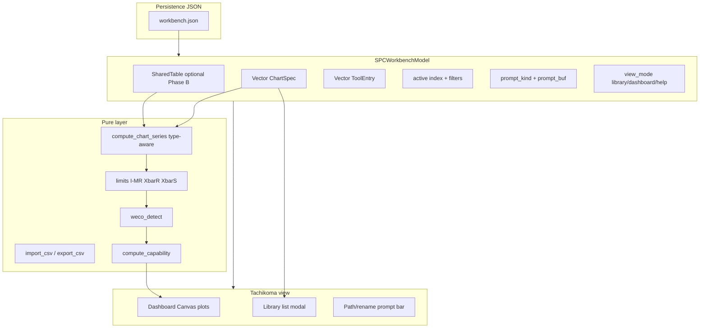
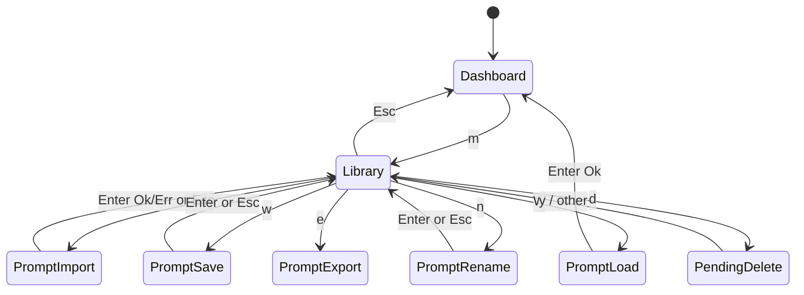
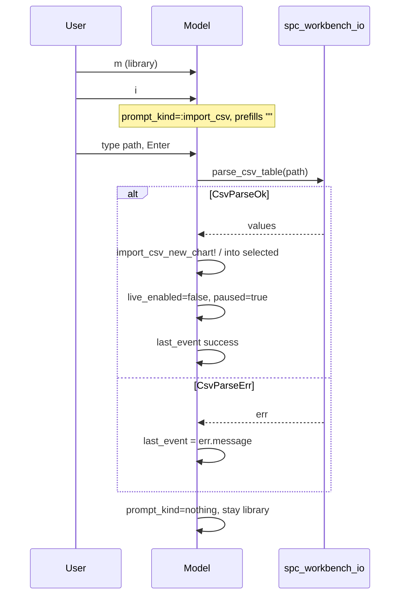
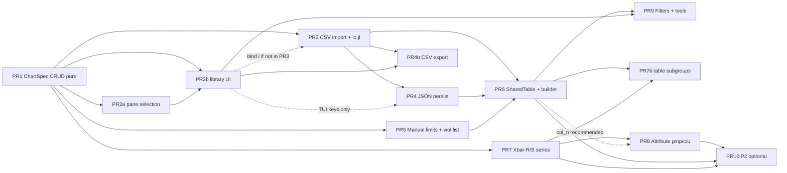

# SPC Workbench Gap Analysis & Terminal Roadmap

**Author:** Grok (systems architect)  
**Date:** 2026-07-08  
**Status:** Final (rev 4 — product decisions locked; approve for implementation)  
**Project:** tachikoma-tui  
**Reference HTML:** `SPC_workbench_2026-06-18-20-46.html` (~3171 lines, “TFLN PIC — SPC / WECO Workbench”)  
**Terminal sources:** `src/spc_workbench.jl` (~2168 lines), `src/spc.jl`, `src/TachikomaTUI.jl`, `test/test_spc_workbench.jl`  
**Related prior design:** `design-spc-interactive-chart.md` (interactive Canvas SPC, not full workbench parity)

---

## Overview

The HTML SPC / WECO Workbench is a self-contained fab process-control app: a **shared tabular dataset**, a **chart library** of typed definitions (I-MR, X̄-R, X̄-S, p, np, c, u) with column mappings, tool filters, WECO/spec/limit config, Excel/CSV import-export, tools registry, admin-gated destructive ops, and multi-card SVG dashboards.

The Tachikoma.jl terminal workbench is a high-fidelity **interactive I-MR explorer**: full WECO 1–8 (ported from the HTML `checkWeco`), Cpk bands, OOC/OOS markers, multi-chart dashboard with mouse hover/pan/zoom, config modals, and live append — but charts are **hardcoded demo series**, there is **no shared table**, **no chart CRUD/builder**, **no import/export**, and **no chart types beyond individuals/MR-style limits**.

This document inventories feature parity (HTML vs terminal), prioritizes TUI-appropriate gaps, and proposes an incremental design/PR plan to close the **core workbench workflow** without blindly porting web-only chrome (admin password UI, self-modifying HTML, rich dual SVG secondary plots).

---

## Background & Motivation

### Current state — HTML (source of truth for “has”)

Global `STATE` (`SPC_workbench_*.html` ~1096–1109):

```js
// data: rows of objects; charts: definitions over columns; tools registry
{ data, columns, charts, tools, processOptions, ownerOptions, admins, defaultRules }
```

Charts are **views** over shared rows (`computeChart` ~2226–2411): filter by assigned tools, map `col_value` / `col_n` / time/lot, subgroup for X̄-R/S, optional size-binning → c-chart, Auto/Manual limits (`autoLimits` ~2433–2508 with `SS_FACTORS`), per-chart WECO (`checkWeco` ~2513), Cpk for variables types, dual SVG when a secondary series exists (MR / R / s).

Sidebar panels: Charts (filters + Clone/Edit/Delete), Build new chart, Data & import, Tools registry, WECO rules (global defaults), Help. Persistence: inline JSON `#spc-state` + “Download copy” of the whole HTML file.

### Current state — Terminal (source of truth for “has now”)

Core pure layer in `src/spc_workbench.jl`:

| Symbol | Role | Lines (approx.) |
|--------|------|-----------------|
| `WECOViolation`, `weco_detect` | WECO 1–8, 1-based indices | 15–18, 124–260 |
| `WorkbenchData` | `values`, `cl`, `sigma`, `meta` | 21–26 |
| `ChartSpec` | `id`, `name`, `data`, `viewport`, USL/Target/LSL, `enabled_rules` | 57–66 |
| `compute_limits_and_zones` | `:std` or `:mr` (MR̄/1.128) | 268–292 |
| `compute_capability`, `detect_oos`, `cpk_band` | Cpk + OOS | 299–340, 473+ |
| `resolve_chart_render_context` | Canonical `:mr` + viol set + Cpk (recomputes from values; ignores stored cl/sigma for display) | 525–533 |
| `generate_spc_workbench_data` | Seeded demo series | 561+ |

UI model `SPCWorkbenchModel` (~917–954): multi-chart `charts::Vector{ChartSpec}`, `active`, config tabs (`:weco` / `:lines` / `:visual`), specs edit, mouse interaction, live append. Bootstrap `_ensure_charts!` (~958–998) **always injects three demo charts** (Primary / Secondary / Tertiary) when empty. Switch only with `[` / `]` (~1232–1241).

Dashboard multi-plot (~1385–1810):

- **Primary pane** = active chart (`current_chart` / legacy sync of `m.data`).
- **Secondary pane** = always `m.charts[2]` when `length >= 2` (~1622–1623).
- **Tertiary pane** = always `m.charts[3]` when `length >= 3` (~1725–1727).

When `active == 2`, primary and secondary panes show the **same series** (duplicate-view bug). Secondary panes are not HTML dual-plot (primary + MR).

**No file I/O** in `src/*.jl` for workbench state (Project.toml has `JSON` but workbench does not use it). No CSV/Excel, no tools/owners, no attribute/subgroup chart engines. `view_mode` comments list `:focused` (~953) but nothing assigns it.

### Pain points

1. **Cannot run a real fab workflow in the TUI** — only seeded demos; no path from “measurement file → chart library → WECO review”.
2. **Chart library is not a library** — fixed three demos; no add/clone/delete/rename/reorder; secondary panes ignore active selection neighborhood.
3. **Data model mismatch** — HTML charts are *definitions* over a table; terminal charts *own* a float series. Closing gaps requires intentional data-model evolution.
4. **Type coverage** — fab reference heavily uses I-MR + tools/specs; X̄-R/X̄-S and attributes exist only in HTML.

---

## Goals & Non-Goals

### Goals

1. **Accurate gap inventory** with Have / Partial / Missing and file/function citations.
2. **TUI-first parity on the core workflow:** maintain a chart library, load real series data, configure I-MR charts (specs, WECO, tools metadata), review OOC/OOS/Cpk interactively.
3. **Incremental, mergeable PRs** that preserve existing WECO/render fidelity and TestBackend coverage.
4. **Reuse HTML math contracts** where already ported (`weco_detect` ↔ `checkWeco`, `:mr` ↔ I-MR `autoLimits`) and extend pure Julia for new chart types before UI.

### Non-Goals (explicit terminal exclusions)

| HTML capability | Why out of scope for terminal |
|-----------------|-------------------------------|
| Admin sign-in / change password (`adminSignIn`, `requireAdmin`, passcodes in STATE) | Client-side theater; TUI is local/trusted. Use OS file perms + confirm-to-delete. |
| Self-modifying HTML / “Download copy” of entire app | Web packaging model. |
| SheetJS Excel primary path + multi-sheet templates (Zeta-20 / LEO1560 / F54 branded UX) | **Long-term I/O is CSV + JSON only** (product decision). No XLSX.jl plan. Sample CSV templates in-repo if needed. |
| Rich dual SVG primary+secondary with zone fill rects | TUI can show MR as a second **series mode** later; not SVG dual-card fidelity. |
| Full in-grid Excel-like multi-column editor with 12+ columns | Too dense for terminal; import + optional simple value-series edit. |
| Size-binning builder UI | P2 niche; pure API later if needed. |
| Pixel-perfect Cpk legend swatches / HTML toast chrome | Terminal already has Cpk band text colors. |
| Import of HTML `exportArchive` / `#spc-state` (including `admins` passcodes) | **v1 non-goal.** TUI defines its own JSON `version:1`. If ever attempted, strip `admins`/passcodes on load. |
| External file pickers (`zenity` / `fzf`) | Breaks TestBackend determinism; typed paths only. |
| Default “focused” single-pane mode on library select | **No** — Enter activates chart and returns to **dashboard** (product decision). |

---

## Feature Matrix: HTML vs Terminal

Legend: **H** = Have, **P** = Partial, **M** = Missing.

### A. Navigation & app shell

| Feature | HTML | Terminal | Citations |
|---------|------|----------|-----------|
| Multi-panel IA (Charts / Builder / Data / Tools / Rules / Help) | H | P | HTML tabs `showPanel` ~410–415; TUI single dashboard + help/keymap overlays (`view_mode`, `_render_help_page!` ~1971, `_render_keymap_page!` ~2011) |
| Help content (quickstart, chart types, WECO defs) | H | P | HTML `p-help`; TUI help is keymap-centric, notes “See original HTML for full defs” ~2002 |
| Keyboard map page | M | H | TUI-only advantage (`k` / `:keymap`) |
| Header meta + save status | H | M | HTML `#meta-saved`; TUI header is static key hints ~1407 |

### B. Chart library & dashboard

| Feature | HTML | Terminal | Citations |
|---------|------|----------|-----------|
| Multi-chart library | H | P | HTML `STATE.charts`; TUI `charts::Vector{ChartSpec}` ~951 but only demo bootstrap |
| Create chart (builder) | H | M | `saveBuilderChart` ~2125; no TUI create path |
| Clone / duplicate | H | M | `duplicateChart` ~2918 |
| Edit chart definition | H | P | HTML `editChart`; TUI edits **specs + WECO on active chart only**, not name/type/columns (`u/t/l/s`, `1-8`, config modal) |
| Delete chart | H | M | `deleteChart` + admin gate ~2909 |
| Switch / focus chart | H (filter pick) | P | TUI `[` `]` only ~1232–1241 |
| Dashboard filters (chart, owner, tool, type) | H | M | `renderViewedCharts` ~2636–2680 |
| Simultaneous multi-card layout | H (all filtered cards) | P | TUI up to 3 stacked plots: **primary = active chart**; secondary panes always `charts[2]` / `charts[3]` (~1623, ~1727)—not active-neighborhood and not filter-aware |
| Per-chart Clone/Edit/Delete actions | H | M | chart card buttons ~2705–2708 |
| Chart list in side panel (name + Cpk) | P (cards) | P | TUI compact list ~1904–1914: name truncated to 8 chars (`c.name[1:min(8,…)]`); no type badge / tools / param columns (HTML cards carry richer meta) |

### C. Chart definition / builder

| Feature | HTML | Terminal | Citations |
|---------|------|----------|-----------|
| Name, parameter, units, owner | H | P | HTML `readBuilder` ~2085; TUI `ChartSpec.name` only (~57–66) |
| Chart type I-MR / X̄-R / X̄-S / p / np / c / u | H | P | HTML `b-type`; TUI always individuals + `:mr` limits in `resolve_chart_render_context` |
| Subgroup size | H | M | `b-subgroup`, `SS_FACTORS` |
| Column mappings (value/n/tool/time/lot) | H | M | `col_*` in chart def |
| Tool multi-select on chart | H | M | `builderState.tools`, filter in `computeChart` ~2243 |
| Size binning | H | M | `binning` branch ~2289–2323 |
| Limits Auto vs Manual (CL/UCL/LCL) | H | M | `limitsMode` ~2369; TUI always auto from series |
| Specs USL / Target / LSL | H | H | HTML builder §B; TUI `u/t/l/s` ~1199–1218, per-`ChartSpec` |
| Per-chart WECO toggles | H | H | HTML builder rules; TUI `enabled_rules` + keys `1-8` / config |
| Global default WECO rules | H | P | HTML `defaultRules` panel; TUI `DEFAULT_WECO_RULES` const only (no session-level default editor separate from chart) |
| Preview before save | H | M | `previewBuilderChart` ~2207 |

### D. Statistics & detection

| Feature | HTML | Terminal | Citations |
|---------|------|----------|-----------|
| WECO 1–8 (defaults 1–5 ON) | H | H | `checkWeco` ~2513; `weco_detect` ~130; tests in `test_spc_workbench.jl` |
| I-MR limits (MR̄/1.128) | H | H | `autoLimits` I-MR ~2439; `sigma_method=:mr` ~276–279 |
| X̄-R / X̄-S limits (A2/A3, d2, c4) | H | M | `SS_FACTORS` ~1066; no Julia port |
| Attribute limits p/np/c/u | H | M | `autoLimits` branches ~2467–2506 |
| Cpk with within-subgroup σ̂ | H | P | HTML type-aware; TUI I-MR style `compute_capability` ~299 |
| Cpk color bands (≥1.67/1.33/1.00) | H | H | `cpkColor` ~2610; `cpk_band` / `cpk_color_for_band` |
| OOS vs OOC distinction | P (viol list + specs on SVG) | H | TUI `point_status`, markers ◆/✕ ~1591–1608 |
| Secondary series (MR / R / s) + dual plot | H | M | `secondary` + second SVG ~2733–2770 |
| Point meta tooltips (lot/wafer/tool/time) | H | P | HTML `pointMeta`; TUI hover shows index/value/OOC/OOS ~861, 1836 |

### E. Data layer

| Feature | HTML | Terminal | Citations |
|---------|------|----------|-----------|
| Shared multi-column table | H | M | `STATE.data` / `columns` |
| Per-chart owned float series | P (derived) | H | `WorkbenchData.values` |
| Excel import append/replace | H | M | `handleImport` ~1392 |
| CSV accept in file picker | H | M | `accept=".xlsx,.xls,.csv"` ~820 |
| Export Excel | H | M | `exportData` ~1457 |
| Retention archive (JSON snapshot) | H | M | `exportArchive` ~1519 |
| Blank templates (generic / tool-specific / size-bin) | H | M | `TEMPLATE_DEFS` ~1604 |
| Editable data grid (+ row, del, clear all) | H | M | `addDataRow`, `delDataRow`, `clearAllData` |
| Live append simulated process | M | H | `advance_live!` ~2059 (demo strength) |
| Seeded demo generator | P (embedded seed data) | H | `generate_spc_workbench_data` |

### F. Tools / owners / admin / persistence

| Feature | HTML | Terminal | Citations |
|---------|------|----------|-----------|
| Tools registry (id, desc, area, process) | H | M | `STATE.tools`, `renderToolsTable` |
| Extensible owner/process options | H | M | `ownerOptions`, `processOptions` |
| Admin auth for destructive ops | H | M (N/A non-goal) | `requireAdmin` |
| Persist workbench state | H (inline HTML) | M | `snapshotState` / `saveLocal`; TUI none |
| Download self-contained app | H | M (non-goal) | `downloadCopy` |

### G. Interaction & visuals (terminal strengths)

| Feature | HTML | Terminal | Citations |
|---------|------|----------|-----------|
| Mouse hover tooltip | H | H | HTML SVG hits; TUI `draw_hover_tooltip!`, crosshair |
| Pan / zoom viewport | M (static full series SVG) | H | `pan_viewport!`, `zoom_viewport_around!`, mouse drag/wheel |
| Chart line visibility toggles | P (always draw CL/UCL) | H | `show_chart_lines` / `v` config |
| Visual prefs (solid series, stroke, braille) | M | H | `VISUAL_PREF_KEYS` ~101–111 |
| Live gauges (current / Cpk) | M | H | view gauges ~1920–1951 |
| Config modal (WECO / Lines / Visual) | P (panel toggles) | H | `config_open` ~1034–1104 |

### Summary counts (approximate)

- **Have in both (core SPC core):** WECO 1–8, I-MR σ̂, Cpk bands, specs, multi-chart *concept*, help.
- **Terminal ahead:** interactive viewport, visual prefs, live sim, keymap page, OOS markers, headless TestBackend.
- **Terminal behind (workflow-critical):** chart CRUD, shared/imported data, chart types beyond I-MR, tools/owners, filters, persistence, dual secondary series.

---

## Priority Tiers

### P0 — Must-have for core workbench workflow parity

These unlock “load my data → manage charts → review WECO/Cpk” without web chrome.

| ID | Gap | Rationale |
|----|-----|-----------|
| **P0.1** | Chart library CRUD (add empty / clone / rename / delete) + stable active index | Without this, multi-chart is a demo carousel only |
| **P0.2** | Explicit `chart_type = I_MR` on `ChartSpec` + seed policy flag (default remains triple) | Foundation for types and import |
| **P0.3** | CSV import path into a chart series | Real data is the point of a workbench |
| **P0.4** | Session persistence: save/load workbench JSON (charts + series + rules + specs) | HTML’s save/archive analogue; `JSON` already in Project.toml |
| **P0.5** | Chart library UI mode in TUI (list + actions; not only `[` `]`) | Discoverability for CRUD |
| **P0.6** | Multi-plot pane selection = active + following visible neighbors (fix `charts[2]`/`[3]` lock + active==2 duplicate) | Safe delete/filter; correct dashboard semantics |

### P1 — Important for fab usability

| ID | Gap | Rationale |
|----|-----|-----------|
| **P1.1** | Shared tabular dataset + chart as definition (column map + optional tool filter) | Matches HTML architecture; enables one import, many charts |
| **P1.2** | Minimal chart builder form (name, value column, tools list, Auto/Manual limits, WECO) | HTML builder subset; **manual CL/UCL/LCL editing lives here** (not single-key on dashboard) |
| **P1.3** | X̄-R and X̄-S pure math + single primary series plot | High fab value for multi-site wafers; secondary plot optional |
| **P1.4** | Dashboard filters: by name/type/tool (subset of HTML filters) | Scales past ~5 charts |
| **P1.5** | Tools registry (minimal: id + description) + owner string on chart | Metadata for filters and cards |
| **P1.6** | CSV export of active series (and later shared table) | Symmetry with import; **scheduled as PR4b**, not deferred to optional P2 |
| **P1.7** | Manual control limits mode (resolver + display; edit via builder in P1.2) | Qual baseline freeze (HTML `limitsMode`) |
| **P1.8** | Violation list panel for active chart (scrollable WECO msgs) | HTML card violations list |
| **P1.9** | Attribute charts **p / np / c / u** (after X̄-R/S) | **v1.x track** (product decision) — scheduled as PR8 after PR7 |

### P2 — Nice-to-have / web-skewed / later

| ID | Gap |
|----|-----|
| **P2.1** | Size binning |
| **P2.2** | Branded blank CSV templates (generic / tool-specific as sample files only — not Excel) |
| **P2.3** | Dual-plot MR/R/s secondary canvas |
| **P2.4** | Full multi-column data grid editor |
| **P2.5** | Global default-rules editor distinct from per-chart |
| **P2.6** | Admin password UI (explicit non-goal unless multi-user shared host appears) |
| **P2.7** | HTML `#spc-state` / exportArchive interop |
| **~~Excel / XLSX.jl~~** | **Out of plan** — CSV + JSON only long-term (product decision) |

---

## Proposed Design

### Design principles

1. **Pure stats first, UI second** — new chart types and import parsers land as pure functions with unit tests (existing pattern: slice-1 pure WECO above the Tachikoma UI half of `spc_workbench.jl`).
2. **Do not break interactive fidelity** — viewport, mouse, Cpk bands, WECO toggles remain the terminal differentiator.
3. **Evolve data ownership deliberately** — Phase A keeps per-chart series (simpler CRUD + CSV load); Phase B introduces shared table with **copy-on-map** into `WorkbenchData` (no live dual-source cache).
4. **TUI patterns** — modals already exist (`config_open`, `editing`, `view_mode`); add `:library` + a small **prompt state machine** rather than browser-style sidebars.
5. **Confirm destructive ops** — two-key confirm (`d` then `y`) instead of admin passwords.
6. **Default demo seed stays triple** until a dedicated PR updates TestBackend assertions.

### Target architecture (after P0–P1)



### Phase A — Chart library + series I/O (P0)

#### A1. Extend `ChartSpec` + empty data constructor

```julia
@enum ChartType begin
    I_MR
    Xbar_R
    Xbar_S
    # Added in PR8 (v1.x after X̄-R/S) — stub parse may reject until PR8:
    p_chart
    np_chart
    c_chart
    u_chart
end

# Wire format aligned with HTML type strings (PR1 introduces I-MR/Xbar; PR8 enables attributes)
const CHART_TYPE_WIRE = Dict(
    I_MR => "I-MR",
    Xbar_R => "Xbar-R",
    Xbar_S => "Xbar-S",
    p_chart => "p",
    np_chart => "np",
    c_chart => "c",
    u_chart => "u",
)
chart_type_to_string(t::ChartType) = CHART_TYPE_WIRE[t]
function parse_chart_type(s::AbstractString)::ChartType
    s == "I-MR" && return I_MR
    s == "Xbar-R" && return Xbar_R
    s == "Xbar-S" && return Xbar_S
    s == "I_MR" && return I_MR   # accept Julia-ish alias
    s == "p" && return p_chart
    s == "np" && return np_chart
    s == "c" && return c_chart
    s == "u" && return u_chart
    error(ChartTypeParseError("unknown chart_type: $s"))
end

"""Empty but valid series — always a legal ChartSpec.data."""
empty_workbench_data() = WorkbenchData(values = Float64[], cl = 0.0, sigma = 0.0)

@kwdef mutable struct ChartSpec
    id::String = "CHT-" * string(rand(1000:9999))
    name::String = "Series-1"
    chart_type::ChartType = I_MR
    data::WorkbenchData = empty_workbench_data()   # default allows empty charts
    viewport::Viewport = Viewport(x0 = 0, x1 = 0, ylo = 0.0, yhi = 1.0)
    usl::Union{Float64,Nothing} = nothing
    target::Union{Float64,Nothing} = nothing
    lsl::Union{Float64,Nothing} = nothing
    enabled_rules::Dict{String,Bool} = copy(DEFAULT_WECO_RULES)
    param::String = ""
    units::String = ""
    owner::String = ""
    tools::Vector{String} = String[]
    limits_mode::Symbol = :auto   # :auto | :manual
    manual_cl::Union{Float64,Nothing} = nothing
    manual_ucl::Union{Float64,Nothing} = nothing
    manual_lcl::Union{Float64,Nothing} = nothing
    subgroup_size::Int = 5
    live_enabled::Bool = true     # per-chart only; false after CSV import / fab data
end
```

**Live-append policy (per-chart only — no model-level `live_enabled`):**

- Gate: `advance_live!` runs only when `!m.paused && m.editing === nothing && !m.config_open && m.prompt_kind === nothing && length(values) > 0 && current_chart(m).live_enabled`.
- **Import / table materialize** sets **`current` or target chart’s** `ch.live_enabled = false` only — does **not** kill live on other demo charts still marked `true`.
- **Re-enable:** library or dashboard key `L` (capital L, not library `m`) toggles `current_chart(m).live_enabled` with `last_event` feedback; help lists it. Optional builder checkbox later.
- **JSON:** always write `live_enabled` per chart. If key **omitted on load**, default **`false`** (safe for fab snapshots). Seeded demos created in-process keep `true` until import.

**Empty chart (`n == 0`) contract:**

- `resolve_chart_render_context`: empty values → zero `LimitsAndZones`, empty viol set, `cpk=nothing` (already partial via empty guards in `compute_limits_and_zones` / `weco_detect`).
- `view` primary plot: keep existing `n > 0` guards (~1475); show “No data — import CSV or clone a demo” in plot title/side when `n==0`.
- `advance_live!`: no-op when `n==0` or `!current_chart(m).live_enabled` (in addition to `paused`).

**Resolve path:** `resolve_chart_render_context` remains the display authority (recomputes from `ch.data.values`; stored `WorkbenchData.cl`/`sigma` are **legacy/live-demo convenience only**, not display source of truth — see current ~525–528).

- If `limits_mode == :manual` and `manual_cl/ucl/lcl` all set → `sigma = (ucl - cl) / 3`, zones from that sigma (HTML ~2369–2371).
- Else auto by `chart_type` (I_MR keeps `:mr` path).

#### A2. Library operations (pure)

```julia
function add_chart!(m::SPCWorkbenchModel;
                    name::AbstractString = "New chart",
                    data::WorkbenchData = empty_workbench_data())::Int
    # Always produces valid ChartSpec; never data=nothing.
    # Returns new index. Sets library_selected; does not change active unless length was 0.
end

function clone_chart!(m::SPCWorkbenchModel, idx::Int)::Int
    # Deep-copy data.values, rules, specs, viewport, metadata; new id; name *= " (copy)"
end

function delete_chart!(m::SPCWorkbenchModel, idx::Int)::Bool
    # Refuse if length(m.charts) == 1 (always keep ≥1 chart). Clamp active.
end

function rename_chart!(m::SPCWorkbenchModel, idx::Int, name::AbstractString)
function set_active_chart!(m::SPCWorkbenchModel, idx::Int)
```

**Seed policy (`seed_demos`):**

```julia
# On SPCWorkbenchModel:
seed_demos::Symbol = :triple   # :triple | :single | :none
```

| Value | Behavior when `isempty(m.charts)` |
|-------|-----------------------------------|
| `:triple` | Current Primary / Secondary / Tertiary (default for `spc_workbench()` and existing tests) |
| `:single` | One Primary demo only |
| `:none` | One empty chart via `empty_workbench_data()` (no random series) |

**PR1 must not flip the default** from `:triple` — tests assert `length(m.charts) >= 3` and Secondary/Tertiary names (`test_spc_workbench.jl` ~466–571). Product change to `:single` is a later PR that updates those assertions.

#### A3. CSV import (series-first) + error contract

**Phase A column policy:** require a column named `Value` (case-sensitive, HTML-compatible). If the file has a single column (header optional), treat that column as values. **No TUI column picker in Phase A** — multi-column pick deferred to Phase B builder. CLI may pass `value_col=` override for tests/scripts only.

Minimal formats:

```text
Value
1303
1305
```

```text
Timestamp,Tool,Value
2026-05-01 09:15,Film-PTPECVD01,1303
```

**Parse result type (pure, no UI):**

```julia
struct CsvParseOk
    columns::Vector{String}
    rows::Vector{Vector{String}}   # row-major string cells
    values::Vector{Float64}        # extracted series
    value_col::String
    warnings::Vector{String}       # e.g. skipped blank lines
end

struct CsvParseErr
    kind::Symbol   # :not_found | :unreadable | :empty | :no_header_match |
                   # :no_numeric | :all_invalid | :too_large
    message::String
end

parse_csv_table(path; value_col="Value", max_rows=50_000)::Union{CsvParseOk,CsvParseErr}
```

| Condition | `kind` | UI `last_event` |
|-----------|--------|-----------------|
| Path missing | `:not_found` | `import err: not found` |
| Permission / IO error | `:unreadable` | `import err: unreadable` |
| Zero bytes / only whitespace | `:empty` | `import err: empty file` |
| Header present, no matching value col | `:no_header_match` | `import err: no Value column` |
| Header-only (no data rows) | `:no_numeric` | `import err: no data rows` |
| Rows present but zero parseable floats | `:all_invalid` | `import err: no numeric values` |
| Rows > `max_rows` | `:too_large` | `import err: too many rows` |

**Parser details (Phase A minimum):**

- Accept `\n` and `\r\n`; strip UTF-8 BOM if present.
- Simple CSV: split on commas; **no full RFC4180 quoted-field support required in P0** — document limitation; quoted commas → Phase B or known limitation in help.
- Skip empty lines; non-numeric cells in value column → skip row + warning (if ≥1 good value remains, `CsvParseOk`; if zero, `:all_invalid`).

**After successful import into a chart:**

1. Replace (default) or append `ch.data.values`.
2. Set `ch.viewport` to full range + `auto_fit_viewport_y!` when `n>0`.
3. Set **`ch.live_enabled = false` only on that chart** (other charts unchanged).
4. Set `m.paused = true` so residual paths that only check `paused` also stop (user may unpause; live still no-ops on charts with `live_enabled=false` until `L` toggle).
5. **Do not** treat stored `cl`/`sigma` as display truth — next `resolve_chart_render_context` recomputes. Optionally refresh stored cl/sigma for legacy gauges: `mean`/`std` of values for convenience only.
6. `last_event = "imported N values from path"`.

```julia
function import_csv_into_chart!(ch::ChartSpec, path; value_col="Value", replace::Bool=true)
    # returns Union{CsvParseOk,CsvParseErr}; mutates ch only on Ok
end
function import_csv_new_chart!(m::SPCWorkbenchModel, path; name=..., kwargs...)
end
function export_csv_series(path, values; col_name="Value")  # PR4b
end
# When in library mode, export uses library_selected chart's series;
# if somehow invoked from dashboard, fall back to active chart.
function chart_for_export(m::SPCWorkbenchModel)::ChartSpec
    if m.view_mode == :library && 1 <= m.library_selected <= length(m.charts)
        return m.charts[m.library_selected]
    end
    return current_chart(m)
end
```

Implementation lives in **`src/spc_workbench_io.jl` from PR3 onward** (not deferred). Include from `TachikomaTUI.jl` / `spc_workbench.jl`. Prefer hand-rolled or `DelimitedFiles` — no new deps.

#### A4. Persistence (JSON schema v1)

```julia
function workbench_to_dict(m::SPCWorkbenchModel)::Dict
function workbench_from_dict(d::Dict)::Union{SPCWorkbenchModel,String}  # new model; CLI/tests
function workbench_from_dict!(m::SPCWorkbenchModel, d::Dict)::Union{Nothing,String}
function save_workbench(m, path::AbstractString)::Union{Nothing,String}  # nothing | error msg
function load_workbench(path::AbstractString)::Union{SPCWorkbenchModel,String}
function load_workbench!(m::SPCWorkbenchModel, path::AbstractString)::Union{Nothing,String}
```

**TUI vs CLI load:**

| API | Use |
|-----|-----|
| `load_workbench(path)` / `workbench_from_dict` | CLI, tests, runners constructing a fresh model before `app(m)` |
| `load_workbench!(m, path)` / `workbench_from_dict!(m, d)` | **Library key `W` and any in-session reload** — mutates existing model under `app(m)` |

**`load_workbench!` / `workbench_from_dict!` replace:**

- `charts`, `active`, `tools`, `default_rules` (if present), `show_chart_lines`, `visual_prefs`, `paused` (optional keys)
- Clear UI ephemerals: `prompt_kind=nothing`, `prompt_buf=""`, `pending_delete=false`, `config_open=false`, `editing=nothing`, `hovered`/`selected`/`drag_start=nothing`, `library_selected=clamp(active)`
- Set `last_workbench_path = path`; `seed_demos` ignored (charts come from file)
- Sync legacy mirrors via `_ensure_charts!` / `_sync_active_back!` as today

**Preserve (do not reset unless necessary):** `rng`, `tick`, `quit`, `plot_area`/`side_area` geometry (recomputed next view), `live_max`.

**Required keys (v1):**

| Key | Type | Notes |
|-----|------|-------|
| `version` | Int | Must be `1`. Unknown future versions → hard error unless documented forward-compat. |
| `charts` | Array | Non-empty after load; if empty array → error `:no_charts`. |
| `active` | Int | 1-based; clamped on load |

**Per-chart required:** `id`, `name`, `chart_type` (wire string `"I-MR"` via `chart_type_to_string`), `values` (array of numbers).

**Per-chart optional (defaults on load):**

| Key | Default |
|-----|---------|
| `usl`, `target`, `lsl` | `null` |
| `enabled_rules` | `DEFAULT_WECO_RULES` |
| `param`, `units`, `owner` | `""` |
| `tools` | `[]` |
| `limits_mode` | `"auto"` |
| `manual_cl`, `manual_ucl`, `manual_lcl` | `null` |
| `subgroup_size` | `5` |
| `live_enabled` | **If omitted on load → `false` (safe).** Writers always emit the field. In-process seeded demos use `true` until import. |
| `viewport` | omit → full-range + auto Y on load |

**Session-level optional:** `default_rules`, `tools` registry, `show_chart_lines`, `visual_prefs`, `paused`, `saved_at`. (No model-level `live_enabled` — per-chart only.)

**Corrupt / invalid load:**

- Missing `version` or `version != 1` → return error string; do not partial-apply.
- Missing `charts` or non-array → error.
- Unknown chart keys → **ignore** (forward compatible).
- Unknown `chart_type` string → error that chart (or whole load — prefer fail whole load for simplicity in v1).
- Never deserialize `admins` / passcodes (field ignored if present from mistaken HTML paste).

**Path policy:** always explicit path in TUI prompt or CLI kwarg. Remember `m.last_workbench_path` for **prefill only** — never silent write to `./spc_workbench.json`.

Round-trip tests (PR4): WECO toggles, specs, values, active, chart_type wire strings. After PR5: also `limits_mode` + manual limits.

#### A5. Prompt state machine (import / save / load / rename)

Extend `SPCWorkbenchModel` (do not overload `editing` alone for paths):

```julia
# Specs keep existing:
# editing::Union{Symbol,Nothing}  # :usl | :target | :lsl
# edit_buf::String

# New free-text prompts:
prompt_kind::Union{Nothing,Symbol} = nothing
# :import_csv | :save_workbench | :load_workbench | :rename_chart | :export_csv
prompt_buf::String = ""
pending_delete::Bool = false          # library: d then y
library_selected::Int = 1
last_workbench_path::String = ""
last_export_path::String = ""
seed_demos::Symbol = :triple
# Note: live_enabled lives on ChartSpec only (not on the model).
```

**Handler order in `update!(KeyEvent)`** (after help/keymap early-return):

1. If `prompt_kind !== nothing` → only path/name buffer keys (chars, backspace, Enter apply, Esc cancel). Same digit/sign rules as specs where relevant; paths allow more chars. On Enter for `:load_workbench`, call **`load_workbench!(m, path)`** (in-place), not a new model.
2. Else if `pending_delete` → `y` confirms delete of `library_selected`, any other key clears pending.
3. Else if `config_open` → existing config handler.
4. Else if `editing !== nothing` → existing specs handler.
5. Else if `view_mode == :library` → library keys only.
6. Else dashboard keys (including `L` toggle live on active chart).

**Mouse path:** extend the existing early-return in `update!(MouseEvent)` (~1263) to also ignore interaction when `prompt_kind !== nothing` or `pending_delete` or `view_mode == :library` — same class as `config_open` / `editing` / help / keymap. Prompts are keyboard-only.



**Import sequence:**



#### A6. Library UI mode + multi-plot algorithm

**Open library:** `m` / `M` → `view_mode = :library`. Handlers run **only** when `view_mode == :library` (same early-return pattern as `config_open` ~1034). Dashboard `o`/`O` remains Visual Preferences (~1192–1198) and is **not** used for file open.

**Canonical library keys:**

| Key | Action |
|-----|--------|
| `↑` `↓` | Move `library_selected` |
| `Enter` | `set_active_chart!(library_selected)`; `view_mode = :dashboard` — **primary pane = that chart**; no focused mode (product decision) |
| `a` | `add_chart!` empty |
| `c` | `clone_chart!(library_selected)` — **library-scoped only** (dashboard `c` = config) |
| `d` | set `pending_delete=true`; `y` confirms |
| `n` | `prompt_kind = :rename_chart` |
| `i` | `prompt_kind = :import_csv` |
| `e` | `prompt_kind = :export_csv` (PR4b) — exports **`library_selected`** chart series via `chart_for_export` |
| `w` | `prompt_kind = :save_workbench` (prefill `last_workbench_path`) |
| `W` | `prompt_kind = :load_workbench` (prefill `last_workbench_path`); Enter → **`load_workbench!`** |
| `Esc` | close library → dashboard |

**Mockup (keys must match table above — no `o` for open):**

```
CHART LIBRARY  (Esc close)
▶ 1 Primary              n=40  Cpk=—     [Enter activate]
  2 Secondary (demo)     n=40  Cpk=—
  3 Tertiary             n=15  Cpk=—

Keys: ↑↓  Enter  a add  c clone  d+y del  n rename
      i import CSV  e export CSV  w save JSON  W load JSON
```

##### Multi-plot pane selection (PR2a)

Replace hard-coded `charts[2]` / `charts[3]` with:

```julia
"""
Return up to `k` charts for dashboard panes.
Primary is always the active chart (if visible under filters).
Following panes are the next charts in `visible_charts(m)` after active
(no wrap). If active is last, only one pane. If active is filtered out,
fall back to first visible as primary.
"""
function dashboard_pane_charts(m::SPCWorkbenchModel; k::Int = 3)::Vector{ChartSpec}
    vis = visible_charts(m)   # Phase A: all charts; Phase D: filtered
    isempty(vis) && return ChartSpec[]
    # Map active chart id into visible list
    act = current_chart(m)
    i = findfirst(c -> c.id == act.id, vis)
    if i === nothing
        i = 1
    end
    j = min(i + k - 1, length(vis))
    return vis[i:j]
end
```

**Regression tests (PR2a):**

1. `active == 2` with 3 charts → panes are charts 2,3 only (length 2) — **no duplicate** of chart 2 as both primary and “secondary locked to index 2”.
2. After `delete_chart!` leaving 2 charts → no access to former `charts[3]`; no throw.
3. `active == last` → single full-height primary (or primary only; no empty second pane).

Primary interactive plot = `panes[1]`; read-only extras = `panes[2:end]`.

### Phase B — Shared table + definition charts (P1.1–P1.2)

**Materialization strategy: copy-on-map (preferred over dirty-cache).**

When the user sets column mapping / tool filter / re-imports the table:

```julia
function materialize_chart_from_table!(ch::ChartSpec, table::SharedTable)
    values, labels, meta = compute_chart_series(table, ch)  # pure
    ch.data = WorkbenchData(values=values, cl=mean_or_0(values), sigma=std_or_0(values),
                            meta=Dict("labels"=>labels, "point_meta"=>meta))
    ch.source = :table   # provenance flag only — runtime series is always ch.data.values
    # reset viewport; live_enabled = false
end
```

There is **no** dual live path where `resolve_chart_render_context` reads the table every frame. Hover/OOC always use `ch.data.values` (and optional `meta` for richer tooltips). Table edits require explicit “Apply mapping” / re-import to refresh series.

```julia
@kwdef mutable struct SharedTable
    columns::Vector{String} = String[]
    rows::Vector{Dict{String,String}} = Dict{String,String}[]
end

# ChartSpec additions (Phase B)
# source::Symbol = :series   # :series | :table  (provenance)
# col_value::String = "Value"
# col_n::String = ""
# col_tool::String = "Tool"
# col_time::String = "Timestamp"
```

**Migration:** demos stay series-owned. Full CSV import can fill `m.table` **and** materialize a default I-MR chart.

### Phase C — X̄-R / X̄-S (P1.3)

Port `SS_FACTORS` (n=2..25) from HTML ~1066–1093.

```julia
function subgroup_means_and_ranges(values, n) -> (xbar, ranges, groups)
function subgroup_means_and_s(values, n) -> (xbar, svals, groups)
function auto_limits(chart_type, values; secondary, subgroup_size, manual...) -> LimitsAndZones
```

**Series-only mode (no SharedTable):** consecutive chunks of `subgroup_size` on `ch.data.values`.  
**Table mode (after PR6):** optional later PR7b — subgroup by lot/wafer column.

Rendering: plot **primary** (X̄) with existing Canvas pipeline; secondary R/s stats in side panel (dual canvas = P2).

Cpk: Xbar-S unbias with `c4` as HTML ~2388–2392.

### Phase D — Filters, tools, manual limits display, violations list (P1.4–P1.8)

- Model: `filter_tool::String=""`, `filter_type::Union{Nothing,ChartType}=nothing`, `filter_owner::String=""`.
- `visible_charts(m)` used by library list **and** `dashboard_pane_charts`.
- Tools registry: simple list mode (optional thin UI).
- Side panel: last N WECO messages from `weco_detect` (HTML card list analogue).
- **Manual limits:** resolver honors `limits_mode` (PR5). **Editing** CL/UCL/LCL only in builder (PR6 / P1.2)—**not** new single-key bindings alongside `u/t/l` specs.

### Interaction with existing code paths

| Existing | Change |
|----------|--------|
| `_ensure_charts!` | Honor `seed_demos`; skip seed if charts already loaded |
| `resolve_chart_render_context` | Manual limits; chart_type; still values-driven |
| `advance_live!` | Gate on `current_chart(m).live_enabled` + `paused` + no prompt/config/edit |
| `update!(MouseEvent)` | Also early-return when `prompt_kind !== nothing` or library/pending_delete |
| `view` multi-plot | `dashboard_pane_charts` instead of `charts[2]`/`[3]` |
| Tests | Keep triple seed default; add CRUD/CSV/JSON/pane tests |
| Runners | `spc_workbench(; load=..., workbench=..., seed_demos=:triple)` — `workbench=` uses construct path; in-app `W` uses `!` |

---

## API / Interface Changes

### Public exports (`TachikomaTUI.jl`)

Add incrementally:

```julia
export ChartType, ChartSpec, empty_workbench_data
export chart_type_to_string, parse_chart_type
export add_chart!, clone_chart!, delete_chart!, rename_chart!, set_active_chart!
export dashboard_pane_charts, visible_charts
export CsvParseOk, CsvParseErr, parse_csv_table
export import_csv_into_chart!, import_csv_new_chart!, export_csv_series
export save_workbench, load_workbench, load_workbench!
export workbench_to_dict, workbench_from_dict, workbench_from_dict!
export SharedTable, compute_chart_series, materialize_chart_from_table!  # Phase B
export SS_FACTORS, auto_limits                                            # Phase C
```

### Runner extensions

```julia
function spc_workbench(; paused::Bool = false,
                         load::Union{Nothing,AbstractString} = nothing,
                         workbench::Union{Nothing,AbstractString} = nothing,
                         seed_demos::Symbol = :triple,
                         value_col::String = "Value")
```

- `load` → CSV new chart; sets that chart’s `live_enabled=false`, `m.paused=true`
- `workbench` → `load_workbench` (new model) before `app(m)`; `seed_demos` ignored when file provides charts
- Default `seed_demos=:triple` preserves current TestBackend expectations

### Keymap additions (canonical)

| Key | Mode | Action |
|-----|------|--------|
| `m` / `M` | dashboard | Open library |
| `a` | library | Add empty chart |
| `c` | library | Clone selected (dashboard `c` = config) |
| `d` then `y` | library | Delete selected |
| `n` | library | Rename prompt |
| `i` | library | Import CSV path prompt (**wired when PR2b ∪ PR3 both present**; see PR3) |
| `e` | library | Export CSV of **`library_selected`** (PR4b); fallback active if not in library |
| `w` | library | Save workbench JSON path prompt |
| `W` | library | Load workbench JSON via **`load_workbench!`** (in-place) |
| `L` | dashboard | Toggle `current_chart.live_enabled` |
| `b` | dashboard/library | Builder mode (Phase B) |
| `f` | dashboard | Cycle/clear filters (Phase D) |
| `o` / `O` | dashboard | **Unchanged:** Visual Preferences — never file open |

---

## Data Model Changes

### Today

```
SPCWorkbenchModel
  └─ charts[]: ChartSpec { name, WorkbenchData{values,cl,sigma}, viewport, specs, rules }
  └─ legacy mirrors: data, viewport, usl, target, lsl, enabled_rules
  └─ editing / edit_buf (specs only)
  └─ view_mode ∈ {dashboard, help, keymap}  # :focused unused; Enter → dashboard (KD20)
```

### After Phase A

```
SPCWorkbenchModel
  ├─ charts[]: ChartSpec + type/metadata/manual limits + per-chart live_enabled
  ├─ tools[]: ToolEntry (optional empty)
  ├─ seed_demos::Symbol = :triple
  ├─ library_selected::Int
  ├─ prompt_kind / prompt_buf / pending_delete
  ├─ last_workbench_path / last_export_path
  ├─ view_mode ∈ {dashboard, help, keymap, library}
  └─ legacy mirrors (unchanged for compat)
  # no model-level live_enabled
```

### After Phase B

```
SPCWorkbenchModel
  ├─ table::SharedTable
  ├─ charts[] with source provenance + col_* maps
  └─ materialize_chart_from_table! on apply (copy-on-map into WorkbenchData)
```

### Migration strategy

1. No on-disk format today → no user file migration.
2. `@kwdef` defaults keep constructing `ChartSpec` in tests; add `data = empty_workbench_data()` default carefully so existing `ChartSpec(name=..., data=d)` still works.
3. JSON `version: 1` with required/optional keys as above.

Storage: ~40 floats/chart small; 10k×12 string table ≈ few MB JSON — fine for local TUI.

---

## Alternatives Considered

### 1. Full HTML port in one shot

- **Pros:** Maximum parity.  
- **Cons:** Huge PR risk; Excel dep; admin useless.  
- **Decision:** Reject. Phased P0→P1→P2.

### 2. Keep series-only forever

- **Pros:** Simpler.  
- **Cons:** Multi-chart from one import needs row duplication.  
- **Decision:** Phase A series-only first; Phase B SharedTable when needed.

### 3. Subprocess to browser HTML for data entry

- **Pros:** Reuse builder.  
- **Cons:** Breaks TUI + TestBackend.  
- **Decision:** Reject for core path.

### 4. XLSX.jl vs CSV-only long-term

- **Pros:** Fab Excel habits.  
- **Cons:** Heavier dep; HTML already accepts CSV.  
- **Decision (product):** **CSV + JSON only long-term.** No XLSX.jl plan unless a future stakeholder force-function reopens the question.

### 5. Embed DuckDB / DataFrames

- **Pros:** Rich queries.  
- **Cons:** Overkill vs HTML’s object arrays.  
- **Decision:** Reject until proven necessary.

### 6. External path pickers (`zenity` / `fzf` / OS dialog)

- **Pros:** Nicer interactive path selection.  
- **Cons:** Non-deterministic in CI; platform deps; hard to drive via `KeyEvent`/`TestBackend`.  
- **Decision:** Reject for v1. Typed paths in prompt buffer + CLI kwargs only.

---

## Security & Privacy Considerations

| Topic | Assessment |
|-------|------------|
| Admin passcodes in HTML STATE | Not security; do not port. |
| Local CSV/JSON paths | User-controlled; no network. Reject path strings with embedded NULs; no shell expansion. |
| Destructive delete | Confirm `d`+`y`; never delete last chart. |
| Secrets in workbench JSON | None expected; strip any `admins`/passcode fields if present. |
| HTML archive / foreign JSON | v1 non-goal; if loaded later, drop `admins` entirely. |
| Multi-user shared terminal | Out of scope; OS file permissions. |

Threat model: local trusted operator. No auth server.

---

## Observability

| Signal | Approach |
|--------|----------|
| User-visible status | `last_event` + footer (`imported 42 values`, `import err: no Value column`, `saved /path`) |
| Parse errors | `CsvParseErr.kind` + message; no silent partial import |
| Tests | Full suite; fixtures for good/empty/malformed CSV; pane selection; JSON round-trip |
| Logging | Optional `@debug` in I/O module |
| Golden equivalence | Keep HTML Film-Thickness sample test (~265) |

---

## Rollout Plan

1. **PR-sized slices** — each green suite + demo smoke.  
2. **No feature flags required** — new modes behind keys; default triple seed preserved.  
3. **Rollback** — revert single PR; JSON version gate.  
4. **Help/keymap** updated in the same PR as new keys.

### Risks

| Risk | Severity | Mitigation |
|------|----------|------------|
| Keymap collisions (`c` config vs clone; `o` visual vs open) | Med | Mode-scoped library keys; canonical `w`/`W`/`i`/`e` only |
| Dual-source drift | Low after rev | Copy-on-map; no live table resolve |
| Large CSV freezes TUI | Low | `max_rows=50_000` + `:too_large` |
| X̄-R without secondary plot | Low | Side panel R̄/s̄ |
| File size / include-order | Med | **PR3 creates `src/spc_workbench_io.jl` from the start** |
| Seed default flip breaks tests | High if careless | Default `:triple` until explicit test update PR |

---

## Key Decisions

1. **Parity means core workflow, not pixel/HTML chrome** — CRUD + import + persistence + I-MR fidelity first; admin HTML save / dual SVG / Excel templates are non-goals (CSV+JSON only).  
   *Rationale:* Terminal strengths are interactive WECO review; gaps are data/library.

2. **Phase A series-owned charts before shared table** — CSV loads values into `WorkbenchData`; SharedTable is Phase B with **copy-on-map** (not dirty-cache dual source).  
   *Rationale:* Fastest real-data path; avoids cache bugs.

3. **CSV + JSON only long-term** — `spc_workbench_io.jl` + existing `JSON` dep; **no XLSX.jl** in the plan.  
   *Rationale:* Product decision; HTML already accepts CSV; lean Project.toml.

4. **Confirm-to-delete instead of admin passwords** — `d` then `y`.  
   *Rationale:* Local trusted environment.

5. **Extend `resolve_chart_render_context` as the single stats gateway** — display limits always recomputed from values (+ manual mode). Stored cl/sigma are not display truth.  
   *Rationale:* Matches current resolver (~525–528) and HTML-sample consistency tests.

6. **Dashboard panes = active + following visible neighbors** via `dashboard_pane_charts` — not hard-coded `charts[2]`/`[3]`. Fixes active==2 duplicate and post-delete index hazards.  
   *Rationale:* Code today locks secondary to absolute indices (~1623, ~1727).

7. **X̄-R / X̄-S before attribute charts; attributes are v1.x (PR8) after PR7** — PR7 depends only on PR1 (series chunking). Table-sourced subgroups = optional PR7b. Attribute p/np/c/u = **PR8** (not indefinite P2 backlog).  
   *Rationale:* Product decision; variables subgroup math first, then attributes; unblocks PR7 without SharedTable.

8. **New UI surfaces are `view_mode` + prompt state machine** — `prompt_kind` / `prompt_buf` for paths and rename.  
   *Rationale:* Specs-only `editing` cannot express multi-step file UX.

9. **Live append gated by per-chart `live_enabled` only** — import/materialize clears that chart’s flag; `advance_live!` checks `current_chart(m).live_enabled` so `p` unpause cannot corrupt imported series. Re-enable with dashboard **`L`**. No model-level live flag (avoids one import silencing other demo charts).  
   *Rationale:* `paused` alone is insufficient (~2059–2061); dual model+chart flags were ambiguous.

10. **Do not port size-binning or dual secondary Canvas in the first four PRs.**  

11. **Default `seed_demos = :triple` until tests updated** — introduce `:single`/`:none` in PR1 but do not change runner defaults.  
    *Rationale:* Protects `test_spc_workbench.jl` multi-chart assertions.

12. **Canonical file keys: `i` import CSV, `e` export CSV, `w` save JSON, `W` load JSON** — never `o`/`O` for files (Visual Preferences). Library-mode only.  

13. **Empty charts use `empty_workbench_data()`** — `add_chart!` never takes `data=nothing`.  

14. **Phase A CSV requires `Value` column (or single-column file)** — no column-picker UI until builder.  

15. **Save/load paths always explicit; `last_workbench_path` is prefill only** — no silent default file.  

16. **Manual limits: resolver + side-panel display in PR5; editing only in builder (PR6)** — no single-key CL/UCL/LCL competing with `u/t/l` specs.  

17. **HTML archive interop is P2 non-goal for v1;** strip `admins` if ever added.  

18. **CSV export is P1 (PR4b), not optional late-P2-only.**

19. **Attribute charts (p/np/c/u) are in v1.x after X̄-R/S** — concrete **PR8**, not a vague P2 backlog.  
    *Rationale:* Product decision.

20. **Library Enter returns to dashboard with that chart active** (primary pane); do **not** open focused mode by default.  
    *Rationale:* Product decision. `:focused` remains unused unless a later explicit UX asks for it.

---

## Open Questions

1. ~~**Attribute charts (p/np/c/u) in v1.x?**~~  
   **Resolved (product):** **Yes — after X̄-R/S**, as **PR8** on the v1.x track (P1.9). Not deferred indefinitely to P2.

2. ~~**Excel via XLSX.jl vs CSV-only long-term?**~~  
   **Resolved (product):** **CSV + JSON only** long-term. No XLSX.jl plan unless a future stakeholder force-function reopens scope.

3. ~~Default bootstrap triple vs single?~~ **Resolved for implementation:** default remains `:triple` (Key Decision 11). Product may later switch default after test updates — not open for PR1.

4. **SharedTable in-process vs always re-read CSV?**  
   - Lean: in-memory after import; CSV is ingress. (Still a small tech preference, not blocking.)

5. ~~Default save path?~~ **Resolved:** explicit path only + `last_workbench_path` prefill (Key Decision 15). Whether to later adopt `~/.config/…` remains a product nicety, not a P0 blocker.

6. **Clone deep-copy series or share table mapping?**  
   - Phase A: deep-copy values. Phase B: clone definition then materialize (independent `WorkbenchData` copy).

7. ~~Manual limits editing UX?~~ **Resolved:** builder-only edit; PR5 = pure + display (Key Decision 16).

8. ~~Split file timing?~~ **Resolved:** PR3 introduces `src/spc_workbench_io.jl` (Key Decision / Risks).

9. ~~**Promote `:focused` after library Enter?**~~  
   **Resolved (product):** **No.** Enter → **dashboard** with selected chart active (primary pane). Do not open focused mode by default (Key Decision 20).

10. ~~HTML archive interop?~~ **Resolved for v1:** non-goal; no passcode ingest.

---

## References

- HTML app: `/home/dhess/Git/Projects/tachikoma-tui/SPC_workbench_2026-06-18-20-46.html`  
  - STATE ~1096, builder `readBuilder`/`saveBuilderChart` ~2085–2150, `computeChart` ~2226, `autoLimits` ~2433, `checkWeco` ~2513, `renderViewedCharts` ~2636, import/export ~1392–1519  
- Terminal workbench: `/home/dhess/Git/Projects/tachikoma-tui/src/spc_workbench.jl`  
- Module exports: `/home/dhess/Git/Projects/tachikoma-tui/src/TachikomaTUI.jl`  
- Tests: `/home/dhess/Git/Projects/tachikoma-tui/test/test_spc_workbench.jl`  
- Prior interactive SPC design: `/home/dhess/Git/Projects/tachikoma-tui/design-spc-interactive-chart.md`  
- Workflow: `/home/dhess/Git/Projects/tachikoma-tui/AGENTS.md`  
- Deps: `/home/dhess/Git/Projects/tachikoma-tui/Project.toml` (`JSON`, `Statistics`, `Tachikoma`)

---

## PR Plan

Ordered, independently reviewable/mergeable slices. Each PR: red-first tests for new behavior, full `julia --project=. test/runtests.jl`, and app smoke (`spc_workbench_demo` or equivalent).

### PR1 — ChartSpec metadata + library pure ops (no file I/O UI yet)

- **Title:** `spc-workbench: ChartSpec type/metadata + pure chart library CRUD`
- **Files/components:**  
  - `src/spc_workbench.jl` — `ChartType`, `chart_type_to_string` / `parse_chart_type`, `empty_workbench_data`, extended `ChartSpec` (incl. `live_enabled`), `add_chart!` / `clone_chart!` / `delete_chart!` / `rename_chart!` / `set_active_chart!`, `seed_demos::Symbol` on model (`:triple` default)  
  - `src/TachikomaTUI.jl` exports  
  - `test/test_spc_workbench.jl` — pure CRUD; empty chart; seed modes; **do not change default triple expectations**
- **Dependencies:** none  
- **Description:** Valid empty charts; deep-copy clone; delete refuses last chart. Resolver still I_MR-only. No keymap UI yet.

### PR2a — Multi-plot pane selection (active + neighbors)

- **Title:** `spc-workbench: dashboard_pane_charts (fix charts[2]/[3] lock)`
- **Files/components:**  
  - `src/spc_workbench.jl` — `visible_charts` (identity in Phase A), `dashboard_pane_charts`, view multi-plot loop  
  - Tests: active==2 no duplicate; delete to 2 charts no throw; active==last single pane  
- **Dependencies:** PR1 (safe delete needs CRUD, but pane helper can land with PR1 if delete tests need it — prefer after PR1)  
- **Description:** Spec algorithm as above. Unblocks safe multi-chart mutation before library chrome.

### PR2b — Chart library TUI mode

- **Title:** `spc-workbench: library mode UI (list/add/clone/delete/rename + prompts)`
- **Files/components:**  
  - `view_mode=:library`, `_render_library_page!`, prompt state machine fields, help/keymap  
  - TestBackend: open library, clone, d+y delete, rename prompt, activate  
- **Dependencies:** PR1, PR2a  
- **Description:** Canonical keys (`m,a,c,d,y,n` + later i/w/W/e). Mode-scoped handlers. No file I/O yet beyond prompt plumbing stubs optional.

### PR3 — CSV import into chart series

- **Title:** `spc-workbench: CSV import (series-first) + spc_workbench_io.jl`
- **Files/components:**  
  - **New** `src/spc_workbench_io.jl` — `CsvParseOk`/`Err`, `parse_csv_table`, `import_csv_*`  
  - Include from module; runner `load=`  
  - Fixtures: good, empty, missing Value, non-numeric  
  - Sets **target chart** `live_enabled=false`, `m.paused=true`  
- **Dependencies:** PR1 only for pure I/O + `load=`  
- **Description:** Phase A Value-column policy; document quoted-CSV limitation.  
  **Library key `i` wiring (explicit):**  
  - **PR3 ships pure API + CLI `load=` + unit tests always.**  
  - **If PR2b already merged:** same PR3 (or a one-commit follow-up in the PR branch) also binds library `i` → `:import_csv` prompt.  
  - **If PR2b not merged yet:** do **not** block PR3; wire `i` in **PR3.1** (tiny “bind import prompt”) or as the first commit of the PR that first has both PR2b+PR3 on the branch.  
  Critical path may run PR3 ∥ PR2b; UI binding is the only ordering constraint.

### PR4 — JSON workbench save/load

- **Title:** `spc-workbench: JSON session persistence (schema v1)`
- **Files/components:**  
  - `spc_workbench_io.jl` — `save_workbench`, **`load_workbench` + `load_workbench!`**, `workbench_from_dict!`, schema keys, wire chart types  
  - Library `w` / `W` prompts call **`load_workbench!`**; runner `workbench=` uses construct `load_workbench`; `last_workbench_path` prefill  
  - Round-trip tests: values, WECO, specs, active, chart_type; plus in-place `!` preserves `rng`  
- **Dependencies:** PR1 (pure API). Soft: PR3 for meaningful series; PR2b for TUI keys only. **Not blocked on PR2a.**  
- **Description:** Explicit paths only. Fail closed on bad version / empty charts. In-session reload never replaces the `app(m)` model identity.

### PR4b — CSV export (P1.6)

- **Title:** `spc-workbench: export series to CSV (library_selected)`
- **Files/components:**  
  - `export_csv_series` + `chart_for_export` in `spc_workbench_io.jl` / workbench  
  - Library key `e` + prompt; tests for selected vs active  
  - Mouse ignored while `prompt_kind` set  
- **Dependencies:** PR3 (shared I/O module); PR2b for key  
- **Description:** Exports **`library_selected`** chart when in library mode (fallback: active). Writes `Value` column. Symmetric with import; **not** deferred to optional P2.

### PR5 — Manual limits mode + violation message list

- **Title:** `spc-workbench: manual CL/UCL/LCL in resolver + WECO message list`
- **Files/components:**  
  - `resolve_chart_render_context` honors `limits_mode` / manual_*  
  - Side panel: mode badge + last-N WECO msgs  
  - Pure tests for sigma=(ucl-cl)/3  
  - **No** new single-key editors for CL (builder later)  
- **Dependencies:** PR1 (parallelizable with PR2–PR4)  
- **Description:** Closes Auto/Manual **computation** gap; editing UX = PR6 builder.

### PR6 — SharedTable + materialize + minimal builder

- **Title:** `spc-workbench: shared data table + copy-on-map I-MR charts + builder`
- **Files/components:**  
  - `SharedTable`, `compute_chart_series`, `materialize_chart_from_table!`  
  - Builder mode: name, col_value, tools, **manual limits fields**, WECO  
  - Tests multi-tool filter materialize (Film-PTPECVD01 style)  
- **Dependencies:** PR3, PR4 recommended; PR5 for manual fields in builder  
- **Description:** No live dual-source cache. Builder is the editor for manual limits (Key Decision 16).

### PR7 — X̄-R and X̄-S pure math + primary plot

- **Title:** `spc-workbench: Xbar-R / Xbar-S limits and plotting (series chunks)`
- **Files/components:**  
  - `SS_FACTORS`, subgroup helpers, `auto_limits`  
  - Resolver + side panel secondary stats  
  - Type selector in builder or library  
  - Pure tests vs HTML factors  
- **Dependencies:** **PR1 only** (series-only chunking). Does **not** depend on PR6.  
- **Description:** Dual secondary Canvas remains P2.

### PR7b — Table-sourced subgroups (optional)

- **Title:** `spc-workbench: Xbar subgroups from SharedTable columns`
- **Files/components:** subgroup-by-lot/wafer in `compute_chart_series` / materialize  
- **Dependencies:** **PR6 and PR7** (both)  
- **Description:** Only path that needs SharedTable for X̄ charts; keep separate from PR7 so series-chunk math can ship early.

### PR8 — Attribute charts p / np / c / u (v1.x track)

- **Title:** `spc-workbench: attribute charts p/np/c/u (after Xbar)`
- **Files/components:**  
  - `auto_limits` branches for p/np/c/u (port HTML ~2467–2506)  
  - `ChartType` p/np/c/u enabled in builder + wire strings (`"p"`, `"np"`, `"c"`, `"u"`)  
  - Series path: precomputed counts/proportions in `WorkbenchData.values`  
  - Table path (preferred): `col_value` + `col_n` materialize via SharedTable  
  - Cpk N/A for attributes (side panel); WECO still runs on primary series  
  - Pure tests vs HTML limit formulas; fixtures for p and c  
- **Dependencies:** **PR7** (variables path + `auto_limits` framework). **PR6 recommended** for `col_n` / defects columns; series-only c/np can ship with PR7 alone if values are pre-binned.  
- **Description:** **Product-scheduled v1.x** work — not optional P2 backlog. Ships after X̄-R/S. Size-binning remains P2.

### PR9 — Dashboard filters + tools registry (minimal)

- **Title:** `spc-workbench: filters (type/tool/owner) + tools registry`
- **Files/components:** filter fields, `visible_charts`, tools list mode, library/dashboard consume filters  
- **Dependencies:** PR2b; PR6 for meaningful tool filter on table-backed charts  
- **Description:** HTML filter bar subset. (Renumbered from former PR8.)

### PR10 (optional P2) — Secondary canvas / HTML interop / size-bin

- **Title:** `spc-workbench: P2 extensions (no Excel)`
- **Files/components:** dual MR/R/s canvas, size binning, HTML archive import (**strip admins**) as chosen  
- **Dependencies:** PR7 for secondary series stats; PR6/PR8 for binning/attributes data  
- **Description:** **No XLSX.jl.** CSV export is PR4b; attributes are PR8. Residual web-parity polish only.

---

### PR dependency diagram



Realistic critical path: **PR1 → (PR2a ∥ PR3 ∥ PR5 ∥ PR7) → PR2b → PR4 → PR4b → PR6 → PR8 (attributes) → PR9 (filters)**.  
PR7 is **independent of PR6**; PR7b after both; **PR8 (attributes) after PR7** on the v1.x track.

---

*End of design document (rev 4 — product decisions locked).*