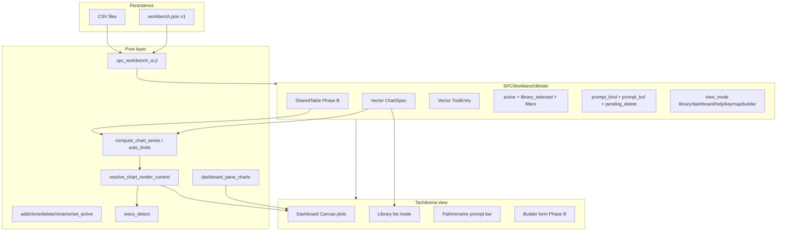
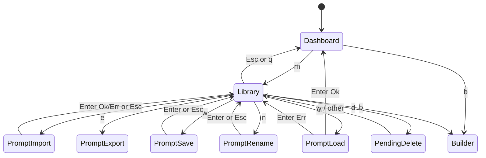
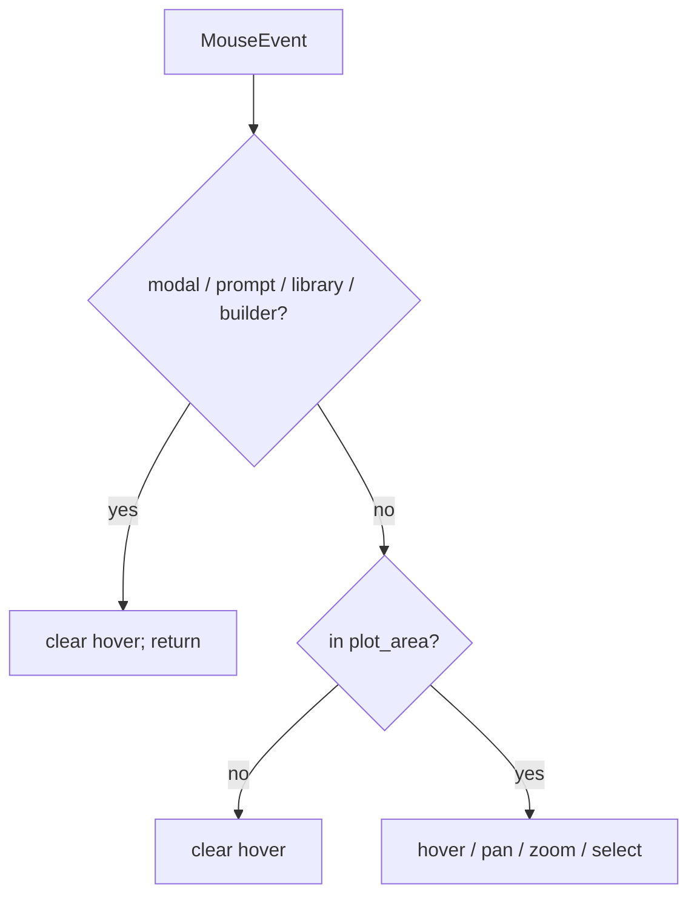
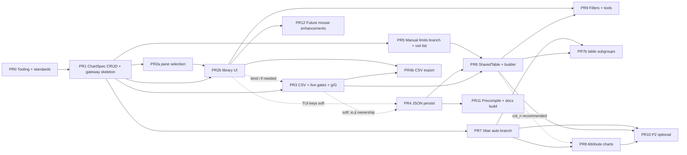

# SPC Workbench: HTML→Terminal Feature Parity Implementation Plan

**Author:** Grok (systems architect)  
**Date:** 2026-07-09  
**Status:** Draft (rev 3 — user decisions locked 2026-07-09)  
**Project:** tachikoma-tui (Julia + Tachikoma.jl)  
**Branch context:** `master` — workbench at ~2168 lines (`src/spc_workbench.jl`)  
**Authoritative inventory:** `/home/dustin/Git/Projects/tachikoma-tui/design-spc-html-gap-analysis.md` (rev 4 — product decisions locked; when checked into repo: `design-spc-html-gap-analysis.md`)  
**HTML reference:** `SPC_workbench_2026-06-18-20-46.html`  
**Prior design (workbench origin):** `design-spc-workbench-plan.md` / `/tmp/grok-design-doc-1442427c.md`  
**Repo copy:** `design-spc-html-parity-plan.md` (keep in sync with this document)  
**Status note:** Draft rev 3 (2026-07-09) — review Issues 1–15 addressed; user decisions locked (PR0 standalone, wire `test_spc.jl`, SharedTable in-memory)

---

## Overview

The HTML SPC / WECO Workbench is a full fab process-control app (shared table, typed chart library, import/export, tools, multi-card dashboard). The terminal workbench is already a high-fidelity **interactive I-MR explorer** — WECO 1–8, Cpk bands, OOC/OOS markers, multi-plot dashboard, mouse hover/pan/zoom, config modals, live append — but charts are **hardcoded demos** with no library CRUD, no CSV/JSON I/O, no chart types beyond individuals, and a multi-plot bug that locks secondary panes to `charts[2]`/`charts[3]`.

This document is **not** another gap inventory. It transforms the locked gap analysis (P0/P1/P2, non-goals, Key Decisions) into an **implementable architecture and ordered PR plan** for terminal-first feature parity: keyboard-primary workflow UI (library, prompts, builder, path I/O), pure stats first, Phase A series-owned charts before Phase B SharedTable, while **preserving interactive fidelity** (viewport, mouse, WECO, Cpk, live, config) and adding project **tooling/standards** (docs, tests, formatting, Tachikoma TestBackend discipline) early enough that later feature PRs inherit it.

---

## Background & Motivation

### Current terminal state (grounded)

| Layer | Location | Notes |
|-------|----------|-------|
| Pure WECO / limits / Cpk | `src/spc_workbench.jl` L15–533 | `weco_detect`, `compute_limits_and_zones`, `resolve_chart_render_context` (display authority; recomputes from values) |
| `ChartSpec` | L57–66 | `id`, `name`, `data`, `viewport`, specs, `enabled_rules` only — **no** `chart_type`, metadata, manual limits, `live_enabled` |
| `SPCWorkbenchModel` | L917–954 | Multi-chart + legacy mirrors; `view_mode ∈ {dashboard, focused, help, keymap}`; **no** library/prompt fields |
| Bootstrap | `_ensure_charts!` L958–998 | Always injects Primary / Secondary / Tertiary when empty |
| Key handler | `update!(KeyEvent)` L1017+ | Help/keymap early-return; `config_open` / `editing` modes; `[` `]` switch only |
| Mouse handler | `update!(MouseEvent)` L1261–1328 | Early-return on `config_open` / `editing` / help / keymap; hover/pan/zoom on primary plot |
| Multi-plot | view L1622–1623, L1725–1727 | Hard-coded `m.charts[2]` / `m.charts[3]` — active==2 duplicates primary as secondary |
| Live | `advance_live!` L2059–2077; gated in `view` L1342 | Only checks `paused` / `editing` / `config_open` — **not** import safety |
| Runners | L2125–2165 | `spc_workbench_demo`, `spc_workbench`, aliases; **no** `load=` / `workbench=` / `seed_demos` |
| Module | `src/TachikomaTUI.jl` | Includes `hello.jl`, `spc.jl`, `spc_workbench.jl`; no `spc_workbench_io.jl`, no `precompile.jl` |
| Tests | `test/test_spc_workbench.jl` (~1121 lines) | Pure WECO + TestBackend UI; triple-seed assertions; `visual_rows_wb` |
| Suite wiring | `test/runtests.jl` | Includes `test_hello.jl`, `test_spc_workbench.jl` only (**not** `test_spc.jl` today) |
| Deps | `Project.toml` | Tachikoma, JSON, Supposition, Random, Statistics — **no** Documenter, PrecompileTools, DelimitedFiles explicit, XLSX |

### Pain points (workflow)

1. Cannot run fab path: measurement file → chart library → WECO review.  
2. Chart library is a demo carousel (`[` / `]` only).  
3. Data model is series-owned floats; HTML is definitions over a shared table — evolution must be phased.  
4. Secondary panes ignore active neighborhood (duplicate-view bug).  

### Why not a web clone

Terminal strengths are keyboard navigation, deterministic TestBackend, live viewport interaction. Product non-goals (admin passwords, self-modifying HTML, Excel, dual SVG chrome, external file pickers) stay out. Adapt UX: **modals, prompts, library list, dashboard** — not side panels and toast chrome.

---

## Goals & Non-Goals

### Goals

1. **P0 core workflow parity:** chart library CRUD, CSV import, JSON save/load, library UI mode, multi-plot pane fix, `ChartType` + empty-chart + per-chart `live_enabled` contracts.  
2. **P1 fab usability:** SharedTable + builder (Phase B), manual limits, X̄-R/X̄-S, filters/tools, CSV export, violation list, attribute charts (v1.x PR8).  
3. **Preserve interactive fidelity:** existing mouse (hover tooltip, pan/zoom, selection), WECO toggles, Cpk bands, config tabs, live demo remain green.  
4. **Keyboard-first new workflow UI;** mouse no-ops library/prompt/builder modes; architecture leaves extension points for future mouse chrome.  
5. **Tooling & standards** for Julia docs/tests/formatting and Tachikoma UI testing, so feature PRs inherit discipline.  
6. **Incremental mergeable PRs** with red-first tests, full suite + app gates per AGENTS.md.

### Non-Goals (locked — do not re-litigate)

| Item | Status |
|------|--------|
| Admin sign-in / passcodes | Non-goal; confirm-to-delete (`d`+`y`) |
| Self-modifying HTML / download full app | Non-goal |
| Excel / XLSX.jl | **Out of plan** — CSV + JSON only long-term |
| HTML `#spc-state` / exportArchive interop (v1) | Non-goal; strip `admins` if ever attempted |
| External path pickers (zenity/fzf) | Non-goal; typed paths only |
| Default focused mode on library Enter | **No** — Enter → dashboard with chart active |
| Size-binning UI, dual secondary Canvas, full data grid | P2 / later |
| New runtime deps for CSV | Prefer hand-rolled / stdlib `DelimitedFiles` |
| Boiling ocean with Aqua/JET in first PR | Optional later quality PR only |

---

## Key Decisions

1. **Parity = core fab workflow, not pixel/HTML chrome**  
   *Rationale:* Terminal differentiator is interactive WECO review; critical gaps are library + data I/O. Gap analysis Key Decision 1.

2. **Phase A series-owned charts before Phase B SharedTable**  
   *Rationale:* Fastest real-data path; SharedTable uses **copy-on-map** into `WorkbenchData` (no dual live source). Phase B table is **in-memory after import** (KD25). Gap KD 2.

3. **CSV + JSON only long-term; new `src/spc_workbench_io.jl` from PR3**  
   *Rationale:* Product decision; JSON already in Project.toml; no XLSX.jl. Gap KD 3, 8.

4. **Confirm-to-delete (`d` then `y`), never delete last chart**  
   *Rationale:* Local trusted operator; no admin theater. Gap KD 4.

5. **`resolve_chart_render_context` remains single stats gateway; PR1 owns the dispatch skeleton**  
   *Rationale:* Display limits recomputed from values (+ manual mode later); stored `cl`/`sigma` are legacy/live convenience only (L525–528). Gap KD 5.  
   *Ownership:* **PR1** lands a thin skeleton that branches on `limits_mode` and `chart_type` but keeps today’s I_MR/` :mr` behavior for all paths. **PR5** fills the `:manual` branch only. **PR7** fills Xbar_R / Xbar_S auto branches (and subgroup helpers). PR5 ∥ PR7 remain parallel **after** the skeleton exists — they must not both invent the dispatcher.

6. **Dashboard panes = active + following visible neighbors** via `dashboard_pane_charts`  
   *Rationale:* Fixes active==2 duplicate and post-delete `charts[3]` hazard. Gap KD 6.

7. **X̄-R/X̄-S before attributes; attributes = PR8 (v1.x), not indefinite P2**  
   *Rationale:* Product schedule; PR7 series-chunk independent of SharedTable. Gap KD 7, 19. PR7 is **pure + resolver/plot only** — type-selector UI is PR2b (minimal cycle) and/or PR6 (builder), not a PR7 hard deliverable.

8. **New UI = `view_mode` + prompt state machine** (`prompt_kind` / `prompt_buf`)  
   *Rationale:* Specs-only `editing` cannot express multi-step path UX. Gap KD 8.

9. **Per-chart `live_enabled` only (no model-level flag); re-enable with dashboard `g`/`G` (not `L`)**  
   *Rationale:* Import clears that chart only; `advance_live!` / `view` must check flag + prompt/config/edit/library/builder.  
   **Key collision fix (verified on master L1209–1212):** both `l` and `L` already open **LSL editing** (`"u/U t/T l/L  edit USL / Target / LSL"` in help ~1982). Live toggle must **not** use `L`.  
   **Canonical live key: `g` / `G`** (“go live” / live gate) — free on dashboard today (used keys: `p r z c v o u t l s 1–8 ? h k [ ] > <` and library-scoped letters). Keep **`l`/`L` = LSL** unchanged.  
   **PR ownership:** **PR3** rewrites live gates in both `view` and `advance_live!`, binds `g`/`G`, updates help/keymap/footer, and tests import→unpause does not grow values + toggle re-enables. PR1 only adds the `live_enabled` field + pure defaults.

10. **Default `seed_demos = :triple` until an explicit test-update PR**  
    *Rationale:* Protects existing multi-chart TestBackend assertions. Gap KD 11.

11. **Canonical file keys: library `i`/`e`/`w`/`W`; never `o`/`O` (Visual Preferences); never `L` for live**  
    *Rationale:* Avoid keymap collisions with Visual Preferences (`o`/`O`) and LSL (`l`/`L`). Live = `g`/`G` (KD9).

12. **Empty charts via `empty_workbench_data()`; `add_chart!` never `data=nothing`**  
    *Rationale:* Always-legal `ChartSpec.data`. Gap KD 13.

13. **Phase A CSV: `Value` column or single-column file; no column-picker UI until builder**  
    *Rationale:* Simple pure parser + CLI `value_col=` override for tests. Gap KD 14.

14. **Explicit paths only; `last_workbench_path` is prefill, never silent write**  
    *Rationale:* Deterministic TestBackend + operator control. Gap KD 15.

15. **Manual limits: PR5 resolver+display; edit only in builder (PR6)**  
    *Rationale:* No single-key CL/UCL/LCL competing with `u/t/l` specs. Gap KD 16.

16. **Keyboard-first workflow; mouse early-return extended; future mouse-enhancement deferred**  
    *Rationale:* Preserve hover/pan/zoom on dashboard; library/prompt/builder no-op mouse same class as `config_open`/`editing`. Do not block parity on mouse chrome for list/CRUD. Full early-return template must clear hover **and** clear `drag_start` on `mouse_release` (parity with L1263–1269).

17. **Tooling scaffolding early (PR0 or folded into PR1)**  
    *Rationale:* Later feature PRs inherit Documenter layout, test helpers, formatting, verification checklist.

18. **No new runtime package deps for CSV**  
    *Rationale:* Hand-rolled Phase A parser or `DelimitedFiles` (stdlib); Documenter/Aqua only in docs/test extras.

19. **`load_workbench!` for in-session reload; `load_workbench` for CLI/construct**  
    *Rationale:* Never replace `app(m)` model identity mid-session. Gap A4.

20. **Library Enter → dashboard (primary = selected); no default `:focused`**  
    *Rationale:* Product decision. Gap KD 20.

21. **Esc/quit precedence for new modes (match help/keymap overlays)**  
    *Rationale:* On master, after config/editing, **global Esc/`q` always quit** (L1149–1151). New modes must handle Esc/`q` **before** that global quit.  
    - `prompt_kind !== nothing`: **Esc** cancels prompt (clears kind/buf); **`q` is a buffer character** (paths/names may include `q`) — do not quit from prompt.  
    - `pending_delete`: any non-`y` (incl. Esc) clears pending; do not quit.  
    - `view_mode ∈ (:library, :builder)`: **Esc and `q` close mode → dashboard** (same pattern as help/keymap L1023–1030), **never set `quit=true`**.  
    - Dashboard: Esc/`q` still quit as today.

22. **I/O pure tests use the package module (`using TachikomaTUI`), not raw `include` of both workbench + io**  
    *Rationale:* Today pure WECO tests `include("../src/spc_workbench.jl")` (test file L7). Double-include + package load risks type redefinition (`__precompile__(false)` at ~L625 already signals include pain). **New CSV/JSON tests** (PR3+) go through `using TachikomaTUI` like `test_spc.jl` UI patterns. Existing pure WECO `include` path may remain until a later consolidation PR; do not raw-include `spc_workbench_io.jl` into the same test process that also `using TachikomaTUI`.

23. **PR0 is standalone** — not folded into PR1.  
    *Rationale:* **User decision (2026-07-09).** Tooling/standards scaffolding lands and merges on its own so feature review stays focused.

24. **PR0 hard-wires `test/test_spc.jl` into the full suite** via `include` in `test/runtests.jl`.  
    *Rationale:* **User decision (2026-07-09).** File is currently orphaned; full-suite gates must exercise classic SPC tests. Fix any pre-existing failures as part of PR0 merge criteria — do not leave exclusion as the default.

25. **SharedTable is in-memory after import; CSV is ingress only**  
    *Rationale:* **User decision (2026-07-09).** Phase B keeps the table in the model after import; `materialize_chart_from_table!` / `compute_chart_series` read the **in-memory** `SharedTable`, not re-open the CSV path on each materialize. Re-import replaces/refreshes the in-memory table; chart series still copy-on-map into `WorkbenchData`.

---

## Proposed Design

### Design principles

1. **Pure stats first, UI second** — new math/I/O as pure functions with unit tests above the Tachikoma half of `spc_workbench.jl` (existing pure/UI split in the file).  
2. **Do not break interactive fidelity** — existing mouse + WECO + Cpk TestBackend suites stay green every PR.  
3. **Evolve data ownership deliberately** — Phase A per-chart series; Phase B SharedTable **in-memory after import** (CSV ingress only) + copy-on-map into `WorkbenchData`.  
4. **TUI patterns** — extend `view_mode` and add prompt SM; mode-scoped keys like `config_open` (L1034).  
5. **Confirm destructive ops** — two-key, not passwords.  
6. **Default demo seed stays triple** until dedicated assertion update.  
7. **Mouse preserve + extend later** — architecture documents handler precedence and future hooks without implementing rich mouse for library/builder in P0.

### Target architecture



### Phase A — Chart library + series I/O (P0 + P1.6 export)

#### A1. `ChartType`, empty data, extended `ChartSpec`

```julia
@enum ChartType begin
    I_MR
    Xbar_R
    Xbar_S
    # PR8 enables attribute use; parse may accept wire strings earlier but engine stubs until PR8
    p_chart
    np_chart
    c_chart
    u_chart
end

const CHART_TYPE_WIRE = Dict(
    I_MR => "I-MR", Xbar_R => "Xbar-R", Xbar_S => "Xbar-S",
    p_chart => "p", np_chart => "np", c_chart => "c", u_chart => "u",
)

empty_workbench_data() = WorkbenchData(values = Float64[], cl = 0.0, sigma = 0.0)

@kwdef mutable struct ChartSpec
    id::String = "CHT-" * string(rand(1000:9999))
    name::String = "Series-1"
    chart_type::ChartType = I_MR
    data::WorkbenchData = empty_workbench_data()
    viewport::Viewport = Viewport(x0 = 0, x1 = 0, ylo = 0.0, yhi = 1.0)
    usl::Union{Float64,Nothing} = nothing
    target::Union{Float64,Nothing} = nothing
    lsl::Union{Float64,Nothing} = nothing
    enabled_rules::Dict{String,Bool} = copy(DEFAULT_WECO_RULES)
    param::String = ""
    units::String = ""
    owner::String = ""
    tools::Vector{String} = String[]
    limits_mode::Symbol = :auto   # :auto | :manual
    manual_cl::Union{Float64,Nothing} = nothing
    manual_ucl::Union{Float64,Nothing} = nothing
    manual_lcl::Union{Float64,Nothing} = nothing
    subgroup_size::Int = 5
    live_enabled::Bool = true
    # Phase B:
    # source::Symbol = :series
    # col_value::String = "Value"
    # col_n::String = ""
    # col_tool::String = "Tool"
    # col_time::String = "Timestamp"
end
```

**Empty chart contract (`n == 0`):**

| Path | Behavior |
|------|----------|
| `resolve_chart_render_context` | Zero `LimitsAndZones`, empty viol set, `cpk=nothing` (via existing empty guards) |
| `view` primary plot | Keep `n > 0` guards (~L1475); title/side: `"No data — import CSV or clone a demo"` |
| `advance_live!` | No-op when `n==0` or `!current_chart(m).live_enabled` |

**Resolver gateway skeleton (PR1 owns; PR5/PR7 fill branches):**

```julia
function resolve_chart_render_context(ch::ChartSpec; sigma_method::Symbol = :mr)::ChartRenderContext
    vs = ch.data.values
    # PR1 skeleton — all paths currently reduce to I_MR/:mr behavior:
    if ch.limits_mode == :manual &&
       ch.manual_cl !== nothing && ch.manual_ucl !== nothing && ch.manual_lcl !== nothing
        # PR5 fills: sigma = (ucl - cl) / 3; zones from that sigma
        # Until PR5: fall through to auto (or implement immediately if PR1+PR5 combined)
        lz = _limits_from_manual(ch)  # PR5; stub may call auto until then
    else
        # PR7 fills type-aware auto; until then always I_MR :mr path
        lz = auto_limits(vs; chart_type = ch.chart_type, subgroup_size = ch.subgroup_size,
                         sigma_method = sigma_method)  # PR1: alias to compute_limits_and_zones(:mr)
    end
    viols = weco_detect(vs, lz.cl, lz.sigma; enabled_rules = ch.enabled_rules)
    # ... cpk/band as today
end
```

**Live-append policy (per-chart only) — owned by PR3 with import:**

```julia
# Shared predicate used by view (tick path) AND advance_live! (defensive):
function _live_may_advance(m::SPCWorkbenchModel)::Bool
    m.paused && return false
    m.editing !== nothing && return false
    m.config_open && return false
    m.prompt_kind !== nothing && return false
    m.pending_delete && return false
    m.view_mode in (:help, :keymap, :library, :builder) && return false
    ch = current_chart(m)
    (isempty(ch.data.values) || !ch.live_enabled) && return false
    return true
end
# view: if _live_may_advance(m) && (m.tick % 4 == 0); advance_live!(m); end
# advance_live!: first line ` _live_may_advance(m) || return `
```

- Import / table materialize sets **that chart’s** `live_enabled = false` only.  
- Dashboard key **`g` / `G`** toggles `current_chart(m).live_enabled` with `last_event` feedback (`"live on"` / `"live off"`). Help/keymap list it. **Not `L`** (LSL — master L1209–1212).  
- JSON: always write `live_enabled`; **if omitted on load → `false`** (safe for fab snapshots). Seeded demos keep `true` until import.  
- **Tests (PR3):** after successful import, `p` unpause must **not** grow `values` while `live_enabled==false`; after `g`, unpause may grow (when other gates clear).

#### A2. Library pure ops + seed policy + minimal ToolEntry

```julia
@kwdef struct ToolEntry
    id::String
    description::String = ""
end
# Model field (Phase A may keep empty): tools::Vector{ToolEntry} = ToolEntry[]
# PR9 may add area/process later as optional fields with defaults — do not invent parallel shapes.

function add_chart!(m; name="New chart", data=empty_workbench_data())::Int
function clone_chart!(m, idx::Int)::Int   # deep-copy values/rules/specs/viewport/meta; new id; name *= " (copy)"
function delete_chart!(m, idx::Int)::Bool # refuse if length==1; clamp active + library_selected
function rename_chart!(m, idx::Int, name::AbstractString)
function set_active_chart!(m, idx::Int)
```

| `seed_demos` | When `isempty(m.charts)` |
|--------------|--------------------------|
| `:triple` (default) | Current Primary / Secondary / Tertiary |
| `:single` | One Primary demo |
| `:none` | One empty chart |

**PR1 must not flip default** from `:triple`.

#### A3. CSV import (series-first) — `src/spc_workbench_io.jl`

```julia
struct CsvParseOk
    columns::Vector{String}
    rows::Vector{Vector{String}}
    values::Vector{Float64}
    value_col::String
    warnings::Vector{String}
end
struct CsvParseErr
    kind::Symbol  # :not_found | :unreadable | :empty | :no_header_match |
                  # :no_numeric | :all_invalid | :too_large
    message::String
end

parse_csv_table(path; value_col="Value", max_rows=50_000)::Union{CsvParseOk,CsvParseErr}
import_csv_into_chart!(ch, path; value_col="Value", replace=true)
import_csv_new_chart!(m, path; name=..., kwargs...)
export_csv_series(path, values; col_name="Value")  # PR4b
chart_for_export(m)  # library_selected when view_mode==:library else active
```

**Phase A column policy:** require `Value` (case-sensitive) or single column (header optional). No TUI column picker. CLI/tests may pass `value_col=`.

**Parser minimum:** `\n`/`\r\n`, strip UTF-8 BOM; simple comma split (**no full RFC4180 quoted fields in P0** — document limitation). Skip empty lines; non-numeric value cells → warning; if ≥1 good float → Ok else `:all_invalid`.

**After successful import into a chart:**

1. Replace (default) or append `ch.data.values`.  
2. Full-range viewport + `auto_fit_viewport_y!` when `n>0`.  
3. `ch.live_enabled = false` on that chart only.  
4. `m.paused = true`.  
5. Display via next `resolve_chart_render_context` (not stored cl/sigma).  
6. `last_event = "imported N values from path"`.

#### A4. JSON schema v1

```julia
workbench_to_dict(m)::Dict
workbench_from_dict(d)::Union{SPCWorkbenchModel,String}
workbench_from_dict!(m, d)::Union{Nothing,String}
save_workbench(m, path)::Union{Nothing,String}
load_workbench(path)::Union{SPCWorkbenchModel,String}     # CLI / construct
load_workbench!(m, path)::Union{Nothing,String}           # in-session library W
```

| Required | Notes |
|----------|-------|
| `version` | Must be `1` |
| `charts` | Non-empty array |
| `active` | 1-based, clamped |
| Per chart: `id`, `name`, `chart_type` wire, `values` | |

**`load_workbench!` replaces:** charts, active, tools, optional default_rules / show_chart_lines / visual_prefs / paused; clears prompt/config/edit/hover/drag ephemerals; sets `last_workbench_path`; clamps `library_selected`. **Preserves:** `rng`, `tick`, `quit`, geometry, `live_max`.

Corrupt load: fail closed (no partial apply). Unknown chart keys ignored. Never deserialize `admins`/passcodes.

**Load/import failure UX (fail closed + stay put):**

| Outcome | Charts mutated? | UI state | `last_event` |
|---------|-----------------|----------|--------------|
| Import Ok | Yes (target chart) | Stay in library; `prompt_kind=nothing` | `"imported N values from …"` |
| Import Err | **No** | Stay in library; clear prompt **or** keep `prompt_buf` (prefer **keep buf** so user can edit path); `prompt_kind=nothing` after Enter attempt | `"import err: …"` using stable kinds (`not found`, `no Value column`, …) |
| Load Ok (`load_workbench!`) | Full replace per A4 | `view_mode=:dashboard`; clear prompt | `"loaded …"` |
| Load Err | **No** (no partial apply) | **Remain in library**; clear `prompt_kind`; prefer keep `prompt_buf` | `"load err: …"` (version / no charts / unreadable / …) |
| Save Err | No | Stay library; clear prompt | `"save err: …"` |

TestBackend (PR3/PR4): assert charts length/values unchanged on err; `find_text` / `last_event` prefix present.

#### A5. Prompt state machine + library mode

**Model fields (additive):**

```julia
prompt_kind::Union{Nothing,Symbol} = nothing
# :import_csv | :save_workbench | :load_workbench | :rename_chart | :export_csv
prompt_buf::String = ""
pending_delete::Bool = false
library_selected::Int = 1
last_workbench_path::String = ""
last_export_path::String = ""
seed_demos::Symbol = :triple
tools::Vector{ToolEntry} = ToolEntry[]
```

**Handler order in `update!(KeyEvent)`** (must run **before** global quit at L1149–1151):

0. Help/keymap early-return (existing): Esc/`q`/toggle closes overlay — **no quit**.  
1. `prompt_kind !== nothing` → path/name buffer only (chars, backspace); **Enter** apply; **Esc** cancel (`prompt_kind=nothing`, keep or clear buf per table above). **`q` is a typed character**, not quit. Load uses **`load_workbench!`**. On apply error: fail closed, stay library, set `last_event`.  
2. `pending_delete` → `y` confirms delete; **any other key including Esc** clears pending (no quit).  
3. `config_open` → existing (Esc closes config, no quit).  
4. `editing !== nothing` → existing specs (Esc cancel; `q` still quits from edit as today L1108–1110).  
5. `view_mode == :library` → library keys only. **Esc and `q` → `view_mode=:dashboard`** (close mode, **never** `quit=true`).  
6. `view_mode == :builder` (Phase B) → builder keys. **Esc and `q` → close builder to previous mode/dashboard** (never quit).  
7. **Only then** global Esc/`q` → quit (dashboard).  
8. Dashboard keys (incl. **`g`/`G` live toggle**, `[` `]` chart switch, …).

**Mouse path extension** — copy full existing early-return body (L1263–1270), extended conditions:

```julia
function update!(m::SPCWorkbenchModel, evt::MouseEvent)
    _ensure_charts!(m)
    if m.config_open || m.editing !== nothing ||
       m.view_mode in (:help, :keymap, :library, :builder) ||
       m.prompt_kind !== nothing || m.pending_delete
        m.last_event = string(evt.action, " ", evt.button, " (modal)")
        m.hover_x = nothing
        m.hovered = nothing
        if evt.action == mouse_release
            m.drag_start = nothing   # parity with today — avoid stuck drag if mode opened mid-drag
        end
        return
    end
    # ... existing hover/pan/zoom/select ...
end
```



**Library keys (canonical):**

| Key | Action |
|-----|--------|
| `↑` `↓` | Move `library_selected` |
| `Enter` | `set_active_chart!`; `view_mode = :dashboard` |
| `a` | Add empty |
| `c` | Clone selected (**library only**; dashboard `c` = config) |
| `d` then `y` | Delete |
| `n` | Rename prompt |
| `i` | Import CSV prompt |
| `e` | Export CSV (PR4b) of `library_selected` |
| `w` / `W` | Save / load JSON |
| `Esc` / `q` | Close library → dashboard (**do not quit**) |

#### A6. Multi-plot pane selection

```julia
function visible_charts(m::SPCWorkbenchModel)::Vector{ChartSpec}
    # Phase A / PR2a: all charts (identity)
    # PR9: apply filter_tool / filter_type / filter_owner
end

function dashboard_pane_charts(m::SPCWorkbenchModel; k::Int = 3)::Vector{ChartSpec}
    vis = visible_charts(m)
    isempty(vis) && return ChartSpec[]
    act = current_chart(m)
    i = findfirst(c -> c.id == act.id, vis)
    i === nothing && (i = 1)  # Phase A only; PR9 policy below when filters hide active
    j = min(i + k - 1, length(vis))
    return vis[i:j]
end
```

**Regression tests (PR2a):**

1. `active == 2`, 3 charts → panes charts 2,3 only (no duplicate).  
2. Delete to 2 charts → no throw / no former charts[3].  
3. `active == last` → single primary pane.

Primary interactive plot = `panes[1]`; read-only extras = `panes[2:end]`.

**PR9 policy when active chart is filtered out:** do **not** silently show another chart as primary while `m.active` still points at a hidden chart. On filter change, if `current_chart(m)` ∉ `visible_charts(m)`:

1. Prefer **`set_active_chart!` to first visible** (if any), update `library_selected` consistently, set `last_event = "active chart filtered — switched to …"`.  
2. If no visible charts: render empty primary with message `"No charts match filters"` (do not crash).  
3. Clearing filters restores full list; active index remains valid.

Phase A identity `visible_charts` never hits this path.

### Phase B — SharedTable + builder (P1.1–P1.2)

**Locked strategy (user decision 2026-07-09 / KD25): in-memory SharedTable after import.**

- CSV (or future paste) is **ingress only**: parse once → fill `m.table::SharedTable`.  
- **Do not re-read the CSV path** on each materialize, filter change, or apply-mapping.  
- `materialize_chart_from_table!(ch, m.table)` / `compute_chart_series(m.table, ch)` always use the **in-memory** table.  
- Re-import replaces or appends into `m.table` in process, then re-materializes charts as needed.  
- Still **copy-on-map** into `ch.data::WorkbenchData` (no live dual-source resolve every frame).

```julia
@kwdef mutable struct SharedTable
    columns::Vector{String} = String[]
    rows::Vector{Dict{String,String}} = Dict{String,String}[]
end

mean_or_0(vs) = isempty(vs) ? 0.0 : mean(vs)
std_or_0(vs) = length(vs) < 2 ? 0.0 : std(vs; corrected=true)

"""
    compute_chart_series(table, ch) -> (values::Vector{Float64}, labels, point_meta)

Pure. Operates on the in-memory SharedTable only (no file I/O).
Filter rows by ch.tools if non-empty; map ch.col_value (and col_n for attributes).
"""
function compute_chart_series(table::SharedTable, ch::ChartSpec)
    # ...
end

function materialize_chart_from_table!(ch::ChartSpec, table::SharedTable)
    values, labels, meta = compute_chart_series(table, ch)
    ch.data = WorkbenchData(values=values, cl=mean_or_0(values), sigma=std_or_0(values),
                            meta=Dict("labels"=>labels, "point_meta"=>meta))
    ch.source = :table  # provenance only
    # reset viewport; ch.live_enabled = false
end
```

No dual path in `resolve_chart_render_context` reading the table every frame. Builder is the **only** editor for manual CL/UCL/LCL (plus name, col_value, tools, WECO).

### Phase C — X̄-R / X̄-S (P1.3) — pure + plot only in PR7

Port `SS_FACTORS` (n=2..25) from HTML ~1066–1093.

```julia
# Dict or NamedTuple table n=2..25 → (A2, A3, d2, D3, D4, c4, B3, B4, ...) as needed
const SS_FACTORS = Dict{Int,NamedTuple}( ... )

function subgroup_means_and_ranges(values::AbstractVector{<:Real}, n::Int)
    # -> (xbar::Vector{Float64}, ranges::Vector{Float64}, groups)
end
function subgroup_means_and_s(values::AbstractVector{<:Real}, n::Int)
    # -> (xbar, svals, groups)
end

"""
    auto_limits(values; chart_type=I_MR, subgroup_size=5, sigma_method=:mr,
                limits_mode=:auto, manual_cl=nothing, manual_ucl=nothing, manual_lcl=nothing)
        -> LimitsAndZones

Type-aware control limits. I_MR uses existing :mr / :std paths.
Xbar_R / Xbar_S use SS_FACTORS (PR7). Attribute p/np/c/u in PR8.
Manual mode: sigma = (ucl - cl) / 3 when all three set (PR5 may live here or in resolver only).
"""
function auto_limits(values::AbstractVector{<:Real};
                     chart_type::ChartType = I_MR,
                     subgroup_size::Int = 5,
                     sigma_method::Symbol = :mr,
                     limits_mode::Symbol = :auto,
                     manual_cl = nothing, manual_ucl = nothing, manual_lcl = nothing)::LimitsAndZones
end
```

Series-only: consecutive chunks of `subgroup_size` on `ch.data.values`. Plot primary X̄; R̄/s̄ stats in side panel (dual canvas = P2). Cpk for Xbar-S uses `c4` as HTML.  
**UI type selector is not required for PR7** — set `chart_type` via API/tests; optional library cycle key after PR2b; builder selector in PR6.

### Phase D — Filters + tools registry (P1.4–P1.5) — **PR9**

- Filters: `filter_tool`, `filter_type`, `filter_owner` → `visible_charts` (and library list + `dashboard_pane_charts`).  
- Tools registry UI over `Vector{ToolEntry}` (id + description).  
- Active-filtered-out policy: see A6 / PR9.  
- **Violation message list is PR5**, not Phase D.  
- Manual limits: resolver PR5; editing builder PR6.

### Mouse architecture (preserve now; enhance later)

**Today (must remain green):** hover tooltip, crosshair, left-drag pan, wheel zoom, click selection ┃, marker colors — on **dashboard primary** when not in modal modes (`update!(MouseEvent)` L1261–1328).

**This plan’s requirement:**

| Mode | Mouse behavior |
|------|----------------|
| Dashboard (normal) | Existing handlers unchanged |
| `config_open` / `editing` / help / keymap | Existing early-return |
| `prompt_kind` / `pending_delete` / `:library` / `:builder` | **Same early-return no-op** (keyboard-only) |

**Extension points (do not implement in P0–P1 core unless free):**

- `plot_area` / future `library_area` rects for hit-testing.  
- Mode-gated dispatch table rather than growing a single if-ladder forever.  
- Optional later: click library row to select; double-click activate; wheel scroll library list.

**Deferred PR (see PR plan):** “Mouse enhancement for library/builder” — **not** on the critical path for parity.



### Interaction with existing code paths

| Existing | Change |
|----------|--------|
| `_ensure_charts!` | Honor `seed_demos`; skip seed if charts already loaded |
| `resolve_chart_render_context` | Manual limits; type-aware auto; still values-driven |
| `advance_live!` | Gate on `live_enabled` + prompt + library/builder modes (**PR3** owns rewrite) |
| `update!(MouseEvent)` | Early-return for prompt/library/builder/pending_delete; clear hover + `drag_start` on release |
| Global Esc/`q` | Must stay **after** library/builder/prompt handlers so modes close without quit |
| `view` multi-plot | `dashboard_pane_charts` instead of `charts[2]`/`[3]` |
| Runners | `spc_workbench(; load=, workbench=, seed_demos=:triple)` |
| Tests | Keep triple seed default; additive CRUD/CSV/JSON/pane tests |

### Public API growth (`TachikomaTUI.jl`)

Add incrementally (never remove existing exports):

```julia
export ChartType, ChartSpec, empty_workbench_data
export chart_type_to_string, parse_chart_type
export add_chart!, clone_chart!, delete_chart!, rename_chart!, set_active_chart!
export dashboard_pane_charts, visible_charts
export CsvParseOk, CsvParseErr, parse_csv_table
export import_csv_into_chart!, import_csv_new_chart!, export_csv_series
export save_workbench, load_workbench, load_workbench!
export workbench_to_dict, workbench_from_dict, workbench_from_dict!
export SharedTable, compute_chart_series, materialize_chart_from_table!  # Phase B
export SS_FACTORS, auto_limits                                            # Phase C
```

### Runner extensions

```julia
function spc_workbench(; paused::Bool = false,
                         load::Union{Nothing,AbstractString} = nothing,
                         workbench::Union{Nothing,AbstractString} = nothing,
                         seed_demos::Symbol = :triple,
                         value_col::String = "Value")
```

- `load` → CSV into new/active chart; that chart `live_enabled=false`, `paused=true`.  
- `workbench` → construct via `load_workbench` before `app(m)`.  
- Default seed preserves TestBackend expectations.

---

## API / Interface Changes

### Keymap additions

| Key | Mode | Action |
|-----|------|--------|
| `m` / `M` | dashboard | Open library |
| `a` | library | Add empty |
| `c` | library | Clone (dashboard `c` = config) |
| `d` then `y` | library | Delete |
| `n` | library | Rename |
| `i` | library | Import CSV |
| `e` | library | Export CSV (PR4b) |
| `w` / `W` | library | Save / load JSON (`load_workbench!`) |
| `g` / `G` | dashboard | Toggle active chart `live_enabled` (**not `L`** — LSL) |
| `l` / `L` | dashboard | **Unchanged:** edit LSL |
| `b` | dashboard/library | Builder (Phase B) |
| `f` | dashboard | Filters (PR9) |
| `o` / `O` | dashboard | **Unchanged** Visual Preferences |
| `Esc` / `q` | library / builder | Close mode → dashboard (**not quit**) |
| `Esc` / `q` | dashboard | Quit (existing) |

Help and keymap pages must list new bindings in the **same PR** that introduces them.

### Include order

```julia
# TachikomaTUI.jl
include("hello.jl")
include("spc.jl")
include("spc_workbench.jl")       # pure + UI
include("spc_workbench_io.jl")    # first of PR3/PR4 that needs it creates this file
# optional later:
# include("precompile.jl")
```

**Test include convention (locked — KD22):**

| Suite | Strategy |
|-------|----------|
| Existing pure WECO block in `test_spc_workbench.jl` | May keep `include("../src/spc_workbench.jl")` until a consolidation PR |
| **New CSV/JSON I/O tests (PR3+)** | **`using TachikomaTUI`** only — do **not** raw-include `spc_workbench_io.jl` in a process that also loads the package |
| UI / TestBackend | `using Tachikoma` + package types via `using TachikomaTUI` (or symbols already in test after package load) |

Prefer: `test/test_spc_workbench_io.jl` with `using TachikomaTUI` + `Test`, wired from `runtests.jl`.

---

## Data Model Changes

### Today

```
SPCWorkbenchModel
  └─ charts[]: ChartSpec { name, WorkbenchData, viewport, specs, rules }
  └─ legacy mirrors: data, viewport, usl, target, lsl, enabled_rules
  └─ editing / edit_buf (specs only)
  └─ view_mode ∈ {dashboard, help, keymap}  # :focused unused
```

### After Phase A

```
SPCWorkbenchModel
  ├─ charts[]: ChartSpec + type/metadata/manual limits + live_enabled
  ├─ tools[]: ToolEntry (optional empty)
  ├─ seed_demos::Symbol = :triple
  ├─ library_selected, prompt_kind, prompt_buf, pending_delete
  ├─ last_workbench_path, last_export_path
  ├─ view_mode ∈ {dashboard, help, keymap, library}
  └─ legacy mirrors (compat)
```

### After Phase B

```
  ├─ table::SharedTable   # in-memory after CSV ingress (KD25); not re-read from path on materialize
  ├─ charts[] with source + col_* maps
  └─ view_mode also :builder
```

### Migration

1. No on-disk format today → no user migration.  
2. `@kwdef` defaults preserve existing `ChartSpec(name=..., data=d)` construction.  
3. JSON `version: 1` with required/optional keys as gap analysis A4.  
4. Storage: 10k×12 string table ≈ few MB JSON — fine for local TUI.

---

## Tooling & Standards

This section is **in scope for implementation**, not advisory fluff. Feature PRs inherit these conventions after PR0 (or PR1 if folded).

### Julia documentation standards

| Practice | Requirement |
|----------|-------------|
| Public API docstrings | `"""..."""` on exported functions/types: purpose, args, returns, errors, examples where non-obvious |
| Documenter.jl | Add **docs environment** (prefer `docs/Project.toml` + `docs/make.jl`), **not** a runtime dep of TachikomaTUI |
| README vs Documenter | README: quick start, runners, keys overview, verification commands. Documenter pages: SPC/WECO concepts, JSON schema, CSV format, library workflow, API reference |
| Doctests | Optional; enable only for pure stable APIs (`weco_detect`, `parse_chart_type`) if examples are deterministic |
| Module docs | Brief module-level docstring in `TachikomaTUI.jl` describing apps shipped |

**Scaffold (PR0):**

```
docs/
  Project.toml          # Documenter + TachikomaTUI path dep
  make.jl
  src/
    index.md
    spc-workbench.md    # workflow + schema + keys
    api.md              # @autodocs or manual pages
```

Build: PR0 creates scaffold only — **`docs/make.jl` green is a PR11 gate**, not PR0. Feature PRs may add pages opportunistically. Scaffold must exist so later PRs do not reinvent layout.

### Julia testing standards

| Practice | Requirement |
|----------|-------------|
| Framework | `Test` stdlib; Supposition PBT where generators/robustness matter (existing pattern) |
| Layout | `test/test_<feature>.jl`; wire via `test/runtests.jl` `include` |
| Pure vs UI | Pure: unit tests without requiring full UI path when possible; UI: TestBackend only |
| Full suite | `julia --project=. test/runtests.jl` — CI-friendly, single entry |
| Wire `test_spc.jl` | **User-locked (KD24):** PR0 **must** `include("test_spc.jl")` in `test/runtests.jl`. Fix any pre-existing failures as part of PR0 merge criteria |
| I/O tests | Package module (`using TachikomaTUI`) — see KD22 / Include order |
| Fixtures | `test/fixtures/spc/` for sample CSV / JSON (good, empty, bad Value, round-trip) |
| Red-first | Behavioral changes: write failing test first, then implement |

**Shared helpers (PR0 or early PR2b):**

```julia
# test/test_helpers_workbench.jl (or top of test_spc_workbench.jl)
function visual_rows_wb(m; w=82, h=20) ... end   # already exists; extract if reused
function render_wb(m; w=80, h=18)
    tb = T.TestBackend(w, h)
    T.reset!(tb.buf)
    T.view(m, T.Frame(tb.buf, T.Rect(1,1,tb.width,tb.height), [], []))
    return tb
end
```

### Formatting

- **JuliaFormatter** with project `.JuliaFormatter.toml` (indent=4, margin=92, …) — verified present.  
- **Not** a Project.toml dep today: install for local/CI with `julia -e 'using Pkg; Pkg.add("JuliaFormatter")'` or a one-off env; do **not** add as runtime dep of TachikomaTUI.  
- Expectation: format **touched files** before merge (`julia -e 'using JuliaFormatter; format("src/…")'`).  
- Do not mass-reformat the whole repo in a feature PR (noise). Optional later: CI format check.  
- **PR0 README:** one line under CONTRIBUTING/dev notes documenting JuliaFormatter install + “format touched files”.

### Tachikoma UI testing standards (mandatory for UI PRs)

Cite and require `/home/dustin/Git/Projects/tachikoma-tui/.grok/docs/tachikoma-ui-testing.md` and `/home/dustin/Git/Projects/tachikoma-tui/.grok/docs/tachikoma-core.md` (repo-relative when checked in: `.grok/docs/…`):

1. **TestBackend** headless renders — never “looks fine manually” as sole proof.  
2. **Re-render after every `update!`** before visual asserts.  
3. Inspect with `find_text` / `row_text` / `char_at` / `visual_rows`.  
4. **Modal no-bleed:** library/help/config/builder must not show dashboard plot chrome underneath (same pattern as help tests L511–529).  
5. **Small-terminal guards:** `TestBackend(18,5)` etc. no crash.  
6. Drive flows exclusively through `update!(m, KeyEvent(...))` (and MouseEvent where testing mouse).  
7. Elm contract: `@kwdef mutable struct … <: Model`, `should_quit`, `update!`, `view`.

### App verification gates (AGENTS.md)

After **any** `src/` change affecting startup / `update!` / `view`:

```bash
# 1. Full suite
julia --project=. test/runtests.jl

# 2. App smoke (minimum)
julia --project=. -e 'using TachikomaTUI; TachikomaTUI.hello_tachikoma()'

# 3. Workbench runners (when exercising workbench changes)
julia --project=. -e 'using TachikomaTUI; TachikomaTUI.spc_workbench_demo()'
# optional live:
# julia --project=. -e 'using TachikomaTUI; TachikomaTUI.spc_workbench(paused=true)'
```

Note: `.grok/rules/always-run-the-app-after-changes.md` still contains **QciKanban** copy-paste (login gate, coverage_gate). **Authoritative for this repo:** AGENTS.md + CLAUDE.md commands above. Do not require Kanban gates.

### Missing deps / tooling (scoped)

| Tool | When | Scope |
|------|------|-------|
| Documenter | PR0 | `docs/` env only — **scaffold only**; **build success not required on PR0** (full `docs/make.jl` green is **PR11** gate). PR0 may run `Pkg.instantiate` optionally |
| `docs/make.jl` + stub pages | PR0 | Scaffold stubs sufficient for later pages |
| PrecompileTools + `src/precompile.jl` | PR11 (after public runners stabilize) | Workload: construct model, resolve context, optional TestBackend view; **prefer no new runtime behavior** |
| Aqua.jl / JET.jl | Optional later quality PR | Not required for parity critical path |
| JuliaFormatter | Dev-only / agent env | Document install in README (PR0); not a runtime dep |
| DelimitedFiles | Only if chosen over hand-rolled CSV | Stdlib — no Project.toml dep needed for stdlib |
| JSON | Already present | Use for workbench schema |
| XLSX.jl | **Never in this plan** | — |

**No new runtime deps** for CSV. Prefer hand-rolled parser matching Phase A policy.

### PrecompileTools (integration)

When wiring (recommended after PR4 runners mature):

```julia
# src/precompile.jl — sketch
using PrecompileTools
@setup_workload begin
    @compile_workload begin
        d = generate_spc_workbench_data(20; seed=1)
        m = SPCWorkbenchModel(data=d, paused=true)
        _ensure_charts!(m)
        resolve_chart_render_context(current_chart(m))
        # optional: TestBackend view if compile-time Tachikoma is acceptable
    end
end
```

Add `PrecompileTools` to Project.toml only when this file lands. Prior workbench plan referenced `precompile.jl` but **it is not on master today** — treat as additive, not assumed.

---

## Alternatives Considered

### 1. Full HTML port in one PR

- **Pros:** Maximum parity in theory.  
- **Cons:** Huge risk; Excel/admin noise; unreviewable.  
- **Decision:** Reject. Phased P0→P1→P2 per gap analysis.

### 2. Keep series-only forever

- **Pros:** Simpler model forever.  
- **Cons:** Multi-chart from one import needs row duplication.  
- **Decision:** Phase A series-first; Phase B SharedTable when needed.

### 3. Subprocess to browser HTML for data entry

- **Pros:** Reuse builder UI.  
- **Cons:** Breaks TUI + TestBackend.  
- **Decision:** Reject for core path.

### 4. XLSX.jl vs CSV-only

- **Pros:** Fab Excel habits.  
- **Cons:** Heavier dep; product locked CSV+JSON.  
- **Decision:** CSV + JSON only long-term.

### 5. DuckDB / DataFrames for table layer

- **Pros:** Rich queries.  
- **Cons:** Overkill vs HTML object arrays; new deps.  
- **Decision:** Reject until proven necessary.

### 6. External path pickers

- **Pros:** Nicer UX.  
- **Cons:** Non-deterministic CI; platform deps.  
- **Decision:** Typed paths only.

### 7. Block parity on full mouse chrome for library

- **Pros:** “Complete” interaction model.  
- **Cons:** Delays P0 workflow; TestBackend keyboard paths already cover CRUD.  
- **Decision:** Keyboard-first workflow; preserve existing mouse; deferred mouse-enhancement PR.

### 8. Feature flags for library/I/O

- **Pros:** Kill-switch.  
- **Cons:** Extra surface; new modes already behind keys.  
- **Decision:** No flags; default triple seed; rollback by revert PR.

---

## Security & Privacy Considerations

| Topic | Assessment |
|-------|------------|
| Admin passcodes | Not security; do not port |
| Local CSV/JSON paths | User-controlled; no network; reject embedded NULs; no shell expansion |
| Destructive delete | `d`+`y`; never delete last chart |
| Secrets in workbench JSON | None expected; strip `admins`/passcodes if present |
| HTML archive foreign JSON | v1 non-goal |
| Multi-user shared host | Out of scope; OS file perms |

Threat model: local trusted operator.

---

## Observability

| Signal | Approach |
|--------|----------|
| User status | `last_event` + footer (`imported 42 values`, `import err: no Value column`, `saved /path`) |
| Parse errors | `CsvParseErr.kind` + message; no silent partial import |
| Tests | Full suite; fixtures; pane selection; JSON round-trip; library no-bleed |
| Logging | Optional `@debug` in I/O module |
| Golden equivalence | Keep HTML Film-Thickness sample tests (~L265 workbench tests) |

---

## Rollout Plan

1. **PR-sized slices** — each independently reviewable; full suite green + app smoke.  
2. **No feature flags** — new modes behind keys; default seed preserved.  
3. **Rollback** — revert single PR; JSON `version` gate rejects unknown formats.  
4. **Help/keymap** updated in same PR as new keys.  
5. **Tooling first** so docs/tests conventions exist before library UI lands.  
6. **Parallelism (honest):** PR2b does **not** wait on PR3. PR3 ∥ PR2b. PR5 ∥ PR7 after PR1 gateway skeleton. PR4 soft-depends on PR3 (module file ownership only).  
7. **Longest-path examples (not a single forced sequence):**  
   - UI path: `PR0 → PR1 → PR2a → PR2b → PR4b` (PR4b also needs PR3)  
   - Data path: `PR0 → PR1 → PR3 → PR4 → PR6 → …`  
   - Math path: `PR0 → PR1 → PR7 → PR8`  
   Preferred integration order for a single serial train is still tooling → pure CRUD → panes → library → I/O → builder → filters, but **do not block library UI on CSV**.

### Risks

| Risk | Severity | Mitigation |
|------|----------|------------|
| Keymap collisions (`c` config vs clone; `o` visual vs open; **`L` was LSL**) | Medium | Mode-scoped library keys; live = **`g`/`G`**; never `o` for files; never `L` for live |
| Dual-source drift (table vs series) | Low | Copy-on-map; no live table resolve |
| Large CSV freezes TUI | Low | `max_rows=50_000` + `:too_large` |
| Seed default flip breaks tests | High if careless | Default `:triple` until explicit test PR |
| File size / include-order of `spc_workbench.jl` | Medium | First of PR3/PR4 creates `spc_workbench_io.jl`; consider pure/UI split later if >3k LOC |
| `ChartSpec` field growth breaks constructors | Medium | `@kwdef` defaults; keep `data` required-or-default carefully |
| Live append corrupts imported data | High if ungated | **PR3** owns full gate rewrite + `g`/`G` + tests; `paused=true` on import |
| Parallel PR5/PR7 merge conflict on resolver | Medium | **PR1 gateway skeleton**; PR5 only manual branch; PR7 only Xbar auto |
| Esc/`q` accidental quit from library | Medium | Mode handlers before global quit; library Esc/`q` close mode only |
| Orphaned `test_spc.jl` silent regressions | Medium | **PR0 hard-wires** `include("test_spc.jl")` (KD24); fix failures before merge |
| Mouse regressions from early-return expansion | Medium | Full early-return template (hover + drag_start on release); existing mouse suite green |
| Documenter env rot | Low | PR0 scaffold only; `docs/make.jl` green required at PR11 |

---

## Open Questions

### Resolved (locked)

**Gap analysis / product (rev 4):** attributes PR8, CSV+JSON only, triple seed default, Enter→dashboard, manual limits builder-only, etc.

**Review rev 2:** live key `g`/`G` (not `L`); PR3 owns live gates; PR1 owns resolver skeleton; PR3 ∥ PR2b; Esc/`q` mode policy; I/O tests via package module; gap analysis `L` for live superseded by KD9.

**User decisions (2026-07-09):**

1. ~~SharedTable in-memory vs re-read CSV~~ → **Resolved: in-memory after import; CSV is ingress only** (KD25).  
2. ~~PR0 standalone vs fold into PR1~~ → **Resolved: PR0 is standalone** (KD23).  
3. ~~Wire `test_spc.jl` in PR0~~ → **Resolved: hard-wire into full suite** (KD24).

### Remaining soft (non-blocking)

1. **`~/.config/…` default save path later?**  
   Not a P0 blocker; keep explicit path + prefill for now.

2. **PrecompileTools timing**  
   After PR4 runners + load paths stable (PR11); not on CRUD critical path.

---

## References

- Gap analysis (authoritative inventory): `/home/dustin/Git/Projects/tachikoma-tui/design-spc-html-gap-analysis.md`  
- Terminal workbench: `/home/dustin/Git/Projects/tachikoma-tui/src/spc_workbench.jl` (~2168 lines)  
- Classic SPC demo: `/home/dustin/Git/Projects/tachikoma-tui/src/spc.jl`  
- Module: `/home/dustin/Git/Projects/tachikoma-tui/src/TachikomaTUI.jl`  
- Tests: `/home/dustin/Git/Projects/tachikoma-tui/test/test_spc_workbench.jl`, `test/runtests.jl`  
- HTML app: `/home/dustin/Git/Projects/tachikoma-tui/SPC_workbench_2026-06-18-20-46.html`  
- Prior workbench design: `/home/dustin/Git/Projects/tachikoma-tui/design-spc-workbench-plan.md`  
- Tachikoma core: `/home/dustin/Git/Projects/tachikoma-tui/.grok/docs/tachikoma-core.md`  
- Tachikoma UI testing: `/home/dustin/Git/Projects/tachikoma-tui/.grok/docs/tachikoma-ui-testing.md`  
- Workflow: `/home/dustin/Git/Projects/tachikoma-tui/AGENTS.md`, `CLAUDE.md`  
- Deps / format: `Project.toml`, `.JuliaFormatter.toml`  
- Tachikoma.jl docs: https://kahliburke.github.io/Tachikoma.jl/dev/

---

## PR Plan

Ordered, independently reviewable/mergeable slices. Each PR: red-first for new behavior; **normalized verification** (see checklist); format touched files.

### Standard verification block (all feature / src PRs)

```bash
julia --project=. test/runtests.jl
julia --project=. -e 'using TachikomaTUI; TachikomaTUI.hello_tachikoma()'
julia --project=. -e 'using TachikomaTUI; TachikomaTUI.spc_workbench_demo()'
```

Plus PR-specific pure/TestBackend bullets under each PR.

### Dependency DAG



**Parallelism (not a single forced critical path):**

| Train | Path |
|-------|------|
| UI | `PR0 → PR1 → PR2a → PR2b` (PR3 **not** required) |
| I/O | `PR0 → PR1 → PR3 → PR4` (PR4 soft on PR3 for `spc_workbench_io.jl`; if PR4 first, **PR4 creates the file**) |
| Math | `PR0 → PR1 → PR5` and `PR0 → PR1 → PR7` in parallel after gateway skeleton |
| Join for builder | PR6 needs PR3 + PR4 + PR5 (recommended) |
| Export | PR4b needs **PR3 and PR2b** |

**Preferred serial integration order** (when one engineer, one branch train):  
`PR0 → PR1 → PR2a → PR2b → PR3 → PR4 → PR4b → PR5 → PR6 → PR7 → PR8 → PR9`  
(with PR5/PR7 movable earlier after PR1). Mouse = PR12 deferred; docs build green = PR11.

---

### PR0 — Tooling & standards scaffolding (**standalone** — KD23)

- **Title:** `chore: docs/test tooling scaffold + suite wiring for workbench parity`  
- **Files/components:**  
  - `docs/Project.toml`, `docs/make.jl`, `docs/src/index.md`, `docs/src/spc-workbench.md` (stubs)  
  - **`test/runtests.jl` — hard deliverable (KD24):** `include("test_spc.jl")` so classic SPC tests run in the full suite (today only hello + workbench). Fix any pre-existing failures as part of this PR.  
  - `test/fixtures/spc/.gitkeep` (or sample CSV placeholder)  
  - Optional: `test/test_helpers_workbench.jl` extraction  
  - `README.md` — full suite + workbench runners + verification gates + **JuliaFormatter install one-liner**  
  - Short CONTRIBUTING/dev notes: docstring / format / TestBackend checklist; I/O tests via `using TachikomaTUI`  
- **Dependencies:** none  
- **Does not fold into PR1** (user-locked standalone PR).  
- **Description:** Establish Documenter **scaffold only** (build success **not** required until PR11). Testing conventions, fixture dirs, README gates. **Must wire `test_spc.jl`.** No workbench feature behavior required beyond suite wiring.  
- **Verification:**  
  ```bash
  julia --project=. test/runtests.jl   # must execute test_spc.jl + hello + workbench
  julia --project=. -e 'using TachikomaTUI; TachikomaTUI.hello_tachikoma()'
  # optional: julia --project=docs -e 'using Pkg; Pkg.instantiate()'
  # docs/make.jl green is PR11, not PR0
  ```

---

### PR1 — ChartSpec metadata + pure library CRUD + resolver gateway skeleton

- **Title:** `spc-workbench: ChartSpec type/metadata + pure chart library CRUD`  
- **Files/components:**  
  - `src/spc_workbench.jl` — `ChartType`, wire parse, `empty_workbench_data`, extended `ChartSpec` (incl. `live_enabled`), `ToolEntry`, pure CRUD, `seed_demos` on model, `_ensure_charts!` honors seed  
  - **`resolve_chart_render_context` skeleton:** branch on `limits_mode` + `chart_type`; all branches still I_MR/` :mr` behavior (PR5/PR7 fill). Prefer introducing `auto_limits(...)` as a thin alias to `compute_limits_and_zones` so PR7 has a hook.  
  - `src/TachikomaTUI.jl` exports  
  - `test/test_spc_workbench.jl` — pure CRUD, empty chart, seed modes; **do not change default triple expectations**  
- **Dependencies:** PR0 recommended; none hard  
- **Description:** Valid empty charts; deep-copy clone; delete refuses last. **Does not** bind live toggle or rewrite `advance_live!` (PR3). No library keymap UI yet.  
- **Verification:** standard block + existing multi-chart / Secondary / Tertiary TestBackend still green.

---

### PR2a — Multi-plot pane selection

- **Title:** `spc-workbench: dashboard_pane_charts (fix charts[2]/[3] lock)`  
- **Files/components:**  
  - `src/spc_workbench.jl` — `visible_charts` (identity Phase A), `dashboard_pane_charts`, view multi-plot loop uses panes  
  - Tests: active==2 no duplicate; delete→2 charts no throw; active==last single pane  
- **Dependencies:** PR1  
- **Description:** Spec algorithm; unblocks safe multi-chart mutation.  
- **Verification:** standard block.  
  TestBackend: with active=2, secondary pane is next neighbor (not duplicate of chart 2).

---

### PR2b — Chart library TUI mode

- **Title:** `spc-workbench: library mode UI (list/add/clone/delete/rename + prompts)`  
- **Files/components:**  
  - `view_mode=:library`, `_render_library_page!`, prompt SM fields, **handler order with Esc/`q` close-mode (no quit)**  
  - Mouse early-return for library/prompt/pending_delete (**full template:** hover clear + `drag_start` clear on release)  
  - Help/keymap updates  
  - TestBackend: open library (`m`), no dashboard bleed; clone; d+y delete; rename prompt; Enter activate → dashboard; **Esc/`q` do not set quit**  
- **Dependencies:** PR1, PR2a only — **does not depend on PR3**  
- **Description:** Canonical keys. File I/O prompts may stub until PR3/PR4 bind Enter handlers. Optional later: minimal type cycle key (soft).  
- **Verification:** standard block.  
  TestBackend: `find_text` "CHART LIBRARY"; after Esc dashboard returns; mouse on library no crash / no stuck drag.

---

### PR3 — CSV import + live gates + `g`/`G` + `spc_workbench_io.jl`

- **Title:** `spc-workbench: CSV import (series-first) + live_enabled gates + io.jl`  
- **Files/components:**  
  - **New** `src/spc_workbench_io.jl` (if PR4 not already created it) — `CsvParseOk`/`Err`, `parse_csv_table`, `import_csv_*`  
  - Include from `TachikomaTUI.jl`  
  - Runner `load=`  
  - Fixtures under `test/fixtures/spc/`  
  - Import sets target chart `live_enabled=false`, `m.paused=true`  
  - **`_live_may_advance` / rewrite `view` tick gate + `advance_live!`** to honor `live_enabled`, `prompt_kind`, `pending_delete`, `:library`/`:builder`/help/keymap  
  - **Bind dashboard `g`/`G`** toggle + help/keymap/footer  
  - Library `i` wiring if PR2b merged; else PR3.1 bind  
  - Tests: package-module I/O (`using TachikomaTUI`); import→unpause does not grow values; `g` re-enables; import err does not mutate charts  
- **Dependencies:** PR1 (hard); PR2b soft for TUI bind **only**  
- **Description:** Phase A Value-column policy; document quoted-CSV limitation. **Owns all live-safety UX.**  
- **Verification:** standard block +  
  ```bash
  julia --project=. -e 'using TachikomaTUI; TachikomaTUI.spc_workbench(load="test/fixtures/spc/sample_value.csv", paused=true)'
  ```  
  Pure: good/empty/missing Value/all non-numeric/too_large. UI if bound: library `i` path Enter → `last_event` imported or `import err:`.

---

### PR4 — JSON workbench save/load

- **Title:** `spc-workbench: JSON session persistence (schema v1)`  
- **Files/components:**  
  - `spc_workbench_io.jl` — create file if PR3 not merged yet; save/load/`!` APIs, schema  
  - Library `w`/`W` → **`load_workbench!`** when PR2b present  
  - Runner `workbench=`  
  - Round-trip tests via `using TachikomaTUI`; in-place preserves `rng`; fail-closed load err UX  
- **Dependencies:** PR1 hard. **PR3 soft** (shared module file — first arriver creates it). PR2b soft for TUI keys only. **Not blocked on PR2a.**  
- **Description:** Explicit paths; fail closed; strip admins if present; load err stays in library.  
- **Verification:** standard block. Suite owns tempfile round-trip (values, WECO, specs, active, chart_type wire, omitted `live_enabled` → false). No placeholder `-e` stubs.

---

### PR4b — CSV export

- **Title:** `spc-workbench: export series to CSV (library_selected)`  
- **Files/components:**  
  - `export_csv_series` + `chart_for_export`  
  - Library `e` + prompt  
  - Mouse ignored while prompt set (already from PR2b)  
- **Dependencies:** PR3, PR2b  
- **Description:** Exports selected library chart series; `Value` column. P1.6 not deferred to P2.  
- **Verification:** standard block. Export then re-import numeric equality in suite.

---

### PR5 — Manual limits branch + violation message list

- **Title:** `spc-workbench: manual CL/UCL/LCL in resolver + WECO message list`  
- **Files/components:**  
  - **Only the `:manual` branch** of the PR1 gateway skeleton (`sigma = (ucl-cl)/3`)  
  - Side panel: mode badge + last-N WECO msgs (**owns P1.8 viol list** — not Phase D/PR9)  
  - Pure tests for manual sigma  
  - **No** single-key CL editors; **do not** rewrite Xbar branches (PR7)  
- **Dependencies:** PR1 (parallelizable with PR2–PR4 and **∥ PR7** after skeleton)  
- **Description:** Closes Auto/Manual computation gap.  
- **Verification:** standard block. TestBackend: side panel WECO messages when violations present.

---

### PR6 — SharedTable + materialize + minimal builder

- **Title:** `spc-workbench: shared data table + copy-on-map I-MR charts + builder`  
- **Files/components:**  
  - `SharedTable` on model (**in-memory after import — KD25**); import path fills `m.table` once  
  - `compute_chart_series`, `materialize_chart_from_table!`, `mean_or_0`/`std_or_0` — **no CSV re-read on materialize**  
  - Builder mode (`b`): name, col_value, tools, **manual limits fields**, WECO, optional chart_type selector  
  - Mouse early-return for `:builder`; Esc/`q` close builder without quit  
  - Tests multi-tool filter materialize against in-memory table  
- **Dependencies:** PR3, PR4 recommended; PR5 for manual fields in builder  
- **Description:** CSV is ingress only; table lives in process; copy-on-map into `WorkbenchData`. No live dual-source cache. Builder edits manual limits (KD 15).  
- **Verification:** standard block. Pure materialize + TestBackend builder no-bleed.

---

### PR7 — X̄-R and X̄-S pure math + primary plot

- **Title:** `spc-workbench: Xbar-R / Xbar-S limits and plotting (series chunks)`  
- **Files/components:**  
  - `SS_FACTORS`, subgroup helpers, `auto_limits` type branches for Xbar_R / Xbar_S  
  - Resolver **auto** path for those types + side panel secondary stats  
  - Pure tests vs HTML factors; construct charts with `chart_type=Xbar_R` via API in tests  
  - **No hard dependency on builder/library type UI** — optional soft follow-up: library type cycle (PR2b+) or builder selector (PR6)  
- **Dependencies:** **PR1 only** (uses gateway skeleton; ∥ PR5 on different branches). Not PR6.  
- **Description:** Dual secondary Canvas remains P2. Series-chunk only.  
- **Verification:** standard block. Pure: SS_FACTORS A2/A3/d2/c4 vs HTML table.

---

### PR7b — Table-sourced subgroups (optional)

- **Title:** `spc-workbench: Xbar subgroups from SharedTable columns`  
- **Files/components:** subgroup-by-lot/wafer in materialize path  
- **Dependencies:** PR6 **and** PR7  
- **Description:** Keep separate so series-chunk math ships early.  
- **Verification:** standard block + pure subgroup fixtures.

---

### PR8 — Attribute charts p / np / c / u (v1.x)

- **Title:** `spc-workbench: attribute charts p/np/c/u (after Xbar)`  
- **Files/components:**  
  - `auto_limits` branches (HTML ~2467–2506)  
  - ChartType enabled in builder + wire strings  
  - Series path: pre-binned values; table path: col_value + col_n  
  - Cpk N/A for attributes; WECO still on primary series  
- **Dependencies:** PR7 hard; PR6 recommended for col_n  
- **Description:** Product-scheduled v1.x — not optional P2 backlog.  
- **Verification:** standard block. Pure limit formulas for p and c fixtures.

---

### PR9 — Dashboard filters + tools registry

- **Title:** `spc-workbench: filters (type/tool/owner) + tools registry`  
- **Files/components:**  
  - `filter_tool` / `filter_type` / `filter_owner`, `visible_charts` implementation  
  - Tools list mode over `Vector{ToolEntry}`  
  - **Active-filtered-out policy (A6):** auto-`set_active_chart!` to first visible; empty message if none  
  - Library list + `dashboard_pane_charts` consume filters  
  - **Does not** re-implement viol list (PR5)  
- **Dependencies:** PR2b; PR6 for meaningful tool filter on table-backed charts  
- **Description:** HTML filter bar subset.  
- **Verification:** standard block. Library list respects filters; pane selection uses `visible_charts`; filter hiding active switches active per A6.

---

### PR10 (optional P2) — Secondary canvas / size-bin / HTML interop

- **Title:** `spc-workbench: P2 extensions (no Excel)`  
- **Files/components:** dual MR/R/s canvas, size binning, HTML archive import (**strip admins**) as chosen  
- **Dependencies:** PR7; PR6/PR8 as needed  
- **Description:** Residual web-parity polish. **No XLSX.jl.**  
- **Verification:** standard block + targeted TestBackend for dual pane if added.

---

### PR11 — Precompile workload + docs content fill

- **Title:** `spc-workbench: PrecompileTools workload + Documenter pages for I/O schema`  
- **Files/components:**  
  - `src/precompile.jl`, Project.toml PrecompileTools, include from module  
  - Documenter pages: JSON schema v1, CSV format, library keys (`g`/`G` live, file keys), API  
- **Dependencies:** PR4 (I/O stable); soft after PR6  
- **Description:** Integration polish; **first PR that requires `julia --project=docs docs/make.jl` green**.  
- **Verification:**  
  ```bash
  julia --project=. test/runtests.jl
  julia --project=. -e 'using TachikomaTUI; TachikomaTUI.hello_tachikoma()'
  julia --project=. -e 'using TachikomaTUI; TachikomaTUI.spc_workbench_demo()'
  julia --project=docs docs/make.jl
  ```

---

### PR12 — Future mouse enhancements (deferred; not blocking parity)

- **Title:** `spc-workbench: mouse enhancements for library/list (non-blocking)`  
- **Files/components:**  
  - Optional click-to-select in library, wheel scroll list, double-click activate  
  - Hit-test rects; keep keyboard paths primary  
  - Must not regress dashboard hover/pan/zoom  
- **Dependencies:** PR2b (library exists); optionally PR6 for builder hit targets  
- **Description:** Explicit deferred slice so architecture leaves hooks without blocking P0–P1.  
- **Verification:** standard block. Existing mouse suite green + new library mouse tests if implemented.

---

### Per-PR checklist (all feature PRs)

1. Red-first tests for new behavior.  
2. `julia --project=. test/runtests.jl` → exit 0.  
3. App gates: **always** `hello_tachikoma()` + `spc_workbench_demo()` after `src/` workbench changes (standard block).  
4. TestBackend: re-render after `update!`; modal no-bleed; small terminal.  
5. Format touched files per `.JuliaFormatter.toml` (dev-install JuliaFormatter if needed).  
6. Docstrings on new public APIs; help/keymap updated if keys change.  
7. Mouse early-return for any new modal/mode (**include `drag_start` clear on release**).  
8. Do not flip `seed_demos` default without intentional test PR.  
9. Do not bind live to `L` (LSL); use `g`/`G`.  
10. I/O tests: `using TachikomaTUI` (no double raw-include).

---

*End of design document — HTML→terminal feature parity implementation plan (2026-07-09, rev 3 — user decisions locked).*
