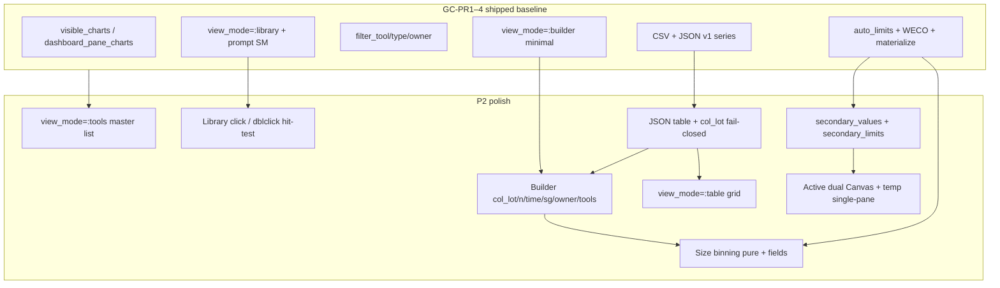
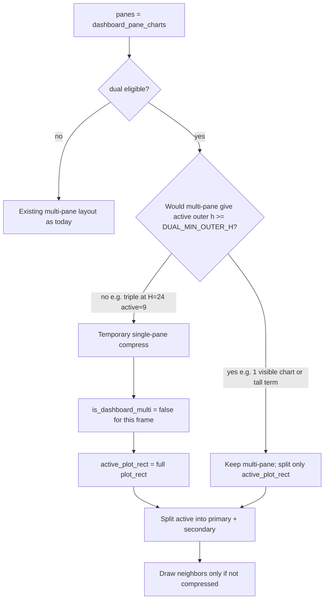
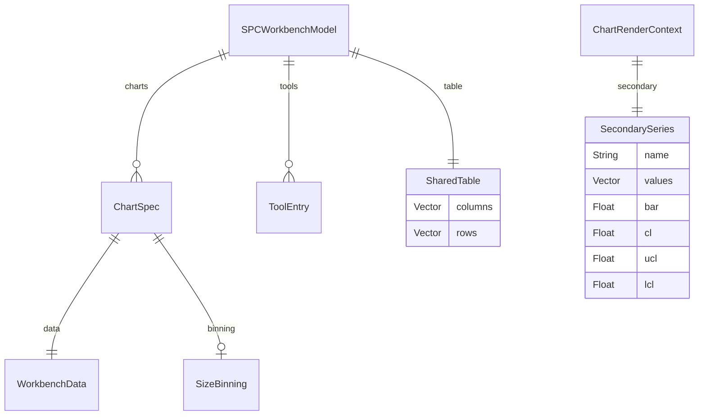
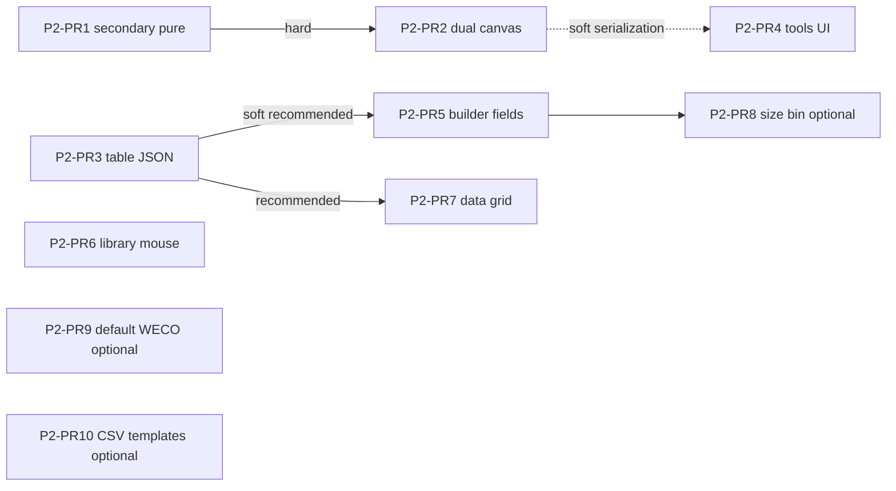

# SPC Workbench P2 Polish Plan

| Field | Value |
|-------|--------|
| **Document** | SPC Workbench P2 Polish — post gap-closure |
| **Author** | (design skill) |
| **Date** | 2026-07-10 |
| **Status** | Final (rev 3 — open questions locked; ready to implement) |
| **Baseline** | `master` with GC-PR1–4 shipped (do not re-plan gap-closure) |
| **Primary code** | `src/spc_workbench.jl` (~4151 LOC), `src/spc_workbench_io.jl` (~1288 LOC) |
| **Tests** | `test/test_spc_workbench.jl` (~4122 LOC) |
| **HTML reference** | `SPC_workbench_2026-06-18-20-46.html` |
| **Prior docs** | `design-spc-html-gap-analysis.md`, `design-spc-html-parity-plan.md`, `design-spc-gap-closure-plan.md` |

---

## Overview

GC-PR1–4 closed the product shell: filter-aware `visible_charts` / `dashboard_pane_charts`, library mode with prompt SM + CRUD + CSV/JSON I/O, and tool/type/owner filters. The workbench is now a usable multi-chart TUI with typed series math (I-MR, X̄-R/S, p/np/c/u), SharedTable materialize, builder, WECO, and HTML archive load.

What remains is **operator polish and deeper HTML→TUI parity** that was deliberately deferred: dual secondary Canvas (MR / R / s under the primary plot), tools registry product UI, SharedTable session persistence, richer builder/grid editing, library mouse chrome, size binning, global default-WECO, and sample CSV templates. This design ranks those items by fab value and TUI feasibility, specifies concrete interfaces grounded in **current master** line evidence, and proposes a **linear stack of small PRs** so each slice can merge independently without parallel conflict hell on `spc_workbench.jl`.

**Rev 2** hardens dual-canvas height policy (temporary single-pane compress under multi-pane math), secondary Viewport isolation, draw-helper extraction, library mouse hit-test geometry, and SharedTable JSON fail-closed contracts — so P2-PR2/PR3/PR6 are implementable without inventing structure mid-PR.

**Rev 3** locks remaining open questions (user): dashboard `d`/`D` → table grid; size binning optional late PR8/backlog only; `add_chart!` seeds from `m.default_rules` when PR9 lands (demos keep explicit rules).

---

## Background & Motivation

### Current state (master — shipped, OUT of redesign)

| Capability | Evidence |
|------------|----------|
| Active-neighborhood panes | `visible_charts` L1935–1948; `dashboard_pane_charts` L2083–2091; view L3053–3073 |
| Layout chrome | Vertical: header 1 + main Fill + gauge 3 + footer 1 (L3037–3044); multi 3-pane `h1 = max(8, (plot_rect.height * 5) ÷ 10)` (L3063–3067) |
| Library mode + prompt SM | Model L1645–1655; open `m`/`M` L2791–2798; library keys L2688–2780; render L3758–3837 |
| Library I/O | `_apply_prompt!` L2383+; `import_csv_*` / `export_csv_series` / `save_workbench` / `load_workbench!` in `spc_workbench_io.jl` |
| Filters f/F | `filter_tool`/`filter_type`/`filter_owner` L1663–1667; setters L1965–2011; GC-PR4 tests incl. anti-port of `:tools` mode ~L2839–2842 |
| Secondary **stats only** | `ChartRenderContext.secondary_name` / `secondary_bar` L921–923; `_primary_and_secondary` L1088–1116; side panel L3536–3549 |
| Dual canvas deferred comments | L921–922, L1084, L3536, L3881 |
| Tools data, no UI | `ToolEntry` L1602–1605; `m.tools` L1660; JSON tools L418–432, L714–719; **no** `view_mode=:tools` render |
| Library mouse stubs | `library_area` / `library_last_click` L1647–1648; mouse early-return on `:library` L2922–2932; render sets `library_area = area` full page L3759 |
| SharedTable not in JSON | `workbench_to_dict` docstring L704–708; table never written; `_parse_workbench_dict` / `_apply_parsed!` have no `table` (L649–693) |
| HTML load already applies table | `_apply_html_parsed!` sets `m.table` (io ~L1161) — pattern to mirror for JSON |
| `col_lot` HTML-only round-trip gap | HTML load sets `col_lot` (io ~L1075/L1101); schema v1 `_chart_to_dict` / `_chart_from_dict` **omit** `col_lot` (io L450–482, L559–591) |
| Builder minimal fields | `BUILDER_FIELDS` L2098–2100 — no `col_lot`, `col_n`, `col_time`, `subgroup_size`, `owner` |
| Visual prefs surface | `DEFAULT_VISUAL_PREFS` / `VISUAL_PREF_KEYS` / `VISUAL_PREF_LABELS` L503–509; Visual tab uses keys+labels (~L3130–3138); JSON wholesale L644/L722 |
| `view_mode=:focused` | Listed in comment L1649; unused; gap-closure non-goal (KD20) |

### Multi-pane height math (why dual needs a layout policy)

Assume Block chrome ≈ 2 rows (title border). Vertical chrome: header 1 + gauge 3 + footer 1 = 5; main = `H − 5`. Side takes Fixed(28); plot gets the rest of main width.

| Terminal H | main ≈ | 3-pane active outer `h1` | 2-pane active outer | 1-pane full plot |
|------------|--------|---------------------------|---------------------|------------------|
| 24 (typical TestBackend) | 19 | `max(8, 9) = 9` | `max(6, 11) = 11` | 19 |
| 30 | 25 | 12 | 15 | 25 |
| 40 | 35 | 17 | 21 | 35 |

A naive gate `active_plot_rect.height >= 14` is **always false** for default `:triple` at H=24 (active ≈ 9). Dual would never show under the common multi-pane path. **Rev 2 locks temporary single-pane compress** when dual is eligible and multi-pane would starve the split (KD-P2-15). This is **not** permanent `view_mode=:focused` (KD20 / KD-P2-10).

### Pain points for operators

1. **Process variation is invisible as a series.** Side panel shows R̄ / s̄ / MR̄ scalars; HTML draws a second SVG with secondary control limits (MR UCL = 3.267·MR̄; R/s use D3/D4/B3/B4 — HTML `autoLimits` ~2433–2465). Fab engineers diagnose range/MR spikes that do not appear on X̄ alone.
2. **Tools registry is load/save only; chart tool assignment is separate.** Filters match **`ch.tools`** (per-chart ids, `visible_charts` / `_chart_matches_filters`), not `m.tools` alone. Demos often have empty `ch.tools`; registry UI alone does not assign tools onto charts. Builder already has a `tools` CSV field — registry is the master list; assignment stays builder (and optional later library action).
3. **Save/load loses SharedTable.** After JSON round-trip, builder rematerialize sees empty `m.table` even though chart series values remain (known v1 limit).
4. **Builder cannot set X̄ group columns.** `col_lot` / `subgroup_size` exist on `ChartSpec` and pure materialize (PR7b) works in tests, but the form never exposes them.
5. **Library is keyboard-only.** Mouse is fully gated; double-click-to-activate is the natural TUI expectation once lists exist.

### What this is *not*

This is **not** GC-PR5. Gap-closure product shell is done. Pure attribute/X̄ math is green and must not be re-opened except where secondary *limits* or size-binning *extend* pure APIs additively.

---

## Goals & Non-Goals

### Goals

1. Ship dual secondary Canvas for I-MR / X̄-R / X̄-S on the **active** plot with secondary control limits matching HTML — **visible under default triple demos at typical terminal sizes** via temporary single-pane compress when needed.
2. Persist `SharedTable` (and missing chart maps such as `col_lot`) as **optional JSON v1 fields** with a full fail-closed parse contract.
3. Provide a dedicated **tools registry** product surface (`view_mode=:tools`) with id/description CRUD on `m.tools` (master list for filters/prompts; chart assignment remains builder `tools` field).
4. Expand builder (and optionally a light data grid) so operators can map columns and inspect SharedTable without leaving the TUI.
5. Complete library mouse chrome with **explicit hit-test geometry** against current library render + scroll/`visible_charts`.
6. Optionally (after core PR1–7): size binning pure path + builder (PR8 backlog); global default-WECO editor (PR9, `add_chart!` seeds `m.default_rules`); branded blank CSV sample files.
7. Keep slices **small, linear, independently reviewable**; red-first TestBackend for behavioral UI.

### Non-Goals (locked)

| Item | Rationale |
|------|-----------|
| Excel / XLSX | Product decision; CSV + JSON only |
| Admin password / passcodes / multi-user auth | Explicit non-goal |
| Self-modifying HTML / “Download copy” | Web-only |
| Flipping `seed_demos` default from `:triple` | Forbidden by AGENTS.md / prior KDs |
| Modifying `src/spc.jl` classic app | Separate product |
| Re-litigating GC-PR1–4 or pure math already green | Baseline is shipped |
| Dual SVG zone-fill fidelity / multi-card dual on all panes | Terminal height; active dual only |
| Permanent `view_mode=:focused` / library-Enter focused | KD20; temporary compress is layout-only (KD-P2-15) |
| Auto-rematerialize charts on JSON/HTML load | Load must not wipe series; rematerialize stays explicit (builder apply / grid exit) |
| RFC4180 CSV / full spreadsheet editor | Out of scope |

---

## Priority ranking (operator value × TUI feasibility)

| Rank | Item | Value | Feasibility | Recommendation |
|------|------|-------|-------------|----------------|
| **1** | Dual secondary Canvas | **High** — process variation diagnostic | High — series already computed; layout policy locked | **Ship first** (pure series + limits, then render) |
| **2** | SharedTable + `col_lot` in JSON | **High** — session integrity | High — mostly `spc_workbench_io.jl` | **Ship early** (low UI conflict) |
| **3** | Tools registry product UI | **Medium–High** — master list for tool ids | Medium — new mode + keys + tests | **Ship mid-stack** (does not alone assign `ch.tools`) |
| **4** | Builder field expansion | **High** — unlocks PR7b / attributes + tool assign UI | High — extend existing builder | **Ship after schema** so maps survive save |
| **5** | Library mouse chrome | **Medium** — UX polish | High — stubs exist; geometry now specified | **Ship when UI-focused** |
| **6** | Data grid (read + light edit) | **Medium** — table inspect | Medium — new mode, size limits | **Ship after builder** |
| **7** | Size binning | **Medium-niche** — particle/defect fab | Medium — pure first, then builder | **Optional late PR8 / backlog only** — after dual, table JSON, tools, builder, mouse, grid |
| **8** | Global default-WECO editor | **Low–medium** — clone/new-chart seed | High — small | **Optional late** |
| **9** | Branded CSV templates | **Low** — onboarding | Trivial — fixtures only | **Optional anytime** (no app risk) |
| **—** | `view_mode=:focused` | Low | Easy but policy conflict | **Drop** (non-goal; comment cleanup only) |

---

## Proposed Design

### Architecture after P2



### Design principles

1. **Reuse pure helpers; wire UI last.** Secondary series already exist inside `_primary_and_secondary` / materialize meta — expose them, do not rewrite auto_limits primary math.
2. **Active dual only; temporary single-pane compress when multi-pane starves height** (KD-P2-15). Neighbors stay single-series when drawn; never dual on neighbor panes.
3. **Secondary Viewport is ephemeral and never wired to mouse** (KD-P2-16). `m.plot_area` / `m.viewport` remain primary-only.
4. **Schema is additive under version 1.** Optional keys; malformed `table` fails the whole parse atomically.
5. **Linear PR stack** on `spc_workbench.jl`; pure/io PRs can interleave with lower conflict. Soft deps = merge serialization only.
6. **Live remains `g`/`G` only** (`L` = LSL). Mode keys must not steal live keys.
7. **Test anti-ports update deliberately.** GC-PR4 asserts `view_mode != :tools` (~test L2839–2842). P2 tools PR **replaces** that anti-port with positive tools-mode tests.

### New-mode acceptance checklist (every mode-adding PR)

Any PR that introduces `view_mode` ∈ {`:tools`, `:table`} (and dual is not a mode but still touches view) must update **all** of:

1. `view` dispatch (~L3022–3033) — dedicated render branch; no dashboard bleed
2. `_live_may_advance` (L4002) — mode blocks live
3. `update!(MouseEvent)` early-return (L2922–2925) — modal keyboard-first (library is special: hit-test only)
4. Help page strings (`_render_help_page!`)
5. Keymap page strings (`_render_keymap_page!`)
6. Footer / header status if keys are advertised there
7. Docs `docs/src/spc-workbench.md`

---

### 1. Dual secondary Canvas

#### Problem

`_primary_and_secondary` returns only `(primary, secondary_name, secondary_bar)` — the **mean** of the secondary series, not the point series (L1088–1116). Render context L914–924 stores scalars only. Side panel prints `Rbar`/`sbar`/`MRbar` (L3536–3549).

HTML emits full secondary series + secondary limits and a second SVG (`renderChartCard` ~2733–2768; `autoLimits` secondary block ~2447–2465).

#### Pure layer (no Tachikoma)

Extend the resolver surface **additively**:

```julia
struct SecondarySeries
    name::String                 # "MR" | "R" | "s" | ""
    values::Vector{Float64}      # aligned for plot; I-MR: length n-1 (no leading null)
    bar::Union{Float64,Nothing}  # mean of values (same as today's secondary_bar)
    cl::Union{Float64,Nothing}
    ucl::Union{Float64,Nothing}
    lcl::Union{Float64,Nothing}
end

# ChartRenderContext gains (keep secondary_name / secondary_bar for compat):
#   secondary::SecondarySeries
```

**Computation rules** (match HTML + existing TUI math):

| Type | Secondary values | Secondary limits |
|------|------------------|------------------|
| `I_MR` | `abs.(diff(primary))` — length `n-1` (drop HTML's leading null) | `cl = MRbar`, `ucl = SS_FACTORS[2].D4 * MRbar` (= 3.267·MR̄), `lcl = 0` |
| `Xbar_R` | per-subgroup R (series-chunk or `meta["secondary_vals"]`) | `cl = R̄`, `ucl = D4(n)·R̄`, `lcl = D3(n)·R̄` |
| `Xbar_S` | per-subgroup s | `cl = s̄`, `ucl = B4(n)·s̄`, `lcl = B3(n)·s̄` |
| attributes | empty `values`, `name=""` | all `nothing` |

Implement as pure:

```julia
function secondary_series_for(ch::ChartSpec, primary::Vector{Float64})::SecondarySeries
```

Refactor `_primary_and_secondary` to call it (or replace call sites) so bar/name stay consistent. **Do not** change primary WECO / Cpk paths.

##### SecondarySeries truth table (pure — P2-PR1 acceptance)

| Case | `values` | `bar` | `cl`/`ucl`/`lcl` | Notes |
|------|----------|-------|------------------|-------|
| I_MR, `n ≥ 2` | length `n-1` MRs | mean(MR) | MR̄, D4₂·MR̄, 0 | HTML parity |
| I_MR, `n < 2` | `[]` | `nothing` | all `nothing` | **not** 0/0/0 |
| Xbar_R/S series-chunk, complete groups | length = n_sg | mean | D3/D4 or B3/B4 for effective n | Incomplete tail dropped; lengths match primary subgroups |
| Xbar_R/S `table_subgroups` | `meta["secondary_vals"]` | mean | same factors with `meta["subgroup_n"]` | Do not re-chunk means |
| Xbar empty / no groups | `[]` | `nothing` | all `nothing` | |
| Attribute types | `[]` | `nothing` | all `nothing` | |
| Primary **manual** limits effective | as type | as type | **still auto from secondary series** (MR̄/R̄/s̄ × factors) | Manual CL/UCL/LCL apply to **primary only** (HTML `autoLimits` secondary block independent of manual primary) |
| Secondary bar == 0 | `values` present | 0.0 | cl=0, ucl=0, lcl=0 | Valid degenerate |

WECO and Cpk remain on **primary only**.

#### Dual eligibility and height policy (KD-P2-15)

```julia
function _dual_secondary_eligible(m, ctx)::Bool
    get(m.visual_prefs, "secondary_canvas", true) || return false
    isempty(ctx.secondary.values) && return false
    return true
end

# Minimum outer rect height to host two stacked Blocks:
# primary inner canvas ≥ 6, secondary inner ≥ 4, plus ~2 chrome each ≈ 14 outer.
const DUAL_MIN_OUTER_H = 14
const DUAL_PRIMARY_FRAC = 0.62
```

**Layout algorithm in `view` (before drawing panes):**



| Condition | Layout |
|-----------|--------|
| Dual **not** eligible | Unchanged GC-PR1 multi-pane |
| Dual eligible **and** multi-pane active outer ≥ `DUAL_MIN_OUTER_H` | Keep neighbors; split **only** active outer rect ~62% / ~35% |
| Dual eligible **and** multi-pane would starve (typical `:triple` @ H=24) | **Temporary single-pane compress**: draw **only** active chart (no Chart 2/3 panes this frame); full `plot_rect` becomes active; then split for dual |
| Dual eligible but full plot still &lt; `DUAL_MIN_OUTER_H` (tiny terminal) | Fall back: full primary only + side stats (today) |

**Quantified outcomes at H=24:**

| Scenario | Dual shown? | Neighbors shown? |
|----------|-------------|------------------|
| `:triple`, pref on, I-MR active | **Yes** (compress) | No (this frame) |
| `:triple`, pref **off** | No | Yes (today) |
| Single visible chart (filters or seed), pref on | **Yes** without compress if plot ≥ 14 | N/A |
| `:triple`, H=40, active h1 ≥ 14 | **Yes** + neighbors | Yes |

**Not** permanent focused mode: `[`/`]` still cycle active; next frame recomputes compress; library Enter still → dashboard (KD20). No `view_mode=:focused`.

**Acceptance tests (P2-PR2):**

1. TestBackend **90×24**, default triple seed, active=1 I-MR, pref on → secondary title text present (e.g. `MR`); **no** requirement that Chart 2/3 titles appear in the same frame.
2. Same geometry, pref off → no secondary title; Chart 2 title present (existing multi-pane contract).
3. Active=2 with pref off → still no charts[2] duplicate regression (GC-PR1).
4. After dual render path, primary hover index / `m.viewport` Y range match single-canvas baseline for same data (viewport isolation).

#### Secondary Viewport isolation (KD-P2-16)

| Object | Ownership | Mouse / pan / zoom |
|--------|-----------|--------------------|
| `m.viewport` | **Primary only** | Yes |
| `m.plot_area` | **Primary plot_inner only** (set after primary Block, never secondary) | Yes (existing hover/drag) |
| Secondary `Viewport` | **Local/ephemeral** stack variable in `view` (or pure helper return) — **not** a model field required for v1 | **No** — display only |
| Secondary fit | `auto_fit_viewport_y!` (or equivalent) on the **local** Viewport with secondary values + secondary UCL/LCL | Must **not** call fit on `m.viewport` |

X mapping:

- X̄-R/S: secondary index domain 1..n_sg (same as primary subgroups).
- I-MR: plot MR points at primary indices **`2:n`** (lock; OQ1 closed) so crosshair correlation is natural; secondary Viewport `x0/x1` may still be 1..n-1 internally if the draw helper maps by parallel arrays — document in helper that values[i] pairs with primary index i+1.

#### Draw strategy (extract helper — KD-P2-17)

Active plot drawing today is a large inline block (~L3156+). **P2-PR2 must extract** before dual copy-paste:

```julia
"""
Draw one series into `outer` Rect: Block(title) + Canvas + connectors + limit lines.
Does not set m.plot_area / m.viewport unless `bind_mouse=true` (primary only).
"""
function _render_series_canvas!(
    buf, outer::Rect, m::SPCWorkbenchModel;
    title::AbstractString,
    values::AbstractVector{<:Real},
    viewport::Viewport,          # caller-owned; primary uses m.viewport
    cl, ucl, lcl,                # horizontal limit lines (secondary: SecondarySeries cl/ucl/lcl)
    extras...;                   # optional: zones, specs, WECO markers, hover — primary only
    bind_mouse::Bool = false,
    draw_weco_markers::Bool = false,
    draw_specs::Bool = false,
    draw_sigma_zones::Bool = false,
)::Rect  # returns plot_inner
```

| Concern | Primary | Secondary |
|---------|---------|-----------|
| Helper | `_render_series_canvas!` | same helper |
| Title | chart name / type (existing) | `"MR (secondary)"` / `"R (secondary)"` / `"s (secondary)"` |
| Prefs | solid/braille from `m.visual_prefs` | **same** solid/braille prefs |
| WECO markers ◆ | yes | **no** |
| OOS / specs USL/LSL | yes if shown | **no** |
| ±1/2σ zones | per `show_chart_lines` | **no** (only CL/UCL/LCL of secondary) |
| Hover / crosshair | yes | **no** |
| `bind_mouse` | true → sets `m.plot_area` | false |

**Block structure (locked):** **two stacked Blocks** inside `active_plot_rect` (not one outer Block with two bare canvases):

```
active_plot_rect
├── primary_outer  height ≈ 62%  → Block(title=chart) → canvas
└── secondary_outer height ≈ 35% → Block(title=MR/R/s) → canvas
```

Min after chrome: primary outer ≥ 8 (inner canvas ≥ 6); secondary outer ≥ 6 (inner ≥ 4). If split cannot satisfy both after compress, degrade to primary-only.

Neighbor panes (when not compressed) continue to use existing single-series draw path (may later call the same helper with `bind_mouse=false`).

#### Visual prefs integration (complete)

Extend all three surfaces in P2-PR2:

```julia
# VISUAL_PREF_KEYS order (append):
"secondary_canvas"

# VISUAL_PREF_LABELS:
"secondary_canvas" => "Secondary canvas (MR/R/s)"

# DEFAULT_VISUAL_PREFS:
"secondary_canvas" => true
```

- Config Visual tab (`o`) lists the new row; digit hotkeys remain fine (list grows 3 → 4).
- JSON already round-trips `visual_prefs` wholesale (io L644/L722). **`_bool_dict_from_json` only keeps keys present in defaults** — the new key **must** ship in `DEFAULT_VISUAL_PREFS` or loads drop it.
- Test: toggle off via Visual tab → dual title absent at 90×24 triple (compress also off because not eligible… actually compress only when dual eligible; pref off → multi-pane neighbors return).

#### Key / prefs

- Soft flag is **visual pref only** (no new dashboard letter for dual).
- Help/keymap: dual secondary for I-MR/X̄ when pref on; multi-pane may temporarily hide neighbors to fit dual; toggle in Visual Preferences (`o`).

#### Risks (dual)

| Risk | Severity | Mitigation |
|------|----------|------------|
| Dual off under default multi-pane | **High** (was understated) | Temporary single-pane compress (KD-P2-15); acceptance @ 90×24 |
| Clobber primary viewport Y via secondary fit | **High** | Ephemeral secondary Viewport (KD-P2-16); tests |
| Copy-paste 200-line draw block | **High** | Mandatory `_render_series_canvas!` extraction (KD-P2-17) |
| I-MR length n-1 vs primary n | Med | Indices `2:n`; pure tests |
| Context struct change breaks tests | Low | Keep `secondary_name`/`secondary_bar` |

---

### 2. SharedTable + schema completeness (JSON)

#### Problem

`workbench_to_dict` documents that `m.table` is **not** persisted (io L704–708). Charts keep copy-on-map `values`, so plots survive, but:

- `materialize_chart_from_table!` after load rematerializes from empty table → **wipes series** if someone rematerializes naively.
- `col_lot` is not written/read in schema v1 (`_chart_to_dict` L450–482; `_chart_from_dict` L559–591) even though HTML archive path sets it (io ~L1075).
- JSON load path has **no** `table` on the parse NamedTuple; HTML path already does `m.table = parsed.table` (~L1161) — **mirror that pattern**.

#### Schema policy

**Stay on `version: 1` with optional additive keys** (no forced bump):

```json
{
  "version": 1,
  "active": 1,
  "charts": [ /* ... + optional col_lot */ ],
  "tools": [],
  "table": {
    "columns": ["Timestamp", "Tool", "Value", "Lot"],
    "rows": [
      {"Timestamp": "...", "Tool": "T1", "Value": "100.1", "Lot": "L1"}
    ]
  }
}
```

| Key | Required | Load if missing / null |
|-----|----------|------------------------|
| `table` | no | `SharedTable()` empty |
| `charts[].col_lot` | no | `""` |
| existing v1 keys | unchanged | unchanged |

Unknown **extra root keys** ignored (same as today).

#### `_table_from_json` / `_table_to_dict` contract (fail closed)

```julia
const TABLE_JSON_MAX_ROWS = 50_000  # mirror CSV max_rows

function _table_from_json(v)::Union{SharedTable,String}
    # v === nothing → SharedTable()  (caller may skip call)
    # else must be AbstractDict
    # columns: required if table present? → if key "columns" missing, treat as String[]
    # columns must be AbstractVector of strings (or stringifiable); else error
    # rows: AbstractVector; each element AbstractDict
    # every cell: coerce via string rule (see below); non-scalar → error string
    # length(rows) > TABLE_JSON_MAX_ROWS → "table too large: …"
    # return SharedTable(columns=…, rows=Vector{Dict{String,String}})
end

function _cell_to_string(x)::Union{String,String}  # value or error
    # nothing → ""
    # AbstractString → String(x)
    # Real / Bool → string(x)   (match HTML _html_cell_to_string spirit)
    # other → error "table cell not scalar"
end
```

**Validation matrix:**

| Input | Result |
|-------|--------|
| no `table` key | empty `SharedTable()` |
| `table: null` | empty `SharedTable()` |
| `table: "x"` | **error** `"table must be an object"` — whole workbench parse fails |
| `columns` not array | error |
| `columns[i]` not string-ish | error |
| `rows` not array | error |
| `rows[i]` not object | error |
| cell array/object | error |
| rows &gt; 50_000 | error |
| row missing some column keys | OK — missing → `""` when materializing / store only present keys; on load fill `get(row, col, "")` at materialize time (store as provided Dict) |
| extra keys in row not in columns | OK — keep or drop; **lock: keep** as extra dict keys (compute_chart_series uses col names) |

#### Atomic parse + apply

1. `_parse_workbench_dict` validates charts **and** table **before** returning NamedTuple. Include `table::SharedTable` in the NamedTuple (mirror HTML parse).
2. On any error string, **no** mutation of model (`load_workbench!` / `workbench_from_dict!` fail closed — existing pattern).
3. `_apply_parsed!` sets `m.table = parsed.table` **only after** full success — same as charts/tools.
4. **Explicit non-goal:** do **not** auto-`materialize_chart_from_table!` on load. Series `values` in JSON remain display source of truth; table is available for later builder rematerialize.

#### Write policy (KD-P2-18)

- `workbench_to_dict`: include `"table"` **only when** `!isempty(m.table.columns) || !isempty(m.table.rows)`. **Omit** empty table key to keep fixtures small.
- Always write `col_lot` on each chart (even `""`) for symmetry with other `col_*` fields already always written.

Also add `col_lot` to `_chart_to_dict` / `_chart_from_dict`.

**Do not** persist full `WorkbenchData.meta` bag — table_subgroups meta is re-derived by materialize.

#### Tests (P2-PR3)

1. Old fixture without `table` → load OK, `m.table` empty.
2. New dict with table → load OK; **manual** `materialize_chart_from_table!` after load recovers series from table.
3. `table` wrong type → error string; model charts unchanged on `load_workbench!`.
4. Oversized rows → error.
5. `col_lot` round-trip on chart.
6. Empty table not present in `workbench_to_dict` keys (omit policy).

#### Migration / compatibility

- Old files without `table`: load as today.
- New files with `table`: builder rematerialize works when user applies builder.
- Filters remain session-ephemeral (`_clear_load_ephemerals!` L673–678).

---

### 3. Tools registry product UI

#### Problem

`ToolEntry` + `m.tools` + JSON round-trip exist; GC-PR4 deferred UI and tests **forbid** `:tools` mode (test ~L2839–2842). Operators cannot maintain the session tool registry.

**Product outcome (clarified):**

| Layer | Role |
|-------|------|
| `m.tools::Vector{ToolEntry}` | **Master registry** (id + description); JSON `tools` array; filter prompts can suggest ids |
| `ch.tools::Vector{String}` | **Per-chart filter assignment** — what `visible_charts` / materialize tool filter actually match |
| Builder field `:tools` | Existing CSV edit of `ch.tools` — **primary assign path** (expanded PR5 still has it) |

Registry CRUD alone does **not** populate demo `ch.tools`. Ranking “unblocks tool filters” means: operators can define canonical ids, then assign via builder (PR5). Optional Enter action copies registry id into `filter_tool` for filtering charts that already list that id. Seeding demo charts with tool ids is **out of scope** unless a later PR chooses to.

#### Open key (locked)

Dashboard used keys include `p g r z c v o u t l s m f b h k [ ] q` and digits. **`x`/`X` are free.**

| Rejected | Reason |
|----------|--------|
| `t`/`T` | Target edit |
| `r`/`R` | Reset viewport |
| `m`/`M` | Library |
| `c`/`C` | Config |

| **Locked** | **`x` / `X` → `view_mode = :tools`** (toolbox) |
|------------|--------------------------------------------------|

Document in help/keymap. Library may also accept `x` to jump to tools (optional nicety). Product may rename the mnemonic later; key binding is locked unless product explicitly reopens at PR4 review.

#### Tools mode behavior

| Key | Action |
|-----|--------|
| `↑` `↓` | Move `tools_selected` |
| `a` | Add tool (prompt `:tool_add_id` then `:tool_add_desc`, or single `id|desc`) |
| `n` | Edit description of selected |
| `d` then `y` | Delete selected (confirm) — **mode-local**; does not conflict with library `d` or dashboard `d` (table grid) |
| Enter | Set `filter_tool` to selected id + close to dashboard (optional but recommended) |
| Esc / `q` | Close → dashboard (**never quit**) |
| Mouse | Keyboard-first in v1 (modal early-return) |

Model fields:

```julia
tools_selected::Int = 1
tools_scroll::Int = 0
# prompt_kind extends: :tool_add_id | :tool_add_desc | :tool_edit_desc
```

Pure helpers (package-private):

```julia
add_tool!(m, id, desc="")
delete_tool!(m, idx)::Bool
# refuse empty id; strip; unique id (case-sensitive like HTML)
```

Render: full-page list (`TOOLS REGISTRY`), id + description; footer keys.

Apply **new-mode acceptance checklist** (view dispatch, live gate, mouse early-return, help, keymap, docs).

Update GC-PR4 anti-port tests to allow `:tools` when entered intentionally.

---

### 4. Size binning UI

#### HTML behavior (reference)

- Per-chart `binning: {enabled, sizeCol, subgroupCol, bins, selectedBin}` (state ~2100).
- When on: count items per subgroup whose size falls in selected bin; force **c-chart** math (HTML ~2296–2320).
- `parseBins("0-5,5-10,10-")` — intervals; last bin includes upper bound (`rowInBin` ~1948–1954).

#### TUI approach

**Phase A — pure (no UI):**

```julia
@kwdef mutable struct SizeBinning
    enabled::Bool = false
    size_col::String = "Value"
    subgroup_col::String = "Wafer"
    bins::String = ""            # wire form "0-5,5-10"
    selected_bin::String = ""    # label matching parse
end

function parse_size_bins(text::AbstractString)::Vector{NamedTuple{(:label,:lo,:hi),...}}
function row_in_bin(value, bin; is_max_hi::Bool)::Bool
function compute_binned_counts(table::SharedTable, binning::SizeBinning)::Vector{Float64}
```

Hook into `materialize_chart_from_table!` when `binning.enabled`: produce count series; force c-chart math at resolve via `meta["binning_c"]=true` (prefer not silently rewriting `chart_type` unless product wants that).

**Phase B — builder fields:** append binning fields when needed. Off by default.

**JSON:** optional `binning` object on chart; omit when default-disabled.

**Rank / schedule (locked):** optional late **P2-PR8 / backlog only**. Ship dual canvas, table JSON, tools, builder, mouse, and grid first; binning only if capacity remains. Default disposition is defer (KD-P2-9).

---

### 5. Richer multi-column data grid + builder expansion

#### Builder expansion (higher priority than full grid)

Extend `BUILDER_FIELDS` (L2098–2100) to:

```julia
const BUILDER_FIELDS = [
    :name, :chart_type, :col_value, :col_n, :col_tool, :col_time, :col_lot,
    :tools, :owner, :subgroup_size, :limits_mode,
    :manual_cl, :manual_ucl, :manual_lcl,
]
```

Wire `_builder_field_value` / `_builder_apply_buf!` / `BUILDER_FIELD_LABELS` for every new symbol. `subgroup_size` parse Int → `_clamp_subgroup_n`. `y`/`Y` continues to cycle **only** `chart_type` when that field is selected (or global builder shortcut as today). After apply, existing `_builder_apply_and_materialize!` rematerializes when table non-empty.

**PR5 tests must cover:**

| Field | Assert |
|-------|--------|
| `col_lot` | apply + materialize Xbar table path (PR7b) |
| `col_n` | string stored on chart |
| `col_time` | string stored |
| `subgroup_size` | clamp 2..25; invalid keeps prior |
| `owner` | string; filter_owner match |
| JSON | after PR3, `col_lot` survives save/load |

Show table summary line (already L3964–3968).

#### Data grid (`view_mode=:table`)

**Goal:** inspect SharedTable; light cell edit — **not** Excel.

| Aspect | Design |
|--------|--------|
| Open | **Dashboard `d`/`D` → `view_mode=:table`** (**locked**, KD-P2-20). Mode-gated: library `d` = delete chart; tools `d` = delete tool; only dashboard opens the grid |
| Layout | Header columns truncated; rows windowed (`table_scroll_row`, `table_scroll_col`) |
| Nav | Arrows move cell; PgUp/PgDn page |
| Edit | Enter starts cell edit into prompt buffer; Enter commits to `m.table.rows[r][col]` as String |
| Safety | Max render 50 cols × window rows; warn if empty table |
| Exit | Esc/q → dashboard |
| Rematerialize | Explicit key on grid (e.g. `m` conflict — use `r` rematerialize active) or on exit confirm — **never** implicit on load |

Apply **new-mode acceptance checklist**.

**Out of scope:** sorting, formulas, insert column UI.

---

### 6. Library mouse chrome (hit-test geometry)

#### Current render geometry (master)

`_render_library_page!` (L3758–3837):

- `m.library_area = area` — **full page**, not list-only.
- Title at `area.y`.
- Summary at approximately `area.y + 2`, then blank → **list starts at `list_top = area.y + 4`** (title + blank + summary + blank pattern in code: y = area.y+2 for summary, y += 2 before list → list_top = area.y+4).
- `list_bottom = bottom(area) - 4`; `capacity = max(1, list_bottom - y + 1)`.
- Rows: `visible_charts` window `[library_scroll+1, library_scroll+capacity]`; each row shows **absolute** index via id lookup into `m.charts`.
- Footer/prompt occupy bottom ~3–4 rows.

#### Hit-test algorithm (locked — KD-P2-19)

```julia
function _library_row_at(m, x, y)::Union{Nothing,Int}
    # Returns absolute index into m.charts, or nothing
    m.prompt_kind !== nothing && return nothing
    m.pending_delete && return nothing

    a = m.library_area
    # Optionally require contains(a, x, y); full page is a
    list_top = a.y + 4          # must match render
    list_bottom = bottom(a) - 4
    capacity = max(1, list_bottom - list_top + 1)
    (y < list_top || y > list_bottom) && return nothing

    vis = visible_charts(m)
    isempty(vis) && return nothing

    vi = m.library_scroll + (y - list_top) + 1   # 1-based index into vis
    (vi < 1 || vi > length(vis)) && return nothing

    abs_i = findfirst(c -> c.id == vis[vi].id, m.charts)
    return abs_i  # may be nothing if race; treat as nothing
end
```

**Optional hygiene:** also set `m.library_list_rect` during render to the exact list Rect so hit-test does not hardcode `+4`; if so, hit-test uses that rect. Either hardcode matching render constants **or** store list rect — pick one in PR6 and test both scroll positions.

#### Click / double-click

| Event | Behavior |
|-------|----------|
| Left press/release on list row | `library_selected = abs_i`; `_sync_library_scroll_vis!`; `last_event = "library sel N"` |
| Second left press on **same** abs_i with `m.tick - last.tick ≤ LIBRARY_DBLCLICK_TICKS` (lock **8** ticks) | `set_active_chart!(m, abs_i)`; `view_mode = :dashboard`; clear `library_last_click` |
| Second press on **different** row | Treat as new single select; reset `library_last_click` |
| Click outside list (header/footer/prompt) | no-op (still consume mouse; no dashboard pan) |
| Scroll wheel over list | optional: adjust `library_scroll` (nice-to-have) |

```julia
library_last_click::Union{Nothing, NamedTuple{(:idx, :tick), Tuple{Int,Int}}}
# idx = absolute chart index; tick = m.tick at click time
const LIBRARY_DBLCLICK_TICKS = 8
```

**Tick caveat:** `m.tick` advances in `view` (L2995), not in `update!(MouseEvent)`. Tests **must** re-`view` (or manually bump tick) between clicks so Δtick is defined. Document in PR6 test helpers.

**Mouse path structure:** when `view_mode == :library`, do **not** blanket-return before hit-test; handle library mouse then return. Other modals (prompt/pending_delete/help/…) keep keyboard-only early-return. When `prompt_kind` or `pending_delete` in library, ignore mouse for selection (keyboard-only).

#### Tests (P2-PR6)

1. Click row → `library_selected` absolute index correct under filters.
2. Double-click (with re-view between) → active set + dashboard.
3. Click footer / title → selection unchanged.
4. Filtered list: visible row 1 maps to correct non-1 absolute index.
5. Prompt open → click no-op on selection.

---

### 7. Related deferred items

#### Global default-WECO editor

Today:

- `DEFAULT_WECO_RULES` const seeds new charts (`add_chart!` L1783).
- `m.enabled_rules` is **legacy mirror of active chart** + JSON `default_rules` maps to `m.enabled_rules` (io L638–639, L686, L720) — **not** a true session default distinct from active.
- Per-chart rules edited via config `c` on active.

**Design (PR9, optional):** introduce explicit `default_rules::Dict{String,Bool}` on the model; JSON `default_rules` ↔ `m.default_rules`.

**`add_chart!` seeding (locked, KD-P2-21):** once `m.default_rules` exists, `add_chart!` copies **`m.default_rules`** into the new chart’s `enabled_rules` (not the module const). Seed demos / `_ensure_charts!` keep **explicit** per-chart rules as today (do not rewrite demo rule maps to session defaults). Until PR9 lands, `add_chart!` continues to use `copy(DEFAULT_WECO_RULES)`.

Config tab `:defaults` optional for editing session defaults without forcing active chart. Rank: after core P2; optional.

#### Branded blank CSV templates

- `test/fixtures/spc/` or `share/spc/templates/`: generic / tool / size-bin headers.
- Document in `docs/src/spc-workbench.md`. No Excel. Zero-risk anytime PR.

#### `view_mode=:focused`

**Leave non-goal.** Temporary single-pane compress (KD-P2-15) is layout-only and does not set `view_mode=:focused`. Library Enter → dashboard (KD20). Optional comment cleanup on L1649.

---

## API / Interface Changes

### Pure / model (additive)

| Symbol | Change |
|--------|--------|
| `SecondarySeries` | New struct |
| `secondary_series_for` / extended resolver | New pure API; export for tests |
| `ChartRenderContext` | Add `secondary::SecondarySeries`; keep name/bar fields |
| `_render_series_canvas!` | Extracted draw helper (primary + secondary) |
| `_dual_secondary_eligible` / layout compress | View-local helpers |
| `DEFAULT_VISUAL_PREFS` + `VISUAL_PREF_KEYS` + `VISUAL_PREF_LABELS` | `"secondary_canvas"` |
| `ChartSpec.binning` | Optional late |
| `SPCWorkbenchModel.default_rules` | Optional late |
| `SPCWorkbenchModel.tools_selected` | Tools mode |
| `view_mode` | May be `:tools`, `:table` |
| `prompt_kind` | Tool prompts; table cell edit optional |
| `_library_row_at` | Library mouse hit-test |

### I/O

| Symbol | Change |
|--------|--------|
| `_table_from_json` / `_table_to_dict` | Fail-closed SharedTable |
| `workbench_to_dict` | Emit `table` only if non-empty; chart `col_lot` always |
| `_parse_workbench_dict` | NamedTuple includes `table`; atomic fail |
| `_apply_parsed!` | `m.table = parsed.table`; **no** rematerialize |
| `_chart_to_dict` / `_chart_from_dict` | `col_lot`; later `binning` |

### UI entry points

| Mode | Open | Close |
|------|------|-------|
| Dual canvas | automatic when eligible (+ compress if needed) | pref off or no secondary |
| `:tools` | `x`/`X` dashboard | Esc/q |
| `:table` | `d`/`D` dashboard | Esc/q |
| Library mouse | click list rows in library | n/a |

### Before / after (secondary)

**Before:** side `MRbar=4.24` only; multi-pane always shows neighbors.  
**After:** active plot shows individuals + MR series with UCL≈3.267·MR̄; at H=24 triple, neighbors temporarily hidden while dual shows; side stats unchanged; `m.viewport` primary Y unchanged by secondary fit.

---

## Data Model Changes



### Migration strategy

1. Optional JSON keys — no forced version bump for table/col_lot.
2. Empty table omitted on write (KD-P2-18).
3. If `default_rules` field splits from `m.enabled_rules`, load path sets `default_rules` from JSON and leaves per-chart rules from chart objects.
4. Visual pref default true — tests that require multi-pane neighbor titles at H=24 with dual-eligible charts must set pref off **or** assert compress behavior.

### Storage estimates

| Artifact | Size order |
|----------|------------|
| Triple demo JSON | ~few KB |
| SharedTable 10k rows × 8 cols | ~1–5 MB text JSON — OK; enforce max_rows 50_000 |
| Secondary series | O(n) floats in memory only (not JSON) |

---

## Alternatives Considered

### A. Dual canvas as separate `view_mode=:secondary` page

- **Pros:** No height fight with multi-pane.  
- **Cons:** Extra navigation; HTML is in-card dual; operators want simultaneous view.  
- **Decision:** Reject for primary design; dual under active is the HTML analog.

### B. Schema version bump to 2 for SharedTable

- **Pros:** Clean break; easy reject of partial writers.  
- **Cons:** Forces all loaders to handle two versions; v1 already ignores unknown keys if we only *add*.  
- **Decision:** Prefer optional `table` under version 1; bump only if fail-closed compatibility becomes painful.

### C. Tools as config tab instead of full page

- **Pros:** No new `view_mode`; fewer live/mouse gates.  
- **Cons:** Config is WECO/lines/visual; tools CRUD with prompts needs vertical space like library.  
- **Decision:** Full `:tools` page (library-like) for CRUD; filter still uses `f` prompts (GC-PR4 preserved).

### D. Secondary series as overlay on primary Canvas

- **Pros:** One rect.  
- **Cons:** Dual Y scales unreadable in braille; HTML uses separate plot.  
- **Decision:** Reject overlay; stacked dual.

### E. Size binning as standalone c-chart CSV only (no bin UI)

- **Pros:** Zero binning code.  
- **Cons:** Loses HTML particle workflow.  
- **Decision:** Pure API optional; UI last.

### F. Implement permanent focused mode for dual height

- **Pros:** More rows for dual.  
- **Cons:** Conflicts KD20 if library Enter or sticky focused; operators lose neighbor glance permanently.  
- **Decision:** Reject permanent focused; use temporary compress (G) instead.

### G. Temporary single-pane compress while dual is shown (accepted)

- **Pros:** Makes dual visible under default `:triple` @ H=24 without permanent `:focused`; does not change library-Enter semantics; neighbors return when pref off or secondary empty.  
- **Cons:** Loses multi-chart glance while dual is on at short heights; must document in help.  
- **Decision:** **Accept** as KD-P2-15 primary height mitigation (with dual-on-full-plot when already single-pane / tall).

### H. Lower gate only (dual in ~9-row active with tiny secondary)

- **Pros:** Keeps neighbors always.  
- **Cons:** Secondary canvas with outer ~3–4 rows is unreadable; high test flake.  
- **Decision:** Reject as sole strategy; compress preferred; tiny-terminal still degrades to side stats only.

### I. Other tools open keys (`a`, `w`, `e`, …)

- **Pros:** Different mnemonics.  
- **Cons:** Weaker or colliding.  
- **Decision:** Reject; lock `x`/`X`.

---

## Security & Privacy Considerations

| Threat | Mitigation |
|--------|------------|
| JSON/HTML paste with `admins` / passcodes | Already stripped/ignored on load; keep |
| Path prompts write arbitrary files | Existing fail-closed I/O; no change to silent defaults |
| Huge SharedTable in JSON | `TABLE_JSON_MAX_ROWS = 50_000` at parse; fail closed |
| Malformed table partial apply | Atomic parse NamedTuple; apply only on full success |
| Tool id injection into filters | Treat as plain strings; no shell |
| Table cell edit | Strings only; materialize parse floats safely |

No new network surface. No auth.

---

## Observability

| Signal | Mechanism |
|--------|-----------|
| Mode / last action | Footer `last=$(m.last_event) mode=$(m.view_mode)` (existing) |
| Dual on/off | Pref toggle; optional `last_event` on compress `"dual canvas (single-pane)"` |
| Load table | `"loaded … (table N×M)"` optional suffix when non-empty |
| Tools CRUD | `"tool added id=…"`, `"tool deleted"` |
| Fail closed | Existing `"load err:"`, `"import err:"`, `"save err:"` prefixes |

No metrics daemon. TestBackend + suite is the regression gate.

---

## Rollout Plan

1. **Linear PR stack** (see PR Plan) — merge one at a time to master.
2. **Soft flag:** visual pref `secondary_canvas` (default true) + height/compress policy.
3. **Docs:** update `docs/src/spc-workbench.md` per PR that adds keys/schema.
4. **Verification per PR (AGENTS.md):**
   - `julia --project=. test/runtests.jl`
   - `julia --project=. -e 'using TachikomaTUI; TachikomaTUI.hello_tachikoma()'` (and workbench demo if runner available)
   - Red-first TestBackend for UI
5. **Rollback:** revert single PR; schema optional fields keep old loaders working on new files for unknown roots.

---

## Open Questions

All resolved. No open product questions remain for implementation.

1. ~~**I-MR secondary X alignment**~~ — **Locked:** plot at primary indices `2:n`.
2. ~~**Tools open key `x`**~~ — **Locked** (`x`/`X`).
3. ~~**Table grid open key `d`**~~ — **Locked (user):** dashboard `d`/`D` → `view_mode=:table`. Mode-gated so tools/library `d` delete paths stay safe (KD-P2-20).
4. ~~**Schema version**~~ — **Locked:** optional v1 fields, not version 2.
5. ~~**Size binning schedule**~~ — **Locked (user):** optional late **PR8 / backlog only**. Ship dual, table JSON, tools, builder, mouse, grid first; binning only if capacity remains (KD-P2-9).
6. ~~**`add_chart!` + `default_rules`**~~ — **Locked (user):** when PR9 lands and `m.default_rules` exists, `add_chart!` seeds new charts from **`m.default_rules`**. Demos keep explicit rules (KD-P2-21).

---

## Key Decisions

| # | Decision | Rationale |
|---|----------|-----------|
| **KD-P2-1** | Dual secondary Canvas on **active chart only** (never neighbor dual) | Multi-pane height; HTML dual is per-card |
| **KD-P2-2** | Expose full secondary **values + limits** in resolver; keep `secondary_bar` compat | Side stats and Cpk depend on bar; dual needs series; pure tests without UI |
| **KD-P2-3** | Secondary limits match HTML (MR D4₂; R D3/D4; s B3/B4 via `SS_FACTORS`); manual primary does not invent secondary limits | Parity with HTML secondary block; factors L109–134 |
| **KD-P2-4** | SharedTable + `col_lot` as **optional JSON v1 fields** (no forced version bump) | Backward compatible; unblocks rematerialize |
| **KD-P2-5** | Tools registry as **`view_mode=:tools`** (library-like page), not filter-mode creep | GC-PR4 deferred tools away from filters; P2 owns dedicated surface |
| **KD-P2-6** | Dashboard open tools with **`x`/`X`** | Avoid collisions with `t` Target, `r` reset, `m` library, `c` config |
| **KD-P2-7** | Builder field expansion **before** full data grid | Max fab value per LOC; grid is inspect/edit polish |
| **KD-P2-8** | Library mouse: single-click select, double-click activate (Enter equivalent) | Matches stubs `library_last_click`; keyboard remains primary |
| **KD-P2-9** | Size binning = **optional late PR8 / backlog only**; pure-first if shipped | Niche; ship dual→table JSON→tools→builder→mouse→grid first; binning only if capacity remains |
| **KD-P2-10** | Permanent `view_mode=:focused` remains **non-goal** | KD20; height solved by temporary compress not focused mode |
| **KD-P2-11** | Linear PR stack; pure/io slices first when possible | Avoid parallel `spc_workbench.jl` conflict hell |
| **KD-P2-12** | Live stays **`g`/`G` only**; `L` = LSL | Locked product invariant |
| **KD-P2-13** | CSV templates = sample files only, no Excel, no generator UI required | Product non-goal for XLSX |
| **KD-P2-14** | Update GC-PR4 `:tools` anti-port when tools mode ships | Intentional supersession, not accidental regress |
| **KD-P2-15** | **Height policy:** if dual eligible and multi-pane active outer &lt; `DUAL_MIN_OUTER_H` (14), **temporary single-pane compress** for that frame; else split active only; if still too short, primary-only + side stats | Fixes dual-off under `:triple` @ H=24; not permanent focused |
| **KD-P2-16** | Secondary uses **ephemeral local Viewport**; never mutate `m.viewport` for secondary; `m.plot_area` = primary only; secondary not in pan/zoom/hover v1 | Prevents primary Y/hover corruption |
| **KD-P2-17** | Dual render **must** extract `_render_series_canvas!`; two stacked Blocks; secondary CL/UCL/LCL only (no WECO/specs/zones) | Avoid 200-line copy-paste regression |
| **KD-P2-18** | JSON write: **omit empty `table`**; always write chart `col_lot`; load never auto-rematerializes | Small fixtures; fail-closed atomic parse; series values remain SoT on load |
| **KD-P2-19** | Library hit-test mirrors render: `list_top = area.y+4` (or stored list rect), `vi = scroll + (y-list_top)+1` over `visible_charts`, abs via id; dblclick Δtick ≤ 8 with re-view in tests | Implementable geometry; filter-safe indices |
| **KD-P2-20** | Dashboard **`d`/`D` → `view_mode=:table`** (SharedTable grid) | Free on dashboard; library/tools keep mode-local `d` delete; no builder-only entry |
| **KD-P2-21** | When `m.default_rules` exists (PR9), **`add_chart!` copies `m.default_rules`**; demos keep explicit rules | Session defaults apply to new charts only; seeded demos must not silently rewrite |

---

## Risks (summary)

| Risk | Sev | Mitigation |
|------|-----|------------|
| Dual off under multi-pane (active ≈9 @ H=24) | **High** | KD-P2-15 compress; 90×24 acceptance tests |
| Secondary fit clobbers primary viewport | **High** | KD-P2-16 ephemeral Viewport + tests |
| Draw-block copy-paste regressions | **High** | KD-P2-17 helper extraction |
| Schema load regressions / partial apply | Med | Atomic parse; fail closed; no rematerialize on load |
| Keymap overcrowding | Med | Mode-local keys; help/keymap checklist |
| `spc_workbench.jl` merge conflicts | High | Linear PRs; soft deps = serialization only |
| Test flakiness on geometry / dblclick ticks | Med | Fixed 90×24; re-view between clicks; assert text not pixels |
| Registry UI without chart tool assign | Med | Clarify product outcome; builder `:tools` is assign path |
| Rematerialize wiping series | Med | Forbid auto-rematerialize on load |

---

## References

- `design-spc-html-gap-analysis.md` — P2 list (P2.1–P2.7)
- `design-spc-html-parity-plan.md` — implementable architecture; KD16 mouse; KD20 focused; KD25 SharedTable
- `design-spc-gap-closure-plan.md` — GC-PR1–4 shipped baseline; deferred dual/mouse/binning/tools mode
- `SPC_workbench_2026-06-18-20-46.html` — `computeChart`, `autoLimits` secondary, binning, `renderToolsTable`, `TEMPLATE_DEFS`
- `src/spc_workbench.jl` — model, resolver, view, library, builder
- `src/spc_workbench_io.jl` — CSV/JSON/HTML I/O
- `docs/src/spc-workbench.md` — user-facing keys/schema
- `AGENTS.md` — Elm pattern, TestBackend, full suite + app verify, never flip `seed_demos`

---

## PR Plan

Ordered linear stack. Each PR is independently reviewable and mergeable. Prefer **one** primary editor of `spc_workbench.jl` at a time; pure/io PRs may land with lower conflict.

**Dependency labels:** **hard** = technical; **soft** = merge serialization only (conflict avoidance on the same file).

### P2-PR1 — Secondary series pure API + limits

| | |
|--|--|
| **Title** | `spc-workbench: secondary series values + control limits (pure)` |
| **Files** | `src/spc_workbench.jl` (pure section ~L914–1212), `test/test_spc_workbench.jl` |
| **Deps** | None |
| **Description** | Add `SecondarySeries`; truth table cases (empty, manual primary, table_subgroups, attributes); HTML-matching limits via `SS_FACTORS`; plumb through `resolve_chart_render_context` while keeping `secondary_name`/`secondary_bar`. No view change. Red-first pure tests. |

### P2-PR2 — Dual secondary Canvas (active pane)

| | |
|--|--|
| **Title** | `spc-workbench: dual secondary Canvas under active plot` |
| **Files** | `src/spc_workbench.jl` (view L3050–3420 extract helper, visual prefs L503–509, help/keymap), `test/test_spc_workbench.jl`, `docs/src/spc-workbench.md` |
| **Deps** | **Hard:** P2-PR1. **Contingent on KD-P2-15/16/17** (height compress, ephemeral Viewport, `_render_series_canvas!`). |
| **Description** | Implement eligibility + temporary single-pane compress; two stacked Blocks; secondary display-only; VISUAL_PREF_KEYS/LABELS/DEFAULTS for `secondary_canvas`. TestBackend **90×24** triple: dual on with compress; pref off restores neighbors; viewport isolation test. Optional split of PR2 into (2a) layout compress + empty secondary placeholder (2b) series draw if size warrants — only if needed. |

### P2-PR3 — JSON: SharedTable + `col_lot`

| | |
|--|--|
| **Title** | `spc-workbench: persist SharedTable and col_lot in JSON schema v1` |
| **Files** | `src/spc_workbench_io.jl` (primarily), `test/test_spc_workbench.jl`, `docs/src/spc-workbench.md` |
| **Deps** | None (**hard**). **Soft:** serialize after PR2 if both touch docs only — preferably merge early for builder value. |
| **Description** | `_table_from_json` fail-closed contract; NamedTuple + `_apply_parsed!` mirror HTML table apply; omit empty table on write; `col_lot` round-trip; **no** rematerialize on load. Tests: old fixture; good table; bad type; oversized; omit empty. |

### P2-PR4 — Tools registry mode

| | |
|--|--|
| **Title** | `spc-workbench: tools registry view_mode=:tools CRUD` |
| **Files** | `src/spc_workbench.jl` (model, update!, view dispatch, render, live/mouse gates, help/keymap), tests, docs |
| **Deps** | None (**hard**). **Soft:** after PR2 (merge serialization on `spc_workbench.jl` only). |
| **Description** | `view_mode=:tools`, open `x`/`X`, list `m.tools`, add/edit/delete with prompts, Esc closes without quit. New-mode checklist. **Replace** GC-PR4 anti-port with positive tests. Document registry vs `ch.tools` assign via builder. JSON already persists tools. |

### P2-PR5 — Builder field expansion

| | |
|--|--|
| **Title** | `spc-workbench: builder col_lot/col_n/col_time/subgroup_size/owner` |
| **Files** | `src/spc_workbench.jl` (`BUILDER_FIELDS` L2098+, labels, apply, render), tests, docs |
| **Deps** | **Soft/recommended:** P2-PR3 so `col_lot` survives JSON. |
| **Description** | Extend builder form + apply/materialize. Tests for **each** new field + Xbar `col_lot` materialize path. `y` still type-only. No binning yet. |

### P2-PR6 — Library mouse chrome

| | |
|--|--|
| **Title** | `spc-workbench: library click select + double-click activate` |
| **Files** | `src/spc_workbench.jl` (`update!(MouseEvent)`, `_library_row_at`, optional list rect in render), tests |
| **Deps** | None (**hard**). Requires KD-P2-19 geometry (design-complete). |
| **Description** | Hit-test algorithm; single/double click; filtered indices; prompt/pending keyboard-only; re-view tick discipline in tests. |

### P2-PR7 — SharedTable data grid (read + light edit)

| | |
|--|--|
| **Title** | `spc-workbench: SharedTable grid view_mode=:table` |
| **Files** | `src/spc_workbench.jl`, tests, docs |
| **Deps** | **Hard/recommended:** P2-PR3 (meaningful table after load). New-mode checklist. |
| **Description** | Open with dashboard **`d`/`D`** (KD-P2-20). Full-page grid; scroll; cell edit; Esc close; explicit rematerialize; empty-table message. Mode-gated vs library/tools `d`. |

### P2-PR8 — Size binning pure + JSON + builder fields (optional / backlog)

| | |
|--|--|
| **Title** | `spc-workbench: size binning pure path and builder fields` |
| **Files** | `src/spc_workbench.jl`, `src/spc_workbench_io.jl`, tests, docs |
| **Deps** | P2-PR5, P2-PR3 |
| **Description** | **Optional late / backlog only (user lock).** Ship only after PR1–7 if capacity remains; default is defer. Pure-first then builder fields if scheduled. |

### P2-PR9 — Global default-WECO editor (optional)

| | |
|--|--|
| **Title** | `spc-workbench: session default_rules distinct from per-chart` |
| **Files** | `src/spc_workbench.jl`, `src/spc_workbench_io.jl`, tests, docs |
| **Deps** | None |
| **Description** | Optional. Add `m.default_rules`; JSON maps to it. **`add_chart!` seeds from `m.default_rules` (KD-P2-21)**; demos/`_ensure_charts!` keep explicit rules. Config `:defaults` tab optional. |

### P2-PR10 — Branded blank CSV templates (optional)

| | |
|--|--|
| **Title** | `spc-workbench: sample CSV templates (generic/tool/size-bin)` |
| **Files** | fixtures/templates, docs |
| **Deps** | None — **anytime** |
| **Description** | Sample headers only; no app code required. |

### Dependency graph



**Suggested merge order:** PR1 → PR2 → PR3 → PR4 → PR5 → PR6 → PR7 → (PR9, PR10 as capacity allows) → **PR8 only if capacity remains after core**.  
Core track ends at PR7 (grid). PR3 may merge immediately after PR1 if dual canvas is delayed. PR6/PR10 have no hard deps. PR4 soft-after-PR2 is conflict avoidance only.

### Explicitly dropped from P2 track

| Item | Disposition |
|------|-------------|
| Permanent `view_mode=:focused` | Non-goal; temporary compress is layout-only |
| Excel templates | Out forever in this product line |
| Dual canvas on neighbor panes | Out (height) |
| Admin / HTML self-save | Out |
| Auto-rematerialize on load | Out (series values SoT) |

---

*End of design document (Final rev 3 — open questions locked; ready to implement).*
