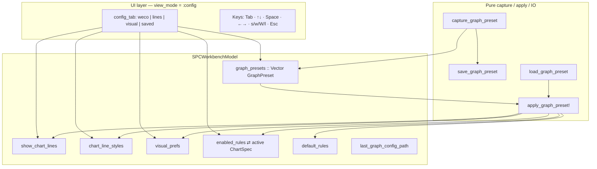
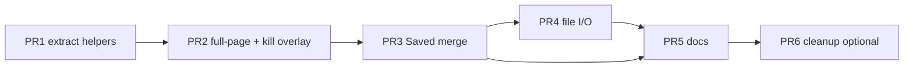

# Design: Unified Config Menu (Rules + Visuals + Save/Load)

| Field | Value |
|-------|-------|
| **Document** | Unified Config Menu for SPC Workbench |
| **Author** | (agent draft) |
| **Date** | 2026-07-13 |
| **Status** | Draft (rev 3 — re-review Issues 1–7 addressed) |
| **Project** | tachikoma-tui (Julia + Tachikoma.jl SPC workbench) |
| **Primary files** | `src/spc_workbench.jl`, `src/spc_workbench_io.jl`, `test/test_spc_workbench.jl`, `docs/src/spc-workbench.md`, `docs/user/workbench.md` |
| **Related** | `design-graph-lines-config-4b12c85d.md` (per-line styles; already landed), graph-presets subsystem, JSON schema v1 |

---

## Overview

Operators currently configure WECO rules, chart-line visibility/styles, and graph visual preferences through **three separate entry points** into one thin overlay (`c` / `v` / `o`), and manage named snapshots of that same set through a **fourth full-page menu** (`e` Graph Presets). Save/load of the graph configuration set is **session-name only** in the TUI; standalone file helpers (`save_graph_preset` / `load_graph_preset`) exist but are not wired to keys.

This design consolidates rules + visuals into a **single Config surface** with four sections (Rules · Lines · Visual · Saved), and promotes **Save config** / **Load config** as first-class actions on that surface—both as named in-session snapshots and as path-based JSON files. The existing `GraphPreset` payload is the config unit; product language shifts to “config” while wire format and `last_event` prefixes stay compatible through first ship.

---

## Background & Motivation

### Current state (as implemented)

#### A. Three-tab config overlay (`config_open`)

| Tab | `config_tab` | Open key | Model fields | Item count |
|-----|--------------|----------|--------------|------------|
| WECO Rules | `:weco` | `c` / `C` | `enabled_rules` (mirror of active chart) + `_sync_active_back!` | 8 |
| Chart Lines | `:lines` | `v` / `V` | `show_chart_lines`, `chart_line_styles` | 5 (`CHART_LINE_KEYS`) |
| Visual Preferences | `:visual` | `o` / `O` | `visual_prefs` | 4 (`VISUAL_PREF_KEYS`) |

Implementation anchors:

- Model fields: `SPCWorkbenchModel` ~L1797–1817 (`config_open`, `config_selected`, `config_tab`, line/visual/rules dicts, `graph_presets`)
- Key handling when open: `update!` ~L3367–3450 (Tab cycle, ↑↓, Enter/Space toggle, ←→ style cycle on Lines, digit 1–N, `e`/`S`/`A` → presets menu)
- Overlay close keys today: Esc, `c`/`C`, `v`/`V`, `o`/`O` all set `config_open=false` (~L3368–3372); dashboard `c` **toggles** overlay (~L3866–3870)
- Overlay render: `view` ~L4921–4980 — height-capped (`ov_h = max(6, min(ov.height-2, 14))`), draws into `plot_rect` **after** dashboard header/layout has already started (~L4835+), then `return`s **before** series paint. Side/Keys panels are skipped on that path (blank chrome under the header). This is **not** a dedicated mode page like `:presets` (which early-returns at ~L4827 before layout). Full-page Config should use `_split_mode_chrome` like presets.
- Dashboard open keys: ~L3866–3885

**Constants** (`src/spc_workbench.jl`):

| Constant | Location |
|----------|----------|
| `DEFAULT_WECO_RULES` | ~L59–67 (WECO-1..5 true, 6..8 false) |
| `CHART_LINE_KEYS` / labels / defaults | ~L484–500 |
| `LINE_STYLE_KEYS` / `DEFAULT_CHART_LINE_STYLES` | ~L502–520 |
| `VISUAL_PREF_KEYS` / `DEFAULT_VISUAL_PREFS` | ~L570–583 |
| `WECO_RULE_DESCS` | ~L5742–5751 |
| `GraphPreset` struct | ~L597–603 |

```julia
# Identity keys (not line numbers — see table above for anchors)
const CHART_LINE_KEYS = ["cl", "sigma1", "sigma2", "sigma3", "specs"]
const LINE_STYLE_KEYS = ["solid", "dotted", "dashed", "long_dash"]
const VISUAL_PREF_KEYS = ["solid_series", "solid_stroke", "braille_series", "secondary_canvas"]
```

#### B. Graph Presets full page (`view_mode = :presets`)

| Concern | Implementation |
|---------|----------------|
| Open | Dashboard `e`/`E` → `_open_presets_menu!` (~L2520); also from config via `e`/`S`/`A` |
| Data | `GraphPreset` (~L597–603): `name`, `show_chart_lines`, `chart_line_styles`, `visual_prefs`, `enabled_rules` |
| Capture / apply | `capture_graph_preset` / `apply_graph_preset!` (~L2183–2228) |
| Named store | `m.graph_presets::Vector{GraphPreset}`; `save_named_graph_preset!` / `apply_named_graph_preset!` |
| UI keys | ↑↓ select; `s` name popup (`:save_graph_preset`); Enter/`l`/`a` load selected → **dashboard** (`_load_selected_preset!` ~L2533–2547); `d`+`y` delete |
| Delete confirm | Shared `pending_delete` block ~L3538–3575 — deletes presets **only** when `view_mode == :presets`; else falls through to **chart** delete |
| Render | `_render_presets_page!` ~L5567–5607 |
| Scope of apply | Session lines/styles/visual; **active-chart** WECO + session `default_rules` + legacy `enabled_rules` mirror |
| Live gate gap | `_live_may_advance` (~L5756–5765) lists modes `(:help, :keymap, :library, :builder, :tools, :table)` — **`:presets` is missing**, so live can advance on the presets page if unpaused. Mouse gate (~L3972–3978) **does** include `:presets`. |

#### C. Persistence today

| Layer | What is persisted | Where |
|-------|-------------------|-------|
| Full session | charts + series + tools + table + **current** lines/styles/visual + `default_rules` + optional `graph_presets[]` | `workbench_to_dict` / `save_workbench` — library `w`/`W` |
| Named graph presets (in session) | Array of `GraphPreset` objects | Session JSON key `graph_presets` (omit when empty) |
| Standalone preset file | One preset + `kind=graph_preset`, `version=1` | `save_graph_preset(p, path)` / `load_graph_preset(path)` in `spc_workbench_io.jl` ~L498–538 — **no TUI key** |

**Config is not “the whole workbench.”** Session save (`w`) includes series data, table, chart metadata. Graph config is presentation + WECO calculation toggles only—no values, no specs numbers, no viewport.

#### D. Pain points

1. **Four mental models for one idea** — “how does my graph look and which rules fire?” is split across `c`/`v`/`o`/`e`.
2. **Overlay is too short** for a combined list (8+5+4 items + actions) and cannot host a useful saved-list + path UX.
3. **Save/load is incomplete product-wise** — session-name presets work; operators cannot export/import a config file from the TUI despite pure IO existing.
4. **`e` is overloaded** in docs/brainspace with library export `e` (mode-gated) and “presets” naming that doesn’t match “config” language.
5. **Tab-only discovery** — Tab cycles WECO→Lines→Visual but Keys panel still lists three separate binds (`c`/`v`/`o`), so newcomers think they are three apps.
6. **Gate inconsistency** — presets page is mouse-gated but not live-gated; any Config migration must fix both.

### Why now

- Per-line styles (`chart_line_styles`) and graph presets (capture/apply + session JSON + pure file helpers) recently landed and are tested (`test_spc_workbench.jl` graph-preset suites ~L44+, ~L3428+, ~L6276+).
- `design-graph-lines-config-4b12c85d.md` deferred an in-overlay tab rearrange (options A/B/C: rename Visual, single Graph tab, or docs-only). This design **supersedes** those deferred options with a larger step: **full-page Config + Saved + file I/O** — same product theme (“unify graph config”), not a direct pick of A/B/C.
- No schema major bump is required if we keep `GraphPreset` wire shape.

---

## Goals & Non-Goals

### Goals

1. **One Config menu** that houses WECO rules, chart lines (visibility + style), and visual prefs under a single surface.
2. **Save config** and **Load config** as explicit actions on that menu:
   - Named in-session list (existing behavior, clearer labels).
   - Path-based file save/load (wire existing pure IO into prompt SM).
3. **Deep-link keys preserved**: `c` / `v` / `o` still open Config focused on Rules / Lines / Visual; no surprise key loss for power users.
4. **Dashboard power keys stay**: `1`–`8` still toggle WECO on the active chart without opening Config.
5. **Fail-closed I/O**; explicit paths only; prefill `last_*_path` never silent write (same policy as workbench save).
6. **TestBackend-first** verification for open/section/toggle/save/load/close; full suite green; app smoke after `src/` changes.
7. **Docs** (`docs/src/spc-workbench.md`, Keys panel, help/keymap, operator guide) speak “Config” not three menus + orphan presets page.
8. **Correct modal gates**: mouse + live + prompt + `pending_delete` all treat Config like library; fix missing `:presets` live gate if presets remains for any bridge PR.

### Non-Goals

- Replacing full **session** save/load (`library w`/`W`) or changing schema `version: 1`.
- Per-chart line styles / visual prefs (remain **session-global** as today).
- Nested rewrite into a single `graph_config` Julia struct (optional later; dict fields stay).
- Spec-limit editing (`u`/`t`/`l`) inside Config (specs stay dashboard prompts).
- Color / glyph pickers, WECO math changes, HTML export dash parity.
- Auto-applying a config on workbench load beyond restoring `graph_presets` list + current session fields (already in session JSON).
- Collapsing builder’s `1`–`8` WECO toggles (builder keeps its own).
- Root session JSON key alias `configs` (not in v1 — see KD-UC-10).
- Optional Config `g` “apply & go” key (not needed under R2; see KD-UC-11).

---

## Key Decisions

| ID | Decision | Rationale |
|----|----------|-----------|
| **KD-UC-1** | Config is a **full-page mode** (`view_mode = :config`), not the short plot overlay. | Overlay height (~14 rows) cannot hold multi-section content + saved list + chrome. Library/tools/table/presets already use full-page + mode chrome. |
| **KD-UC-2** | Config **unit** = existing `GraphPreset` payload (lines + styles + visual + WECO). Product label: **“config”**; wire `kind` stays `"graph_preset"` (accept alias `"graph_config"` on **load only**). | Avoid dual data models; reuse tested capture/apply/IO; rename UX without JSON churn. |
| **KD-UC-3** | Four sections via `config_tab`: `:weco` \| `:lines` \| `:visual` \| `:saved` (extend, don’t invent a parallel field). | Minimal model churn; Tab cycle gains a fourth stop; deep-links map cleanly. |
| **KD-UC-4** | **Save config** = (1) named upsert into `m.graph_presets` via existing name prompt; (2) **file** write via new path prompt. **Load config** = apply selected named entry **or** load file then apply. | Matches user “save/load config”; separates session library of configs from portable files. |
| **KD-UC-5** | Apply load: same as `apply_graph_preset!` today — session lines/styles/visual; active-chart WECO + `default_rules`; **does not** mutate other charts’ rules, series, specs, or viewport. | Predictable; matches tests; multi-chart operators keep per-chart rules elsewhere. |
| **KD-UC-6** | Primary open key remains **`c`**. `v`/`o` deep-link Lines/Visual. **`e` opens Config → Saved** (replaces dedicated `:presets` mode). | One page; free a view_mode; `e` stays “my saved configs.” |
| **KD-UC-7** | **No dual UI at any merged PR boundary.** PR1 is pure extraction (helpers only). PR2 flips open keys + full-page Rules/Lines/Visual + **kills overlay in the same PR**. Never leave `config_open` and `view_mode=:config` both live. | Dual surfaces = dual bugs and half-gated mouse/live; review Issue 3. |
| **KD-UC-8** | File prompts use new kinds `:save_graph_config` / `:load_graph_config`; path policy mirrors workbench: explicit path, prefill `last_graph_config_path`, fail-closed, no default silent path. | Consistency with library I/O; pure helpers already exist. |
| **KD-UC-9** | Dashboard digit `1`–`8` WECO toggles **stay** outside Config. Config Rules section is the discoverable + descriptive UI. | Operators rely on 1–8; removing would be a regression. |
| **KD-UC-10** | Schema: no `version` bump. Session read/write uses **`graph_presets` only** — **no** root `configs` alias in v1. | Avoid expanding `workbench_from_dict` without user-facing need; back-compat with existing files and tests. |
| **KD-UC-11** | **Load named = R2:** Enter/`l`/`a` applies selected config and **returns to dashboard** (keep `_load_selected_preset!` semantics). No Config `g` apply&go key in v1. | Matches current presets behavior and tests (~L3516–3517, ~L3539); lowest churn for PR3. A/B stay-on-page (R1) is a later polish if product asks. |
| **KD-UC-12** | **File load** inserts the **loaded** `GraphPreset` value into `m.graph_presets` by **payload `p.name`** (replace-or-push; see `_upsert_graph_preset!` below), then `apply_graph_preset!(m, p)`, then dashboard (R2). **Do not** call `save_named_graph_preset!` on file load — that helper re-captures the live model. | Saved list reflects portable imports; no silent “load but forget”; avoids re-capturing post-apply state under the wrong name. |
| **KD-UC-13** | **`last_event` prefixes stay `"preset …"`** for **named-list** capture/apply/save helpers through first ship (`"preset applied:"`, `"preset saved:"`, `"preset updated:"`, `"deleted preset"`). UI chrome/labels say **Config** / **Saved**. **File path success overwrites** after apply: final string is **`"loaded graph config $(path)"`** / **`"saved graph config $(path)"`** (not `"preset applied"`). Errors: `"save err:"` / `"load err:"`. | Named-list tests grep preset substrings; file-load tests must grep **`loaded graph config`** only (set after apply). Optional full rename in PR6. |
| **KD-UC-14** | **Close Config only with Esc/`q`.** In-Config section jumps: **`c`/`v`/`o` always** jump Rules/Lines/Visual. **`e` jumps Saved only after PR3**; during PR2 bridge `e` opens presets page (see PR2 transitional keys). Dashboard `c` opens Rules (no longer toggles off). | Match library/tools close model; intentional break of overlay close-with-`c`. |
| **KD-UC-15** | **`pending_delete` confirm** must treat Config Saved as preset-delete, never chart-delete: `(view_mode === :config && config_tab === :saved)` (bridge may also keep `view_mode === :presets`). | Today’s `else` branch deletes a **chart** — catastrophic if Saved `d`+`y` falls through after PR3. |
| **KD-UC-16** | **Every transition into `:saved`** (open helper, Tab landing, in-page `e` **after PR3**) clamps `presets_selected` and calls `_sync_presets_scroll!`. | Avoids stale/out-of-range selection after prior deletes. |
| **KD-UC-17** | **File-save `GraphPreset.name`:** on successful path write, capture with **`name = basename(path)` without extension** (strip trailing extension only; empty basename → `"default"`; reject empty path as today). Written JSON carries that name. File **load** upserts using **file payload `name`**, not re-capture. | Avoids every export collapsing to `capture_graph_preset` default `"default"`, which would make KD-UC-12 clobber one session list entry for all files. Basename is portable and unique per file without an extra name prompt. |

---

## Proposed Design

### Product surface

```text
Dashboard ──c──► CONFIG (full page)
              ├── Section: Rules   (WECO-1..8 on active chart)
              ├── Section: Lines   (visibility + style per CL/σ/specs)
              ├── Section: Visual  (series connectors + secondary canvas)
              └── Section: Saved   (named configs list + file save/load)
                 ├── s  → name prompt → upsert session list
                 ├── w  → path prompt → write graph_preset JSON file
                 ├── Enter / l / a → apply selected named → dashboard (R2)
                 ├── W  → path prompt → load file → upsert by name → apply → dashboard
                 └── d+y → delete named entry (pending_delete → config/saved branch)
```

### Architecture diagram



### UX: layout and navigation

**Page chrome** (reuse `_split_mode_chrome` + `_render_mode_chrome!` with `mode=:config` — same pattern as `_render_presets_page!`):

```
┌─ CONFIG  ·  Esc/q → dashboard ─────────────────────────────────────┐
│  [Rules]  [Lines]  [Visual]  [Saved]     Tab cycle · current bold  │
│  Active chart: Primary   ·  toggles apply immediately              │
│  Note: WECO rules apply to active chart (+ defaults for new charts)│
│                                                                     │
│  … section body …                                                   │
│                                                                     │
├─ Keys ─────────────────────────────────────────────────────────────┤
│  ↑↓ select · Space/↵ toggle · ←→ style(lines) · 1-N jump           │
│  s name-save · w file-save · l/↵ load named · W file-load · d del  │
└─────────────────────────────────────────────────────────────────────┘
```

**Section bodies** (preserve row formats that tests already assert where possible):

| Section | Rows | Primary actions |
|---------|------|-----------------|
| **Rules** | `WECO-N [ON\|OFF] <desc>` from `WECO_RULE_DESCS` (~L5742) | Space/Enter/digit toggle; sync via `_sync_active_back!` |
| **Lines** | `N ●/○ LABEL [ON\|OFF] style` | Space toggle visibility; ←→ cycle style (`_cycle_line_style!`) |
| **Visual** | `N ●/○ label [ON\|OFF]` for `VISUAL_PREF_KEYS` | Space/digit toggle |
| **Saved** | List of `m.graph_presets` (reuse presets list summary: `lines-off= · WECO-on=`) empty state CTA | See save/load keys |

**Live apply:** toggles take effect **immediately** on the live model (same as today’s overlay)—no “Apply” button. Saved load is the only “batch apply.”

**Close:** Esc / `q` only → dashboard (`view_mode=:dashboard`); **never quit** from Config (same as library/tools/presets). In-Config `c`/`v`/`o`/`e` jump sections (KD-UC-14).

**Load named (locked R2 — KD-UC-11):**

- Enter / `l` / `a` → `_load_selected_preset!` (or thin rename wrapper): `apply_graph_preset!` → `view_mode = :dashboard` → clear prompt → `last_event` keeps helper text (`"preset applied: <name>"`).
- Helpers that must stay R2-aligned: `_load_selected_preset!` (~L2533–2547), `:apply_graph_preset` prompt branch (~L3225–3238) when `view_mode === :config` (same as today’s `:presets` → dashboard).
- Empty list: `last_event = "no presets to load"`; stay on Config Saved.

### Keybindings

#### Dashboard → open Config

| Key | Action |
|-----|--------|
| `c` / `C` | Open Config, section **Rules**, `config_selected=1` (**open only** — no toggle-off) |
| `v` / `V` | Open Config, section **Lines** |
| `o` / `O` | Open Config, section **Visual** |
| `e` / `E` | Open Config, section **Saved** (replaces `view_mode=:presets`) |

#### Inside Config (all sections)

| Key | Action |
|-----|--------|
| Esc / `q` | Close → dashboard (no quit) — **only** close keys |
| Tab | Cycle Rules → Lines → Visual → Saved → Rules; reset `config_selected=1`; **if landing on Saved**, run Saved selection init (KD-UC-16) |
| `c` / `C` | Jump section → Rules (stay on Config) |
| `v` / `V` | Jump section → Lines |
| `o` / `O` | Jump section → Visual |
| `e` / `E` | Jump section → Saved (+ KD-UC-16 init) |
| ↑ / ↓ | Move selection within section (`config_selected` or `presets_selected`) |
| Space / Enter | Toggle item (Rules/Lines/Visual). **Saved (after PR3):** Enter/`l`/`a` load→dashboard (R2); **Space also loads** (explicit expansion vs old presets page where Space was a no-op — see Test D). |
| `1`–`N` | Jump+toggle (Rules N≤8, Lines N≤5, Visual N≤4); on Saved optional jump only |
| ← / → | **Lines only:** cycle style; other sections consume (no pan) |

#### Saved section (final state after PR3; + available from any Config section)

| Key | Action |
|-----|--------|
| `s` | Name prompt → `save_named_graph_preset!` (session upsert); remain on Config Saved |
| `w` | Path prompt → capture with **KD-UC-17 name** + `save_graph_preset` file write |
| `W` | Path prompt → `load_graph_preset` → **`_upsert_graph_preset!(m, p)`** (payload, not re-capture) → `apply_graph_preset!` → set `last_event = "loaded graph config …"` → **dashboard** |
| `l` / `L` / Enter / Space / `a` / `A` | Apply selected named → dashboard (R2). Space is **new** vs old presets (Test D). |
| `d` then `y` | Delete selected named config via **shared `pending_delete`** with Config/Saved branch (KD-UC-15) |

#### PR2 transitional keys (three-tab Config; Saved not yet merged)

Until PR3, `config_tab` is only `:weco` \| `:lines` \| `:visual`. **Do not** set `:saved`.

| Context | Key | PR2 behavior |
|---------|-----|--------------|
| Dashboard | `e` / `E` | Still `_open_presets_menu!` → `view_mode=:presets` (unchanged) |
| Config (`view_mode=:config`) | `e` / `E` / `s` / `S` / `a` / `A` | All call **`_open_presets_menu!`** (preserve pre-PR3 “config → presets” path; same family as today’s overlay `e`/`S`/`A`/`s`/`a`) |
| Config | `c` / `v` / `o` | Jump Rules / Lines / Visual only |
| Config | Tab | Cycle three tabs only (no Saved) |
| Config | `w` / `W` | **Not** wired until PR4 (no-op / absorb) |

PR3 rebinds Config `e` → Saved jump; `s` → name-save; Enter/`l`/`a`/Space → load named; removes `:presets` page.

#### Same glyph, different mode (must appear in Keys/help/docs)

| Glyph | Dashboard | Config | Library |
|-------|-----------|--------|---------|
| `c` | Open Config → Rules | Jump → Rules | Clone chart |
| `s` | Clear **spec** limits | **Name-save** config | — |
| `e` | Open Config → Saved | Jump → Saved | Export CSV |
| `w` | — | **File-save** config | Save workbench session |
| `W` | — | **File-load** config | Load workbench session |
| `d` | SharedTable grid | Delete named config (Saved) | Delete chart |
| `l` | Edit LSL | Load named config | — |
| `1`–`8` | Toggle WECO on active chart | Jump+toggle in Rules (or lines/visual range) | — |

Mode-gating is mandatory; document this table in PR5.

**While any prompt open:** existing prompt SM runs **before** mode handlers — `q` is buffer char; Esc cancels; Enter applies; fail-closed keeps prompt on path errors where appropriate (workbench/file save/load).

#### Deprecated / removed

| Old | New |
|-----|-----|
| `view_mode = :presets` | Folded into `:config` + `:saved` (PR3) |
| `_open_presets_menu!` | `_open_config!(m; tab=:saved)` |
| Overlay `config_open` branch | Removed in PR2; Config mode handler after prompt/`pending_delete` |
| Overlay close via `c`/`v`/`o` | **Removed** — Esc/`q` only (KD-UC-14) |
| Dashboard `c` toggle-close | **Removed** — open only |

#### Keys panel / help updates

`_contextual_key_entries` expanded section today:

```text
("c", "rules"), ("v", "lines"), ("o", "visual")
("e", "presets")
```

After:

```text
("c", "config"), ("v", "lines"), ("o", "visual"), ("e", "saved cfg")
```

`_mode_key_entries(:config)` replaces `:presets` entries. Compact Saved/config keys must not imply dashboard `s` = name-save.

### Open / close helpers

```julia
"""Open unified Config page. tab ∈ (:weco, :lines, :visual, :saved)."""
function _open_config!(m::SPCWorkbenchModel; tab::Symbol = :weco)
    m.view_mode = :config
    m.config_open = false          # always clear; never dual-path
    m.config_tab = tab
    m.config_selected = 1
    m.pending_delete = false
    m.prompt_kind = nothing
    m.prompt_buf = ""
    if tab === :saved
        _init_saved_selection!(m)
    end
    m.last_event = "config open $(tab)"
    return nothing
end

"""Clamp presets_selected + sync scroll. Call on every entry into :saved."""
function _init_saved_selection!(m::SPCWorkbenchModel)
    n = length(m.graph_presets)
    if n < 1
        m.presets_selected = 1
        m.presets_scroll = 0
        return
    end
    m.presets_selected = clamp(m.presets_selected, 1, n)
    _sync_presets_scroll!(m)
    return nothing
end

"""Jump section while already on Config (in-page c/v/o/e or Tab landing)."""
function _config_set_tab!(m::SPCWorkbenchModel, tab::Symbol)
    m.config_tab = tab
    m.config_selected = 1
    m.pending_delete = false
    if tab === :saved
        _init_saved_selection!(m)
    end
    m.last_event = "config tab $(tab)"
    return nothing
end
```

Selection model:

- Rules / Lines / Visual use `config_selected`.
- Saved reuses `presets_selected` + `presets_scroll` + `presets_area` (no second cursor).

### `pending_delete` confirm (required code change)

Current shared block (~L3538–3575):

```julia
if m.view_mode == :tools
    # delete tool
elseif m.view_mode == :presets
    # delete graph preset
else
    # delete chart  ← DANGER if Config Saved falls here
end
```

**Required after PR3 (and during any bridge that uses `:config` + Saved delete):**

```julia
if m.view_mode == :tools
    # delete tool (unchanged)
elseif m.view_mode == :presets ||
       (m.view_mode == :config && m.config_tab === :saved)
    # delete graph preset (same body as today)
else
    # delete chart — library path only
end
```

**Acceptance test (TestBackend):** open Saved with ≥1 named config and ≥3 charts → `d` → `y` → `length(graph_presets)` decreases by 1; `length(charts)` **unchanged**.

### File name + upsert helpers (PR4; KD-UC-12 / KD-UC-17)

```julia
"""Basename without extension for config file identity. Empty → \"default\"."""
function _graph_config_name_from_path(path::AbstractString)::String
    base = basename(strip(String(path)))
    isempty(base) && return "default"
    # strip last extension only (foo.bar.json → foo.bar)
    dot = findlast(==('.'), base)
    name = (dot === nothing || dot == 1) ? base : base[1:prevind(base, dot)]
    n = strip(name)
    return isempty(n) ? "default" : n
end

"""Replace-or-push loaded/captured preset by exact name. Does NOT re-capture model."""
function _upsert_graph_preset!(m::SPCWorkbenchModel, p::GraphPreset)
    n = strip(p.name)
    isempty(n) && return "empty preset name"
    for i in eachindex(m.graph_presets)
        if m.graph_presets[i].name == n
            m.graph_presets[i] = p   # store the provided value (file payload or capture)
            return nothing
        end
    end
    push!(m.graph_presets, p)
    return nothing
end
```

**File save Enter path:**

```julia
path = strip(buf)
name = _graph_config_name_from_path(path)
p = capture_graph_preset(m; name = name)   # NOT default "default" unless basename empty
err = save_graph_preset(p, path)
# on ok: last_graph_config_path = path; last_event = "saved graph config $path"
```

**File load Enter path:**

```julia
p = load_graph_preset(path)                # GraphPreset | String error
# on ok:
_upsert_graph_preset!(m, p)                # insert p itself — NOT save_named_graph_preset!
apply_graph_preset!(m, p)                  # sets last_event to "preset applied: …" briefly
m.last_graph_config_path = path
m.last_event = "loaded graph config $path" # KD-UC-13: final string after apply
m.view_mode = :dashboard
# clear prompt
```

### Sequence: file save / load

```mermaid
sequenceDiagram
  participant Op as Operator
  participant UI as update! prompt SM
  participant Cap as capture_graph_preset
  participant IO as save/load_graph_preset
  participant Up as _upsert_graph_preset!
  participant App as apply_graph_preset!

  Op->>UI: w (from Config)
  UI->>UI: _open_prompt!(:save_graph_config; seed=last_graph_config_path)
  Op->>UI: path + Enter
  UI->>UI: name = basename(path) w/o ext (KD-UC-17)
  UI->>Cap: capture_graph_preset(m; name=name)
  UI->>IO: save_graph_preset(p, path)
  alt ok
    IO-->>UI: nothing
    UI->>UI: last_graph_config_path=path
    UI->>UI: last_event="saved graph config path"
    UI->>UI: clear prompt; stay view_mode=:config
  else err
    IO-->>UI: "save err: …"
    UI->>UI: keep prompt open for retry
  end

  Op->>UI: W
  UI->>UI: _open_prompt!(:load_graph_config; seed=last_graph_config_path)
  Op->>UI: path + Enter
  UI->>IO: load_graph_preset(path)
  alt ok
    IO-->>UI: GraphPreset p (name from file payload)
    UI->>Up: _upsert_graph_preset!(m, p)
    UI->>App: apply_graph_preset!(m, p)
    UI->>UI: last_event="loaded graph config path" (overwrite after apply)
    UI->>UI: last_graph_config_path=path; view_mode=:dashboard
  else err
    IO-->>UI: "load err: …"
    UI->>UI: keep prompt / no partial apply / no upsert
  end
```

### Live preview vs full-page trade-off

Full-page Config **hides the plot** (like library). Operators lose live preview while adjusting styles.

**Mitigations (ordered):**

1. **Accept** full-page (library-class pages already trade preview). Esc is one key to see the plot.
2. **Optional later:** split layout Config (left 40% form / right 60% mini plot) — **out of scope** for first ship.
3. **Never** keep the old overlay in parallel (KD-UC-7).

Immediate toggles still mutate model fields; returning to dashboard shows results without re-apply.

---

## API / Interface Changes

### Model (`SPCWorkbenchModel`)

| Field | Change |
|-------|--------|
| `view_mode` | Add `:config`; remove use of `:presets` after PR3 |
| `config_tab` | Extend values: `:weco \| :lines \| :visual \| :saved` |
| `config_open` | Forced `false` on open/load; field removed in optional PR6 when unused |
| `last_graph_config_path::String` | **New** (PR4) — prefill only for file save/load prompts |
| `graph_presets`, `presets_*` | Unchanged storage; Saved section UI |

### Prompt kinds

| Kind | Purpose | Handled where |
|------|---------|----------------|
| `:save_graph_preset` | Name buffer for session upsert | **Existing prompt SM** (before mode handler) |
| `:apply_graph_preset` | Legacy name-typed apply | Prompt SM; prefer list load in UI |
| `:save_graph_config` | Filesystem path write | Prompt SM (PR4) |
| `:load_graph_config` | Filesystem path read + upsert + apply | Prompt SM (PR4) |

### Public / package API

| Symbol | Change |
|--------|--------|
| `GraphPreset`, `capture_graph_preset`, `apply_graph_preset!`, `save_named_graph_preset!`, `apply_named_graph_preset!` | Keep; event strings unchanged (KD-UC-13) |
| `save_graph_preset`, `load_graph_preset` | Keep; used by TUI prompts |
| Optional rename aliases | **Not** required for v1 |

### `load_graph_preset` kind acceptance (PR4)

```julia
# Accept both kinds for portable files
allowed = ("graph_preset", "graph_config")
if kind !== nothing && String(kind) ∉ allowed
    return "load err: not a graph_preset (kind=$(kind))"
end
# save continues to write kind="graph_preset" (stable)
```

### `update!` control flow (exact order — locked)

Matches real structure in `src/spc_workbench.jl` (~L3338+). Config **must not** short-circuit before prompt / `pending_delete`.

```text
update!(m, KeyEvent) order after tick/bootstrap:
  1. builder mode (if view_mode == :builder) → return
  2. table mode (if view_mode == :table) → return
  3. help / keymap overlays → return
  4. [REMOVED in PR2] config_open overlay branch
  5. editing (USL/Target/LSL buffer) → return
  6. prompt_kind !== nothing  → prompt SM (Enter applies save/load/name) → return
  7. pending_delete           → y confirm / else clear
        - tools → delete tool
        - presets OR (config && config_tab==:saved) → delete graph preset  # KD-UC-15
        - else → delete chart (library)
  8. library mode → return
  9. tools mode → return
 10. view_mode == :config → _handle_config_keys!(m, evt) → return
        # assumes prompts and pending_delete already handled
        # replaces old :presets block after PR3
 11. [REMOVED after PR3] view_mode == :presets block
 12. global quit (Esc/q on dashboard only)
 13. dashboard keys (c/v/o/e open Config; 1-8 WECO; …)
```

```julia
# Sketch for steps 10 + 13 only — do NOT place config handler before step 6–7.

if m.view_mode == :config
    _handle_config_keys!(m, evt)  # section edit / Tab / open prompts / d for delete
    return
end

# Dashboard open keys (step 13):
if c == 'c' || c == 'C'
    _open_config!(m; tab = :weco)
elseif c == 'v' || c == 'V'
    _open_config!(m; tab = :lines)
elseif c == 'o' || c == 'O'
    _open_config!(m; tab = :visual)
elseif c == 'e' || c == 'E'
    _open_config!(m; tab = :saved)
end
```

`_handle_config_keys!` responsibilities:

- Esc/`q` → dashboard
- Tab / `c`/`v`/`o`/`e` → `_config_set_tab!`
- ↑↓ / Space / digits / ←→ per section
- Saved: `s`/`w`/`W`/`l`/`a`/`d` open prompts or set `pending_delete=true` (confirm runs in step 7)
- **Must not** re-implement prompt character handling

### `view` control flow

```julia
# Early mode pages (with help/library/tools/table):
elseif m.view_mode == :config
    _render_config_page!(buf, area, m)  # _split_mode_chrome like presets
    return
# After PR3: remove elseif m.view_mode == :presets
# After PR2: remove if m.config_open overlay inside dashboard layout
```

### Mouse / live gates (explicit code change list)

Grep for every gate site and update:

| Site | Today | After |
|------|-------|-------|
| Mouse modal gate ~L3972–3978 | `config_open` + modes including `:presets` | Add `:config`; drop `:presets` when removed; keep `config_open` until field gone |
| `_live_may_advance` ~L5756–5765 | `config_open`; modes **without** `:presets` | Add `:config` **and** `:presets` (bugfix even if presets dies next PR); keep `config_open` until removed |
| Any other `config_open \|\| view_mode ==` | grep `spc_workbench.jl` | Treat `:config` as modal |

```julia
function _live_may_advance(m::SPCWorkbenchModel)::Bool
    m.paused && return false
    m.editing !== nothing && return false
    m.config_open && return false
    m.prompt_kind !== nothing && return false
    m.pending_delete && return false
    m.view_mode in (:help, :keymap, :library, :builder, :tools, :table,
                    :presets, :config) && return false
    # …
end
```

`load_workbench!` ephemerals: clear `config_open`, prompts, `pending_delete`; force `view_mode = :dashboard` if was `:config` or `:presets`.

---

## Data Model Changes

### In-memory config unit (unchanged shape)

```julia
@kwdef mutable struct GraphPreset
    name::String = "default"
    show_chart_lines::Dict{String,Bool} = copy(DEFAULT_CHART_LINES)
    chart_line_styles::Dict{String,String} = copy(DEFAULT_CHART_LINE_STYLES)
    visual_prefs::Dict{String,Bool} = copy(DEFAULT_VISUAL_PREFS)
    enabled_rules::Dict{String,Bool} = copy(DEFAULT_WECO_RULES)
end
```

**Semantics of “config”:**

| Included | Excluded |
|----------|----------|
| Line visibility | Chart series values |
| Line styles | USL/Target/LSL numbers |
| Visual prefs (series + dual canvas) | Viewport, hover, selection |
| WECO enable map (snapshot from active chart at capture) | Chart type, tools, owner, table |
| Name (for session list / file) | SharedTable, tools registry |

### Session JSON (schema v1 — no version bump)

Unchanged keys — **only** `graph_presets` (no `configs` alias in v1):

```json
{
  "version": 1,
  "charts": [ ... ],
  "active": 1,
  "default_rules": { "WECO-1": true },
  "show_chart_lines": { "cl": true },
  "chart_line_styles": { "cl": "solid" },
  "visual_prefs": { "secondary_canvas": true },
  "graph_presets": [
    {
      "name": "fab-dense",
      "show_chart_lines": { "specs": false },
      "chart_line_styles": { "cl": "long_dash" },
      "visual_prefs": { "solid_series": false },
      "enabled_rules": { "WECO-6": true }
    }
  ]
}
```

### Standalone config file

```json
{
  "kind": "graph_preset",
  "version": 1,
  "name": "fab-dense",
  "show_chart_lines": { },
  "chart_line_styles": { },
  "visual_prefs": { },
  "enabled_rules": { }
}
```

Already implemented by `save_graph_preset` / `load_graph_preset`. Load accepts `kind=graph_config` as alias (PR4).

### Migration strategy

| Artifact | Migration |
|----------|-----------|
| Old sessions with `graph_presets` | Load unchanged |
| Old muscle memory `c`/`v`/`o` | Same keys open full page (section deep-link) |
| Old `e` presets page | Same key → Saved section |
| Overlay close-with-`c` / toggle-`c` | **Behavior change** → Esc/`q` only; rewrite tests |
| Tests referencing `config_open` | Update to `view_mode === :config` (PR2 budget) |
| Tests referencing `view_mode === :presets` | Update to `:config` + `config_tab === :saved` (PR3 budget) |
| `workbench_from_dict!` | Clear config mode ephemerals; `config_open=false`; dashboard |

No on-disk migration tool required.

---

## Alternatives Considered

### Alt 1 — Keep three-tab overlay; only rename “presets” → “configs”

**Pros:** Smallest diff; presets file keys already half-done.  
**Cons:** Does not satisfy “combine all rule and visual menus into one menu”; still three tabs + separate page.  
**Verdict:** Reject as final state; may be intermediate if a micro-PR only wires file save/load.

### Alt 2 — Single scrollable flat list (no tabs) with section headers

**Pros:** One continuous list; no Tab concept.  
**Cons:** 17+ rows + actions; selection indices clash with digit shortcuts (1–8 WECO vs line 1–5); harder to deep-link `v`/`o`.  
**Verdict:** Reject for first ship; tabs/sections preserve digit semantics per section.

### Alt 3 — Nested `graph_config` struct + schema v2

**Pros:** Cleaner long-term model.  
**Cons:** Large JSON/model/test churn with no user-visible gain beyond rename.  
**Verdict:** Defer; dicts + `GraphPreset` are enough (same conclusion as graph-lines design).

### Alt 4 — Split view (config form + live plot)

**Pros:** Live preview while editing.  
**Cons:** Layout complexity, mouse area rebinding, dual chrome; higher risk.  
**Verdict:** Non-goal; revisit if operators complain about full-page.

### Alt 5 — Config applies to **all** charts’ WECO rules on load

**Pros:** One “house style” including calculation everywhere.  
**Cons:** Breaks per-chart WECO customization (builder/dashboard 1–8); surprises multi-chart sessions.  
**Verdict:** Keep apply-to-active + `default_rules` only (KD-UC-5). Optional later “apply rules to all charts” confirm action.

### Alt 6 — In-overlay tab merge only (graph-lines design A/B/C)

**Pros:** Smaller than full-page; keeps plot under overlay height.  
**Cons:** Still cannot host Saved list + file UX; does not fix presets split.  
**Verdict:** Superseded by this design’s full-page Config + Saved; A/B/C remain historical notes only.

---

## Security & Privacy Considerations

| Topic | Notes |
|-------|-------|
| Path prompts | Same risk class as session/CSV paths — operator-chosen local paths only; no network. |
| File content | Config files contain **no process data series**; still may encode fab rule policy—treat as sensitive operational preference, not secret credentials. |
| Kind validation | Fail-closed on wrong `kind` / bad types / unknown line styles (existing). |
| Path traversal | No sandbox beyond OS permissions; document “trusted paths” like other workbench I/O. |
| No credentials | Never write admins/passcodes (session load already ignores). |
| Delete confirm | KD-UC-15 prevents Saved `d`+`y` from deleting charts |

Threat model is local-operator TUI; no multi-tenant auth surface.

---

## Observability

| Signal | Mechanism |
|--------|-----------|
| Open / tab | `"config open weco"`, `"config tab lines"`, … |
| Toggles | Existing-style `"toggle WECO-3"`, `"toggle line …"`, `"toggle visual …"`, `"style cl=…"` |
| Named apply/save | **Keep** `"preset applied: …"`, `"preset saved: …"`, `"preset updated: …"`, `"deleted preset"` (KD-UC-13) — list load only |
| File save success | **Final** `"saved graph config $(path)"` (not preset prefix) |
| File load success | **Final** `"loaded graph config $(path)"` **after** `apply_graph_preset!` (overwrites helper’s `"preset applied: …"`) |
| File errors | `"save err: …"` / `"load err: …"` |
| Prefix stability | File success greps **`loaded graph config`** / **`saved graph config`**; named list greps **`preset applied`** |
| No metrics subsystem | N/A for this TUI; rely on tests + `last_event` |
| Debug | Existing TestBackend dumps / `record_app` when available |

---

## Rollout Plan

### Feature flags

None. Behavior change is UX consolidation; ship behind incremental PRs merged to master when green.

### Staged delivery

See **PR Plan** below. High-level:

1. **PR1:** Pure extraction of handlers/render helpers — **no** open-key or dual-surface behavior change.
2. **PR2:** Full-page Rules/Lines/Visual + kill overlay + open keys `c`/`v`/`o` + gate fixes in **one** PR.
3. **PR3:** Merge presets into Saved; fix `pending_delete`; `e` deep-link.
4. **PR4:** File save/load prompts + upsert policy.
5. **PR5:** Docs / Keys / help collision table.
6. **PR6 (optional):** Dead field cleanup; optional event-string rename.

### Rollback

- Revert PR series; session JSON remains compatible either way.
- If only file-prompt PR is bad, named session save/load still works.

### Risks

| Risk | Severity | Mitigation |
|------|----------|------------|
| Test suite heavily asserts `config_open` / `:presets` (~20+ sites) | High | Grep checklist **inside** PR2/PR3 (not afterthought) |
| Operators lose live plot preview | Med | Document Esc; optional future split view |
| Key collision: Config `w`/`s` vs library/dashboard | Med | Mode-gate + collision table in Keys/docs |
| Apply scope misunderstood (only active WECO) | Med | UI note on Rules + Saved |
| Regression of left/right pan while config-like | Med | Config mode early-return after prompt; TestBackend viewport stable |
| Dual `config_open` + `:config` | High | **Forbidden** — PR1 extract-only; PR2 atomic flip (KD-UC-7) |
| Saved `d`+`y` deletes chart | Critical | KD-UC-15 + acceptance test in PR3 |
| Live advances on Config/presets | High | Explicit `_live_may_advance` + mouse gate list |

---

## Test Strategy

Follow AGENTS.md / `.grok/docs/tachikoma-ui-testing.md`: **re-render after every `update!`**; prefer `find_text` / `row_text` / `char_at`.

### A. Pure / unit (no Tachikoma)

- Existing `capture_graph_preset` / `apply_graph_preset!` / named upsert suites remain green.
- New: file prompt helpers call `save_graph_preset` / `load_graph_preset` with temp paths (extend ~L6386 suite).
- `load_graph_preset` accepts `kind=graph_config` alias.
- Event strings still contain `"preset applied"` / `"preset saved"` after apply/save.

### B. Open / deep-link / close

| Step | Assert |
|------|--------|
| `KeyEvent('c')` | `view_mode === :config`, `config_tab === :weco`, find `"CONFIG"` or Rules chrome |
| `KeyEvent('v')` | `config_tab === :lines`, row contains style labels |
| `KeyEvent('o')` | `config_tab === :visual`, find visual pref label |
| `KeyEvent('e')` | `config_tab === :saved`, find Saved / empty CTA |
| Esc / `q` | `view_mode === :dashboard`, `quit === false` |
| From Lines, `KeyEvent('c')` | **stays** `:config`, `config_tab === :weco` (jump, not close) |
| From Config, `KeyEvent('c')` is **not** close | rewrite old ~L3064–3068 toggle/close-with-c tests |
| Full-page no-bleed | While Config open, early mode page like presets: no multi-pane dashboard chart titles (pattern ~L3432) |

### C. Section editing

- Tab cycles four sections; `config_selected` resets to 1; Tab onto Saved runs `_init_saved_selection!`.
- Rules: Space toggles WECO-N; `_sync_active_back!` reflected on `current_chart(m).enabled_rules`.
- Lines: Space toggles visibility; ←→ cycles style; viewport unchanged.
- Visual: Space toggles `_pref_on`.
- Digits only affect current section’s range.

### D. Save / load named (R2)

- `s` → name → Enter → `length(graph_presets)==1`, stay on Config Saved; `last_event` has `"preset saved"`.
- Mutate lines/rules → Enter/`l` load named → fields restored **and** `view_mode === :dashboard`.
- `last_event` has `"preset applied"`.
- **Space on Saved also loads** (new vs old presets page where Space was no-op) — assert Space → dashboard + apply same as Enter.
- `d`+`y` deletes preset; **chart count unchanged** (KD-UC-15).
- Empty state text after last delete.

### E. Save / load file (PR4)

- Temp file e.g. `/tmp/fab-dense.json`: `w` path → file exists with `kind=graph_preset` and **`"name": "fab-dense"`** (KD-UC-17 basename rule), not always `"default"`.
- Mutate model → `W` path → apply restores; **`length(graph_presets)` upsert by payload name** (+1 if new name, same length if same name).
- Two files with different basenames loaded sequentially → **two** list entries; reload same path/name → length unchanged.
- Load must store **file payload** (if file has name `"from-file"`, list entry is that name even if path basename differs — payload wins on load).
- Bad path / bad JSON → `last_event` has `load err:` / `save err:`; model rules **and** `graph_presets` unchanged on load fail.
- Prefill: after successful save, reopen `w` seeds `prompt_buf` with `last_graph_config_path`.
- Load success → dashboard (R2); **`last_event` contains `"loaded graph config"`** (not required to contain `"preset applied"`).

### F. Gates

- Mouse events ignored in Config (and still ignored on presets if present mid-bridge).
- **Live:** unpaused model, `live_enabled=true`, open Config → drive tick path → series **length unchanged**.
- Same live test for `:presets` if that mode still exists when gate fix lands.
- `load_workbench!` leaves `view_mode` dashboard and empty prompts.

### G. Regression

- Dashboard `1`–`8` still toggle without opening Config.
- Dashboard `s` still clears specs (not name-save).
- Library `e` export / `w`/`W` session I/O unchanged (mode-gate).
- Session JSON round-trip of `graph_presets` unchanged.
- Full suite: `julia --project=. test/runtests.jl`
- App smoke: `julia --project=. -e 'using TachikomaTUI; TachikomaTUI.spc_workbench_demo()'`

### H. Commands (verification gate)

```bash
julia --project=. test/runtests.jl
julia --project=. -e 'using TachikomaTUI; TachikomaTUI.spc_workbench_demo()'
```

### Grep checklists (per PR)

| PR | Must clear / update |
|----|---------------------|
| PR1 | New helpers only; **no** new `view_mode=:config` assertions required if behavior-identical extract |
| PR2 | `config_open` open/close tests; overlay titles; close-with-`c` (~L3068); Tab three-way; Config `e`/`s`/`a` → `:presets`; mouse + `_live_may_advance` include `:config` |
| PR3 | `:presets`, `GRAPH PRESETS`, `_open_presets_menu!`, `_render_presets_page!`, pending_delete, load→dashboard, Space-on-Saved load, `e` → Saved (not presets) |
| PR4 | New prompt kinds; basename name in JSON; two-file upsert cardinality; final `loaded graph config` last_event; no `save_named_graph_preset!` on file load |
| PR5 | Docs keys tables; collision table; operator guide |

---

## Open Questions

Resolved for v1 (see Key Decisions): load R2 (**KD-UC-11**), file-load upsert of payload (**KD-UC-12**), file-save basename name (**KD-UC-17**), file vs named `last_event` (**KD-UC-13**), no `configs` root alias (**KD-UC-10**), close Esc/`q` only (**KD-UC-14**), PR2 transitional keys to presets.

Remaining (non-blocking for implementation):

1. **Write `kind: "graph_config"` on new files later?** v1 keeps write `"graph_preset"`; accept both on read (PR4).
2. **Split-view live preview** — demand signal unknown; park unless users request.
3. **“Apply rules to all charts”** action — useful for house style; not in first ship.
4. **Remove `config_open` field** in PR6 vs leave dead one release — prefer remove when zero references (grep gate).
5. **Optional later R1** (apply named + stay on Config) — only if operators dislike Esc after A/B; would need dedicated tests and is **not** default.
6. **File-save name override** (optional later): prefer selected Saved name when on Saved section — not v1; basename-only is simpler and avoids path/list desync.

---

## References

| Resource | Path / note |
|----------|-------------|
| Graph / lines styles design | `design-graph-lines-config-4b12c85d.md` (in-overlay A/B/C superseded by this full-page design) |
| HTML gap / workbench plans | `design-spc-html-gap-analysis.md`, `design-spc-workbench-plan.md` |
| Authoritative keys + JSON schema | `docs/src/spc-workbench.md` |
| Operator guide | `docs/user/workbench.md` |
| Pure + UI sources | `src/spc_workbench.jl`, `src/spc_workbench_io.jl` |
| Tests | `test/test_spc_workbench.jl` |
| UI testing methodology | `.grok/docs/tachikoma-ui-testing.md` |
| Workflow | `AGENTS.md` |

### Code anchors (current master)

| Concern | Location |
|---------|----------|
| `DEFAULT_WECO_RULES` | `src/spc_workbench.jl` ~L59–67 |
| `CHART_LINE_*` / styles | ~L484–520 |
| `VISUAL_PREF_*` | ~L570–583 |
| `GraphPreset` | ~L597–603 |
| Capture / apply / named store | ~L2183–2260 (`capture_graph_preset` default `name="default"` ~L2190) |
| `_load_selected_preset!` / `_open_presets_menu!` | ~L2519–2547 |
| Model UI fields | ~L1797–1870 |
| Config overlay keys | ~L3367–3450 |
| Prompt **apply** handlers (Enter on path/name kinds) | ~L3140–3238 (`:save_graph_preset`, `:apply_graph_preset`, workbench, …) |
| Prompt **key** SM (char/backspace/Esc while `prompt_kind !== nothing`) | ~L3495–3536 |
| `pending_delete` (tools / presets / chart) | ~L3538–3575 |
| Presets mode keys | ~L3747–3795 |
| Dashboard open keys | ~L3826–3885 |
| Mouse modal gate | ~L3972–3978 |
| Keys panel | ~L4408–4468 |
| View early modes (`:presets`) | ~L4815–4832 |
| Overlay render (inside dashboard path) | ~L4921–4980 |
| Presets page render | ~L5567–5607 |
| `WECO_RULE_DESCS` | ~L5742–5751 |
| `_live_may_advance` | ~L5756–5765 |
| IO preset file + session | `src/spc_workbench_io.jl` ~L439–538, ~L848–954 |

---

## PR Plan

Incremental, independently reviewable slices. Each PR: red-first tests where behavior changes; full suite + `spc_workbench_demo()` before merge.

### PR1 — Extract config helpers (no behavior change)

| | |
|--|--|
| **Title** | `refactor(workbench): extract config overlay + presets key/render helpers` |
| **Files** | `src/spc_workbench.jl`, optionally tests only if needed for coverage of extract |
| **Depends on** | — |
| **Changes** | Move overlay key handling into `_handle_config_keys!` (still driven by `config_open`); move overlay body draw into helper used by existing `if m.config_open` path; optionally extract presets list body for later reuse. **Do not** add `view_mode=:config`, **do not** change dashboard `c`/`v`/`o`/`e`, **do not** dual-render. Optionally fix `_live_may_advance` to include `:presets` as a pure bugfix in this PR (recommended — tiny, prevents live append on presets page). |
| **Grep checklist** | No new `view_mode === :config` product path; suite green with zero intentional assertion rewrites. |
| **Success** | Behavior-identical; helpers exist for PR2 to flip call sites cleanly. |

### PR2 — Full-page Rules / Lines / Visual; kill overlay; open keys

| | |
|--|--|
| **Title** | `feat(workbench): full-page Config for rules, lines, visual (kill overlay)` |
| **Files** | `src/spc_workbench.jl`, `test/test_spc_workbench.jl`, Keys/help strings in same file |
| **Depends on** | PR1 |
| **Changes** | Introduce `view_mode=:config` with tabs `:weco`/`:lines`/`:visual` only (**do not** add `:saved`). Dashboard `c`/`v`/`o` → `_open_config!` (open only, no toggle). **Dashboard `e` still `_open_presets_menu!`.** From Config: **`e`/`s`/`a` (any case) → `_open_presets_menu!`** (transitional; preserve overlay→presets path). In-Config `c`/`v`/`o` jump Rules/Lines/Visual only; Tab cycles **three** tabs. Implement `_render_config_page!` via `_split_mode_chrome`. **Remove** `if m.config_open` view branch and overlay key branch in the same commit set. Force `config_open=false` on open/load. **Close:** Esc/`q` only. **Gates:** mouse + `_live_may_advance` include `:config` (and `:presets` if not already). Place Config handler **after** prompt + `pending_delete`. Rewrite tests: `config_open` → `view_mode === :config`; rewrite close-with-`c` (~L3068); add test Config `e` → `:presets`. |
| **Grep checklist** | `config_open` assertions; overlay titles; toggle-close tests; Config→presets via `e`/`s`/`a`. |
| **Success** | No dual UI; three-section full page; path to presets still works; suite green. |

### PR3 — Merge Graph Presets into Config → Saved

| | |
|--|--|
| **Title** | `feat(workbench): fold presets page into Config Saved section` |
| **Files** | `src/spc_workbench.jl`, `test/test_spc_workbench.jl`, `docs/src/spc-workbench.md` (keys table minimal) |
| **Depends on** | PR2 |
| **Changes** | Add `config_tab=:saved`; Tab four-way; port list UI from `_render_presets_page!`; **rebind** Config `e` → Saved jump (no longer opens `:presets`); `s` → name-save; load Enter/`l`/`a`/**Space** via R2 (`_load_selected_preset!` → dashboard); **update `pending_delete` branch** (KD-UC-15); KD-UC-16 init on every Saved entry; delete `_render_presets_page!` / `:presets` mode keys path; keys panel `e` = saved cfg. Keep named-list `last_event` preset prefixes. Test Space-on-Saved loads. |
| **Grep checklist** | `:presets`, `GRAPH PRESETS`, `_open_presets_menu!`, load→dashboard tests, delete-preset tests + **new chart-count-unchanged test**, Space load. |
| **Success** | Single Config page for rules+visuals+saved names; no `:presets` view_mode. |

### PR4 — File save/load config in TUI

| | |
|--|--|
| **Title** | `feat(workbench): path prompts for save/load graph config files` |
| **Files** | `src/spc_workbench.jl`, `src/spc_workbench_io.jl` (kind alias), `test/test_spc_workbench.jl`, `docs/src/spc-workbench.md` |
| **Depends on** | PR3 (so `w`/`W` live on Config) |
| **Changes** | Add `last_graph_config_path`; `_graph_config_name_from_path` + `_upsert_graph_preset!`; prompt kinds `:save_graph_config` / `:load_graph_config` in **prompt SM** (step 6); wire `w`/`W` from Config. **Save:** `capture_graph_preset(m; name=basename(path))` then `save_graph_preset` (KD-UC-17). **Load:** `load_graph_preset` → `_upsert_graph_preset!(m, p)` (payload only — **not** `save_named_graph_preset!`) → `apply_graph_preset!` → **`last_event = "loaded graph config $path"`** → dashboard. Accept `kind=graph_config` on load; write still `graph_preset`. Fail-closed. Tests: basename name in file, two-file list cardinality, upsert same name, final last_event string, prefill. **No** root session `configs` alias. |
| **Grep checklist** | New kinds; no silent default path; no file-load path calling `save_named_graph_preset!`. |
| **Success** | Portable config files end-to-end from TUI. |

### PR5 — Docs, operator guide, chrome polish

| | |
|--|--|
| **Title** | `docs(workbench): unified Config menu keys and config file contract` |
| **Files** | `docs/src/spc-workbench.md`, `docs/user/workbench.md`, help/keymap in `spc_workbench.jl` if incomplete, `README.md` if it lists keys |
| **Depends on** | PR3 minimum; ideally PR4 so file keys are documented as shipped |
| **Changes** | Single Config section; collision table (same glyph / different mode); deprecate three-tab + separate presets language; document file format + R2 load; note WECO apply scope. No behavior change. |
| **Success** | Docs match implementation keys. |

### PR6 (optional) — Remove dead fields / optional renames

| | |
|--|--|
| **Title** | `refactor(workbench): remove config_open; optional last_event config wording` |
| **Files** | `src/spc_workbench.jl`, `src/spc_workbench_io.jl`, tests |
| **Depends on** | PR3–PR5 stable |
| **Changes** | Delete `config_open` when grep-clean; remove `:presets` comments; **optional** rename `last_event` preset→config strings with full test update (only if product wants). Keep `GraphPreset` type name unless separately justified. |

### Dependency graph



### Out of scope PRs (follow-ons)

- Split-view Config + live plot.
- Apply WECO config to all charts with confirm.
- Nested `graph_config` struct / schema v2.
- R1 load-named stay-on-Config.
- Color pickers / series_mode enum (see graph-lines design future path).
- Root session JSON `configs` alias.
