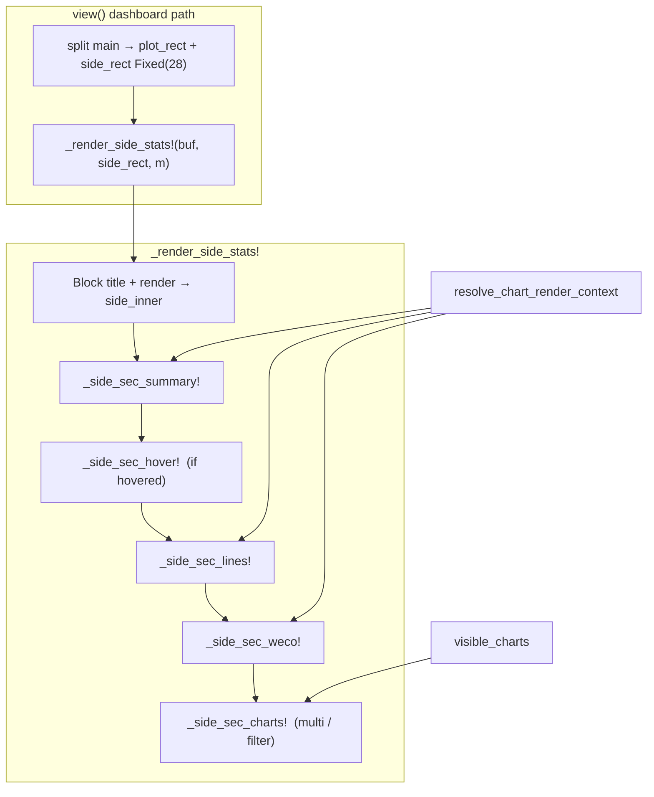

# Design: Side Stats Panel — Sectionize + Visual Polish

| Field | Value |
|-------|-------|
| **Author** | design-doc-writer (Grok) |
| **Date** | 2026-07-14 |
| **Status** | Draft (rev. 4 — Viols D-rank + WECO paint order) |
| **Audience** | Senior engineers implementing SPC Workbench TUI |
| **Primary codebase** | `src/spc_workbench.jl` (dashboard side panel only) |
| **Tests** | `test/test_spc_workbench.jl` (side-stats BDD blocks) |
| **Related** | Config page visual language (`_render_config_page!`, `_render_presets_list_body!`), Keys panel sections (`_render_key_entries_into!`), classic `src/spc.jl` Details (non-goal) |

**Changelog (rev. 4):** Renumbered pure D-list so **`Viols: N` = D17** (kept longer than charts D4 and digits D6); WECO paint order fixed as `bubbles → [digits if rem≥2 else skip] → Viols → msgs`; H≤11/mockup/KD-SS-6 cross-refs updated. No supersession footnote — ranks match paint intent.

**Changelog (rev. 3):** Reordered drop list so `T=` drops before HOVER body (KD-SS-15); Specs→WECO chrome gap contract; `Viols: N` + `reserve_tail=2`; hover policy cleanup; KD-SS-17 H≤11 specialization.

**Changelog (rev. 2):** Target retention (KD-SS-11); token freeze (KD-SS-12); drop list + mockups; H=18 WECO gate; compact algorithm; empty-filter `Charts:`; `n`/`n_primary`; hover behavior change; navy/maxw; PR2 checklist.

---

## Overview

The SPC Workbench dashboard right-hand **Side Stats** panel (`view_mode = :dashboard`) currently dumps a flat vertical stream of stats, line parameters, WECO bubbles, violations, and chart lists into a narrow `Fixed(28)` column. Users cannot scan hierarchy at a glance; labels, spacing, and grouping lag the polished Config / Keys / Saved surfaces.

This design **sectionizes** the panel into five named groups (Summary · Hover · Lines · WECO · Charts), applies the existing Tachikoma visual language (`▸` section headers, dim rules only when space allows, ●/○ chips, accent/success/warning styles), and defines a strict **height-priority / collapse policy** so information density under ~11–17 inner rows remains usable. Implementation is a pure render refactor + string/layout polish: **no model schema changes**, no new config semantics, read-only display only.

**PR2 freezes value separators** (`Cpk=`, `CL=`, `limits:auto|manual`, `Viols:`, `Charts:`) so TestBackend churn is limited to section headers, band merge, Target placement, and collapse — not wholesale typography.

---

## Background & Motivation

### Current state (verified on disk 2026-07-14)

| Concern | Location | Behavior |
|---------|----------|----------|
| Layout split | `view` ~L5913–5918 | `Horizontal [Fill(), Fixed(28)]` → `side_rect` |
| Block title | ~L6273, empty-filter ~L5973 | `"Side Stats (chart N/M • dashboard)"` |
| Main content stream | ~L6272–6423 | Flat `y += 1` dump; no section headers |
| Empty filter side | ~L5972–5980 | Minimal `Charts: 0/N` + `(no match)` |
| Empty data | ~L6421–6422 | `"n=0"` only when `length(m.data.values) == 0` |
| Helpers | `_side_trunc` L6444, `_side_viol_msgs_by_index` L6463, `SIDE_VIOL_MSG_MAX = 5` | Truncation + last-N WECO msgs by sample index |
| Context source | `resolve_chart_render_context` | Canonical `lz`, `cpk`, `band`, secondary bar, primary values |
| Line visibility | `_line_on(m, key)` | ●/○ on Lines rows; values always listed |
| Specs row | L6333 | `USL=… LSL=…` only — **no Target** |
| Top specs/target row | L6309–6310 | `USL=… T=… LSL=…` — **only Side Stats surface for `m.target`** |
| Chart list | `visible_charts(m)` | Filtered; ▶ active; name trunc 8; `cpk=` |
| Hover “priority” | L6312–6320 | Comment says priority; code only paints hover **before** Lines with `y <= bottom - 1` (needs `rem ≥ 2`). **Does not** reserve space or drop Lines for hover |
| Cpk style | L6304 | green/red/amber special-cased; else `:text` (covers `:navy` + default) |
| Viol trunc width | L6387 | `maxw = max(4, side_inner.width - 1)` |
| Polish precedents | Keys `:section` → `▸ ` + accent bold (L5668); Saved title + `─` rule (L6732–6740); Config tab strip (L6627–6636) | Established hierarchy language elsewhere; **not** used in side stats |

### Content stream today (order)

1. `n=<primary_count> limits:auto|manual` (`n_primary = length(act_ctx.primary_values)`)
2. `cl=… σ=…` + optional `Rbar|sbar|MRbar=…`
3. `Cpk=…` (band-colored) + optional `band:green #hex` row
4. Optional top-level `USL=… T=… LSL=…` when `m.usl !== nothing || m.lsl !== nothing` (**includes Target**)
5. Hover: `h[i]=value STAT` (order-before-Lines only; not space-reserving)
6. `Lines [v]` + 5 rows (CL, ±1σ, ±2σ, ±3σ, Specs=`USL/LSL` only) with ●/○
7. Optional blank gap → `WECO ` label **same row as** bubbles + digit row 1–8
8. `Viols: N` + up to 5 truncated messages
9. Multi-chart / filter: `Charts: …` + list rows

### Pain points

- **No visual hierarchy** — stats, lines, WECO, and charts read as one undifferentiated list.
- **Duplicate USL/LSL** — top row and Lines → Specs both show USL/LSL; **Target is not duplicated** (Specs lacks `T=`).
- **`band:` row is noise** — hex swatch string from `cpk_color_for_band` is low-value in a TUI (color already on `Cpk=`); costs a row.
- **Inconsistent polish** — Config/Keys/Saved use `▸` headers and dim rules; Side Stats does not.
- **Hard to maintain** — ~150 lines of sequential paint inline in `view`; empty-filter path duplicates Block setup.
- **Cramped terminals** — at H=18, `side_inner ≈ 11` rows; full content can exceed **20+** rows → silent clipping without explicit priority narrative. **H=18 is the primary suite gate** for WECO bubble tests (`TestBackend(80, 18)`).

### Row budget (approximate)

| Terminal H | Gauge | Main | Side inner (Block − borders) |
|------------|-------|------|------------------------------|
| 16 | 4 | 11 | ~9 |
| 18 | 4 | 13 | ~11 |
| 24 | 4 | 19 | ~17 |
| 36 | 4 | 31 | ~29 |

Usable width ≈ `28 − 2` (Block left/right borders) = **26 cells** for body text.  
Viol message truncation today: `max(4, side_inner.width - 1)` — **preserve this formula** in PR1/PR2 (do not switch to `max(1, width)`).

---

## Goals & Non-Goals

### Goals

1. **Sectionize** Side Stats into clear visual sections with consistent headers.
2. **Pretty up** text: hierarchy, label/value contrast, alignment, spacing, styles within existing `tstyle` tokens — **without** changing frozen value tokens in PR2 (KD-SS-12).
3. **Preserve information content** — all current facts remain available under sufficient height, including **Target (`T=`)** when set, Cpk band coloring, WECO bubbles, line values, viol messages, chart list.
4. **Explicit collapse policy** when short — single ordered drop list (documented + tested); H=18 WECO bubbles must stay green.
5. **Minimal API surface** — extract `_render_side_stats!` (+ small section helpers); no model fields, no JSON, no keymap changes.
6. **TestBackend-verifiable** — update locators/helpers where layout moves; add section-header + collapse tests.
7. **Keep side panel read-only** — edits stay in Config (`c`/`v`/`o`/`e`); side only displays + shows affordance hints (`[v]`, digit keys for WECO).

### Non-Goals

| Explicitly out | Rationale |
|----------------|-----------|
| Classic `src/spc.jl` Details panel redesign | Separate product surface; optional tiny parity later |
| Changing side width from `Fixed(28)` | Layout/plot trade-off; separate decision |
| New config toggles for which sections show | Overkill; height policy is enough |
| Making side panel interactive (focus, click toggles) | Config owns toggles; keyboard digits already flip WECO |
| Dual-canvas / plot chrome changes | Unrelated to side polish |
| Renaming product modes or Keys panel | Scope is Side Stats body only |
| i18n / localization | English labels only, as today |
| Scrolling the side panel | Prefer collapse; scroll is a larger UX |
| Changing empty-gate from `m.data.values` to chart-primary-only | Sync invariant; out of scope (KD-SS-13) |
| PR2 short mode badge / title rename / dropping `=` from Cpk/CL | Deferred to optional PR3 (KD-SS-12) |

---

## Proposed Design

### Architecture



Empty-filter early return (~L5967) also calls `_render_side_stats!` with `variant=:empty_filter` so Block title + `m.side_area` assignment stay single-sourced.

### Section layout (names · order · content)

| # | Section id | Header label | Body content | Always? |
|---|------------|--------------|--------------|---------|
| 1 | `:summary` | `▸ STATS` | `n=… limits:auto\|manual`; `cl=… σ=…` + secondary; `Cpk=…` (+ optional `· band` dim suffix); optional `T=…` when target set | Yes when body `n > 0` gate passes |
| 2 | `:hover` | `▸ HOVER` | `h[i]=value` + `OK\|OOC\|OOS` | Only if `m.hovered` valid on primary |
| 3 | `:lines` | `▸ LINES [v]` | ●/○ rows: `CL=…`, `±1σ=…`, `±2σ=…`, `±3σ=…`, `Specs=USL=… LSL=…` | When space (see drop list) |
| 4 | `:weco` | `▸ WECO` | Bubble row (8× ●/○); optional digit row; `Viols: N`; last-N msgs | When space |
| 5 | `:charts` | `▸ CHARTS` | Count line **`Charts: …`** + ▶ list | Multi-chart or filter active |

**Empty data:** gate with `length(m.data.values) == 0` (same as today’s `view`); paint `n=0`.

**Empty filter:** Block + optional `▸ CHARTS` + **`Charts: 0/N`** + ` (no match)` — count line **must** keep the `Charts:` token (KD-SS-14).

### Visual language

Reuse patterns already shipping elsewhere in this file:

| Element | Style | Pattern source |
|---------|-------|----------------|
| Section header | `tstyle(:accent, bold=true)`, text `▸ NAME` | Keys `_render_key_entries_into!` L5668; Saved L6736 |
| Optional rule | **skip by default** (KD-SS-3) | Height budget |
| Section gap | At most one blank row before WECO body when drop-list allows | Today L6350–6352 |
| Body text | `tstyle(:text)` primary values; `tstyle(:text_dim)` labels / secondary / band name / Target | Existing |
| Cpk value | Band → `:success` / `:warning` / `:error` / `:text` (incl. **`:navy`** and unknown → `:text`), **bold** | L6304–6305 |
| Band name suffix | Dim ` · green\|amber\|red\|navy` after `Cpk=…`; **no hex** | KD-SS-5 |
| ● on / ○ off | `:success` / `:text_dim` | Lines + WECO bubbles |
| Hover / active chart | `:accent, bold=true` | L6318, L6416 |
| Viol header / msgs | `:warning` when `nv > 0` else `:text_dim` | L6383 |
| Truncation | `_side_trunc`; viol msgs use `max(4, side_inner.width - 1)` | L6387, L6444 |
| Block title | keep `"Side Stats (chart N/M • dashboard)"` for v1 | Tests assert `"Side Stats"` |

#### Label / value formatting (PR2 frozen tokens)

**PR2 keeps these exact token shapes** (KD-SS-12) so existing matchers stay valid:

| Token | PR2 form | Notes |
|-------|----------|-------|
| Mode badge | `limits:auto` / `limits:manual` | Full string; short `auto` only in PR3 |
| Cpk | `Cpk=<val>` | Optional dim suffix ` · green` etc. after value |
| CL / sigma lines | `CL=<val>`, `±1σ=…`, etc. | Bubble + `"$label=$valstr"` as today |
| Viols | `Viols: N` | Keep colon |
| Charts count | `Charts: N` or `Charts: V/N` | Keep `Charts:` prefix |
| Hover | `h[i]=…` | Unchanged |
| Empty filter | `Charts: 0/N` then ` (no match)` | Unchanged body strings |

Allowed PR2 visual changes around those tokens:

```
▸ STATS
n=40 limits:auto
cl=12.34 σ=1.23 MRbar=1.38
Cpk=1.54 · green          # = kept; band merged; hex dropped
T=12.0                    # only when m.target !== nothing
▸ HOVER
h[7]=12.10 OK
▸ LINES [v]
● CL=12.34
● ±1σ=15.1/9.6
…
● Specs=USL=16.0 LSL=8.0  # USL/LSL only; Target lives on STATS
▸ WECO
●●●●●○○○                  # bubbles on own row (or same-row compact — see WECO layout)
12345678
Viols: 2
WECO-1 beyond +3σ #4
▸ CHARTS
Charts: 2/3
▶ Primar… cpk=1.54
```

**WECO bubble layout (PR2):** Prefer section header on its own row and bubbles on the next row when `rem` allows header+bubbles. **Always** ensure an 8-bubble run is findable without requiring `WECO` glyphs on the **same** row as bubbles — tests will use the rewritten locator (Issue 2). Optional compact form when only one row remains for WECO: paint `WECO ` + bubbles on one row (today’s layout) so digit-less H=18 still works.

**Name truncation:** keep 8-char chart names (current) unless `maxw ≥ 24`, then allow up to 12 — optional polish, not required for v1.

### Height priority / collapse policy

#### Single ordered drop list (authoritative)

When `rem` is insufficient for the full ideal paint, drop **in this order** (lower id = dropped **first** under pressure = lower priority). Higher id = kept longer.

| Drop # | Item | Notes |
|--------|------|-------|
| D1 | Chart **list names** | Lowest multi-chart detail |
| D2 | Viol **messages** (each, up to `SIDE_VIOL_MSG_MAX`) | Lowest WECO text; stop when `y>bot` |
| D3 | CHARTS **header** `▸ CHARTS` | Count line can stand alone |
| D4 | CHARTS **count** line | Entire charts section omitted after this |
| D5 | Blank **gap** before WECO chrome | Optional Specs→WECO spacer |
| D6 | WECO **digit** row `12345678` | Drop **before** `Viols: N` (D17) under pressure |
| D7 | WECO **header** `▸ WECO` | Prefer compact same-row `WECO ●●…` if only one WECO row fits |
| D8 | Lines **±1σ** row | |
| D9 | Lines **±2σ** row | |
| D10 | LINES **header** `▸ LINES [v]` | Body may be headerless |
| D11 | Lines **Specs** row | USL/LSL only; **not** Target |
| D12 | Lines **±3σ** row | |
| D13 | Lines **CL** row | After this, Lines fully omitted |
| D14 | STATS optional **`T=`** row | Target set only; **before HOVER body** (KD-SS-15) |
| D15 | HOVER **header** `▸ HOVER` | Prefer headerless `h[…]` |
| D16 | STATS **header** `▸ STATS` | Chrome; drop before hover body / Viols count |
| D17 | **`Viols: N` count** line | **High keep** — outranks charts (D4) and digits (D6); near protected bubbles |
| D18 | HOVER **body** `h[i]=…` | Highest optional priority — last droppable before STATS core |
| — | **WECO bubble row** (8× ●/○) | Not D-ranked: protected by `reserve_tail` when `height ≤ 11` (best-effort otherwise) |
| — | STATS core `n`+limits, cl/σ, Cpk | Never drop while `n>0` and `rem≥1`; paint top-first if partial |

**Rank notes (pure list = intent; no supersession footnotes):**

| Concern | Ids | Meaning under pressure |
|---------|-----|------------------------|
| KD-SS-15 hover ≻ Target | **D14 `T=`** ≺ **D18 hover body** | Drop Target before hover |
| Viols ≻ charts / digits | **D4 charts count**, **D6 digits** ≺ **D17 `Viols: N`** | Keep count line; omit digits/charts first (matches H≤11 must-pass) |
| Hover ≻ Viols count | **D17** ≺ **D18** | If forced to choose after STATS core, hover body wins; at H≤11 `reserve_tail=2` still keeps bubbles+Viols in the tail |

#### WECO section paint order (authoritative for `_side_sec_weco!`)

After entering WECO (optional header D7 already handled):

```
1. Paint bubble row (8× ●/○) if rem ≥ 1
2. If rem ≥ 2 after bubbles: paint digit row (1–8); else skip digits (D6)
3. If rem ≥ 1: paint Viols: N (D17)     # prefer count over digits when only one row left
4. While rem ≥ 1: paint viol messages (D2), oldest-of-window first as today
```

Do **not** paint `Viols:` before bubbles. Do **not** require digits between bubbles and Viols when `rem == 1` after bubbles — that single row is **`Viols: N`**, not digits. Tall layouts (H≥24) typically have `rem ≥ 2` after bubbles so digits sit between bubbles and Viols (`num_y == bubble_y + 1`).

#### Hover vs Lines vs WECO (intentional PR2 behavior)

Today: hover is painted **before** Lines with `y <= bottom - 1` (needs `rem ≥ 2`) but does **not** reserve tail space for WECO — order-only, not space-reserving.

**PR2 policy (single paragraph — no extra formulas):**

1. **Call order** is fixed: `STATS → HOVER → LINES → WECO → CHARTS`. Painting hover before Lines is how hover outranks long line detail (same structural order as today, plus drop-list ranks).
2. **Hover header:** use `_side_want_header(rem, body_min=1)` — header only if `rem ≥ 2`; else headerless body if `rem ≥ 1`.
3. **`_side_sec_lines!(...; reserve_tail)`** must leave the last `reserve_tail` rows of `side_inner` **unpainted** so WECO (and at H≤11 the Viols count) still fit. Lines never “eat” the reserved tail.
4. **Oracles:** acceptance test #4 (collapse+hover) and KD-SS-16 (H=18 bubbles). No separate `need_hover`/`weco_min` arithmetic beyond `reserve_tail`.

#### `reserve_tail` (normative)

| Condition | `reserve_tail` | Protects |
|-----------|----------------|----------|
| `inner.height ≤ 11` | **2** | 1× WECO bubble row + 1× `Viols: N` |
| `inner.height > 11` | **0** | Sequential paint; WECO/Viols compete normally via D-list |

Bubble row itself is not D-ranked; if even `reserve_tail` cannot be met after STATS+hover core, bubbles may clip (last resort — should not happen at H=18 with the H≤11 specialization below).

#### Lines partial vs omitted

| Mode | Condition (after hover, accounting for `reserve_tail`) | Rows painted |
|------|--------------------------------------------------------|--------------|
| **Lines full** | Enough rem for CL+±1+±2+±3+Specs (+ optional header) | All five line rows |
| **Lines compressed** | Moderate rem | Drop D8 then D9 (±1, ±2); keep CL + ±3 + Specs while rem allows |
| **Lines minimal** | Tight rem (e.g. 2 body rows) | CL + ±3σ only (**Specs dropped** — D11 before D12) |
| **Lines omitted** | `rem - reserve_tail < 2` | No line rows |

**Canonical moderate set:** CL + ±3σ + Specs (no ±1/±2).  
**Severe:** CL + ±3σ.  
**Extreme:** omit Lines to protect hover body + reserved WECO tail.

#### Profile: `side_inner.height ≤ 11` (H≈18) — **normative specialization** (KD-SS-17)

This profile is **not** merely illustrative. Implementers **must** apply it in addition to sequential D-list paint. Rationale: default `seed_demos = :triple` → multi-chart is the common suite path; pure sequential D8→D9 without a height specialization can still spend rows on ±1 before `reserve_tail` is considered if Lines is greedy. Specialization makes H=18 deterministic.

**Mandatory rules when `side_inner.height ≤ 11`:**

1. `reserve_tail = 2` (bubbles + `Viols: N` / D17).
2. **Always drop ±1σ and ±2σ** (apply D8+D9) when **either** hover is active **or** multi-chart / filter is active (covers default triple demos + hover tests).
3. Prefer headerless HOVER / LINES / WECO (apply D15, D10, D7 early).
4. Apply D14 before risking hover/Viols: if target set and painting `T=` would force `reserve_tail` or hover body to clip, **omit `T=`**.
5. Digit row (D6), viol messages (D2), chart names (D1), charts count (D4): omit unless leftover after Viols.

**Must-pass paint set** (PR2 acceptance; top→bottom):

1. STATS core: `n=… limits:…`, `cl=… σ=…`, `Cpk=…` [+ ` · band`] — 3 rows (header D16 optional)
2. **No `T=`** unless extra room after hover + Lines compressed + reserve_tail (D14)
3. Hover body if active (headerless) — required when hovered (D18)
4. Lines headerless compressed: CL, ±3σ, Specs if room after reserve (**never** ±1/±2 under rule 2)
5. WECO digit-less bubble row (compact `WECO ●●…` or bubbles-only) — **required** (KD-SS-16)
6. `Viols: N` — **required** via `reserve_tail=2` and **D17** keep-rank (digits D6 already dropped)
7. No viol msgs (D2), no chart names (D1); `Charts:` count (D4) only if ≥1 free **after** Viols

Illustrative 11-row budget (no target, hover on, multi-chart):

| Row | Content |
|-----|---------|
| 1 | `▸ STATS` or start core |
| 2–4 | n/limits, cl/σ, Cpk |
| 5 | `h[i]=…` |
| 6–8 | CL, ±3σ, Specs |
| 9 | `WECO ●●●●●○○○` or `●●●●●○○○` |
| 10 | `Viols: N` |
| 11 | `Charts: 2/3` optional (often omitted) |

#### Per-section compact algorithm (single rule)

**No global `rem ≤ 4` special case.** Each section uses:

```julia
const SIDE_HEADER_COST = 1

"""Paint ▸ header only if rem >= 1 + body_min; else headerless if rem >= body_min."""
function _side_want_header(rem::Int, body_min::Int)::Bool
    return rem >= SIDE_HEADER_COST + body_min
end
```

| Section | `body_min` |
|---------|------------|
| STATS | 3 (n/limits, cl/σ, Cpk); partial core top-first if less |
| HOVER | 1 |
| LINES | 2 (CL+±3) minimal; 3 with Specs |
| WECO | 1 (bubbles); count line is separate after bubbles |
| CHARTS | 1 (count line) |

```julia
function _side_sec_example!(buf, x, y, bot, maxw, title, body_min, paint_body!)
    rem = bot - y + 1
    rem <= 0 && return y
    if _side_want_header(rem, body_min)
        y = _side_section_header!(buf, x, y, bot, maxw, title)
    end
    return paint_body!(buf, x, y, bot, maxw)
end
```

Body orchestration (canonical — **no no-op bots**):

```julia
function _render_side_stats_body!(buf, inner, m)
    # …
    reserve_tail = inner.height <= 11 ? 2 : 0
    y = _side_sec_summary!(...)           # may omit T= under D14 / H≤11 rules
    y = _side_sec_hover!(...)             # headerless if rem < 2; paints h[…] when active
    y = _side_sec_lines!(...; reserve_tail)  # must not paint into last reserve_tail rows
    y = _side_sec_weco!(...)              # bubbles → [digits if rem≥2] → Viols: N → msgs
    y = _side_sec_charts!(...)            # names/count lowest (D1/D4)
end
```

### Before / after ASCII mockups

#### Typical ~24-row terminal (side_inner ≈ 17)

**Before (flat):**
```
┌ Side Stats (chart 1/3 • dashboard) ┐
│ n=40 limits:auto                    │
│ cl=12.34 σ=1.23 MRbar=1.38          │
│ Cpk=1.54                            │
│ band:green #1a6e3c                  │
│ USL=16.0 T=12.0 LSL=8.0             │
│ h[7]=12.10 OK                       │
│ Lines [v]                           │
│ ● CL=12.34                          │
│ ● ±1σ=15.1/9.6                      │
│ ● ±2σ=…                             │
│ ● ±3σ=UCL=… LCL=…                   │
│ ● Specs=USL=16.0 LSL=8.0            │
│                                     │
│ WECO ●●●●●○○○                       │
│      12345678                       │
│ Viols: 2                            │
│ WECO-1 beyond…                      │
└─────────────────────────────────────┘
```

**After (sectionized, target set):**
```
┌ Side Stats (chart 1/3 • dashboard) ┐
│ ▸ STATS                             │
│ n=40 limits:auto                    │
│ cl=12.34 σ=1.23 MRbar=1.38          │
│ Cpk=1.54 · green                    │
│ T=12.0                              │
│ ▸ HOVER                             │
│ h[7]=12.10 OK                       │
│ ▸ LINES [v]                         │
│ ● CL=12.34                          │
│ ● ±1σ=15.10/9.58                    │
│ ● ±2σ=…                             │
│ ● ±3σ=UCL=16.03 LCL=8.65            │
│ ● Specs=USL=16.0 LSL=8.0            │
│ ▸ WECO                              │
│ ●●●●●○○○                            │
│ 12345678                            │
│ Viols: 2                            │
│ WECO-1 beyond +3σ #4                │
└─────────────────────────────────────┘
```

#### Cramped H=18 (side_inner ≈ 11) — suite gate

Hover on, multi-chart, no target (default demos often target=nothing):

```
┌ Side Stats (chart 1/3 • dashboard) ┐
│ ▸ STATS                             │  or headerless if budget tight
│ n=40 limits:auto                    │
│ cl=12.34 σ=1.23                     │
│ Cpk=1.54 · green                    │
│ h[7]=12.10 OK                       │  headerless hover
│ ● CL=12.34                          │  ±1/±2 dropped (D8–D9 / KD-SS-17)
│ ● ±3σ=UCL=… LCL=…                   │
│ ● Specs=USL=… LSL=…                 │
│ WECO ●●●●●○○○                       │  digit-less (D6 dropped); same-row compact OK
│ Viols: 0                            │  D17 kept ≻ charts/digits
└─────────────────────────────────────┘
  Charts names (D1) / count (D4) omitted; digits (D6) omitted
```

**PR2 must-pass:** `_side_weco_bubbles` (rewritten) finds `●●●●●○○○` (default rules) at `TestBackend(80, 18)`.

#### Extreme H=16 (side_inner ≈ 9) — matches drop list

```
┌ Side Stats (chart 1/3 • dashboard) ┐
│ n=40 limits:auto                    │  D16: no STATS header
│ cl=12.34 σ=1.23                     │
│ Cpk=1.54 · green                    │
│ h[7]=12.10 OOS                      │  hover kept (D18); T= dropped (D14)
│ ● CL=12.34                          │  Lines minimal: CL+±3; Specs dropped (D11)
│ ● ±3σ=UCL=… LCL=…                   │
│ WECO ●●●●●○○○                       │  D6 digits skipped; compact label OK
│ Viols: 2                            │  D17 after bubbles (reserve_tail / rem≥1)
└─────────────────────────────────────┘
```

No Specs — D11 before D12/D13. No chart list (D1/D4). Hover ≻ `T=` (D14≺D18). Viols ≻ digits/charts (D6/D4≺D17).

### Extraction surface (API)

```julia
"""
Render dashboard Side Stats into `side_rect` (outer). Sets `m.side_area` to Block inner.
`variant`: :full | :empty_filter
"""
function _render_side_stats!(buf, side_rect, m::SPCWorkbenchModel;
                             variant::Symbol = :full)
    title = "Side Stats (chart $(m.active)/$(max(1, length(m.charts))) • dashboard)"
    side_block = Block(title=title, border_style=tstyle(:border))
    side_inner = render(side_block, side_rect, buf)
    m.side_area = side_inner
    if variant === :empty_filter
        # Count line MUST remain: "Charts: 0/$nch" (+ optional ▸ CHARTS above)
        _side_sec_charts_empty!(buf, side_inner, m)
        return
    end
    # PR1/PR2: copy view’s empty gate literally — do NOT substitute chart primary length.
    # Invariant: after _ensure_charts! / _sync_active_back!, m.data tracks active chart
    # for dashboard view’s `n`, but act_ctx.primary_values is the stats authority for n_primary.
    n = length(m.data.values)
    if n == 0
        set_string!(buf, side_inner.x, side_inner.y, "n=0", tstyle(:text))
        return
    end
    _render_side_stats_body!(buf, side_inner, m)
end

function _render_side_stats_body!(buf, inner, m)
    x, y = inner.x, inner.y
    bot = bottom(inner)
    maxw_body = max(1, inner.width)
    # viol lines: preserve max(4, width - 1)
    act_ch = current_chart(m)
    act_ctx = resolve_chart_render_context(act_ch; sigma_method=:mr)
    n_primary = length(act_ctx.primary_values)  # NOT length(m.data.values)
    # H≤11: reserve bubbles + Viols: N (see reserve_tail table / KD-SS-17)
    reserve_tail = (inner.height <= 11) ? 2 : 0

    y = _side_sec_summary!(buf, x, y, bot, maxw_body, m, act_ctx, n_primary)
    y = _side_sec_hover!(buf, x, y, bot, maxw_body, m, act_ctx, n_primary)
    y = _side_sec_lines!(buf, x, y, bot, maxw_body, m, act_ctx; reserve_tail=reserve_tail)
    y = _side_sec_weco!(buf, x, y, bot, maxw_body, m, act_ctx)
    # WECO: bubbles → [digits if rem≥2 after bubbles] → Viols: N (D17) → msgs (D2)
    y = _side_sec_charts!(buf, x, y, bot, maxw_body, m)  # D1 names, D4 count — lowest
    return y
end
```

**KD-SS-13:** Intentional chart-primary-only empty semantics are **out of scope**. PR1 copies `n = length(m.data.values)` for the empty branch and `n_primary = length(act_ctx.primary_values)` for stats — unchanged from today.

### Information changes (polish-only, not semantic)

| Item | Decision |
|------|----------|
| Top `USL= T= LSL=` row | **Split:** drop **USL/LSL** from top (Specs owns them). **Keep Target** on STATS as `T=…` when `m.target !== nothing` (KD-SS-11). When target is `nothing`, paint **no** `T=` row (reclaim vs today’s `T=—` when USL/LSL set). |
| Specs line | Remains `USL=… LSL=…` only (visibility toggles for plot specs) |
| `band:green #hex` row | **Merge** into Cpk as dim ` · green` (also amber/red/**navy**); hex omitted |
| `limits:auto` | **Keep full** `limits:auto\|manual` in PR2 (KD-SS-12); short badge = PR3 only |
| `Cpk=` / `CL=` | **Keep `=`** in PR2; spacing polish only around tokens |
| `Lines [v]` | Becomes section header `▸ LINES [v]` |
| `Viols: N` | **Keep** `Viols:` with colon; paint after bubbles (and after digits only if `rem≥2`); **D17** keep-rank; H≤11 in `reserve_tail=2` |
| `WECO` label | Section header and/or compact same-row form; tests use bubble-run locator |
| Chart count | **Keep** `Charts:` prefix always |

### Empty / edge paths

| Path | Behavior |
|------|----------|
| `length(m.data.values) == 0` | `n=0` |
| Filter matches 0 charts | `▸ CHARTS` optional + **`Charts: 0/N`** + ` (no match)` |
| No USL/LSL | Specs shows `—`; no phantom top USL row |
| Target set | STATS shows `T=…` (when not drop-listed) |
| Target nothing | No `T=` row |
| Cpk `nothing` | `Cpk=—` dim; no band suffix |
| Band `:navy` | Cpk style `:text` bold; suffix ` · navy` dim |
| All WECO off | Bubbles all `○`; `Viols: 0` dim |
| Single chart, no filter | Omit CHARTS section entirely |

### Sequence (one frame)

```mermaid
sequenceDiagram
  participant V as view()
  participant R as _render_side_stats!
  participant C as resolve_chart_render_context
  participant S as section helpers

  V->>R: side_rect, m
  R->>R: Block + side_inner, m.side_area=
  Note over R: empty gate uses length(m.data.values)
  R->>C: current_chart(m)
  C-->>R: act_ctx (lz, cpk, band, primary, secondary)
  Note over R: n_primary from act_ctx.primary_values
  R->>S: summary → hover → lines → weco → charts
  Note over S: header if rem>=1+body_min; lines reserve_tail; WECO=bubbles→digits?→Viols→msgs
  S-->>R: done
  R-->>V: return
```

---

## API / Interface Changes

### Public API

**None.** No new exports, model fields, keys, or JSON.

### Internal API (new)

| Symbol | Role |
|--------|------|
| `_render_side_stats!(buf, side_rect, m; variant)` | Entry; Block + dispatch |
| `_render_side_stats_body!(buf, inner, m)` | Full non-empty body |
| `_side_sec_summary!` / `_side_sec_hover!` / `_side_sec_lines!` / `_side_sec_weco!` / `_side_sec_charts!` | Sections |
| `_side_section_header!(buf, x, y, bot, maxw, title) -> Int` | Shared `▸` paint; no-op if no room |
| `_side_want_header(rem, body_min) -> Bool` | Single compact predicate |
| `_side_sec_charts_empty!` | Empty-filter body (`Charts: 0/N`) |

### Call-site changes in `view`

```julia
_render_side_stats!(buf, side_rect, m; variant = :empty_filter)  # empty filter path
# …
_render_side_stats!(buf, side_rect, m)  # normal path
```

---

## Data Model Changes

**None.**

Constants retained: `SIDE_VIOL_MSG_MAX = 5`, layout `Fixed(28)`.

---

## Alternatives Considered

### A1. Nested Blocks per section

**Reject** — burns 2 rows + 2 cols per section at width 28 / H=18.

### A2. Scrollable side buffer

**Reject** for this slice — new state/keymap; user asked sectionize/pretty.

### A3. Chips-only, no sections

**Reject** as sole strategy; compact mode is fallback only.

### A4. Shared widget with classic `spc.jl` Details

**Defer** — different content; non-goal.

### A5. Put Target on Specs line only

**Reject as sole home for Target** — Specs is droppable (D11) and width-tight; Target would vanish under collapse. STATS retention (KD-SS-11) + D14 (T drops before hover D18, not with Specs) is more reliable. Optional future: also show T on Specs when width ≥ 26 and target set (duplicate then acceptable only if STATS T dropped — not in PR2).

### Chosen: A0 — section headers + ordered collapse in extracted renderer

---

## Security & Privacy Considerations

Display-only; no new attack surface. Chart names truncated; no paths in side list.

---

## Observability

No per-frame logging. Debug via TestBackend `_side_full` / rewritten `_side_weco_bubbles`. Collapse makes clipping predictable.

---

## Rollout Plan

| Stage | Action |
|-------|--------|
| 1 | PR1 pure extract — pixel/string parity (zero intentional test edits) |
| 2 | PR2 sectionize + collapse + **required** test helper updates |
| 3 | PR2 checklist (below) green |
| 4 | Optional PR3 copy only after product taste |
| Rollback | Revert PR2 (or PR1+PR2); no migration |

**Feature flags:** none.

---

## Risks

| Risk | Severity | Mitigation |
|------|----------|------------|
| Headers starve WECO at H=18 | **High** | D-list + `reserve_tail=2` + KD-SS-17; H=18 must-pass |
| `_side_weco_bubbles` same-row WECO assumption | **High** | Rewrite locator (8-bubble run; disambiguate Lines ●) |
| Target regression if USL row dropped blindly | **High** | KD-SS-11; **D14** drops T before hover (**D18**) |
| `Cpk=` / `CL=` / `limits:` churn | Medium | KD-SS-12 freeze for PR2 |
| Specs–WECO gap + `▸ WECO` intermediate | Medium | Gap contract via `weco_chrome_y` |
| Empty-filter `Charts:` token loss | Medium | KD-SS-14 contract |
| Viols vs charts/digits under pure D-list | **Low** (rev. 4) | **D17** `Viols: N` ≻ **D4** charts / **D6** digits; paint prefers Viols when `rem==1` after bubbles |
| Large `view` merge conflicts | Low | PR1 extract first; note in PR2 checklist |

---

## Key Decisions

| ID | Decision | Rationale |
|----|----------|-----------|
| **KD-SS-1** | Extract `_render_side_stats!` + section helpers; **no model/schema changes** | Pure view; reviewable PRs |
| **KD-SS-2** | Five sections: **STATS → HOVER → LINES → WECO → CHARTS** | Scan order matches workflow |
| **KD-SS-3** | `▸ NAME` accent bold; **no full-width `─` by default** | Height budget at H=18 |
| **KD-SS-4** | Drop top-row **USL/LSL only**; Specs remains USL/LSL visibility display | Removes true duplicate; does **not** remove Target |
| **KD-SS-5** | Merge band **name** into `Cpk=` row as dim ` · band`; drop hex | Color on Cpk; navy/unknown use `:text` |
| **KD-SS-6** | Single **ordered drop list D1…D18**; msgs/charts/gap/digits first; Lines ±1→±2→hdr→Specs→±3→CL; **`T=`=D14**; **`Viols: N`=D17** (≻ D4 charts, D6 digits); **HOVER body=D18** | Pure ranks match H≤11 must-pass + WECO paint order |
| **KD-SS-7** | Compact = **per-section** `_side_want_header(rem, body_min)` only | No global `rem≤4` |
| **KD-SS-8** | Keep Block title **`Side Stats (chart N/M • dashboard)`** for v1 | Test stability |
| **KD-SS-9** | Classic `spc.jl` Details = **non-goal** | Scope |
| **KD-SS-10** | Side panel **read-only** | Config owns edits |
| **KD-SS-11** | **Target:** when `m.target !== nothing`, paint `T=<rounded>` on STATS (after Cpk); never rely on Specs for Target | Specs has no `T=` today; Goal 3 |
| **KD-SS-12** | **PR2 string freeze:** keep `Cpk=`, `CL=`, `±Nσ=`, `limits:auto\|manual`, `Viols:`, `Charts:`, `h[i]=` | Avoid suite churn; pure typography = PR3 |
| **KD-SS-13** | Empty gate = `length(m.data.values)`; stats n = `length(act_ctx.primary_values)` | Copy view literally |
| **KD-SS-14** | Count lines keep **`Charts:`** prefix; `▸ CHARTS` optional | Test ~L4833 |
| **KD-SS-15** | Hover priority is **intentional PR2 behavior**: call order STATS→HOVER→LINES; drop-list **D18 hover body outranks D14 `T=`** (and D17 Viols if forced); Lines use `reserve_tail` for bubbles+Viols | Acceptance test #4 |
| **KD-SS-16** | **H=18 WECO bubbles** is a **PR2 merge gate**; rewrite `_side_weco_bubbles` | Suite depends on it |
| **KD-SS-17** | **`height ≤ 11` specialization is normative:** `reserve_tail=2`; always drop ±1/±2 when hover **or** multi-chart/filter; drop `T=` before clipping hover/WECO | Deterministic H=18 with default `:triple` demos |

---

## Open Questions

1. **Block title rename?** Keep vs `Stats (N/M)`. Recommendation: **keep** until after PR2 (KD-SS-8). PR3 only.
2. ~~`limits:auto` vs short `auto`~~ **Closed:** keep full string in PR2; short badge = PR3 only (KD-SS-12).
3. **Section title casing:** `▸ STATS` vs `▸ Stats`. Recommendation: **SCREAMING** labels for 26-col scanability. Implementer may ship either if tests use `occursin("STATS")` / case-insensitive — prefer exact `▸ STATS`.
4. ~~Orphan LINES header~~ **Closed:** header only if `rem >= 1 + body_min` (KD-SS-7).
5. **Secondary bar placement:** same line as cl/σ when fits; else wrap one dim line. Soft preference, not a freeze.
6. ~~Empty-filter `▸ CHARTS`~~ **Closed:** optional `▸ CHARTS`; **required** body `Charts: 0/N` (KD-SS-14).
7. **Parity on classic Details later?** Follow-up only.
8. **PR3 only:** drop `=` from Cpk/CL for “pretty” spacing; short mode badge; title rename.

---

## Test Impact Map

| Existing test area (`test/test_spc_workbench.jl`) | Impact |
|--------------------------------------------------|--------|
| `find_text(…, "Side Stats")` | **Stable** (KD-SS-8) |
| `match(r"Cpk=([0-9.\-]+)", …)` / `find_text("Cpk=")` / `occursin("Cpk=")` ~L2140, L2596–2599 | **Stable** if KD-SS-12 kept (`Cpk=` retained; ` · green` suffix OK) |
| `h[1]=` hover | **Stable** token; may appear when Lines compressed (new behavior — add test) |
| `limits:auto` / `limits:manual` ~L3071–3098 | **Stable** (KD-SS-12) |
| `_side_weco_bubbles` ~L2961–3045 @ H=18 | **Must rewrite** helper: find 8-char bubble run in `side_area` (prefer row with ≥8 ●/○; optionally verify `WECO` on same or previous row). **Must stay green** at H=18 (KD-SS-16) |
| Specs–WECO gap ~L3110–3132 @ H=24 | **Post-PR2 contract (exact):** see subsection below — measure to WECO **chrome**, not bubbles, unless intermediates allow header |
| Digit row 1–8 @ H=24 | **Stable** when space; `bubble_y + 1` via rewritten helper; not required at H=18 |
| `Viols:` + WECO-1 message | **Stable** token; count after bubbles (and after digits only if space); **D17**; msgs (D2) after count |
| `_side_find_row(..., "CL=")` ~L3221 | **Stable** (`CL=` frozen); no need for `CL ` fallback in PR2 |
| `Lines [v]` | Becomes `▸ LINES [v]` — assert `LINES` + `[v]` or `Lines` |
| Empty filter `Charts: 0/` ~L4833 | **Stable** if KD-SS-14 held; optional `▸ CHARTS` above |
| Band hex | Hex may disappear — assert band **name** near Cpk optional; do not require `#1a6e3c` |

### Required test helper change (PR2)

```julia
# Replace same-row WECO+bubbles assumption with:
function _side_weco_bubbles(tb, m)
    sa = m.side_area
    for y in sa.y:T.bottom(sa)
        bubbles = Char[]
        for x in sa.x:T.right(sa)
            ch = T.char_at(tb, x, y)
            (ch == '●' || ch == '○') && push!(bubbles, ch)
        end
        length(bubbles) >= 8 && return (y=y, bubbles=String(bubbles[1:8]), sa=sa)
    end
    return nothing
end
```

(Optionally still prefer a row whose previous line contains `WECO` if multiple bubble runs exist — Lines section also uses ●/○. **Disambiguation:** WECO run is **8 consecutive** bubbles with **no** `CL=`/`±` text on that row; Lines rows are `● CL=…` single bubble + text. Filter: rows where bubble count ≥ 8, or single-glyph columns without `=` labels.)

### Specs–WECO gap test contract (PR2) — exact assertions

Preferred tall layout:

```
● Specs=USL=… LSL=…
[optional blank]          ← gap (D5)
▸ WECO                    ← WECO chrome (header D7)
●●●●●○○○                  ← bubble_y from _side_weco_bubbles
12345678                  ← digit row = bubble_y + 1 when rem≥2 after bubbles (D6)
Viols: N                  ← D17; after digits when present, else immediately after bubbles
```

**Do not** use `startswith(lstrip(txt), "WECO")` (breaks on `▸ WECO`).

| Symbol | Definition |
|--------|------------|
| `specs_y` | Side row whose text matches Specs body (`Specs=` or `Specs `) |
| `weco_chrome_y` | First side row with `occursin("WECO", txt)` (covers `▸ WECO` and compact `WECO ●●…`) |
| `bubble_y` | From rewritten `_side_weco_bubbles` |

**When `side_inner.height ≥ 15` (e.g. H≥24) and not in H≤11 compact profile:**

1. `weco_chrome_y !== nothing` and `specs_y !== nothing`
2. Prefer gap: `weco_chrome_y >= specs_y + 2` when D5 blank is painted; if no blank (D5 dropped) but header present, `weco_chrome_y == specs_y + 1` is acceptable only when height forced it — at H=24 suite default, **require** `weco_chrome_y >= specs_y + 2`
3. For every `y` in `(specs_y + 1) : (weco_chrome_y - 1)`: row is **blank** (whitespace/`\0` only)
4. Digit row: when present (`rem ≥ 2` after bubbles), `num_y == bubble_y + 1` and digits align under bubbles; **`Viols:` follows digits** (or follows bubbles when digits skipped)

**If a test measures gap to `bubble_y` instead of `weco_chrome_y`:** intermediates may include exactly one non-blank WECO chrome row (`occursin("WECO", …)` or `▸`); all other intermediates blank. Prefer chrome-endpoint (above) so the existing “all intermediate blank” spirit maps cleanly: blank lives **between Specs and WECO chrome**, not between chrome and bubbles.

**H≤11 / compact:** gap optional (D5); digits (D6) omitted; do not fail suite if Specs abuts compact `WECO ●●…` then `Viols:`.

### New tests (PR2)

1. **Section headers** at H=36: `▸ STATS` (or `STATS`), `LINES`, `WECO` when data rich.
2. **Target retained:** set `m.target = 12.0` (+ USL/LSL); side contains `T=12` (or `T=12.0`); Specs still `USL=`/`LSL=`; **no requirement** that top triple row exists.
3. **USL not double-counted as a third display:** under full height, USL appears on Specs; no separate pre-Lines `USL=… T=… LSL=…` triple (Target may appear alone as `T=`).
4. **Collapse + hover (behavior change):** H=16–18, `m.hovered` set, multi-chart → `h[` present; ±1/±2 absent or Lines minimal; chart **names** absent.
5. **H=18 WECO gate:** default bubbles `●●●●●○○○`; toggle `6` / `1` still updates pattern (existing tests, new locator).
6. **Empty filter:** `Charts: 0/` and `(no match)` still present.
7. **Band inline:** optional `green`/`navy` near Cpk; hex not required.
8. **Navy band:** if fixture yields `:navy`, Cpk still renders (style `:text` bold).

---

## Implementation Notes (for implementer)

1. PR1: move L5972–5980 + L6272–6423 **literally** — same strings, `n = length(m.data.values)`, `n_primary = length(act_ctx.primary_values)`, viol `maxw = max(4, side_inner.width - 1)`.
2. Do **not** change `SIDE_VIOL_MSG_MAX` or viol ordering (PR5 / P1.8).
3. PR2: implement drop list D1–D18 (`T=`=D14, hover body=D18, `Viols: N`=D17 ≻ charts D4 / digits D6); WECO paint `bubbles → [digits?] → Viols → msgs`; `reserve_tail=2` at H≤11; KD-SS-17; Target on STATS; band merge; rewrite `_side_weco_bubbles` + Specs–WECO gap contract.
4. Re-render after every `update!` in tests.
5. Prefer `set_string!` / `set_char!` + `tstyle` only.
6. After `src/` change: full suite + dashboard smoke.
7. Merge-conflict risk: `view` is large — land PR1 first to shrink the conflict window for PR2.

---

## References

| Artifact | Path / anchor |
|----------|----------------|
| Side stats paint (today) | `src/spc_workbench.jl` ~L6272–6423 |
| Empty filter side | `src/spc_workbench.jl` ~L5967–5986 |
| Side width | `Fixed(28)` ~L5913 |
| Target on top row only | L6309–6310 vs Specs L6333 |
| Cpk band styles | L6304–6305; `cpk_color_for_band` L1073–1085 |
| Viol helpers | ~L6441–6472; viol maxw L6387 |
| Section visual precedents | Keys ~L5668; Saved ~L6731–6740 |
| Side stats tests | `test/test_spc_workbench.jl` ~L1997, L2126–2158, L2596–2599, L2959–3283, L4826–4835 |
| UI testing methodology | `.grok/docs/tachikoma-ui-testing.md` |

---

## PR Plan

### PR 1 — Extract Side Stats renderer (behavior-identical)

| Field | Value |
|-------|-------|
| **Title** | `refactor(workbench): extract _render_side_stats! without visual change` |
| **Files** | `src/spc_workbench.jl` only |
| **Dependencies** | None |
| **Description** | Lift Block setup + body into `_render_side_stats!` / body helper with **identical** strings, order, styles, bottom checks, `m.data` empty gate, `n_primary` from ctx, viol `maxw` formula. Empty-filter via `variant`. **Zero** intentional test edits. Full suite green. |

### PR 2 — Sectionize + collapse + test contracts

| Field | Value |
|-------|-------|
| **Title** | `feat(workbench): sectionize Side Stats + height collapse` |
| **Files** | `src/spc_workbench.jl`; `test/test_spc_workbench.jl` |
| **Dependencies** | PR 1 |
| **Description** | Sections + D1–D18 (Viols=D17 ≻ digits/charts) + WECO paint order + KD-SS-17 + `reserve_tail=2` + Target on STATS + band merge. **Freeze** tokens (KD-SS-12). Rewrite `_side_weco_bubbles` + chrome gap contract. |

#### PR2 merge checklist

- [ ] `julia --project=. test/runtests.jl` green  
- [ ] H=18 WECO bubbles + toggles (`●●●●●○○○` / `●●●●●●○○` / `○●●●●●○○`)  
- [ ] H=18 `Viols:` count present after bubbles when default demos  
- [ ] H=24 Specs–WECO gap via **`weco_chrome_y`** (blank intermediates; `▸ WECO` OK as chrome endpoint) + digit row 1–8  
- [ ] H=36 section headers visible  
- [ ] Empty-filter `Charts: 0/` + `(no match)`  
- [ ] Cpk parse / `find_text("Cpk=")` still works  
- [ ] Target `T=` when set at tall height; omitted before hover at short height if needed (D14≺D18)  
- [ ] Collapse+hover test (h[ present; ±1/±2 gone; no chart names) — KD-SS-15  
- [ ] Under short height: `Viols:` present while digits/chart names absent (D17 ≻ D6/D1)  
- [ ] App/dashboard smoke render  
- [ ] Note: large `view` — rebase on PR1 to reduce conflicts  

### PR 3 — Optional micro-copy (product taste)

| Field | Value |
|-------|-------|
| **Title** | `polish(workbench): Side Stats title / badge / separator taste` |
| **Files** | `src/spc_workbench.jl`; matching tests |
| **Dependencies** | PR 2 |
| **Description** | Only if product wants: title rename, short `auto` badge, or `Cpk ` without `=`. Otherwise **skip**. |

### PR graph


---

*End of design document (rev. 4).*
