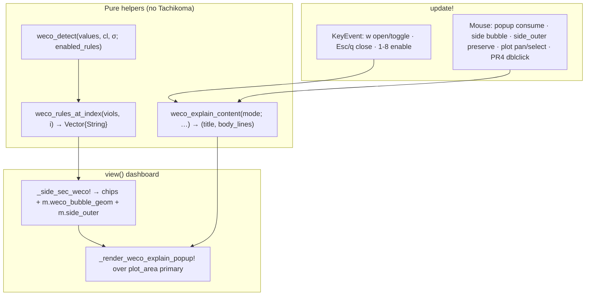
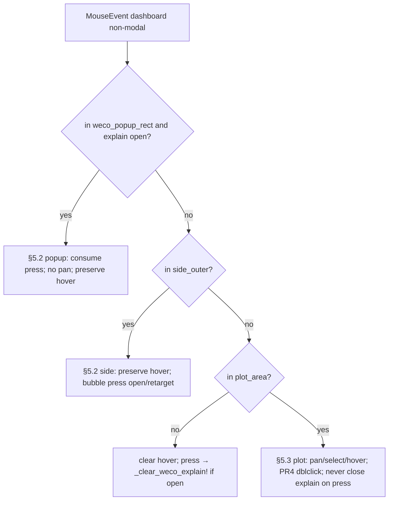
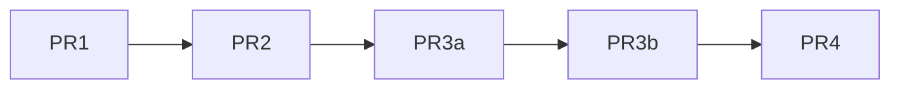

# Design: WECO Rule Bubbles — Visual Boxes + Hover Highlight + Violation Explain Popup

| Field | Value |
|-------|-------|
| **Author** | design-doc-writer (Grok) |
| **Date** | 2026-07-14 |
| **Status** | Draft (rev. 2 — review fixes) |
| **Audience** | Senior engineers implementing SPC Workbench TUI |
| **Primary codebase** | `src/spc_workbench.jl` (dashboard Side Stats WECO + mouse/keys) |
| **Tests** | `test/test_spc_workbench.jl` (side-stats WECO + new popup/hover BDD) |
| **Related** | `docs/design/side-stats-sectionize.md` (WECO section / H=18 gates); library double-click (`LIBRARY_DBLCLICK_TICKS`, KD-P2-19); hover tooltip (`draw_hover_tooltip!`); file browser modal (`_render_file_browser!`); `_clear_load_ephemerals!` in `src/spc_workbench_io.jl` |

**Changelog (rev. 2):** Review pass — plot double-click state machine vs pan/select; simplified click-outside (no plot-press auto-close); frozen popup assembly (`mode=:rule|:point`); same-index multi-rule fixture; `side_outer` hover preserve; PR3a/PR3b split; narrow-plot `box_w`; `_clear_weco_explain!` call graph; API freeze; A7 Shift-click alternative; live re-query; digit_x + no-hover style note; mode-gated `w` help copy.

**Changelog (rev. 1):** Initial design — boxed hybrid chrome, multi-rule hover highlight, ephemeral explain popup left of Side Stats, pure helpers, interaction matrix, copy catalog, PR plan.

---

## Overview

The SPC Workbench Side Stats **▸ WECO** section currently shows eight bare enable bubbles (`●`/`○`), an optional digit row `12345678`, a `Viols: N` count, and last-N violation messages. Users can toggle rules with keys `1`–`8` and see hover status on the plot (`h[i]=… OOC|OOS|OK`), but there is **no visual link** from a hovered violating point back to *which* rule(s) fired, and **no focused explain surface** that shows how a rule is calculated.

This design adds three layered interactions, all dashboard-only and session-ephemeral:

1. **Visual chrome** for the eight rule chips (box hybrid when width allows; bare bubbles under H=18 compact).
2. **Hover multi-highlight** of rule chip(s) that fire at the currently hovered primary index (several chips can light at once).
3. **Explain popup** anchored **left of Side Stats** (over the primary plot area) with concise rule + calculation copy, opened by bubble click, hotkey `w`, or (PR4) double-click / optional Shift-click on a violating plot point.

No JSON / workbench schema changes. Side width stays `Fixed(28)`. H=18 WECO bubble locator tests remain a hard gate (glyph set for enable state stays `●`/`○`; existing `_side_weco_bubbles` already ignores non-bubble glyphs, so tall boxed `[`/`]` need no locator rewrite for the 8-run gate).

---

## Background & Motivation

### Current state (verified on disk 2026-07-14; line refs soft)

| Concern | Location | Behavior |
|---------|----------|----------|
| Pure detector | `weco_detect` | `Vector{WECOViolation}` with `rule`, `index` (1-based), `msg` |
| Render context | `ChartRenderContext` | Stores `viol_indices::Set{Int}` only — **not** per-rule map |
| Point class | `point_status` | `:oos` (spec) ≻ `:ooc` (WECO index set) ≻ `:ok` |
| Side WECO paint | `_side_sec_weco!` | Header / compact same-row `WECO `; bare `●`/`○`; digits if rem; `Viols: N`; msgs |
| Rule short descs | `WECO_RULE_DESCS` | `Vector{String}` length 8, **1-based index** (not Dict) |
| Enable defaults | `DEFAULT_WECO_RULES` | 1–5 ON, 6–8 OFF |
| Hover state | `m.hovered` | Set only when mouse is **inside `m.plot_area`** (plot **inner**) |
| Side geometry | `_render_side_stats!` | `m.side_area = side_inner` (Block **inner**); outer is layout `side_rect` |
| Mouse dispatch | `update!(…, MouseEvent)` | Outside `plot_area` → clear hover; **side never hit-tested**; left press always arms `drag_start` |
| Mouse event types | Tachikoma | `mouse_press\|release\|drag\|move` only — **no native double-click** |
| Double-click prior art | `_update_library_mouse!` + `LIBRARY_DBLCLICK_TICKS=8` | Tick-window on **press only**; library never starts drag |
| Tick advance | `view` | `m.tick += 1` once per view (not in `update!` mouse) |
| Popup prior art | `_render_file_browser!` | `_clear_rect!` + `Block` + content |
| Plot tooltip | `draw_hover_tooltip!` | Small BOX_PLAIN near point; status only, no rule list |
| Keys dashboard | `1`–`8` | **Toggle** WECO enable; **`w` unbound** on dashboard |
| Keys other modes | Library `w`/`W` save/load; Config `w`/`W` Save As / Load | Mode-gated; help already notes `lib w≠config w` |
| Builder keys | `1`–`8` | Enable toggle only — **never** open explain (non-dashboard) |
| Load ephemerals | `_clear_load_ephemerals!` | Clears hover/selected/prompts/file browser; **must list** new explain fields |
| Side interactivity policy | KD-SS-10 (sectionize) | Side was **read-only** for config edits — this design **narrowly extends** mouse hit-testing for WECO chips + popup only |

### Pain points

1. **Bare bubbles blend with LINES ●/○** — sectionize helped hierarchy, but the eight enable chips still look like parameter toggles without “chip/box” weight.
2. **Hover shows OOC but not which rule** — plot markers ◆ and `h[i]=… OOC` collapse all WECO rules into one status; multi-rule points are opaque.
3. **Viol messages are a scrolling tail** — last-N by sample index (`_side_viol_msgs_by_index`), not focused on the point under the cursor or a selected rule.
4. **No progressive disclosure for math** — Config lists `WECO_RULE_DESCS`; detector msgs embed numbers but only in the side tail list; no left-of-panel explain card.

### Height / width budget (unchanged layout chrome)

| Constraint | Value |
|------------|-------|
| Side outer | `Fixed(28)` |
| Side body width | ≈ 26 cells (`side_inner.width`) |
| H=18 `side_inner` | ≈ 11 rows (`compact_h11`) |
| Protected WECO floor | `reserve_tail = 2` (bubbles + `Viols: N`) |
| Suite gate | `_side_weco_bubbles` finds 8× `●`/`○` at `TestBackend(80, 18)` |

Any boxed chrome **must not** steal a row at H=18 or expand beyond 26 columns on the bubble row in compact same-row mode (`"WECO " + 8 chips`).

---

## Goals & Non-Goals

### Goals

1. **Distinct chip chrome** for WECO-1…8 (box hybrid when space allows; still scannable as 8 enable states).
2. **Hover → multi-highlight** chips for every rule that fires at `m.hovered` (enabled-rules detector only).
3. **Concise explain popup** left of Side Stats covering rule identity + how calculated + optional point-specific numbers.
4. **Open paths:** bubble click; hotkey `w`; (PR4) double-click or Shift-click violating plot point.
5. **Close paths (frozen):** Esc / `q` (popup only, not quit); `w` toggle; same-bubble re-click; different-bubble retarget; mode leave / load / `_clear_weco_explain!`. **Not** plot-press auto-close (see KD-WB-13).
6. **Ephemeral model only** — no JSON schema / preset / graph-config fields.
7. **Preserve H=18 gates**, digit-row alignment contract at tall heights, and `1`–`8` toggle semantics.
8. **TestBackend-verifiable** highlight styles + popup text + open/close + mouse region gates.

### Non-Goals

| Explicitly out | Rationale |
|----------------|-----------|
| Changing `Fixed(28)` side width | Separate layout trade-off |
| Side panel scrolling or focus ring navigation of all sections | Scope is WECO chips + popup |
| Click-to-toggle rules on side (replace keys `1`–`8`) | Keys + Config remain owners of enable; click opens **explain**, not toggle |
| Full-screen modal / `view_mode` change for explain | Keep dashboard live; overlay only |
| Editing rule thresholds / custom WECO math | Detector contract frozen |
| Classic `src/spc.jl` Details parity | Separate surface |
| Storing explain history or multi-popup stack | Single popup |
| Secondary-canvas / dual-plot WECO hit-test | Primary plot only (`m.plot_area`) |
| Explain UI in builder / config / library | Dashboard only; builder `1`–`8` stay enable-only |
| i18n | English copy only |

---

## Proposed Design

### Architecture



```mermaid
sequenceDiagram
  participant U as User
  participant M as update!
  participant V as view
  participant D as weco_detect

  U->>M: mouse_move in plot_area
  M->>M: m.hovered = compute_hovered_index(...)
  U->>V: re-render
  V->>D: detect for active chart
  V->>V: rules = weco_rules_at_index(viols, hovered)
  V->>V: style chips in rules with :warning bold
  U->>M: mouse_press on side bubble geom
  M->>M: open/retarget explain (preserve hovered)
  U->>V: re-render
  V->>V: popup left of side; re-query viols for At-line
  U->>M: Esc
  M->>M: _clear_weco_explain!(m)
```

### 1. Visual language for bubbles / boxes

#### Decision: hybrid chrome (KD-WB-1)

| Mode | Condition | Bubble row paint | Digit row |
|------|-----------|------------------|-----------|
| **Compact bare** | `compact_h11` **or** `same_row_label` **or** `maxw < 24` | 8× single cell `●`/`○` (today) | Omitted under KD-SS-17 |
| **Boxed** | Tall side (`!compact_h11`), not same-row label, `maxw ≥ 24` | 8× three-cell chips: `[●]` / `[○]` | Digits on **glyph cell** (center of each chip) |

**Rationale:**

- H=18 suite and same-row `"WECO "` + 8 chips (`5 + 8 = 13 ≤ 26`) **break** if every chip is 3 cells (`5 + 24 = 29`).
- Boxed form is free at tall heights where digits already paint (`num_y == bubble_y + 1`).
- Enable glyph stays **`●` (on) / `○` (off)**. Existing `_side_weco_bubbles` already collects only `●`/`○` and ignores other glyphs — **no locator rewrite** required for the 8-run H=18 gate when tall mode adds `[`/`]`.

#### Digit cell algorithm (normative; keeps H≥24 digit alignment green)

```julia
# For chip i (1..8):
x_left = bx0 + (i - 1) * step   # step=1 bare, step=3 boxed
glyph_x = boxed ? x_left + 1 : x_left
# paint ●/○ at glyph_x
# if digits row: set_char!(buf, glyph_x, num_y, Char('0'+i), …)
digit_x = glyph_x   # NOT x_left of brackets
```

Existing test samples digit cells at bubble glyph x (~digit alignment suite); boxed center must remain that x.

#### Chip styles (three orthogonal layers)

| Layer | Meaning | Style |
|-------|---------|-------|
| **Enable** | Rule on/off on active chart | ON: `●` + `:success`; OFF: `○` + `:text_dim` |
| **Hover fire** | Rule in `weco_rules_at_index(viols, hovered)` | **Override** center glyph to `:warning, bold=true` |
| **Explain focus** | Popup open for this rule (or primary rule in point mode) | Bracket cells `[` `]` (boxed) or nothing extra (bare); optional `:accent` on brackets only |

**Priority when styles conflict:** explain-focus brackets ≻ hover-fire center ≻ enable default.

**Not used:** reverse/inverse terminal attrs (Tachikoma `tstyle` tokens only).

#### Width math (boxed)

```
[●][●][●][●][●][○][○][○]   = 24 cells
 digit on each glyph cell (x_left+1)
```

Fits `maxw ≥ 24`. When `maxw == 26`, two cells of padding remain (keep body `x` as today).

#### Mockup (tall, hover on multi-rule OOC point)

```
▸ WECO
[●][●][●][●][●][○][○][○]     # firing rule centers :warning bold
 1  2  3  4  5  6  7  8       # digits under glyph cells
Viols: 3
WECO-1 #4 = … beyond +3σ …
```

#### Mockup (H=18 compact)

```
WECO ●●●●●○○○                 # bare; firing chip :warning bold when hover fires
Viols: 2
```

### 2. Hover → multi-highlight

#### Pure helper

```julia
"""Rules (e.g. \"WECO-1\") that list `index` in `viols`, stable rule-number order."""
function weco_rules_at_index(
    viols::AbstractVector{WECOViolation},
    index::Int,
)::Vector{String}
    index < 1 && return String[]
    rules = String[]
    seen = Set{String}()
    for v in viols
        v.index == index || continue
        v.rule in seen && continue
        push!(seen, v.rule)
        push!(rules, v.rule)
    end
    sort!(rules; by = r -> something(tryparse(Int, replace(r, "WECO-" => "")), 99))
    return rules
end
```

Call sites pass the same viol list as side messages (hoist once in `_side_sec_weco!` / body):

```julia
side_viols = weco_detect(act_ch.data.values, act_ctx.lz.cl, act_ctx.lz.sigma;
                         enabled_rules = act_ch.enabled_rules)
hover_rules = if (hi = m.hovered) !== nothing
    weco_rules_at_index(side_viols, hi)
else
    String[]
end
```

**Note:** `ChartRenderContext.viol_indices` is only a set of indices — insufficient for multi-rule. Do **not** expand the struct for v1; re-detect in side (already done for msgs) or pass one `side_viols` local.

#### Same-index multi-rule (test / product)

The existing combined fixture (`test_spc_workbench.jl` “Rule enable/disable and combined violations”) uses:

```julia
vals = [3.5, 2.2, 2.1]  # WECO-1 at index 1 + WECO-2 at index 3
```

That is **two rules at different indices** — useful only for enable-filter coverage, **not** for `weco_rules_at_index` multi-highlight.

**Dedicated same-index fixture (normative for PR1 tests):** construct the viol vector directly (fastest, deterministic):

```julia
# Pure multi-at-one-index (does not require a live series that co-triggers)
viols_multi = [
    WECOViolation("WECO-1", 8, "#8 = 3.5 beyond +3σ (UCL 3.0)"),
    WECOViolation("WECO-4", 8, "8 in a row ending #8 above CL"),
    WECOViolation("WECO-2", 3, "2 of 3 ending #3 in zone A (+ 2σ side)"),
]
@test weco_rules_at_index(viols_multi, 8) == ["WECO-1", "WECO-4"]
@test weco_rules_at_index(viols_multi, 3) == ["WECO-2"]
@test isempty(weco_rules_at_index(viols_multi, 1))
```

Optional integration series (if desired for UI): long run of same-side points with the last also beyond 3σ can co-fire WECO-1 + WECO-4 at the same ending index under default rules — **not required** if pure vector fixture is used for helper tests; UI multi-highlight can set `m.hovered = 8` and inject via chart data that triggers ≥2 rules at 8, or temporarily monkey-patch by driving real `weco_detect` on a crafted series in a dedicated testset.

#### Clear semantics

| Event | Highlight set |
|-------|----------------|
| `m.hovered === nothing` | Empty — all chips enable-only styles |
| Hover OK point (not in any viol) | Empty |
| Hover OOS-only (spec breach, no WECO) | Empty **unless** index also in WECO viols (highlight WECO only) |
| Hover multi-rule OOC | All matching rule chips warning |
| Mouse leaves **plot_outer and side_outer** | Clear `m.hovered` → highlights clear |
| Mouse in side_outer (incl. borders) | **Preserve** `m.hovered` |
| Empty data / `n_primary == 0` | No hover body; no highlights |

**Live append:** each `view` re-detects; highlight tracks current `hovered` index. Open popup **re-queries** viols each paint so At-line stays live (see Observability).

### 3. Explain popup

#### Placement (KD-WB-2)

```
┌── plot_area (primary inner) ──────────┐┌─ Side Stats ─┐
│                                       ││ ▸ WECO       │
│              ┌─ WECO-1 · ON ─┐        ││ [●][●]…      │
│              │ body lines…   │◄───────┼│              │
│              └───────────────┘  gap≥1 ││              │
└───────────────────────────────────────┘└──────────────┘
```

- **Anchor:** popup’s **right** edge at `side_outer.x - 2` when known, else `side_area.x - 2`.
- **Horizontal:** flush-right to that anchor; clamp left ≥ `plot_area.x`.
- **Vertical:** prefer centered on `weco_bubble_geom.y`; clamp into `plot_area` (primary only — **not** secondary dual-canvas rect; multi-pane dashboards may look primary-biased — accepted v1).
- **Size (narrow-safe):**

```julia
avail = max(0, plot_area.width - 1)
avail < 16 && return  # skip paint; last_event optional "popup too narrow"
desired = 36
box_w = clamp(desired, min(28, max(12, avail)), min(48, avail))
# body max width for trunc: max(4, box_w - 2)
box_h = 2 + length(body_lines)   # Block borders + body (no separate footer row)
```

- **Z-order:** after plot + side stats; **before** Message|Keys chrome. While open, popup **supersedes** hover tooltip (tooltip may paint earlier under the cleared rect — acceptable; do not special-case tooltip skip unless easy).
- **Not** a `view_mode`.

#### Frozen content assembly (KD-WB-14) — single contract

**One pure builder** returns title + body; render uses Block `title` + truncated body lines only. **No** separate footer line (footer is Keys panel / Message `last_event` — keeps height ≤ ~7 rows).

```julia
"""
    weco_explain_content(mode; rule, enabled, viols, index, rules_at) -> NamedTuple{(:title,:lines)}

mode:
  :rule  — bubble click or single-rule w
  :point — multi/single from point open (w with multi hover-fire, or PR4 dblclick)

lines: ≤ WECO_POPUP_MAX_BODY (5) strings, already without trailing footer.
"""
function weco_explain_content(
    mode::Symbol;
    rule::String = "WECO-1",
    enabled::Bool = true,
    viols::AbstractVector{WECOViolation} = WECOViolation[],
    index::Union{Nothing,Int} = nothing,
    rules_at::Vector{String} = String[],
)::NamedTuple{(:title, :lines), Tuple{String, Vector{String}}}
    state = enabled ? "ON" : "OFF"
    if mode === :point
        i = something(index, 0)
        title = "WECO · #$i"
        lines = String[]
        # One line per firing rule, max 4, then +N more
        shown = rules_at[1:min(end, 4)]
        for r in shown
            ridx = something(tryparse(Int, replace(r, "WECO-" => "")), 1)
            short = (1 <= ridx <= length(WECO_RULE_DESCS)) ? WECO_RULE_DESCS[ridx] : r
            v = _first_viol(viols, r, i)  # internal: first match rule+index
            if v !== nothing
                push!(lines, _side_trunc("$r: $(v.msg)", 80))  # trunc again at paint
            else
                push!(lines, "$r: $short")
            end
        end
        extra = length(rules_at) - length(shown)
        extra > 0 && push!(lines, "+$extra more")
        # Cap
        length(lines) > WECO_POPUP_MAX_BODY && (lines = lines[1:WECO_POPUP_MAX_BODY])
        return (; title, lines)
    else
        # :rule
        ridx = something(tryparse(Int, replace(rule, "WECO-" => "")), 1)
        short = (1 <= ridx <= length(WECO_RULE_DESCS)) ? WECO_RULE_DESCS[ridx] : rule
        title = "$rule · $state"
        lines = String[
            short,
            "How: " * get(WECO_EXPLAIN_HOW, rule, ""),
        ]
        v = if index !== nothing
            _first_viol(viols, rule, index)
        else
            nothing
        end
        if v !== nothing
            push!(lines, "At: " * v.msg)
        end
        # Do NOT duplicate State in body — it is in the title only
        length(lines) > WECO_POPUP_MAX_BODY && (lines = lines[1:WECO_POPUP_MAX_BODY])
        return (; title, lines)
    end
end

function _first_viol(viols, rule::String, index::Int)
    for v in viols
        v.rule == rule && v.index == index && return v
    end
    return nothing
end
```

**Render path each frame (live):**

```julia
function _render_weco_explain_popup!(buf, plot_area::Rect, m::SPCWorkbenchModel)
    !m.weco_explain_open && return
    plot_area.width < 16 && return
    ch = current_chart(m)
    ctx = resolve_chart_render_context(ch; sigma_method=:mr)
    viols = weco_detect(ch.data.values, ctx.lz.cl, ctx.lz.sigma; enabled_rules=ch.enabled_rules)
    rule = something(m.weco_explain_rule, "WECO-1")
    enabled = get(ch.enabled_rules, rule, false)
    mode = m.weco_explain_mode  # :rule | :point
    rules_at = m.weco_explain_index === nothing ? String[] :
        weco_rules_at_index(viols, m.weco_explain_index)
    content = weco_explain_content(mode; rule, enabled, viols,
        index = m.weco_explain_index, rules_at)
    # layout rect → m.weco_popup_rect; _clear_rect!; Block(title=content.title); body lines
end
```

| Open path | `weco_explain_mode` | Title | Body |
|-----------|---------------------|-------|------|
| Bubble click rule k | `:rule` | `WECO-k · ON\|OFF` | short, `How:`, optional `At:` if hover index fires that rule |
| `w` with 0–1 hover-fire | `:rule` | same | same; rule = that fire or last/WECO-1 |
| `w` with ≥2 hover-fire | `:point` | `WECO · #i` | up to 4 rule lines + `+N more` |
| PR4 point open | `:point` | `WECO · #i` | same |

**Test oracles (frozen):**

| Mode | Must find |
|------|-----------|
| `:rule` | Block/title region contains `WECO-` and `ON` or `OFF`; body contains `How:` |
| `:rule` with viol | body contains `At:` |
| `:point` | title/body contains `WECO · #` or `#` + index; at least one `WECO-` rule id in body |
| **Not required** | `State:` in body (removed — title only); `Also:`; footer string |

#### Open triggers (KD-WB-3)

| Trigger | PR | Notes |
|---------|----|-------|
| **Click WECO chip** (`mouse_press` left in bubble geom) | PR3b | ON and OFF; retarget or toggle-close if same rule in `:rule` mode |
| **Hotkey `w` / `W`** | PR3b | Dashboard only; selection order below |
| **Double-click viol point** | PR4 | State machine §5.3; if flaky, A7 Shift-click |
| **Shift+click viol point** | PR4 optional | A7 fallback if dblclick unreliable in real terminals |

**`w` rule selection (when opening):**

1. If `m.hovered` has `rules_at = weco_rules_at_index(...)` with **≥2** rules → open `:point` at hovered index.
2. Else if exactly **1** hover-fire rule → open `:rule` for that rule with `index=hovered`.
3. Else if `m.weco_explain_rule !== nothing` (last) → reopen `:rule` for that rule.
4. Else → open `:rule` for `"WECO-1"`.
5. Empty data / no charts → `last_event = "nothing to explain"`; do not open.

**Single-click plot** remains select/drag. **Never** open explain on unmodified single-click of a point.

#### Close paths (KD-WB-13 — frozen, no plot-press race)

| Action | Closes? |
|--------|---------|
| Esc | Yes — `_clear_weco_explain!` only |
| `q` / `Q` while open | Yes — **not** app quit |
| `w` / `W` while open | Yes (toggle) |
| Click same bubble (rule mode, same k) | Yes (toggle) |
| Click other bubble | No close — **retarget** |
| Click inside popup rect | Consume; no pan; no close |
| Click empty side (non-bubble) | No auto-close v1 (preserve hover; low value) |
| Click Message/Keys/header chrome (outside plot_outer ∪ side_outer) | Yes on **press** if explain open |
| **Plot press / drag / release** | **Never auto-close** (aligns with “pan does not close”; enables PR4 dblclick) |
| Mode leave / prompt / file browser / load | Yes via `_clear_weco_explain!` |

### 4. Side bubble hit geometry + outer rects

```julia
@kwdef mutable struct WecoBubbleGeom
    y::Int = 0
    x0::Int = 0          # first chip left edge
    step::Int = 1        # 1 bare, 3 boxed
    n::Int = 8
    boxed::Bool = false
end

# SPCWorkbenchModel:
weco_bubble_geom::Union{Nothing,WecoBubbleGeom} = nothing
side_outer::Rect = Rect(0, 0, 0, 0)     # layout side_rect; set in view with side_area
weco_explain_open::Bool = false
weco_explain_mode::Symbol = :rule       # :rule | :point
weco_explain_rule::Union{Nothing,String} = nothing
weco_explain_index::Union{Nothing,Int} = nothing
weco_popup_rect::Rect = Rect(0, 0, 0, 0)
# PR4:
plot_press::Union{Nothing, NamedTuple{(:idx, :x, :y, :tick, :dragged), Tuple{Int,Int,Int,Int,Bool}}} = nothing
plot_last_click::Union{Nothing, NamedTuple{(:idx, :tick), Tuple{Int,Int}}} = nothing
```

```julia
function _weco_bubble_at(m::SPCWorkbenchModel, x::Int, y::Int)::Union{Nothing,Int}
    g = m.weco_bubble_geom
    g === nothing && return nothing
    y != g.y && return nothing
    for i in 1:g.n
        x_left = g.x0 + (i - 1) * g.step
        x_right = x_left + g.step - 1
        if x_left <= x <= x_right
            return i
        end
    end
    return nothing
end
```

In `_render_side_stats!`:

```julia
m.side_outer = side_rect    # outer Block rect from layout
m.side_area = side_inner    # unchanged — bubble geom in inner coords
```

### 5. Mouse dispatch (dashboard) — full state machine

#### 5.1 Region priority (every event)



**KD-WB-4 (revised):** preserve hover when `contains(side_outer, x, y)` **or** `contains(weco_popup_rect, x, y)` while open. Clear hover only when outside **both** `plot_area` and `side_outer` (and not in popup).

#### 5.2 Popup + side (PR3a/PR3b)

| Event | Popup open + in popup rect | In side_outer |
|-------|----------------------------|---------------|
| move | preserve hover; no-op | preserve hover |
| press left in bubble | n/a | open/retarget/toggle rule explain; **do not** set drag_start |
| press left non-bubble side | n/a | preserve hover; no explain change (v1) |
| press left in popup | consume (no pan) | — |
| release/drag | ignore for pan | ignore for pan |

Bubble press algorithm:

```julia
k = _weco_bubble_at(m, evt.x, evt.y)
k === nothing && return  # side non-bubble
rid = "WECO-$k"
if m.weco_explain_open && m.weco_explain_mode === :rule && m.weco_explain_rule == rid
    _clear_weco_explain!(m)
    m.last_event = "weco explain closed"
else
    m.weco_explain_open = true
    m.weco_explain_mode = :rule
    m.weco_explain_rule = rid
    m.weco_explain_index = m.hovered  # may be nothing
    m.last_event = "weco explain $rid"
end
```

#### 5.3 Plot pan / select / double-click (PR4 normative)

Tachikoma has **no** native double-click. Library dblclick works because it **only** handles `mouse_press` and never arms drag. Dashboard **must** keep pan: every left press still sets `drag_start` as today.

**Fields:**

- `plot_press`: filled on press — `(idx, x, y, tick, dragged=false)`.
- `plot_last_click`: last **completed click** (release without drag) — `(idx, tick)` for dblclick match.

**Constants:**

```julia
const WECO_DBLCLICK_TICKS = 8
const WECO_DRAG_SLOP = 1   # cells; |dx|≥1 or |dy|≥1 marks dragged (KD-WB-10)
```

**State machine:**

| Step | Event | Action |
|------|-------|--------|
| 1 | `press` left in `plot_area` | Keep today: `drag_start = (x,y,vp)`; `hovered = compute…`; `selected = nothing`. Also `plot_press = (idx=hovered_or_nearest, x, y, tick=m.tick, dragged=false)`. **Do not** close explain. **Do not** open explain. |
| 2 | `drag` left | If `plot_press !== nothing` and (`|evt.x-plot_press.x| ≥ WECO_DRAG_SLOP` or `|dy| ≥ WECO_DRAG_SLOP`): set `plot_press.dragged = true`; clear `plot_last_click`. Existing `pan_viewport!` continues. Explain stays open. |
| 3 | `release` left | `drag_start = nothing`. Let `pp = plot_press`; clear `plot_press`. If `pp === nothing` or `pp.dragged`: existing select path only (`selected = nearest…`); **return**. If **not** dragged: (a) existing select: `selected = nearest…`; sync hover; (b) **dblclick detect**: if `plot_last_click !== nothing` and `plot_last_click.idx == selected` and `(m.tick - plot_last_click.tick) ≤ WECO_DBLCLICK_TICKS` and `weco_rules_at_index(viols, selected)` nonempty → open `:point` explain at that index; clear `plot_last_click`; `last_event = "weco explain #$selected"`. Else set `plot_last_click = (idx=selected, tick=m.tick)` (single click memory). |
| 4 | `move` (no button) | Existing hover only; leave click memory intact. |
| 5 | Scroll wheel | Existing zoom; leave explain open; optional clear `plot_last_click` (recommend clear to avoid false dblclick after zoom). |

**Important differences from library:**

- Detection on **release without drag**, not on second press (because first press always arms pan).
- First click still **selects** (release path unchanged when not completing dblclick open).
- Second click-release within tick window on **same idx** opens explain **in addition to** select.

**TestBackend recipe (mirror library ~tick discipline):**

```julia
function re_view!()
    T.reset!(tb.buf)
    T.view(m, T.Frame(tb.buf, T.Rect(1,1,W,H), [], []))  # advances m.tick
end
# press → release (no drag) at viol cell → re_view!() → press → release same idx
# assert m.weco_explain_open && m.weco_explain_mode === :point
```

**Optional A7 (if dblclick flakes in real terminals):** on `press` with `evt.shift` and viol index → open `:point` immediately without waiting for second click; still set drag_start only if shift not held **or** suppress drag when shift held. Document in PR4; prefer implementing dblclick first per KD-WB-10.

### 6. Key dispatch

| Key | Dashboard explain **closed** | Dashboard explain **open** | Builder / Config / Library |
|-----|------------------------------|----------------------------|----------------------------|
| `w` / `W` | Open (selection §3) | Close via `_clear_weco_explain!` | Unchanged mode handlers (save/load etc.) |
| Esc | existing | Close explain first | mode-specific |
| `q` / `Q` | quit | **Close explain only** (`quit` stays false) | mode-specific |
| `1`–`8` | toggle enable on **active chart** | toggle enable + next view refreshes title ON/OFF | Builder: enable only — **never** opens explain |

Gate dashboard `w` only when `view_mode == :dashboard` and no `editing` / `prompt_kind` / `pending_*` / `file_browser_open`.

**Help / keymap education (required PR3b or PR4):**

```
dashboard: w = WECO explain
library:   w = save workbench · W = load
config:    w/s = Save As · W = Load
builder:   1-8 = toggle WECO enable (no explain popup)
```

Keys panel expanded SPECS/WECO: add `("w", "explain")` beside `1-8`.

### 7. Clear helper (KD-WB-11)

```julia
function _clear_weco_explain!(m::SPCWorkbenchModel)
    m.weco_explain_open = false
    m.weco_explain_mode = :rule
    m.weco_explain_rule = nothing
    m.weco_explain_index = nothing
    m.weco_popup_rect = Rect(0, 0, 0, 0)
    # keep weco_bubble_geom (paint-owned); keep plot_last_click unless load-clear
    return nothing
end
```

**Call sites (mandatory list):**

| Site | Also clear plot click memory? |
|------|-------------------------------|
| Esc / `q` / `w` close | no |
| Mode enter: config, library, help, keymap, builder, tools, table | yes (`plot_last_click = plot_press = nothing`) |
| `prompt_kind` set / pending_delete / pending_overwrite / file_browser_open | yes |
| `_clear_load_ephemerals!` | yes + geom null ok |
| Chrome outside press (§5.1 G) | no |

Prefer wrapping mode transitions through a tiny `_enter_mode!(m, mode)` later; until then, call `_clear_weco_explain!` at each existing mode-open branch.

### 8. Paint integration in `_side_sec_weco!`

1. Hoist `side_viols` once at start of WECO section.
2. `hover_rules = weco_rules_at_index(side_viols, hi)`.
3. Choose bare vs boxed (KD-WB-1); paint with `digit_x = glyph_x`.
4. Layered styles; set `m.weco_bubble_geom`.
5. Digits / Viols / msgs order unchanged (sectionize contract).

Popup after side stats in dashboard `view`:

```julia
if m.weco_explain_open && m.view_mode == :dashboard
    _render_weco_explain_popup!(buf, m.plot_area, m)
end
```

### Interaction matrix

| Scenario | Highlight | Popup |
|----------|-----------|-------|
| Hover OK point | none | — |
| Hover single-rule OOC | that chip warning | `w` → `:rule` @ index |
| Hover multi-rule OOC | all matching chips | `w` → `:point` list |
| Hover OOS, no WECO | none | PR4 dblclick no explain open |
| Hover OOS **and** WECO | WECO chips only | WECO explain only |
| Click ON bubble | preserve hover | `:rule` open |
| Click OFF bubble | none for that rule | `:rule` title `· OFF`, How only (no At unless detector still has it — it will not) |
| Click same bubble again | — | close |
| Empty data | — | `w` → `"nothing to explain"` |
| `1`–`8` while open | chip enable flips | next view re-queries; title ON/OFF updates |
| Drag pan | hover may move | **stays open**; At-line re-queries each view |
| Live append while open | may change | At-line/body re-query each view (not frozen snapshot) |
| Config / library / … | N/A | `_clear_weco_explain!` |
| Builder `1`–`8` | N/A | no popup |

---

## API / Interface Changes

### Pure API (frozen signatures)

| Function | Signature / role |
|----------|------------------|
| `weco_rules_at_index` | `(viols, index::Int) -> Vector{String}` |
| `weco_explain_content` | `(mode::Symbol; rule, enabled, viols, index, rules_at) -> (; title, lines)` |
| `WECO_EXPLAIN_HOW` | `Dict{String,String}` keys `WECO-1`…`WECO-8` |
| `WECO_RULE_DESCS` | existing `Vector{String}`; index with `WECO_RULE_DESCS[k]` for k in 1:8 |

**Dropped from v1 API table:** `weco_violation_for` (use internal `_first_viol` only); unused `lz`/`values` kwargs on explain.

Prefer **not** changing `WECOViolation` or `ChartRenderContext` in v1. Export pure helpers optionally via `TachikomaTUI.jl`.

### Model fields (session ephemeral only)

See §4. Cleared via `_clear_weco_explain!` and `_clear_load_ephemerals!`.

### Keys / Messages

- `last_event`: `"weco explain WECO-1"`, `"weco explain #12"`, `"weco explain closed"`, `"nothing to explain"`.
- Message severity: info (default).

---

## Data Model Changes

**No JSON / graph-config / preset schema changes.**

```julia
# SPCWorkbenchModel additions
weco_bubble_geom::Union{Nothing,WecoBubbleGeom} = nothing
side_outer::Rect = Rect(0, 0, 0, 0)
weco_explain_open::Bool = false
weco_explain_mode::Symbol = :rule
weco_explain_rule::Union{Nothing,String} = nothing
weco_explain_index::Union{Nothing,Int} = nothing
weco_popup_rect::Rect = Rect(0, 0, 0, 0)
plot_press::Union{Nothing, NamedTuple{(:idx, :x, :y, :tick, :dragged), Tuple{Int,Int,Int,Int,Bool}}} = nothing
plot_last_click::Union{Nothing, NamedTuple{(:idx, :tick), Tuple{Int,Int}}} = nothing
```

Constants:

```julia
const WECO_DBLCLICK_TICKS = 8
const WECO_DRAG_SLOP = 1
const WECO_POPUP_MAX_BODY = 5
const WECO_BOX_MIN_MAXW = 24
const WECO_POPUP_MIN_PLOT_W = 16
```

---

## Copy Catalog (concise)

`WECO_RULE_DESCS` remains the short-name vector (1-based). How-lines:

```julia
const WECO_EXPLAIN_HOW = Dict{String,String}(
    "WECO-1" => "Flag if point is beyond CL ± 3σ (control limits).",
    "WECO-2" => "Flag if ≥2 of 3 points end in zone A (±2σ), same side.",
    "WECO-3" => "Flag if ≥4 of 5 points end in zone B (±1σ), same side.",
    "WECO-4" => "Flag if 8 consecutive points sit on one side of CL.",
    "WECO-5" => "Flag if 6 consecutive points strictly trend up or down.",
    "WECO-6" => "Flag if 14 consecutive points alternate up/down.",
    "WECO-7" => "Flag if 15 consecutive points stay inside ±1σ.",
    "WECO-8" => "Flag if 8 consecutive points stay outside ±1σ.",
)
```

| Rule | Short (`WECO_RULE_DESCS[k]`) | How key | Point-specific |
|------|------------------------------|---------|----------------|
| WECO-1…8 | existing vector entries | `WECO_EXPLAIN_HOW` | `viol.msg` via `_first_viol` |

Point-specific numbers always come from detector `msg` when a matching viol exists — do not re-derive σ math in the popup.

---

## Alternatives Considered

### A1. Always-boxed `[●]` chips including H=18

**Reject for v1.** Same-row compact overflows Fixed(28) inner. Hybrid (KD-WB-1) is correct.

### A2. Full-screen / `view_mode = :weco_explain`

**Reject.** Heavier than a short card; breaks live dashboard.

### A3. Expand hover tooltip with rule list (no side popup)

**Reject as sole solution.** Optional later sugar: tooltip `OOC WECO-1,2`.

### A4. Click bubble toggles enable

**Reject.** Separates discovery from mutation (KD-WB-6).

### A5. Encode per-rule set into `ChartRenderContext`

**Defer.** Local detect + pure helpers suffice.

### A6. Double-click only / no bubble mouse

**Reject as sole open path.** Bubble + `w` are primary; plot open is PR4 power path.

### A7. Shift-click (or modified click) on viol point instead of tick double-click

**Accept as PR4 fallback.** Dashboard pan means dblclick must be release-without-drag + tick window (unlike library press-only). If real terminals deliver sloppy drag events (slop ≥1 cell) and false negatives dominate, implement **Shift+click** open `:point` (suppress pan while shift held on that press) **or** ship `w`-only for point explain. Design still specifies dblclick algorithm so PR4 is implementable; A7 is the escape hatch, not the default.

### A8. Close explain on any plot press

**Reject.** Races with pan and with first half of double-click (Issue 2). KD-WB-13 freezes no plot-press auto-close.

### Chosen: A0 — hybrid chrome + hover multi-style + anchored popup + bubble/`w` primary + PR4 release-dblclick (A7 fallback)

---

## Security & Privacy Considerations

- Display-only overlay; no filesystem, no network, no new prompt paths.
- Popup text derived from in-memory series (same sensitivity as Viols msgs / tooltips).
- Hit-test coordinates are terminal cells only.

---

## Observability

- No per-frame logging.
- `m.last_event` for open/close/nothing.
- TestBackend: `find_text` for `How:`, `WECO-`, `ON`/`OFF` in title path; `style_at` for warning highlight; `char_at` for `[`/`]` in boxed mode.
- **Live / open popup:** each `view` re-runs `weco_detect` inside `_render_weco_explain_popup!` so At-lines track live append; do **not** snapshot strings into the model at open time.

---

## Rollout Plan

| Stage | Action |
|-------|--------|
| 1 | PR1 pure helpers + same-index fixture tests |
| 2 | PR2 chip chrome + hover highlight + geom + `side_outer` field write |
| 3 | **PR3a** mouse regions + hover preserve + bubble hit → flags only |
| 4 | **PR3b** popup paint + keys + clear helper + help lines |
| 5 | PR4 plot dblclick state machine (+ optional A7) |
| Rollback | Revert PR stack; no migration |
| Feature flags | None |

**App verification after each UI PR:**

```bash
julia --project=. test/runtests.jl
julia --project=. -e 'using TachikomaTUI; TachikomaTUI.hello_tachikoma()'
```

---

## Risks

| Risk | Severity | Mitigation |
|------|----------|------------|
| Boxed chips break H=18 / bubble locator | **High** | Bare-only under compact/same-row; locator already ●/○-only |
| Side mouse clears hover (current early-out) | **High** | `side_outer` preserve (KD-WB-4); PR3a isolated gate |
| Esc/`q` quits while reading popup | **High** | KD-WB-5 |
| Plot dblclick vs pan | **High** (PR4) | Full §5.3 state machine; drag slop; release detection; A7 fallback |
| Click-outside vs dblclick race | **High** if plot-press closes | KD-WB-13: never close on plot press |
| Popup on narrow primary | Medium | Skip if `width < 16`; clamp box_w |
| Multi-pane vertical placement | Low | Primary-only clamp; document |
| Extra `weco_detect` cost | Low | Hoist in side; popup once per open frame |
| Mode leave misses clear | Medium | `_clear_weco_explain!` call list + load ephemerals |
| KD-SS-10 read-only expectation | Low | Narrow exception: explain hit-test only |

---

## Key Decisions

| ID | Decision | Rationale |
|----|----------|-----------|
| **KD-WB-1** | Hybrid bare/boxed chrome | H=18 + Fixed(28) safe |
| **KD-WB-2** | Popup right-anchored over **primary** `plot_area`, not view_mode | Product ask + Block pattern |
| **KD-WB-3** | Open: bubble click + dashboard **`w`** + PR4 point open | Mouse + keyboard; no single-click plot open |
| **KD-WB-4** | Preserve hover in **`side_outer` ∪ popup**; clear only outside plot∪side_outer | Border cells are not in `side_area` inner |
| **KD-WB-5** | Esc/`q` close popup only | Modal safety |
| **KD-WB-6** | Bubble click = explain, not toggle; `1`–`8` toggles; builder never opens explain | Config ownership |
| **KD-WB-7** | Hover highlight = `:warning, bold` on center glyph | Orthogonal to enable |
| **KD-WB-8** | Ephemeral model only | No migration |
| **KD-WB-9** | Pure `weco_rules_at_index` + `weco_explain_content`; no ChartRenderContext change | Minimal API |
| **KD-WB-10** | Dblclick = **release without drag** + same idx within 8 ticks; `WECO_DRAG_SLOP=1` | Real MouseEvent set; not library press-only |
| **KD-WB-11** | `_clear_weco_explain!` from keys, mode enter, load ephemerals, chrome outside | Single clear path |
| **KD-WB-12** | Copy: `WECO_EXPLAIN_HOW` + `viol.msg`; short names from `WECO_RULE_DESCS[k]` | Single source |
| **KD-WB-13** | **No auto-close on plot press/drag/release** | Avoids pan/dblclick races |
| **KD-WB-14** | Frozen assembly: `weco_explain_content` → title + ≤5 body lines; State in title only; no footer row | One implementable layout |
| **KD-WB-15** | PR3 split: **3a mouse/hit**, **3b popup/keys** | Bisect hover regressions |

---

## Open Questions

1. **Hotkey letter:** Locked recommendation **`w`** (dashboard free; mode-gated elsewhere). Residual risk is education, not collision — help lines required.
2. **PR4 point open:** Prefer §5.3 double-click first; fall back to **A7 Shift-click** if terminals flake. Product can pick Shift-click-only later without redesigning bubble/`w`.
3. **Boxed brackets taste:** **`[●]`** locked recommendation (Config `[ON]` language).
4. **Close on drag?** Locked **no** for v1 (KD-WB-13).
5. **OFF-rule bubble click:** Locked **yes** — title `· OFF` + How; no At-line.
6. **Tooltip one-liner `OOC WECO-1,2`?** Non-goal v1 / optional later.
7. **Digit under box:** Locked `digit_x = glyph_x = x_left+1` when boxed.

---

## Test Plan

### Pure (no Tachikoma)

| Test | Assert |
|------|--------|
| `weco_rules_at_index` empty / single | correct vectors |
| **Same-index multi** | Use **synthetic** `viols_multi` fixture (§2) — **not** L491 combined series |
| L491 combined series | Keep as enable-filter only (W1@1 + W2@3) |
| `weco_explain_content(:rule)` | `title` has `WECO-` and `ON`/`OFF`; `lines` has `How:`; has `At:` iff viol passed |
| `weco_explain_content(:point)` | title `WECO · #i`; ≤4 rule lines; `+N more` when >4 |
| Catalog | all 8 keys in `WECO_EXPLAIN_HOW` |

### UI — highlight (PR2)

| Test | Setup | Assert |
|------|-------|--------|
| Default no hover | do **not** set `m.hovered` | chip styles `:success` / `:text_dim` only (existing suite) |
| Hover OK | set in-control index | no warning chips |
| Hover WECO-1 | crafted / manual limits | that chip `style_at == tstyle(:warning, bold=true)` |
| Multi-rule hover | same-index series or controlled viols | ≥2 chips warning |
| Leave hover | `hovered = nothing` | warning cleared |

### UI — chrome (PR2)

| Test | Assert |
|------|--------|
| H=18 | `_side_weco_bubbles` 8-run; pattern defaults; **no** locator rewrite required |
| H=36 boxed | `[`/`]` present; digits at **glyph_x** (centers) |
| Toggle 6/1 | patterns update |

### UI — mouse regions (PR3a gates, ordered)

1. Move from plot onto side_outer → `hovered` **unchanged**.
2. Move outside both plot and side_outer → `hovered === nothing`.
3. Press on bubble cell → sets explain **flags** (even before popup paint) without clearing hover.
4. Press on bubble does **not** set `drag_start` / does not pan.

### UI — popup (PR3b)

| Test | Assert |
|------|--------|
| `w` open | `How:` or point lines; `weco_explain_open` |
| Bubble press | open/retarget/toggle |
| Esc / `q` | closed; `quit == false` on `q` |
| Plot press while open | explain **still open** |
| Outside chrome press | closed |
| OFF bubble | title contains `OFF` |
| Leave dashboard | forced closed |
| Live append (optional) | with open popup, after `advance_live!` + view, body still coherent (re-query) |

### UI — dblclick (PR4)

| Test | Assert |
|------|--------|
| press-release-re_view-press-release same viol idx | `:point` open |
| drag between (dx≥1) | no open; select may still update |
| non-viol double click-release | select only; no explain |

---

## References

- `docs/design/side-stats-sectionize.md` — WECO paint order, KD-SS-16/17
- `src/spc_workbench.jl` — `_side_sec_weco!`, `weco_detect`, dashboard mouse, `WECO_RULE_DESCS`
- `src/spc_workbench_io.jl` — `_clear_load_ephemerals!`
- Library double-click tests — re_view tick discipline
- File browser overlay — `_render_file_browser!`, `_clear_rect!`

---

## PR Plan

### PR1 — Pure WECO explain helpers

| Field | Value |
|-------|-------|
| **Title** | `feat(weco): rules_at_index + explain_content catalog` |
| **Files** | `src/spc_workbench.jl` (pure section); `test/test_spc_workbench.jl` |
| **Dependencies** | None |
| **Description** | Add `weco_rules_at_index`, `weco_explain_content`, `WECO_EXPLAIN_HOW`, internal `_first_viol`. Unit tests: synthetic same-index multi fixture; :rule/:point title/lines contracts. No model/view/mouse. |

### PR2 — Chip chrome + hover multi-highlight + geom

| Field | Value |
|-------|-------|
| **Title** | `feat(side-stats): WECO boxed chips + hover rule highlight` |
| **Files** | `src/spc_workbench.jl` (`_side_sec_weco!`, body, `WecoBubbleGeom`, `weco_bubble_geom`, write `side_outer` from side_rect); tests |
| **Dependencies** | PR1 |
| **Description** | KD-WB-1 hybrid paint; `digit_x = glyph_x`; hoist viols; warning styles; geom record. **No popup, no mouse rewrite.** H=18 green; default style tests remain no-hover. |

### PR3a — Mouse regions + hover preserve + bubble hit flags

| Field | Value |
|-------|-------|
| **Title** | `feat(weco): side_outer hit-test + preserve hover + bubble press flags` |
| **Files** | `src/spc_workbench.jl` (`update!` MouseEvent early-out rewrite, `_weco_bubble_at`, model explain flags set on bubble press, `_clear_weco_explain!` stub used on outside chrome); tests for § Test Plan “mouse regions” gates 1–4 |
| **Dependencies** | PR2 (geom + side_outer written in view) |
| **Description** | **Risk gate for hover/pan.** Implement §5.1–5.2 without painting popup (flags may be true with no visible card yet — acceptable). Prove side move keeps hovered; bubble press does not clear hover or start drag. Full suite must stay green on existing hover/pan tests. |

### PR3b — Explain popup + keys + clear graph

| Field | Value |
|-------|-------|
| **Title** | `feat(weco): explain popup + w/Esc/q + clear paths` |
| **Files** | `src/spc_workbench.jl` (render popup, key handlers, Keys/help strings, mode-enter clears); `src/spc_workbench_io.jl` (`_clear_load_ephemerals!`); tests open/close/text |
| **Dependencies** | PR3a |
| **Description** | KD-WB-2/5/11/13/14. Paint popup; `w` open/close; Esc/`q`; chrome outside close; no plot-press close; force-close on mode/load. App hello + full suite. |

### PR4 — Plot point open (dblclick state machine + optional A7)

| Field | Value |
|-------|-------|
| **Title** | `feat(weco): plot double-click explain (release+tick) + multi-rule point body` |
| **Files** | `src/spc_workbench.jl` (`plot_press` / `plot_last_click`, §5.3); tests with re_view recipe; help note |
| **Dependencies** | PR3b |
| **Description** | Implement §5.3 fully. Optional Shift-click (A7) if needed. Multi-rule `:point` already in content helper — wire open path only. |

### Merge order



| PR | Independently reviewable value |
|----|--------------------------------|
| PR1 | Pure API + tests |
| PR2 | Visible highlight + chrome |
| PR3a | Correct mouse regions (even if popup invisible) |
| PR3b | User-complete explain UX |
| PR4 | Power open from plot |

---

## Implementation Checklist (for implementers)

- [ ] Pure helpers + synthetic multi-index tests (PR1)
- [ ] Hoist `side_viols`; hybrid paint; `digit_x = glyph_x`; geom (PR2)
- [ ] Write `side_outer` every side render (PR2)
- [ ] Mouse region rewrite + hover preserve gates (PR3a)
- [ ] Bubble press flags without drag_start (PR3a)
- [ ] `_clear_weco_explain!` + load ephemerals (PR3b)
- [ ] Popup paint + narrow skip + re-query viols (PR3b)
- [ ] Key `w` / Esc / `q`; help mode-gating lines (PR3b)
- [ ] Mode-enter clear list (PR3b)
- [ ] §5.3 dblclick + TestBackend re_view recipe (PR4)
- [ ] H=18 bubbles + H=36 brackets + no-hover default styles
- [ ] `julia --project=. test/runtests.jl`
- [ ] `julia --project=. -e 'using TachikomaTUI; TachikomaTUI.hello_tachikoma()'`
